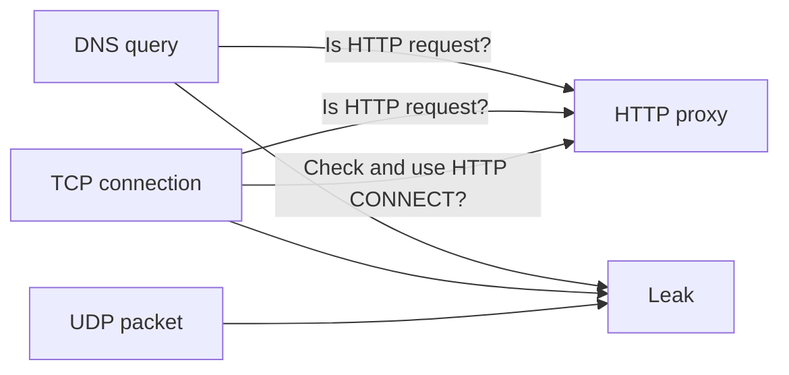
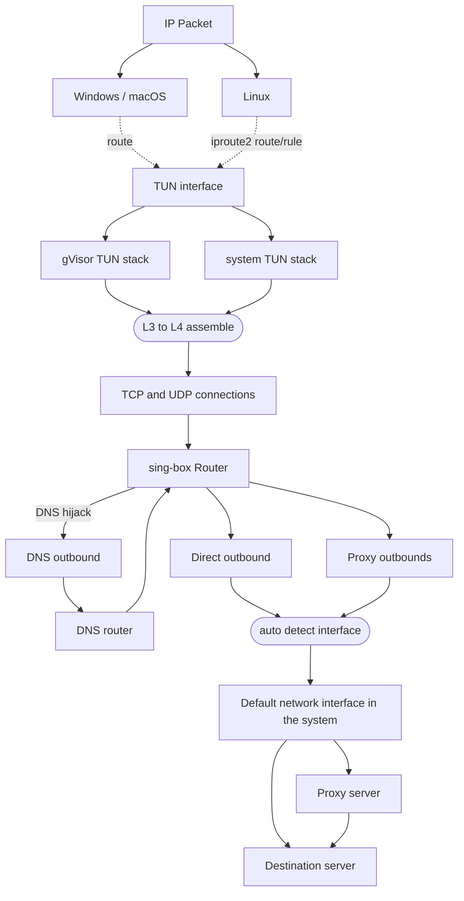

# File: tmp_sing_box_repo/docs/changelog.md

---
icon: material/alert-decagram
---

#### 1.14.0-alpha.29

* Fixes and improvements

#### 1.13.13

* Fixes and improvements

#### 1.14.0-alpha.27

* Add Tailscale SSH server **1**
* Fixes and improvements

**1**:

Adds an [`ssh_server`](/configuration/endpoint/tailscale/#ssh_server) field to
[Tailscale](/configuration/endpoint/tailscale/) endpoints, running a Tailscale SSH
server on tailnet port 22. Access is controlled by the SSH ACL in the Tailscale
admin console, which maps each connection to a local user (behavior varies by
platform; iOS and tvOS are not yet supported). The value may be `true` (equivalent
to `{ "enabled": true }`), or an object that additionally sets
[`disable_pty`](/configuration/endpoint/tailscale/#ssh_serverdisable_pty),
[`disable_sftp`](/configuration/endpoint/tailscale/#ssh_serverdisable_sftp), and
[`disable_forwarding`](/configuration/endpoint/tailscale/#ssh_serverdisable_forwarding).

#### 1.14.0-alpha.26

* Add gecko obfs for Hysteria2 **1**
* Fixes and improvements

**1**:

Adds `gecko` as a new QUIC traffic obfuscation type for
[Hysteria2 inbound](/configuration/inbound/hysteria2/#obfstype) and
[outbound](/configuration/outbound/hysteria2/#obfstype), alongside the
existing `salamander`. Gecko supports configurable
[`min_packet_size`](/configuration/inbound/hysteria2/#obfsmin_packet_size)
(default 512) and
[`max_packet_size`](/configuration/inbound/hysteria2/#obfsmax_packet_size)
(default 1200) fields.

#### 1.14.0-alpha.25

* Revert Tailscale endpoint dial fields deprecation and remove `control_http_client` **1**
* Fixes and improvements

**1**:

The `control_http_client` field on
[Tailscale](/configuration/endpoint/tailscale/) endpoints introduced in
`1.14.0-alpha.13` is removed, and the deprecation of
[Dial Fields](/configuration/endpoint/tailscale/#dial-fields) is reverted.

#### 1.13.12

* Update naiveproxy to v148.0.7778.96-1
* Fixes and improvements

#### 1.14.0-alpha.22

* Add Hysteria Realm service and Hysteria2 NAT traversal support **1**
* Fixes and improvements

**1**:

The new [Hysteria Realm service](/configuration/service/hysteria-realm/)
is a rendezvous service for Hysteria2 NAT traversal. A Hysteria2 server
behind NAT registers its STUN-discovered public addresses on a stable
realm endpoint via the new
[`realm`](/configuration/inbound/hysteria2/#realm) inbound field;
clients query the realm via the new
[`realm`](/configuration/outbound/hysteria2/#realm) outbound field to
learn the server's current addresses and perform UDP hole-punching to
establish a direct QUIC connection. Once hole-punching succeeds, all
proxy traffic flows directly between client and server.

#### 1.14.0-alpha.21

* Allow customizing TUN DNS mode and hijack interface DNS by default **1**
* Add mDNS DNS server **2**
* Add `preferred_by` DNS rule item **3**
* Add neighbor-based hostname resolution for the local DNS server **4**
* Update NaiveProxy to 148.0.7778.96-1
* Add more TLS spoof methods and route rule action support **5**
* Fixes and improvements

**1**:

Adds [`dns_mode`](/configuration/inbound/tun/#dns_mode) and
[`dns_address`](/configuration/inbound/tun/#dns_address) on the TUN inbound.
The default `hijack` mode now sets the platform's native interface DNS
(`systemd-resolved` on Linux, per-interface DNS on Windows and Apple) and
installs platform-level DNS hijacking (an `iproute2` rule on Linux,
nftables DNAT when `auto_redirect` is enabled, WFP filters on Windows when
`strict_route` is enabled). Earlier versions did not touch the interface
DNS or the platform firewall.

**2**:

The new [mDNS DNS server](/configuration/dns/server/mdns/) sends queries via
multicast on the local network. The default
[local DNS server](/configuration/dns/server/local/) also routes queries for
`*.local.` and IPv4/IPv6 link-local reverse zones via mDNS on non-Apple
platforms (and via the system resolver on Apple), so an explicit `mdns`
server is only needed to reference it from
[`preferred_by`](/configuration/dns/rule/#preferred_by) or to use it
standalone.

**3**:

The new [`preferred_by`](/configuration/dns/rule/#preferred_by) DNS rule
item matches domains that the listed DNS servers consider their preferred
names. Supported server types are `hosts`, `local`, `mdns`, `tailscale`, and
`resolved`. The [Tailscale](/configuration/dns/server/tailscale/),
[Hosts](/configuration/dns/server/hosts/) and
[Resolved](/configuration/dns/server/resolved/) example pages have been
updated to use this rule item in place of the previous `evaluate` +
`ip_accept_any` + `respond` pattern.

**4**:

Adds [`neighbor_domain`](/configuration/dns/server/local/#neighbor_domain)
on the local DNS server. Listed suffixes (each starting with `.`) cause
A/AAAA queries for single-label hosts under those suffixes to be answered
from the [neighbor resolver](/configuration/shared/neighbor/) instead of
the upstream (for example `[".", ".lan"]`).

**5**:

Adds `wrong-ack`, `wrong-md5`, and `wrong-timestamp`
[spoof methods](/configuration/shared/tls/#spoof_method), and adds
[`tls_spoof`](/configuration/route/rule_action/#tls_spoof) /
[`tls_spoof_method`](/configuration/route/rule_action/#tls_spoof_method)
to route rule actions for per-rule TLS spoofing without outbound TLS settings.

#### 1.14.0-alpha.20

** Fixes and improvements

#### 1.14.0-alpha.19

* Preserve comments between formatting
* Add cipher, MAC, and key exchange algorithm options for SSH outbound **1**
* Add DNS query timeout options **2**
** Fixes and improvements

**1**:

See [SSH](/configuration/outbound/ssh/#cipher).

**2**:

Adds [`dns.timeout`](/configuration/dns/#timeout), with per-query
overrides via [DNS rule action](/configuration/dns/rule_action/#timeout)
and [`resolve` route rule action](/configuration/route/rule_action/#timeout),
and a `timeout` field on
[`domain_resolver`](/configuration/shared/dial/#domain_resolver).

#### 1.14.0-alpha.18

* Add Windows TLS engine **1**
* Fixes and improvements

**1**:

The new `windows` value for outbound TLS
[`engine`](/configuration/shared/tls/#engine) routes the TLS handshake
through Schannel via SSPI. Only available on Windows build 17763 or
later (Windows 10 version 1809, Windows Server 2019, or newer); TLS 1.3
is only negotiated on Windows 11 or Windows Server 2022 and newer.

#### 1.13.11

* Fix process searcher failure introduced in 1.13.9
* Fixes and improvements

#### 1.14.0-alpha.16

* Add ACME profile support for IP address certificates **1**
* Fixes and improvements

**1**:

See [ACME Certificate Provider](/configuration/shared/certificate-provider/acme/#profile).

#### 1.13.10

* Fix process searcher failure introduced in 1.13.9

#### 1.14.0-alpha.15

* Add search domain support for Tailscale DNS **1**
* Fixes and improvements

**1**:

See [Tailscale DNS Server](/configuration/dns/server/tailscale/#accept_search_domain).

#### 1.13.9

* Fixes and improvements

#### 1.14.0-alpha.13

* Unify HTTP client **1**
* Add Apple HTTP and TLS engines **2**
* Unify HTTP/2 and QUIC parameters **3**
* Add TLS spoof **4**
* Fixes and improvements

**1**:

The new top-level [`http_clients`](/configuration/shared/http-client/)
option defines reusable HTTP clients (engine, version, dialer, TLS,
HTTP/2 and QUIC parameters). Components that make outbound HTTP requests
— remote rule-sets, ACME and Cloudflare Origin CA certificate providers,
DERP `verify_client_url`, and the Tailscale `control_http_client` — now
accept an inline HTTP client object or the tag of an `http_clients`
entry, replacing the dial and TLS fields previously inlined in each
component. When the field is omitted, ACME, Cloudflare Origin CA, DERP
and Tailscale dial direct (their existing default).

Remote rule-sets are the only HTTP-using component whose default for an
omitted `http_client` has historically resolved to the default outbound,
not to direct, and a typical configuration contains many of them. To
avoid repeating the same `http_client` block in every rule-set,
[`route.default_http_client`](/configuration/route/#default_http_client)
selects a default rule-set client by tag and is the only field that
consults it. If `default_http_client` is empty and `http_clients` is
non-empty, the first entry is used automatically. The legacy fallback
(use the default outbound when `http_clients` is empty altogether) is
preserved with a deprecation warning and will be removed in sing-box
1.16.0, together with the legacy `download_detour` remote rule-set
option and the legacy dialer fields on Tailscale endpoints.

**2**:

A new `apple` engine is available on Apple platforms in two independent
places:

* [HTTP client `engine`](/configuration/shared/http-client/#engine) —
  routes HTTP requests through `NSURLSession`.
* Outbound TLS [`engine`](/configuration/shared/tls/#engine) — routes
  the TLS handshake through `Network.framework` for direct TCP TLS
  client connections.

The default remains `go`. Both engines come with additional CGO and
framework memory overhead and platform restrictions documented on each
field.

**3**:

[HTTP/2](/configuration/shared/http2/) and
[QUIC](/configuration/shared/quic/) parameters
(`idle_timeout`, `keep_alive_period`, `stream_receive_window`,
`connection_receive_window`, `max_concurrent_streams`,
`initial_packet_size`, `disable_path_mtu_discovery`) are now shared
across QUIC-based outbounds
([Hysteria](/configuration/outbound/hysteria/),
[Hysteria2](/configuration/outbound/hysteria2/),
[TUIC](/configuration/outbound/tuic/)) and HTTP clients running HTTP/2
or HTTP/3.

This deprecates the Hysteria v1 tuning fields `recv_window_conn`,
`recv_window`, `recv_window_client`, `max_conn_client` and
`disable_mtu_discovery`; they will be removed in sing-box 1.16.0.

**4**:

Added outbound TLS [`spoof`](/configuration/shared/tls/#spoof) and
[`spoof_method`](/configuration/shared/tls/#spoof_method) fields. When
enabled, a forged ClientHello carrying a whitelisted SNI is sent before
the real handshake to fool SNI-filtering middleboxes. Requires
`CAP_NET_RAW` + `CAP_NET_ADMIN` or root on Linux and macOS, and
Administrator privileges on Windows (ARM64 is not supported). IP-literal
server names are rejected.

#### 1.14.0-alpha.12

* Fix fake-ip DNS server should return SUCCESS when address type is not configured
* Fixes and improvements

#### 1.13.8

* Update naiveproxy to v147.0.7727.49-1
* Fix fake-ip DNS server should return SUCCESS when address type is not configured
* Fixes and improvements

#### 1.14.0-alpha.11

* Add optimistic DNS cache **1**
* Update NaiveProxy to 147.0.7727.49
* Fixes and improvements

**1**:

Optimistic DNS cache returns an expired cached response immediately while
refreshing it in the background, reducing tail latency for repeated
queries. Enabled via [`optimistic`](/configuration/dns/#optimistic)
in DNS options, and can be persisted across restarts with the new
[`store_dns`](/configuration/experimental/cache-file/#store_dns) cache
file option. A per-query
[`disable_optimistic_cache`](/configuration/dns/rule_action/#disable_optimistic_cache)
field is also available on DNS rule actions and the `resolve` route rule
action.

This deprecates the `independent_cache` DNS option (the DNS cache now
always keys by transport) and the `store_rdrc` cache file option
(replaced by `store_dns`); both will be removed in sing-box 1.16.0.
See [Migration](/migration/#migrate-independent-dns-cache).

#### 1.14.0-alpha.10

* Add `evaluate` DNS rule action and Response Match Fields **1**
* `ip_version` and `query_type` now also take effect on internal DNS lookups **2**
* Add `package_name_regex` route, DNS and headless rule item **3**
* Add cloudflared inbound **4**
* Fixes and improvements

**1**:

Response Match Fields
([`response_rcode`](/configuration/dns/rule/#response_rcode),
[`response_answer`](/configuration/dns/rule/#response_answer),
[`response_ns`](/configuration/dns/rule/#response_ns),
and [`response_extra`](/configuration/dns/rule/#response_extra))
match the evaluated DNS response. They are gated by the new
[`match_response`](/configuration/dns/rule/#match_response) field and
populated by a preceding
[`evaluate`](/configuration/dns/rule_action/#evaluate) DNS rule action;
the evaluated response can also be returned directly by a
[`respond`](/configuration/dns/rule_action/#respond) action.

This deprecates the Legacy Address Filter Fields (`ip_cidr`,
`ip_is_private` without `match_response`) in DNS rules, the Legacy
`strategy` DNS rule action option, and the Legacy
`rule_set_ip_cidr_accept_empty` DNS rule item; all three will be removed
in sing-box 1.16.0.
See [Migration](/migration/#migrate-address-filter-fields-to-response-matching).

**2**:

`ip_version` and `query_type` in DNS rules, together with `query_type` in
referenced rule-sets, now take effect on every DNS rule evaluation,
including matches from internal domain resolutions that do not target a
specific DNS server (for example a `resolve` route rule action without
`server` set). In earlier versions they were silently ignored in that
path. Combining these fields with any of the legacy DNS fields deprecated
in **1** in the same DNS configuration is no longer supported and is
rejected at startup.
See [Migration](/migration/#ip_version-and-query_type-behavior-changes-in-dns-rules).

**3**:

See [Route Rule](/configuration/route/rule/#package_name_regex),
[DNS Rule](/configuration/dns/rule/#package_name_regex) and
[Headless Rule](/configuration/rule-set/headless-rule/#package_name_regex).

**4**:

See [Cloudflared](/configuration/inbound/cloudflared/).

#### 1.13.7

* Fixes and improvement

#### 1.13.6

* Fixes and improvements

#### 1.14.0-alpha.8

* Add BBR profile and hop interval randomization for Hysteria2 **1**
* Fixes and improvements

**1**:

See [Hysteria2 Inbound](/configuration/inbound/hysteria2/#bbr_profile) and [Hysteria2 Outbound](/configuration/outbound/hysteria2/#bbr_profile).

#### 1.13.5

* Fixes and improvements

#### 1.14.0-alpha.7

* Fixes and improvements

#### 1.13.4

* Fixes and improvements

#### 1.14.0-alpha.4

* Refactor ACME support to certificate provider system **1**
* Add Cloudflare Origin CA certificate provider **2**
* Add Tailscale certificate provider **3**
* Fixes and improvements

**1**:

See [Certificate Provider](/configuration/shared/certificate-provider/) and [Migration](/migration/#migrate-inline-acme-to-certificate-provider).

**2**:

See [Cloudflare Origin CA](/configuration/shared/certificate-provider/cloudflare-origin-ca).

**3**:

See [Tailscale](/configuration/shared/certificate-provider/tailscale).

#### 1.13.3

* Add OpenWrt and Alpine APK packages to release **1**
* Backport to macOS 10.13 High Sierra **2**
* OCM service: Add WebSocket support for Responses API **3**
* Fixes and improvements

**1**:

Alpine APK files use `linux` in the filename to distinguish from OpenWrt APKs which use the `openwrt` prefix:

- OpenWrt: `sing-box_{version}_openwrt_{architecture}.apk`
- Alpine: `sing-box_{version}_linux_{architecture}.apk`

**2**:

Legacy macOS binaries (with `-legacy-macos-10.13` suffix) now support
macOS 10.13 High Sierra, built using Go 1.25 with patches
from [SagerNet/go](https://github.com/SagerNet/go).

**3**:

See [OCM](/configuration/service/ocm).

#### 1.12.24

* Fixes and improvements

#### 1.14.0-alpha.2

* Add OpenWrt and Alpine APK packages to release **1**
* Backport to macOS 10.13 High Sierra **2**
* OCM service: Add WebSocket support for Responses API **3**
* Fixes and improvements

**1**:

Alpine APK files use `linux` in the filename to distinguish from OpenWrt APKs which use the `openwrt` prefix:

- OpenWrt: `sing-box_{version}_openwrt_{architecture}.apk`
- Alpine: `sing-box_{version}_linux_{architecture}.apk`

**2**:

Legacy macOS binaries (with `-legacy-macos-10.13` suffix) now support
macOS 10.13 High Sierra, built using Go 1.25 with patches
from [SagerNet/go](https://github.com/SagerNet/go).

**3**:

See [OCM](/configuration/service/ocm).

#### 1.14.0-alpha.1

* Add `source_mac_address` and `source_hostname` rule items **1**
* Add `include_mac_address` and `exclude_mac_address` TUN options **2**
* Update NaiveProxy to 145.0.7632.159 **3**
* Fixes and improvements

**1**:

New rule items for matching LAN devices by MAC address and hostname via neighbor resolution.
Supported on Linux, macOS, or in graphical clients on Android and macOS.

See [Route Rule](/configuration/route/rule/#source_mac_address), [DNS Rule](/configuration/dns/rule/#source_mac_address) and [Neighbor Resolution](/configuration/shared/neighbor/).

**2**:

Limit or exclude devices from TUN routing by MAC address.
Only supported on Linux with `auto_route` and `auto_redirect` enabled.

See [TUN](/configuration/inbound/tun/#include_mac_address).

**3**:

This is not an official update from NaiveProxy. Instead, it's a Chromium codebase update maintained by Project S.

#### 1.13.2

* Fixes and improvements

#### 1.13.1

* Fixes and improvements

#### 1.12.14

* Backport fixes

#### 1.13.0

Important changes since 1.12:

* Add NaiveProxy outbound **1**
* Add pre-match support for `auto_redirect` **2**
* Improve `auto_redirect` **3**
* Add Chrome Root Store certificate option **4**
* Add new options for ACME DNS-01 challenge providers **5**
* Add Wi-Fi state support for Linux and Windows **6**
* Add curve preferences, pinned public key SHA256, mTLS and ECH `query_server_name` for TLS options **7**
* Add kTLS support **8**
* Add ICMP echo (ping) proxy support **9**
* Add `interface_address`, `network_interface_address` and `default_interface_address` rule items **10**
* Add `preferred_by` route rule item **11**
* Improve `local` DNS server **12**
* Add `disable_tcp_keep_alive`, `tcp_keep_alive` and `tcp_keep_alive_interval` options for listen and dial fields **13**
* Add `bind_address_no_port` option for dial fields **14**
* Add system interface, relay server and advertise tags options for Tailscale endpoint **15**
* Add Claude Code Multiplexer service **16**
* Add OpenAI Codex Multiplexer service **17**
* Apple/Android: Refactor GUI
* Apple/Android: Add support for sharing configurations via [QRS](https://github.com/qifi-dev/qrs)
* Android: Add support for resisting VPN detection via Xposed
* Drop support for go1.23 **18**
* Drop support for Android 5.0 **19**
* Update uTLS to v1.8.2 **20**
* Update quic-go to v0.59.0
* Update gVisor to v20250811
* Update Tailscale to v1.92.4

**1**:

NaiveProxy outbound now supports QUIC, ECH, UDP over TCP, and configurable QUIC congestion control.

Only available on Apple platforms, Android, Windows and some Linux architectures.
Each Windows release includes `libcronet.dll` —
ensure this file is in the same directory as `sing-box.exe` or in a directory listed in `PATH`.

See [NaiveProxy outbound](/configuration/outbound/naive/).

**2**:

`auto_redirect` now allows you to bypass sing-box for connections based on routing rules.

A new rule action `bypass` is introduced to support this feature. When matched during pre-match, the connection will bypass sing-box and connect directly.

This feature requires Linux with `auto_redirect` enabled.

See [Pre-match](/configuration/shared/pre-match/) and [Rule Action](/configuration/route/rule_action/#bypass).

**3**:

`auto_redirect` now rejects MPTCP connections by default to fix compatibility issues.
You can change it to bypass sing-box via the new `exclude_mptcp` option.

Adds a fallback iproute2 rule checked after system default rules (32766: main, 32767: default),
ensuring traffic is routed to the sing-box table when no route is found in system tables.
The rule index can be customized via `auto_redirect_iproute2_fallback_rule_index` (default: 32768).

See [TUN](/configuration/inbound/tun/#exclude_mptcp).

**4**:

Adds `chrome` as a new certificate store option alongside `mozilla`.
Both stores filter out China-based CA certificates.

See [Certificate](/configuration/certificate/#store).

**5**:

See [DNS-01 Challenge](/configuration/shared/dns01_challenge/).

**6**:

sing-box can now monitor Wi-Fi state on Linux and Windows to enable routing rules based on `wifi_ssid` and `wifi_bssid`.

See [Wi-Fi State](/configuration/shared/wifi-state/).

**7**:

See [TLS](/configuration/shared/tls/).

**8**:

Adds `kernel_tx` and `kernel_rx` options for TLS inbound.
Enables kernel-level TLS offloading via `splice(2)` on Linux 5.1+ with TLS 1.3.

See [TLS](/configuration/shared/tls/).

**9**:

sing-box can now proxy ICMP echo (ping) requests.
A new `icmp` network type is available for route rules.
Supported from TUN, WireGuard and Tailscale inbounds to Direct, WireGuard and Tailscale outbounds.
The `reject` action can also reply to ICMP echo requests.

**10**:

New rule items for matching based on interface IP addresses, available in route rules, DNS rules and rule-sets.

**11**:

Matches outbounds' preferred routes.
For Tailscale: MagicDNS domains and peers' allowed IPs. For WireGuard: peers' allowed IPs.

**12**:

The `local` DNS server now uses platform-native resolution:
`getaddrinfo`/libresolv on Apple platforms, systemd-resolved DBus on Linux.
A new `prefer_go` option is available to opt out.

See [Local DNS](/configuration/dns/server/local/).

**13**:

The default TCP keep-alive initial period has been updated from 10 minutes to 5 minutes.

See [Dial Fields](/configuration/shared/dial/#tcp_keep_alive).

**14**:

Adds the Linux socket option `IP_BIND_ADDRESS_NO_PORT` support when explicitly binding to a source address.

This allows reusing the same source port for multiple connections, improving scalability for high-concurrency proxy scenarios.

See [Dial Fields](/configuration/shared/dial/#bind_address_no_port).

**15**:

Tailscale endpoint can now create a system TUN interface to handle traffic directly.
New `relay_server_port` and `relay_server_static_endpoints` options for incoming relay connections.
New `advertise_tags` option for ACL tag advertisement.

See [Tailscale endpoint](/configuration/endpoint/tailscale/).

**16**:

CCM (Claude Code Multiplexer) service allows you to access your local Claude Code subscription remotely through custom tokens, eliminating the need for OAuth authentication on remote clients.

See [CCM](/configuration/service/ccm).

**17**:

See [OCM](/configuration/service/ocm).

**18**:

Due to maintenance difficulties, sing-box 1.13.0 requires at least Go 1.24 to compile.

**19**:

Due to maintenance difficulties, sing-box 1.13.0 will be the last version to support Android 5.0,
and only through a separate legacy build (with `-legacy-android-5` suffix).

For standalone binaries, the minimum Android version has been raised to Android 6.0,
since Termux requires Android 7.0 or later.

**20**:

This update fixes missing padding extension for Chrome 120+ fingerprints.

Also, documentation has been updated with a warning about uTLS fingerprinting vulnerabilities.
uTLS is not recommended for censorship circumvention due to fundamental architectural limitations;
use NaiveProxy instead for TLS fingerprint resistance.

#### 1.12.23

* Fixes and improvements

#### 1.13.0-rc.5

* Add `mipsle`, `mips64le`, `riscv64` and `loong64` support for NaiveProxy outbound

#### 1.12.22

* Fixes and improvements

#### 1.13.0-rc.3

* Fixes and improvements

#### 1.12.21

* Fixes and improvements

#### 1.13.0-rc.2

* Fixes and improvements

#### 1.12.20

* Fixes and improvements

#### 1.13.0-rc.1

* Fixes and improvements

#### 1.12.19

* Fixes and improvements

#### 1.13.0-beta.8

* Add fallback routing rule for `auto_redirect` **1**
* Fixes and improvements

**1**:

Adds a fallback iproute2 rule checked after system default rules (32766: main, 32767: default),
ensuring traffic is routed to the sing-box table when no route is found in system tables.

The rule index can be customized via `auto_redirect_iproute2_fallback_rule_index` (default: 32768).

#### 1.12.18

* Add fallback routing rule for `auto_redirect` **1**
* Fixes and improvements

**1**:

Adds a fallback iproute2 rule checked after system default rules (32766: main, 32767: default),
ensuring traffic is routed to the sing-box table when no route is found in system tables.

The rule index can be customized via `auto_redirect_iproute2_fallback_rule_index` (default: 32768).

#### 1.13.0-beta.6

* Update uTLS to v1.8.2 **1**
* Fixes and improvements

**1**:

This update fixes missing padding extension for Chrome 120+ fingerprints.

Also, documentation has been updated with a warning about uTLS fingerprinting vulnerabilities.
uTLS is not recommended for censorship circumvention due to fundamental architectural limitations;
use NaiveProxy instead for TLS fingerprint resistance.

#### 1.12.17

* Update uTLS to v1.8.2 **1**
* Fixes and improvements

**1**:

This update fixes missing padding extension for Chrome 120+ fingerprints.

Also, documentation has been updated with a warning about uTLS fingerprinting vulnerabilities.
uTLS is not recommended for censorship circumvention due to fundamental architectural limitations;
use NaiveProxy instead for TLS fingerprint resistance.

#### 1.13.0-beta.5

* Fixes and improvements

#### 1.12.16

* Fixes and improvements

#### 1.13.0-beta.4

* Apple/Android: Add support for sharing configurations via [QRS](https://github.com/qifi-dev/qrs)
* Android: Add support for resisting VPN detection via Xposed
* Update quic-go to v0.59.0
* Fixes and improvements

#### 1.13.0-beta.2

* Add `bind_address_no_port` option for dial fields **1**
* Fixes and improvements

**1**:

Adds the Linux socket option `IP_BIND_ADDRESS_NO_PORT` support when explicitly binding to a source address.

This allows reusing the same source port for multiple connections, improving scalability for high-concurrency proxy scenarios.

See [Dial Fields](/configuration/shared/dial/#bind_address_no_port).

#### 1.13.0-beta.1

* Add system interface support for Tailscale endpoint **1**
* Fixes and improvements

**1**:

Tailscale endpoint can now create a system TUN interface to handle traffic directly.

See [Tailscale endpoint](/configuration/endpoint/tailscale/#system_interface).

#### 1.12.15

* Fixes and improvements

#### 1.13.0-alpha.36

* Downgrade quic-go to v0.57.1
* Fixes and improvements

#### 1.13.0-alpha.35

* Add pre-match support for `auto_redirect` **1**
* Fixes and improvements

**1**:

`auto_redirect` now allows you to bypass sing-box for connections based on routing rules.

A new rule action `bypass` is introduced to support this feature. When matched during pre-match, the connection will bypass sing-box and connect directly.

This feature requires Linux with `auto_redirect` enabled.

See [Pre-match](/configuration/shared/pre-match/) and [Rule Action](/configuration/route/rule_action/#bypass).

#### 1.13.0-alpha.34

* Add Chrome Root Store certificate option **1**
* Add new options for ACME DNS-01 challenge providers **2**
* Add Wi-Fi state support for Linux and Windows **3**
* Update naiveproxy to 143.0.7499.109
* Update quic-go to v0.58.0
* Update tailscale to v1.92.4
* Drop support for go1.23 **4**
* Drop support for Android 5.0 **5**

**1**:

Adds `chrome` as a new certificate store option alongside `mozilla`.
Both stores filter out China-based CA certificates.

See [Certificate](/configuration/certificate/#store).

**2**:

See [DNS-01 Challenge](/configuration/shared/dns01_challenge/).

**3**:

sing-box can now monitor Wi-Fi state on Linux and Windows to enable routing rules based on `wifi_ssid` and `wifi_bssid`.

See [Wi-Fi State](/configuration/shared/wifi-state/).

**4**:

Due to maintenance difficulties, sing-box 1.13.0 requires at least Go 1.24 to compile.

**5**:

Due to maintenance difficulties, sing-box 1.13.0 will be the last version to support Android 5.0,
and only through a separate legacy build (with `-legacy-android-5` suffix).

For standalone binaries, the minimum Android version has been raised to Android 6.0,
since Termux requires Android 7.0 or later.

#### 1.12.14

* Fixes and improvements

#### 1.13.0-alpha.33

* Fixes and improvements

#### 1.13.0-alpha.32

* Remove `certificate_public_key_sha256` option for NaiveProxy outbound **1**
* Fixes and improvements

**1**:

Self-signed certificates change traffic behavior significantly, which defeats the purpose of NaiveProxy's design to resist traffic analysis.
For this reason, and due to maintenance costs, there is no reason to continue supporting `certificate_public_key_sha256`, which was designed to simplify the use of self-signed certificates.

#### 1.13.0-alpha.31

* Add QUIC support for NaiveProxy outbound **1**
* Add QUIC congestion control option for NaiveProxy **2**
* Fixes and improvements

**1**:

NaiveProxy outbound now supports QUIC.

See [NaiveProxy outbound](/configuration/outbound/naive/#quic).

**2**:

NaiveProxy inbound and outbound now supports configurable QUIC congestion control algorithms, including BBR and BBRv2.

See [NaiveProxy inbound](/configuration/inbound/naive/#quic_congestion_control) and [NaiveProxy outbound](/configuration/outbound/naive/#quic_congestion_control).

#### 1.13.0-alpha.30

* Add ECH support for NaiveProxy outbound **1**
* Add `tls.ech.query_server_name` option **2**
* Fix NaiveProxy outbound on Windows **3**
* Add OpenAI Codex Multiplexer service **4**
* Fixes and improvements

**1**:

See [NaiveProxy outbound](/configuration/outbound/naive/#tls).

**2**:

See [TLS](/configuration/shared/tls/#query_server_name).

**3**:

Each Windows release now includes `libcronet.dll`.
Ensure this file is in the same directory as `sing-box.exe` or in a directory listed in `PATH`.

**4**:

See [OCM](/configuration/service/ocm).

#### 1.13.0-alpha.29

* Add UDP over TCP support for naiveproxy outbound **1**
* Fixes and improvements

**1**:

See [NaiveProxy outbound](/configuration/outbound/naive/#udp_over_tcp).

#### 1.13.0-alpha.28

* Add naiveproxy outbound **1**
* Add `disable_tcp_keep_alive`, `tcp_keep_alive` and `tcp_keep_alive_interval` options for dial fields **2**
* Update default TCP keep-alive initial period from 10 minutes to 5 minutes
* Update quic-go to v0.57.1
* Fixes and improvements

**1**:

Only available on Apple platforms, Android, Windows and some Linux architectures.

See [NaiveProxy outbound](/configuration/outbound/naive/).

**2**:

See [Dial Fields](/configuration/shared/dial/#tcp_keep_alive).

* __Unfortunately, for non-technical reasons, we are currently unable to notarize the standalone version of the macOS client:
because system extensions require signatures to function, we have had to temporarily halt its release.__

__We plan to fix the App Store release issue and launch a new standalone desktop client, but until then,
only clients on TestFlight will be available (unless you have an Apple Developer Program and compile from source code).__


#### 1.12.13

* Fix naive inbound
* Fixes and improvements

__Unfortunately, for non-technical reasons, we are currently unable to notarize the standalone version of the macOS client:
because system extensions require signatures to function, we have had to temporarily halt its release.__

__We plan to fix the App Store release issue and launch a new standalone desktop client, but until then,
only clients on TestFlight will be available (unless you have an Apple Developer Program and compile from source code).__

#### 1.12.12

* Fixes and improvements

#### 1.13.0-alpha.26

* Update quic-go to v0.55.0
* Fix memory leak in hysteria2
* Fixes and improvements

#### 1.12.11

* Fixes and improvements

#### 1.13.0-alpha.24

* Add Claude Code Multiplexer service **1**
* Fixes and improvements

**1**:

CCM (Claude Code Multiplexer) service allows you to access your local Claude Code subscription remotely through custom tokens, eliminating the need for OAuth authentication on remote clients.

See [CCM](/configuration/service/ccm).

#### 1.13.0-alpha.23

* Fix compatibility with MPTCP **1**
* Fixes and improvements

**1**:

`auto_redirect` now rejects MPTCP connections by default to fix compatibility issues,
but you can change it to bypass the sing-box via the new `exclude_mptcp` option.

See [TUN](/configuration/inbound/tun/#exclude_mptcp).

#### 1.13.0-alpha.22

* Update uTLS to v1.8.1 **1**
* Fixes and improvements

**1**:

This update fixes an critical issue that could cause simulated Chrome fingerprints to be detected,
see https://github.com/refraction-networking/utls/pull/375.

#### 1.12.10

* Update uTLS to v1.8.1 **1**
* Fixes and improvements

**1**:

This update fixes an critical issue that could cause simulated Chrome fingerprints to be detected,
see https://github.com/refraction-networking/utls/pull/375.

#### 1.13.0-alpha.21

* Fix missing mTLS support in client options **1**
* Fixes and improvements

See [TLS](/configuration/shared/tls/).

#### 1.12.9

* Fixes and improvements

#### 1.13.0-alpha.16

* Add curve preferences, pinned public key SHA256 and mTLS for TLS options **1**
* Fixes and improvements

See [TLS](/configuration/shared/tls/).

#### 1.13.0-alpha.15

* Update quic-go to v0.54.0
* Update gVisor to v20250811
* Update Tailscale to v1.86.5
* Fixes and improvements

#### 1.12.8

* Fixes and improvements

#### 1.13.0-alpha.11

* Fixes and improvements

#### 1.12.5

* Fixes and improvements

#### 1.13.0-alpha.10

* Improve kTLS support **1**
* Fixes and improvements

**1**:

kTLS is now compatible with custom TLS implementations other than uTLS.

#### 1.12.4

* Fixes and improvements

#### 1.12.3

* Fixes and improvements

#### 1.12.2

* Fixes and improvements

#### 1.12.1

* Fixes and improvements

#### 1.12.0

* Refactor DNS servers **1**
* Add domain resolver options**2**
* Add TLS fragment/record fragment support to route options and outbound TLS options **3**
* Add certificate options **4**
* Add Tailscale endpoint and DNS server **5**
* Drop support for go1.22 **6**
* Add AnyTLS protocol **7**
* Migrate to stdlib ECH implementation **8**
* Add NTP sniffer **9**
* Add wildcard SNI support for ShadowTLS inbound **10**
* Improve `auto_redirect` **11**
* Add control options for listeners **12**
* Add DERP service **13**
* Add Resolved service and DNS server **14**
* Add SSM API service **15**
* Add loopback address support for tun **16**
* Improve tun performance on Apple platforms **17**
* Update quic-go to v0.52.0
* Update gVisor to 20250319.0
* Update the status of graphical clients in stores **18**

**1**:

DNS servers are refactored for better performance and scalability.

See [DNS server](/configuration/dns/server/).

For migration, see [Migrate to new DNS server formats](/migration/#migrate-to-new-dns-server-formats).

Compatibility for old formats will be removed in sing-box 1.14.0.

**2**:

Legacy `outbound` DNS rules are deprecated
and can be replaced by the new `domain_resolver` option.

See [Dial Fields](/configuration/shared/dial/#domain_resolver) and
[Route](/configuration/route/#default_domain_resolver).

For migration,
see [Migrate outbound DNS rule items to domain resolver](/migration/#migrate-outbound-dns-rule-items-to-domain-resolver).

**3**:

See [Route Action](/configuration/route/rule_action/#tls_fragment) and [TLS](/configuration/shared/tls/).

**4**:

New certificate options allow you to manage the default list of trusted X509 CA certificates.

For the system certificate list, fixed Go not reading Android trusted certificates correctly.

You can also use the Mozilla Included List instead, or add trusted certificates yourself.

See [Certificate](/configuration/certificate/).

**5**:

See [Tailscale](/configuration/endpoint/tailscale/).

**6**:

Due to maintenance difficulties, sing-box 1.12.0 requires at least Go 1.23 to compile.

For Windows 7 users, legacy binaries now continue to compile with Go 1.23 and patches
from [MetaCubeX/go](https://github.com/MetaCubeX/go).

**7**:

The new AnyTLS protocol claims to mitigate TLS proxy traffic characteristics and comes with a new multiplexing scheme.

See [AnyTLS Inbound](/configuration/inbound/anytls/) and [AnyTLS Outbound](/configuration/outbound/anytls/).

**8**:

See [TLS](/configuration/shared/tls).

The build tag `with_ech` is no longer needed and has been removed.

**9**:

See [Protocol Sniff](/configuration/route/sniff/).

**10**:

See [ShadowTLS](/configuration/inbound/shadowtls/#wildcard_sni).

**11**:

Now `auto_redirect` fixes compatibility issues between tun and Docker bridge networks,
see [Tun](/configuration/inbound/tun/#auto_redirect).

**12**:

You can now set `bind_interface`, `routing_mark` and `reuse_addr` in Listen Fields.

See [Listen Fields](/configuration/shared/listen/).

**13**:

DERP service is a Tailscale DERP server, similar to [derper](https://pkg.go.dev/tailscale.com/cmd/derper).

See [DERP Service](/configuration/service/derp/).

**14**:

Resolved service is a fake systemd-resolved DBUS service to receive DNS settings from other programs
(e.g. NetworkManager) and provide DNS resolution.

See [Resolved Service](/configuration/service/resolved/) and [Resolved DNS Server](/configuration/dns/server/resolved/).

**15**:

SSM API service is a RESTful API server for managing Shadowsocks servers.

See [SSM API Service](/configuration/service/ssm-api/).

**16**:

TUN now implements SideStore's StosVPN.

See [Tun](/configuration/inbound/tun/#loopback_address).

**17**:

We have significantly improved the performance of tun inbound on Apple platforms, especially in the gVisor stack.

The following data was tested
using [tun_bench](https://github.com/SagerNet/sing-box/blob/dev-next/cmd/internal/tun_bench/main.go) on M4 MacBook pro.

| Version     | Stack  | MTU   | Upload | Download |
|-------------|--------|-------|--------|----------|
| 1.11.15     | gvisor | 1500  | 852M   | 2.57G    |
| 1.12.0-rc.4 | gvisor | 1500  | 2.90G  | 4.68G    |
| 1.11.15     | gvisor | 4064  | 2.31G  | 6.34G    |
| 1.12.0-rc.4 | gvisor | 4064  | 7.54G  | 12.2G    |
| 1.11.15     | gvisor | 65535 | 27.6G  | 18.1G    |
| 1.12.0-rc.4 | gvisor | 65535 | 39.8G  | 34.7G    |
| 1.11.15     | system | 1500  | 664M   | 706M     |
| 1.12.0-rc.4 | system | 1500  | 2.44G  | 2.51G    |
| 1.11.15     | system | 4064  | 1.88G  | 1.94G    |
| 1.12.0-rc.4 | system | 4064  | 6.45G  | 6.27G    |
| 1.11.15     | system | 65535 | 26.2G  | 17.4G    |
| 1.12.0-rc.4 | system | 65535 | 17.6G  | 21.0G    |

**18**:

We continue to experience issues updating our sing-box apps on the App Store and Play Store.
Until we rewrite and resubmit the apps, they are considered irrecoverable.
Therefore, after this release, we will not be repeating this notice unless there is new information.

### 1.11.15

* Fixes and improvements

_We are temporarily unable to update sing-box apps on the App Store because the reviewer mistakenly found that we
violated the rules (TestFlight users are not affected)._

#### 1.12.0-beta.32

* Improve tun performance on Apple platforms **1**
* Fixes and improvements

**1**:

We have significantly improved the performance of tun inbound on Apple platforms, especially in the gVisor stack.

### 1.11.14

* Fixes and improvements

_We are temporarily unable to update sing-box apps on the App Store because the reviewer mistakenly found that we
violated the rules (TestFlight users are not affected)._

#### 1.12.0-beta.24

* Allow `tls_fragment` and `tls_record_fragment` to be enabled together **1**
* Also add fragment options for TLS client configuration **2**
* Fixes and improvements

**1**:

For debugging only, it is recommended to disable if record fragmentation works.

See [Route Action](/configuration/route/rule_action/#tls_fragment).

**2**:

See [TLS](/configuration/shared/tls/).

#### 1.12.0-beta.23

* Add loopback address support for tun **1**
* Add cache support for ssm-api **2**
* Fixes and improvements

**1**:

TUN now implements SideStore's StosVPN.

See [Tun](/configuration/inbound/tun/#loopback_address).

**2**:

See [SSM API Service](/configuration/service/ssm-api/#cache_path).

#### 1.12.0-beta.21

* Fix missing `home` option for DERP service **1**
* Fixes and improvements

**1**:

You can now choose what the DERP home page shows, just like with derper's `-home` flag.

See [DERP](/configuration/service/derp/#home).

### 1.11.13

* Fixes and improvements

_We are temporarily unable to update sing-box apps on the App Store because the reviewer mistakenly found that we
violated the rules (TestFlight users are not affected)._

#### 1.12.0-beta.17

* Update quic-go to v0.52.0
* Fixes and improvements

#### 1.12.0-beta.15

* Add DERP service **1**
* Add Resolved service and DNS server **2**
* Add SSM API service **3**
* Fixes and improvements

**1**:

DERP service is a Tailscale DERP server, similar to [derper](https://pkg.go.dev/tailscale.com/cmd/derper).

See [DERP Service](/configuration/service/derp/).

**2**:

Resolved service is a fake systemd-resolved DBUS service to receive DNS settings from other programs
(e.g. NetworkManager) and provide DNS resolution.

See [Resolved Service](/configuration/service/resolved/) and [Resolved DNS Server](/configuration/dns/server/resolved/).

**3**:

SSM API service is a RESTful API server for managing Shadowsocks servers.

See [SSM API Service](/configuration/service/ssm-api/).

### 1.11.11

* Fixes and improvements

_We are temporarily unable to update sing-box apps on the App Store because the reviewer mistakenly found that we
violated the rules (TestFlight users are not affected)._

#### 1.12.0-beta.13

* Add TLS record fragment route options **1**
* Add missing `accept_routes` option for Tailscale **2**
* Fixes and improvements

**1**:

See [Route Action](/configuration/route/rule_action/#tls_record_fragment).

**2**:

See [Tailscale](/configuration/endpoint/tailscale/#accept_routes).

#### 1.12.0-beta.10

* Add control options for listeners **1**
* Fixes and improvements

**1**:

You can now set `bind_interface`, `routing_mark` and `reuse_addr` in Listen Fields.

See [Listen Fields](/configuration/shared/listen/).

### 1.11.10

* Undeprecate the `block` outbound **1**
* Fixes and improvements

**1**:

Since we don’t have a replacement for using the `block` outbound in selectors yet,
we decided to temporarily undeprecate the `block` outbound until a replacement is available in the future.

_We are temporarily unable to update sing-box apps on the App Store because the reviewer mistakenly found that we
violated the rules (TestFlight users are not affected)._

#### 1.12.0-beta.9

* Update quic-go to v0.51.0
* Fixes and improvements

### 1.11.9

* Fixes and improvements

_We are temporarily unable to update sing-box apps on the App Store because the reviewer mistakenly found that we
violated the rules (TestFlight users are not affected)._

#### 1.12.0-beta.5

* Fixes and improvements

### 1.11.8

* Improve `auto_redirect` **1**
* Fixes and improvements

**1**:

Now `auto_redirect` fixes compatibility issues between TUN and Docker bridge networks,
see [Tun](/configuration/inbound/tun/#auto_redirect).

_We are temporarily unable to update sing-box apps on the App Store because the reviewer mistakenly found that we
violated the rules (TestFlight users are not affected)._

#### 1.12.0-beta.3

* Fixes and improvements

### 1.11.7

* Fixes and improvements

_We are temporarily unable to update sing-box apps on the App Store because the reviewer mistakenly found that we
violated the rules (TestFlight users are not affected)._

#### 1.12.0-beta.1

* Fixes and improvements

**1**:

Now `auto_redirect` fixes compatibility issues between tun and Docker bridge networks,
see [Tun](/configuration/inbound/tun/#auto_redirect).

### 1.11.6

* Fixes and improvements

_We are temporarily unable to update sing-box apps on the App Store because the reviewer mistakenly found that we
violated the rules (TestFlight users are not affected)._

#### 1.12.0-alpha.19

* Update gVisor to 20250319.0
* Fixes and improvements

#### 1.12.0-alpha.18

* Add wildcard SNI support for ShadowTLS inbound **1**
* Fixes and improvements

**1**:

See [ShadowTLS](/configuration/inbound/shadowtls/#wildcard_sni).

#### 1.12.0-alpha.17

* Add NTP sniffer **1**
* Fixes and improvements

**1**:

See [Protocol Sniff](/configuration/route/sniff/).

#### 1.12.0-alpha.16

* Update `domain_resolver` behavior **1**
* Fixes and improvements

**1**:

`route.default_domain_resolver` or `outbound.domain_resolver` is now optional when only one DNS server is configured.

See [Dial Fields](/configuration/shared/dial/#domain_resolver).

### 1.11.5

* Fixes and improvements

_We are temporarily unable to update sing-box apps on the App Store because the reviewer mistakenly found that we
violated the rules (TestFlight users are not affected)._

#### 1.12.0-alpha.13

* Move `predefined` DNS server to DNS rule action **1**
* Fixes and improvements

**1**:

See [DNS Rule Action](/configuration/dns/rule_action/#predefined).

### 1.11.4

* Fixes and improvements

#### 1.12.0-alpha.11

* Fixes and improvements

#### 1.12.0-alpha.10

* Add AnyTLS protocol **1**
* Improve `resolve` route action **2**
* Migrate to stdlib ECH implementation **3**
* Fixes and improvements

**1**:

The new AnyTLS protocol claims to mitigate TLS proxy traffic characteristics and comes with a new multiplexing scheme.

See [AnyTLS Inbound](/configuration/inbound/anytls/) and [AnyTLS Outbound](/configuration/outbound/anytls/).

**2**:

`resolve` route action now accepts `disable_cache` and other options like in DNS route actions,
see [Route Action](/configuration/route/rule_action).

**3**:

See [TLS](/configuration/shared/tls).

The build tag `with_ech` is no longer needed and has been removed.

#### 1.12.0-alpha.7

* Add Tailscale DNS server **1**
* Fixes and improvements

**1**:

See [Tailscale](/configuration/dns/server/tailscale/).

#### 1.12.0-alpha.6

* Add Tailscale endpoint **1**
* Drop support for go1.22 **2**
* Fixes and improvements

**1**:

See [Tailscale](/configuration/endpoint/tailscale/).

**2**:

Due to maintenance difficulties, sing-box 1.12.0 requires at least Go 1.23 to compile.

For Windows 7 users, legacy binaries now continue to compile with Go 1.23 and patches
from [MetaCubeX/go](https://github.com/MetaCubeX/go).

### 1.11.3

* Fixes and improvements

_This version overwrites 1.11.2, as incorrect binaries were released due to a bug in the continuous integration
process._

#### 1.12.0-alpha.5

* Fixes and improvements

### 1.11.1

* Fixes and improvements

#### 1.12.0-alpha.2

* Update quic-go to v0.49.0
* Fixes and improvements

#### 1.12.0-alpha.1

* Refactor DNS servers **1**
* Add domain resolver options**2**
* Add TLS fragment route options **3**
* Add certificate options **4**

**1**:

DNS servers are refactored for better performance and scalability.

See [DNS server](/configuration/dns/server/).

For migration, see [Migrate to new DNS server formats](/migration/#migrate-to-new-dns-server-formats).

Compatibility for old formats will be removed in sing-box 1.14.0.

**2**:

Legacy `outbound` DNS rules are deprecated
and can be replaced by the new `domain_resolver` option.

See [Dial Fields](/configuration/shared/dial/#domain_resolver) and
[Route](/configuration/route/#default_domain_resolver).

For migration,
see [Migrate outbound DNS rule items to domain resolver](/migration/#migrate-outbound-dns-rule-items-to-domain-resolver).

**3**:

The new TLS fragment route options allow you to fragment TLS handshakes to bypass firewalls.

This feature is intended to circumvent simple firewalls based on **plaintext packet matching**, and should not be used
to circumvent real censorship.

Since it is not designed for performance, it should not be applied to all connections, but only to server names that are
known to be blocked.

See [Route Action](/configuration/route/rule_action/#tls_fragment).

**4**:

New certificate options allow you to manage the default list of trusted X509 CA certificates.

For the system certificate list, fixed Go not reading Android trusted certificates correctly.

You can also use the Mozilla Included List instead, or add trusted certificates yourself.

See [Certificate](/configuration/certificate/).

### 1.11.0

Important changes since 1.10:

* Introducing rule actions **1**
* Improve tun compatibility **3**
* Merge route options to route actions **4**
* Add `network_type`, `network_is_expensive` and `network_is_constrainted` rule items **5**
* Add multi network dialing **6**
* Add `cache_capacity` DNS option **7**
* Add `override_address` and `override_port` route options **8**
* Upgrade WireGuard outbound to endpoint **9**
* Add UDP GSO support for WireGuard
* Make GSO adaptive **10**
* Add UDP timeout route option **11**
* Add more masquerade options for hysteria2 **12**
* Add `rule-set merge` command
* Add port hopping support for Hysteria2 **13**
* Hysteria2 `ignore_client_bandwidth` behavior update **14**

**1**:

New rule actions replace legacy inbound fields and special outbound fields,
and can be used for pre-matching **2**.

See [Rule](/configuration/route/rule/),
[Rule Action](/configuration/route/rule_action/),
[DNS Rule](/configuration/dns/rule/) and
[DNS Rule Action](/configuration/dns/rule_action/).

For migration, see
[Migrate legacy special outbounds to rule actions](/migration/#migrate-legacy-special-outbounds-to-rule-actions),
[Migrate legacy inbound fields to rule actions](/migration/#migrate-legacy-inbound-fields-to-rule-actions)
and [Migrate legacy DNS route options to rule actions](/migration/#migrate-legacy-dns-route-options-to-rule-actions).

**2**:

Similar to Surge's pre-matching.

Specifically, new rule actions allow you to reject connections with
TCP RST (for TCP connections) and ICMP port unreachable (for UDP packets)
before connection established to improve tun's compatibility.

See [Rule Action](/configuration/route/rule_action/).

**3**:

When `gvisor` tun stack is enabled, even if the request passes routing,
if the outbound connection establishment fails,
the connection still does not need to be established and a TCP RST is replied.

**4**:

Route options in DNS route actions will no longer be considered deprecated,
see [DNS Route Action](/configuration/dns/rule_action/).

Also, now `udp_disable_domain_unmapping` and `udp_connect` can also be configured in route action,
see [Route Action](/configuration/route/rule_action/).

**5**:

When using in graphical clients, new routing rule items allow you to match on
network type (WIFI, cellular, etc.), whether the network is expensive, and whether Low Data Mode is enabled.

See [Route Rule](/configuration/route/rule/), [DNS Route Rule](/configuration/dns/rule/)
and [Headless Rule](/configuration/rule-set/headless-rule/).

**6**:

Similar to Surge's strategy.

New options allow you to connect using multiple network interfaces,
prefer or only use one type of interface,
and configure a timeout to fallback to other interfaces.

See [Dial Fields](/configuration/shared/dial/#network_strategy),
[Rule Action](/configuration/route/rule_action/#network_strategy)
and [Route](/configuration/route/#default_network_strategy).

**7**:

See [DNS](/configuration/dns/#cache_capacity).

**8**:

See [Rule Action](/configuration/route/#override_address) and
[Migrate destination override fields to route options](/migration/#migrate-destination-override-fields-to-route-options).

**9**:

The new WireGuard endpoint combines inbound and outbound capabilities,
and the old outbound will be removed in sing-box 1.13.0.

See [Endpoint](/configuration/endpoint/), [WireGuard Endpoint](/configuration/endpoint/wireguard/)
and [Migrate WireGuard outbound fields to route options](/migration/#migrate-wireguard-outbound-to-endpoint).

**10**:

For WireGuard outbound and endpoint, GSO will be automatically enabled when available,
see [WireGuard Outbound](/configuration/outbound/wireguard/#gso).

For TUN, GSO has been removed,
see [Deprecated](/deprecated/#gso-option-in-tun).

**11**:

See [Rule Action](/configuration/route/rule_action/#udp_timeout).

**12**:

See [Hysteria2](/configuration/inbound/hysteria2/#masquerade).

**13**:

See [Hysteria2](/configuration/outbound/hysteria2/).

**14**:

When `up_mbps` and `down_mbps` are set, `ignore_client_bandwidth` instead denies clients from using BBR CC.

### 1.10.7

* Fixes and improvements

#### 1.11.0-beta.20

* Hysteria2 `ignore_client_bandwidth` behavior update **1**
* Fixes and improvements

**1**:

When `up_mbps` and `down_mbps` are set, `ignore_client_bandwidth` instead denies clients from using BBR CC.

See [Hysteria2](/configuration/inbound/hysteria2/#ignore_client_bandwidth).

#### 1.11.0-beta.17

* Add port hopping support for Hysteria2 **1**
* Fixes and improvements

**1**:

See [Hysteria2](/configuration/outbound/hysteria2/).

#### 1.11.0-beta.14

* Allow adding route (exclude) address sets to routes **1**
* Fixes and improvements

**1**:

When `auto_redirect` is not enabled, directly add `route[_exclude]_address_set`
to tun routes (equivalent to `route[_exclude]_address`).

Note that it **doesn't work on the Android graphical client** due to
the Android VpnService not being able to handle a large number of routes (DeadSystemException),
but otherwise it works fine on all command line clients and Apple platforms.

See [route_address_set](/configuration/inbound/tun/#route_address_set) and
[route_exclude_address_set](/configuration/inbound/tun/#route_exclude_address_set).

#### 1.11.0-beta.12

* Add `rule-set merge` command
* Fixes and improvements

#### 1.11.0-beta.3

* Add more masquerade options for hysteria2 **1**
* Fixes and improvements

**1**:

See [Hysteria2](/configuration/inbound/hysteria2/#masquerade).

#### 1.11.0-alpha.25

* Update quic-go to v0.48.2
* Fixes and improvements

#### 1.11.0-alpha.22

* Add UDP timeout route option **1**
* Fixes and improvements

**1**:

See [Rule Action](/configuration/route/rule_action/#udp_timeout).

#### 1.11.0-alpha.20

* Add UDP GSO support for WireGuard
* Make GSO adaptive **1**

**1**:

For WireGuard outbound and endpoint, GSO will be automatically enabled when available,
see [WireGuard Outbound](/configuration/outbound/wireguard/#gso).

For TUN, GSO has been removed,
see [Deprecated](/deprecated/#gso-option-in-tun).

#### 1.11.0-alpha.19

* Upgrade WireGuard outbound to endpoint **1**
* Fixes and improvements

**1**:

The new WireGuard endpoint combines inbound and outbound capabilities,
and the old outbound will be removed in sing-box 1.13.0.

See [Endpoint](/configuration/endpoint/), [WireGuard Endpoint](/configuration/endpoint/wireguard/)
and [Migrate WireGuard outbound fields to route options](/migration/#migrate-wireguard-outbound-to-endpoint).

### 1.10.2

* Add deprecated warnings
* Fix proxying websocket connections in HTTP/mixed inbounds
* Fixes and improvements

#### 1.11.0-alpha.18

* Fixes and improvements

#### 1.11.0-alpha.16

* Add `cache_capacity` DNS option **1**
* Add `override_address` and `override_port` route options **2**
* Fixes and improvements

**1**:

See [DNS](/configuration/dns/#cache_capacity).

**2**:

See [Rule Action](/configuration/route/#override_address) and
[Migrate destination override fields to route options](/migration/#migrate-destination-override-fields-to-route-options).

#### 1.11.0-alpha.15

* Improve multi network dialing **1**
* Fixes and improvements

**1**:

New options allow you to configure the network strategy flexibly.

See [Dial Fields](/configuration/shared/dial/#network_strategy),
[Rule Action](/configuration/route/rule_action/#network_strategy)
and [Route](/configuration/route/#default_network_strategy).

#### 1.11.0-alpha.14

* Add multi network dialing **1**
* Fixes and improvements

**1**:

Similar to Surge's strategy.

New options allow you to connect using multiple network interfaces,
prefer or only use one type of interface,
and configure a timeout to fallback to other interfaces.

See [Dial Fields](/configuration/shared/dial/#network_strategy),
[Rule Action](/configuration/route/rule_action/#network_strategy)
and [Route](/configuration/route/#default_network_strategy).

#### 1.11.0-alpha.13

* Fixes and improvements

#### 1.11.0-alpha.12

* Merge route options to route actions **1**
* Add `network_type`, `network_is_expensive` and `network_is_constrainted` rule items **2**
* Fixes and improvements

**1**:

Route options in DNS route actions will no longer be considered deprecated,
see [DNS Route Action](/configuration/dns/rule_action/).

Also, now `udp_disable_domain_unmapping` and `udp_connect` can also be configured in route action,
see [Route Action](/configuration/route/rule_action/).

**2**:

When using in graphical clients, new routing rule items allow you to match on
network type (WIFI, cellular, etc.), whether the network is expensive, and whether Low Data Mode is enabled.

See [Route Rule](/configuration/route/rule/), [DNS Route Rule](/configuration/dns/rule/)
and [Headless Rule](/configuration/rule-set/headless-rule/).

#### 1.11.0-alpha.9

* Improve tun compatibility **1**
* Fixes and improvements

**1**:

When `gvisor` tun stack is enabled, even if the request passes routing,
if the outbound connection establishment fails,
the connection still does not need to be established and a TCP RST is replied.

#### 1.11.0-alpha.7

* Introducing rule actions **1**

**1**:

New rule actions replace legacy inbound fields and special outbound fields,
and can be used for pre-matching **2**.

See [Rule](/configuration/route/rule/),
[Rule Action](/configuration/route/rule_action/),
[DNS Rule](/configuration/dns/rule/) and
[DNS Rule Action](/configuration/dns/rule_action/).

For migration, see
[Migrate legacy special outbounds to rule actions](/migration/#migrate-legacy-special-outbounds-to-rule-actions),
[Migrate legacy inbound fields to rule actions](/migration/#migrate-legacy-inbound-fields-to-rule-actions)
and [Migrate legacy DNS route options to rule actions](/migration/#migrate-legacy-dns-route-options-to-rule-actions).

**2**:

Similar to Surge's pre-matching.

Specifically, new rule actions allow you to reject connections with
TCP RST (for TCP connections) and ICMP port unreachable (for UDP packets)
before connection established to improve tun's compatibility.

See [Rule Action](/configuration/route/rule_action/).

#### 1.11.0-alpha.6

* Update quic-go to v0.48.1
* Set gateway for tun correctly
* Fixes and improvements

#### 1.11.0-alpha.2

* Add warnings for usage of deprecated features
* Fixes and improvements

#### 1.11.0-alpha.1

* Update quic-go to v0.48.0
* Fixes and improvements

### 1.10.1

* Fixes and improvements

### 1.10.0

Important changes since 1.9:

* Introducing auto-redirect **1**
* Add AdGuard DNS Filter support **2**
* TUN address fields are merged **3**
* Add custom options for `auto-route` and `auto-redirect` **4**
* Drop support for go1.18 and go1.19 **5**
* Add tailing comma support in JSON configuration
* Improve sniffers **6**
* Add new `inline` rule-set type **7**
* Add access control options for Clash API **8**
* Add `rule_set_ip_cidr_accept_empty` DNS address filter rule item **9**
* Add auto reload support for local rule-set
* Update fsnotify usages **10**
* Add IP address support for `rule-set match` command
* Add `rule-set decompile` command
* Add `process_path_regex` rule item
* Update uTLS to v1.6.7 **11**
* Optimize memory usages of rule-sets **12**

**1**:

The new auto-redirect feature allows TUN to automatically
configure connection redirection to improve proxy performance.

When auto-redirect is enabled, new route address set options will allow you to
automatically configure destination IP CIDR rules from a specified rule set to the firewall.

Specified or unspecified destinations will bypass the sing-box routes to get better performance
(for example, keep hardware offloading of direct traffics on the router).

See [TUN](/configuration/inbound/tun).

**2**:

The new feature allows you to use AdGuard DNS Filter lists in a sing-box without AdGuard Home.

See [AdGuard DNS Filter](/configuration/rule-set/adguard/).

**3**:

See [Migration](/migration/#tun-address-fields-are-merged).

**4**:

See [iproute2_table_index](/configuration/inbound/tun/#iproute2_table_index),
[iproute2_rule_index](/configuration/inbound/tun/#iproute2_rule_index),
[auto_redirect_input_mark](/configuration/inbound/tun/#auto_redirect_input_mark) and
[auto_redirect_output_mark](/configuration/inbound/tun/#auto_redirect_output_mark).

**5**:

Due to maintenance difficulties, sing-box 1.10.0 requires at least Go 1.20 to compile.

**6**:

BitTorrent, DTLS, RDP, SSH sniffers are added.

Now the QUIC sniffer can correctly extract the server name from Chromium requests and
can identify common QUIC clients, including
Chromium, Safari, Firefox, quic-go (including uquic disguised as Chrome).

**7**:

The new [rule-set](/configuration/rule-set/) type inline (which also becomes the default type)
allows you to write headless rules directly without creating a rule-set file.

**8**:

With new access control options, not only can you allow Clash dashboards
to access the Clash API on your local network,
you can also manually limit the websites that can access the API instead of allowing everyone.

See [Clash API](/configuration/experimental/clash-api/).

**9**:

See [DNS Rule](/configuration/dns/rule/#rule_set_ip_cidr_accept_empty).

**10**:

sing-box now uses fsnotify correctly and will not cancel watching
if the target file is deleted or recreated via rename (e.g. `mv`).

This affects all path options that support reload, including
`tls.certificate_path`, `tls.key_path`, `tls.ech.key_path` and `rule_set.path`.

**11**:

Some legacy chrome fingerprints have been removed and will fallback to chrome,
see [utls](/configuration/shared/tls#utls).

**12**:

See [Source Format](/configuration/rule-set/source-format/#version).

### 1.9.7

* Fixes and improvements

#### 1.10.0-beta.11

* Update uTLS to v1.6.7 **1**

**1**:

Some legacy chrome fingerprints have been removed and will fallback to chrome,
see [utls](/configuration/shared/tls#utls).

#### 1.10.0-beta.10

* Add `process_path_regex` rule item
* Fixes and improvements

_The macOS standalone versions of sing-box (>=1.9.5/<1.10.0-beta.11) now silently fail and require manual granting of
the **Full Disk Access** permission to system extension to start, probably due to Apple's changed security policy. We
will prompt users about this in feature versions._

### 1.9.6

* Fixes and improvements

### 1.9.5

* Update quic-go to v0.47.0
* Fix direct dialer not resolving domain
* Fix no error return when empty DNS cache retrieved
* Fix build with go1.23
* Fix stream sniffer
* Fix bad redirect in clash-api
* Fix wireguard events chan leak
* Fix cached conn eats up read deadlines
* Fix disconnected interface selected as default in windows
* Update Bundle Identifiers for Apple platform clients **1**

**1**:

See [Migration](/migration/#bundle-identifier-updates-in-apple-platform-clients).

We are still working on getting all sing-box apps back on the App Store, which should be completed within a week
(SFI on the App Store and others on TestFlight are already available).

#### 1.10.0-beta.8

* Fixes and improvements

_With the help of a netizen, we are in the process of getting sing-box apps back on the App Store, which should be
completed within a month (TestFlight is already available)._

#### 1.10.0-beta.7

* Update quic-go to v0.47.0
* Fixes and improvements

#### 1.10.0-beta.6

* Add RDP sniffer
* Fixes and improvements

#### 1.10.0-beta.5

* Add PNA support for [Clash API](/configuration/experimental/clash-api/)
* Fixes and improvements

#### 1.10.0-beta.3

* Add SSH sniffer
* Fixes and improvements

#### 1.10.0-beta.2

* Build with go1.23
* Fixes and improvements

### 1.9.4

* Update quic-go to v0.46.0
* Update Hysteria2 BBR congestion control
* Filter HTTPS ipv4hint/ipv6hint with domain strategy
* Fix crash on Android when using process rules
* Fix non-IP queries accepted by address filter rules
* Fix UDP server for shadowsocks AEAD multi-user inbounds
* Fix default next protos for v2ray QUIC transport
* Fix default end value of port range configuration options
* Fix reset v2ray transports
* Fix panic caused by rule-set generation of duplicate keys for `domain_suffix`
* Fix UDP connnection leak when sniffing
* Fixes and improvements

_Due to problems with our Apple developer account,
sing-box apps on Apple platforms are temporarily unavailable for download or update.
If your company or organization is willing to help us return to the App Store,
please [contact us](mailto:contact@sagernet.org)._

#### 1.10.0-alpha.29

* Update quic-go to v0.46.0
* Fixes and improvements

#### 1.10.0-alpha.25

* Add AdGuard DNS Filter support **1**

**1**:

The new feature allows you to use AdGuard DNS Filter lists in a sing-box without AdGuard Home.

See [AdGuard DNS Filter](/configuration/rule-set/adguard/).

#### 1.10.0-alpha.23

* Add Chromium support for QUIC sniffer
* Add client type detect support for QUIC sniffer **1**
* Fixes and improvements

**1**:

Now the QUIC sniffer can correctly extract the server name from Chromium requests and
can identify common QUIC clients, including
Chromium, Safari, Firefox, quic-go (including uquic disguised as Chrome).

See [Protocol Sniff](/configuration/route/sniff/) and [Route Rule](/configuration/route/rule/#client).

#### 1.10.0-alpha.22

* Optimize memory usages of rule-sets **1**
* Fixes and improvements

**1**:

See [Source Format](/configuration/rule-set/source-format/#version).

#### 1.10.0-alpha.20

* Add DTLS sniffer
* Fixes and improvements

#### 1.10.0-alpha.19

* Add `rule-set decompile` command
* Add IP address support for `rule-set match` command
* Fixes and improvements

#### 1.10.0-alpha.18

* Add new `inline` rule-set type **1**
* Add auto reload support for local rule-set
* Update fsnotify usages **2**
* Fixes and improvements

**1**:

The new [rule-set](/configuration/rule-set/) type inline (which also becomes the default type)
allows you to write headless rules directly without creating a rule-set file.

**2**:

sing-box now uses fsnotify correctly and will not cancel watching
if the target file is deleted or recreated via rename (e.g. `mv`).

This affects all path options that support reload, including
`tls.certificate_path`, `tls.key_path`, `tls.ech.key_path` and `rule_set.path`.

#### 1.10.0-alpha.17

* Some chaotic changes **1**
* `rule_set_ipcidr_match_source` rule items are renamed **2**
* Add `rule_set_ip_cidr_accept_empty` DNS address filter rule item **3**
* Update quic-go to v0.45.1
* Fixes and improvements

**1**:

Something may be broken, please actively report problems with this version.

**2**:

`rule_set_ipcidr_match_source` route and DNS rule items are renamed to
`rule_set_ip_cidr_match_source` and will be remove in sing-box 1.11.0.

**3**:

See [DNS Rule](/configuration/dns/rule/#rule_set_ip_cidr_accept_empty).

#### 1.10.0-alpha.16

* Add custom options for `auto-route` and `auto-redirect` **1**
* Fixes and improvements

**1**:

See [iproute2_table_index](/configuration/inbound/tun/#iproute2_table_index),
[iproute2_rule_index](/configuration/inbound/tun/#iproute2_rule_index),
[auto_redirect_input_mark](/configuration/inbound/tun/#auto_redirect_input_mark) and
[auto_redirect_output_mark](/configuration/inbound/tun/#auto_redirect_output_mark).

#### 1.10.0-alpha.13

* TUN address fields are merged **1**
* Add route address set support for auto-redirect **2**

**1**:

See [Migration](/migration/#tun-address-fields-are-merged).

**2**:

The new feature will allow you to configure the destination IP CIDR rules
in the specified rule-sets to the firewall automatically.

Specified or unspecified destinations will bypass the sing-box routes to get better performance
(for example, keep hardware offloading of direct traffics on the router).

See [route_address_set](/configuration/inbound/tun/#route_address_set)
and [route_exclude_address_set](/configuration/inbound/tun/#route_exclude_address_set).

#### 1.10.0-alpha.12

* Fix auto-redirect not configuring nftables forward chain correctly
* Fixes and improvements

### 1.9.3

* Fixes and improvements

#### 1.10.0-alpha.10

* Fixes and improvements

### 1.9.2

* Fixes and improvements

#### 1.10.0-alpha.8

* Drop support for go1.18 and go1.19 **1**
* Update quic-go to v0.45.0
* Update Hysteria2 BBR congestion control
* Fixes and improvements

**1**:

Due to maintenance difficulties, sing-box 1.10.0 requires at least Go 1.20 to compile.

### 1.9.1

* Fixes and improvements

#### 1.10.0-alpha.7

* Fixes and improvements

#### 1.10.0-alpha.5

* Improve auto-redirect **1**

**1**:

nftables support and DNS hijacking has been added.

Tun inbounds with `auto_route` and `auto_redirect` now works as expected on routers **without intervention**.

#### 1.10.0-alpha.4

* Fix auto-redirect **1**
* Improve auto-route on linux **2**

**1**:

Tun inbounds with `auto_route` and `auto_redirect` now works as expected on routers.

**2**:

Tun inbounds with `auto_route` and `strict_route` now works as expected on routers and servers,
but the usages of [exclude_interface](/configuration/inbound/tun/#exclude_interface) need to be updated.

#### 1.10.0-alpha.2

* Move auto-redirect to Tun **1**
* Fixes and improvements

**1**:

Linux support are added.

See [Tun](/configuration/inbound/tun/#auto_redirect).

#### 1.10.0-alpha.1

* Add tailing comma support in JSON configuration
* Add simple auto-redirect for Android **1**
* Add BitTorrent sniffer **2**

**1**:

It allows you to use redirect inbound in the sing-box Android client
and automatically configures IPv4 TCP redirection via su.

This may alleviate the symptoms of some OCD patients who think that
redirect can effectively save power compared to the system HTTP Proxy.

See [Redirect](/configuration/inbound/redirect/).

**2**:

See [Protocol Sniff](/configuration/route/sniff/).

### 1.9.0

* Fixes and improvements

Important changes since 1.8:

* `domain_suffix` behavior update **1**
* `process_path` format update on Windows **2**
* Add address filter DNS rule items **3**
* Add support for `client-subnet` DNS options **4**
* Add rejected DNS response cache support **5**
* Add `bypass_domain` and `search_domain` platform HTTP proxy options **6**
* Fix missing `rule_set_ipcidr_match_source` item in DNS rules **7**
* Handle Windows power events
* Always disable cache for fake-ip DNS transport if `dns.independent_cache` disabled
* Improve DNS truncate behavior
* Update Hysteria protocol
* Update quic-go to v0.43.1
* Update gVisor to 20240422.0
* Mitigating TunnelVision attacks **8**

**1**:

See [Migration](/migration/#domain_suffix-behavior-update).

**2**:

See [Migration](/migration/#process_path-format-update-on-windows).

**3**:

The new DNS feature allows you to more precisely bypass Chinese websites via **DNS leaks**. Do not use plain local DNS
if using this method.

See [Legacy Address Filter Fields](/configuration/dns/rule#legacy-address-filter-fields).

[Client example](/manual/proxy/client#traffic-bypass-usage-for-chinese-users) updated.

**4**:

See [DNS](/configuration/dns), [DNS Server](/configuration/dns/server) and [DNS Rules](/configuration/dns/rule).

Since this feature makes the scenario mentioned in `alpha.1` no longer leak DNS requests,
the [Client example](/manual/proxy/client#traffic-bypass-usage-for-chinese-users) has been updated.

**5**:

The new feature allows you to cache the check results of
[Legacy Address Filter Fields](/configuration/dns/rule/#legacy-address-filter-fields) until expiration.

**6**:

See [TUN](/configuration/inbound/tun) inbound.

**7**:

See [DNS Rule](/configuration/dns/rule/).

**8**:

See [TunnelVision](/manual/misc/tunnelvision).

#### 1.9.0-rc.22

* Fixes and improvements

#### 1.9.0-rc.20

* Prioritize `*_route_address` in linux auto-route
* Fix `*_route_address` in darwin auto-route

#### 1.8.14

* Fix hysteria2 panic
* Fixes and improvements

#### 1.9.0-rc.18

* Add custom prefix support in EDNS0 client subnet options
* Fix hysteria2 crash
* Fix `store_rdrc` corrupted
* Update quic-go to v0.43.1
* Fixes and improvements

#### 1.9.0-rc.16

* Mitigating TunnelVision attacks **1**
* Fixes and improvements

**1**:

See [TunnelVision](/manual/misc/tunnelvision).

#### 1.9.0-rc.15

* Fixes and improvements

#### 1.8.13

* Fix fake-ip mapping
* Fixes and improvements

#### 1.9.0-rc.14

* Fixes and improvements

#### 1.9.0-rc.13

* Update Hysteria protocol
* Update quic-go to v0.43.0
* Update gVisor to 20240422.0
* Fixes and improvements

#### 1.8.12

* Now we have official APT and DNF repositories **1**
* Fix packet MTU for QUIC protocols
* Fixes and improvements

**1**:

Including stable and beta versions, see https://sing-box.sagernet.org/installation/package-manager/

#### 1.9.0-rc.11

* Fixes and improvements

#### 1.8.11

* Fixes and improvements

#### 1.8.10

* Fixes and improvements

#### 1.9.0-beta.17

* Update `quic-go` to v0.42.0
* Fixes and improvements

#### 1.9.0-beta.16

* Fixes and improvements

_Our Testflight distribution has been temporarily blocked by Apple (possibly due to too many beta versions)
and you cannot join the test, install or update the sing-box beta app right now.
Please wait patiently for processing._

#### 1.9.0-beta.14

* Update gVisor to 20240212.0-65-g71212d503
* Fixes and improvements

#### 1.8.9

* Fixes and improvements

#### 1.8.8

* Fixes and improvements

#### 1.9.0-beta.7

* Fixes and improvements

#### 1.9.0-beta.6

* Fix address filter DNS rule items **1**
* Fix DNS outbound responding with wrong data
* Fixes and improvements

**1**:

Fixed an issue where address filter DNS rule was incorrectly rejected under certain circumstances.
If you have enabled `store_rdrc` to save results, consider clearing the cache file.

#### 1.8.7

* Fixes and improvements

#### 1.9.0-alpha.15

* Fixes and improvements

#### 1.9.0-alpha.14

* Improve DNS truncate behavior
* Fixes and improvements

#### 1.9.0-alpha.13

* Fixes and improvements

#### 1.8.6

* Fixes and improvements

#### 1.9.0-alpha.12

* Handle Windows power events
* Always disable cache for fake-ip DNS transport if `dns.independent_cache` disabled
* Fixes and improvements

#### 1.9.0-alpha.11

* Fix missing `rule_set_ipcidr_match_source` item in DNS rules **1**
* Fixes and improvements

**1**:

See [DNS Rule](/configuration/dns/rule/).

#### 1.9.0-alpha.10

* Add `bypass_domain` and `search_domain` platform HTTP proxy options **1**
* Fixes and improvements

**1**:

See [TUN](/configuration/inbound/tun) inbound.

#### 1.9.0-alpha.8

* Add rejected DNS response cache support **1**
* Fixes and improvements

**1**:

The new feature allows you to cache the check results of
[Legacy Address Filter Fields](/configuration/dns/rule/#legacy-address-filter-fields) until expiration.

#### 1.9.0-alpha.7

* Update gVisor to 20240206.0
* Fixes and improvements

#### 1.9.0-alpha.6

* Fixes and improvements

#### 1.9.0-alpha.3

* Update `quic-go` to v0.41.0
* Fixes and improvements

#### 1.9.0-alpha.2

* Add support for `client-subnet` DNS options **1**
* Fixes and improvements

**1**:

See [DNS](/configuration/dns), [DNS Server](/configuration/dns/server) and [DNS Rules](/configuration/dns/rule).

Since this feature makes the scenario mentioned in `alpha.1` no longer leak DNS requests,
the [Client example](/manual/proxy/client#traffic-bypass-usage-for-chinese-users) has been updated.

#### 1.9.0-alpha.1

* `domain_suffix` behavior update **1**
* `process_path` format update on Windows **2**
* Add address filter DNS rule items **3**

**1**:

See [Migration](/migration/#domain_suffix-behavior-update).

**2**:

See [Migration](/migration/#process_path-format-update-on-windows).

**3**:

The new DNS feature allows you to more precisely bypass Chinese websites via **DNS leaks**. Do not use plain local DNS
if using this method.

See [Legacy Address Filter Fields](/configuration/dns/rule#legacy-address-filter-fields).

[Client example](/manual/proxy/client#traffic-bypass-usage-for-chinese-users) updated.

#### 1.8.5

* Fixes and improvements

#### 1.8.4

* Fixes and improvements

#### 1.8.2

* Fixes and improvements

#### 1.8.1

* Fixes and improvements

### 1.8.0

* Fixes and improvements

Important changes since 1.7:

* Migrate cache file from Clash API to independent options **1**
* Introducing [rule-set](/configuration/rule-set/) **2**
* Add `sing-box geoip`, `sing-box geosite` and `sing-box rule-set` commands **3**
* Allow nested logical rules **4**
* Independent `source_ip_is_private` and `ip_is_private` rules **5**
* Add context to JSON decode error message **6**
* Reject internal fake-ip queries **7**
* Add GSO support for TUN and WireGuard system interface **8**
* Add `idle_timeout` for URLTest outbound **9**
* Add simple loopback detect
* Optimize memory usage of idle connections
* Update uTLS to 1.5.4 **10**
* Update dependencies **11**

**1**:

See [Cache File](/configuration/experimental/cache-file/) and
[Migration](/migration/#migrate-cache-file-from-clash-api-to-independent-options).

**2**:

rule-set is independent collections of rules that can be compiled into binaries to improve performance.
Compared to legacy GeoIP and Geosite resources,
it can include more types of rules, load faster,
use less memory, and update automatically.

See [Route#rule_set](/configuration/route/#rule_set),
[Route Rule](/configuration/route/rule/),
[DNS Rule](/configuration/dns/rule/),
[rule-set](/configuration/rule-set/),
[Source Format](/configuration/rule-set/source-format/) and
[Headless Rule](/configuration/rule-set/headless-rule/).

For GEO resources migration, see [Migrate GeoIP to rule-sets](/migration/#migrate-geoip-to-rule-sets) and
[Migrate Geosite to rule-sets](/migration/#migrate-geosite-to-rule-sets).

**3**:

New commands manage GeoIP, Geosite and rule-set resources, and help you migrate GEO resources to rule-sets.

**4**:

Logical rules in route rules, DNS rules, and the new headless rule now allow nesting of logical rules.

**5**:

The `private` GeoIP country never existed and was actually implemented inside V2Ray.
Since GeoIP was deprecated, we made this rule independent, see [Migration](/migration/#migrate-geoip-to-rule-sets).

**6**:

JSON parse errors will now include the current key path.
Only takes effect when compiled with Go 1.21+.

**7**:

All internal DNS queries now skip DNS rules with `server` type `fakeip`,
and the default DNS server can no longer be `fakeip`.

This change is intended to break incorrect usage and essentially requires no action.

**8**:

See [TUN](/configuration/inbound/tun/) inbound and [WireGuard](/configuration/outbound/wireguard/) outbound.

**9**:

When URLTest is idle for a certain period of time, the scheduled delay test will be paused.

**10**:

Added some new [fingerprints](/configuration/shared/tls#utls).
Also, starting with this release, uTLS requires at least Go 1.20.

**11**:

Updated `cloudflare-tls`, `gomobile`, `smux`, `tfo-go` and `wireguard-go` to latest, `quic-go` to `0.40.1` and  `gvisor`
to `20231204.0`

#### 1.8.0-rc.11

* Fixes and improvements

#### 1.7.8

* Fixes and improvements

#### 1.8.0-rc.10

* Fixes and improvements

#### 1.7.7

* Fix V2Ray transport `path` validation behavior **1**
* Fixes and improvements

**1**:

See [V2Ray transport](/configuration/shared/v2ray-transport/).

#### 1.8.0-rc.7

* Fixes and improvements

#### 1.8.0-rc.3

* Fix V2Ray transport `path` validation behavior **1**
* Fixes and improvements

**1**:

See [V2Ray transport](/configuration/shared/v2ray-transport/).

#### 1.7.6

* Fixes and improvements

#### 1.8.0-rc.1

* Fixes and improvements

#### 1.8.0-beta.9

* Add simple loopback detect
* Fixes and improvements

#### 1.7.5

* Fixes and improvements

#### 1.8.0-alpha.17

* Add GSO support for TUN and WireGuard system interface **1**
* Update uTLS to 1.5.4 **2**
* Update dependencies **3**
* Fixes and improvements

**1**:

See [TUN](/configuration/inbound/tun/) inbound and [WireGuard](/configuration/outbound/wireguard/) outbound.

**2**:

Added some new [fingerprints](/configuration/shared/tls#utls).
Also, starting with this release, uTLS requires at least Go 1.20.

**3**:

Updated `cloudflare-tls`, `gomobile`, `smux`, `tfo-go` and `wireguard-go` to latest, and `gvisor` to `20231204.0`

This may break something, good luck!

#### 1.7.4

* Fixes and improvements

_Due to the long waiting time, this version is no longer waiting for approval
by the Apple App Store, so updates to Apple Platforms will be delayed._

#### 1.8.0-alpha.16

* Fixes and improvements

#### 1.8.0-alpha.15

* Some chaotic changes **1**
* Fixes and improvements

**1**:

Designed to optimize memory usage of idle connections, may take effect on the following protocols:

| Protocol                                             | TCP              | UDP              |
|------------------------------------------------------|------------------|------------------|
| HTTP proxy server                                    | :material-check: | /                |
| SOCKS5                                               | :material-close: | :material-check: |
| Shadowsocks none/AEAD/AEAD2022                       | :material-check: | :material-check: |
| Trojan                                               | /                | :material-check: |
| TUIC/Hysteria/Hysteria2                              | :material-close: | :material-check: |
| Multiplex                                            | :material-close: | :material-check: |
| Plain TLS (Trojan/VLESS without extra sub-protocols) | :material-check: | /                |
| Other protocols                                      | :material-close: | :material-close: |

At the same time, everything existing may be broken, please actively report problems with this version.

#### 1.8.0-alpha.13

* Fixes and improvements

#### 1.8.0-alpha.10

* Add `idle_timeout` for URLTest outbound **1**
* Fixes and improvements

**1**:

When URLTest is idle for a certain period of time, the scheduled delay test will be paused.

#### 1.7.2

* Fixes and improvements

#### 1.8.0-alpha.8

* Add context to JSON decode error message **1**
* Reject internal fake-ip queries **2**
* Fixes and improvements

**1**:

JSON parse errors will now include the current key path.
Only takes effect when compiled with Go 1.21+.

**2**:

All internal DNS queries now skip DNS rules with `server` type `fakeip`,
and the default DNS server can no longer be `fakeip`.

This change is intended to break incorrect usage and essentially requires no action.

#### 1.8.0-alpha.7

* Fixes and improvements

#### 1.7.1

* Fixes and improvements

#### 1.8.0-alpha.6

* Fix rule-set matching logic **1**
* Fixes and improvements

**1**:

Now the rules in the `rule_set` rule item can be logically considered to be merged into the rule using rule-sets,
rather than completely following the AND logic.

#### 1.8.0-alpha.5

* Parallel rule-set initialization
* Independent `source_ip_is_private` and `ip_is_private` rules **1**

**1**:

The `private` GeoIP country never existed and was actually implemented inside V2Ray.
Since GeoIP was deprecated, we made this rule independent, see [Migration](/migration/#migrate-geoip-to-rule-sets).

#### 1.8.0-alpha.1

* Migrate cache file from Clash API to independent options **1**
* Introducing [rule-set](/configuration/rule-set/) **2**
* Add `sing-box geoip`, `sing-box geosite` and `sing-box rule-set` commands **3**
* Allow nested logical rules **4**

**1**:

See [Cache File](/configuration/experimental/cache-file/) and
[Migration](/migration/#migrate-cache-file-from-clash-api-to-independent-options).

**2**:

rule-set is independent collections of rules that can be compiled into binaries to improve performance.
Compared to legacy GeoIP and Geosite resources,
it can include more types of rules, load faster,
use less memory, and update automatically.

See [Route#rule_set](/configuration/route/#rule_set),
[Route Rule](/configuration/route/rule/),
[DNS Rule](/configuration/dns/rule/),
[rule-set](/configuration/rule-set/),
[Source Format](/configuration/rule-set/source-format/) and
[Headless Rule](/configuration/rule-set/headless-rule/).

For GEO resources migration, see [Migrate GeoIP to rule-sets](/migration/#migrate-geoip-to-rule-sets) and
[Migrate Geosite to rule-sets](/migration/#migrate-geosite-to-rule-sets).

**3**:

New commands manage GeoIP, Geosite and rule-set resources, and help you migrate GEO resources to rule-sets.

**4**:

Logical rules in route rules, DNS rules, and the new headless rule now allow nesting of logical rules.

### 1.7.0

* Fixes and improvements

Important changes since 1.6:

* Add [exclude route support](/configuration/inbound/tun/) for TUN inbound
* Add `udp_disable_domain_unmapping` [inbound listen option](/configuration/shared/listen/) **1**
* Add [HTTPUpgrade V2Ray transport](/configuration/shared/v2ray-transport#HTTPUpgrade) support **2**
* Migrate multiplex and UoT server to inbound **3**
* Add TCP Brutal support for multiplex **4**
* Add `wifi_ssid` and `wifi_bssid` route and DNS rules **5**
* Update quic-go to v0.40.0
* Update gVisor to 20231113.0

**1**:

If enabled, for UDP proxy requests addressed to a domain,
the original packet address will be sent in the response instead of the mapped domain.

This option is used for compatibility with clients that
do not support receiving UDP packets with domain addresses, such as Surge.

**2**:

Introduced in V2Ray 5.10.0.

The new HTTPUpgrade transport has better performance than WebSocket and is better suited for CDN abuse.

**3**:

Starting in 1.7.0, multiplexing support is no longer enabled by default
and needs to be turned on explicitly in inbound
options.

**4**

Hysteria Brutal Congestion Control Algorithm in TCP. A kernel module needs to be installed on the Linux server,
see [TCP Brutal](/configuration/shared/tcp-brutal/) for details.

**5**:

Only supported in graphical clients on Android and Apple platforms.

#### 1.7.0-rc.3

* Fixes and improvements

#### 1.6.7

* macOS: Add button for uninstall SystemExtension in the standalone graphical client
* Fix missing UDP user context on TUIC/Hysteria2 inbounds
* Fixes and improvements

#### 1.7.0-rc.2

* Fix missing UDP user context on TUIC/Hysteria2 inbounds
* macOS: Add button for uninstall SystemExtension in the standalone graphical client

#### 1.6.6

* Fixes and improvements

#### 1.7.0-rc.1

* Fixes and improvements

#### 1.7.0-beta.5

* Update gVisor to 20231113.0
* Fixes and improvements

#### 1.7.0-beta.4

* Add `wifi_ssid` and `wifi_bssid` route and DNS rules **1**
* Fixes and improvements

**1**:

Only supported in graphical clients on Android and Apple platforms.

#### 1.7.0-beta.3

* Fix zero TTL was incorrectly reset
* Fixes and improvements

#### 1.6.5

* Fix crash if TUIC inbound authentication failed
* Fixes and improvements

#### 1.7.0-beta.2

* Fix crash if TUIC inbound authentication failed
* Update quic-go to v0.40.0
* Fixes and improvements

#### 1.6.4

* Fixes and improvements

#### 1.7.0-beta.1

* Fixes and improvements

#### 1.6.3

* iOS/Android: Fix profile auto update
* Fixes and improvements

#### 1.7.0-alpha.11

* iOS/Android: Fix profile auto update
* Fixes and improvements

#### 1.7.0-alpha.10

* Fix tcp-brutal not working with TLS
* Fix Android client not closing in some cases
* Fixes and improvements

#### 1.6.2

* Fixes and improvements

#### 1.6.1

* Our [Android client](/installation/clients/sfa/) is now available in the Google Play Store ▶️
* Fixes and improvements

#### 1.7.0-alpha.6

* Fixes and improvements

#### 1.7.0-alpha.4

* Migrate multiplex and UoT server to inbound **1**
* Add TCP Brutal support for multiplex **2**

**1**:

Starting in 1.7.0, multiplexing support is no longer enabled by default and needs to be turned on explicitly in inbound
options.

**2**

Hysteria Brutal Congestion Control Algorithm in TCP. A kernel module needs to be installed on the Linux server,
see [TCP Brutal](/configuration/shared/tcp-brutal/) for details.

#### 1.7.0-alpha.3

* Add [HTTPUpgrade V2Ray transport](/configuration/shared/v2ray-transport#HTTPUpgrade) support **1**
* Fixes and improvements

**1**:

Introduced in V2Ray 5.10.0.

The new HTTPUpgrade transport has better performance than WebSocket and is better suited for CDN abuse.

### 1.6.0

* Fixes and improvements

Important changes since 1.5:

* Our [Apple tvOS client](/installation/clients/sft/) is now available in the App Store 🍎
* Update BBR congestion control for TUIC and Hysteria2 **1**
* Update brutal congestion control for Hysteria2
* Add `brutal_debug` option for Hysteria2
* Update legacy Hysteria protocol **2**
* Add TLS self sign key pair generate command
* Remove [Deprecated Features](/deprecated/) by agreement

**1**:

None of the existing Golang BBR congestion control implementations have been reviewed or unit tested.
This update is intended to address the multi-send defects of the old implementation and may introduce new issues.

**2**

Based on discussions with the original author, the brutal CC and QUIC protocol parameters of
the old protocol (Hysteria 1) have been updated to be consistent with Hysteria 2

#### 1.7.0-alpha.2

* Fix bugs introduced in 1.7.0-alpha.1

#### 1.7.0-alpha.1

* Add [exclude route support](/configuration/inbound/tun/) for TUN inbound
* Add `udp_disable_domain_unmapping` [inbound listen option](/configuration/shared/listen/) **1**
* Fixes and improvements

**1**:

If enabled, for UDP proxy requests addressed to a domain,
the original packet address will be sent in the response instead of the mapped domain.

This option is used for compatibility with clients that
do not support receiving UDP packets with domain addresses, such as Surge.

#### 1.5.5

* Fix IPv6 `auto_route` for Linux **1**
* Add legacy builds for old Windows and macOS systems **2**
* Fixes and improvements

**1**:

When `auto_route` is enabled and `strict_route` is disabled, the device can now be reached from external IPv6 addresses.

**2**:

Built using Go 1.20, the last version that will run on
Windows 7, 8, Server 2008, Server 2012 and macOS 10.13 High
Sierra, 10.14 Mojave.

#### 1.6.0-rc.4

* Fixes and improvements

#### 1.6.0-rc.1

* Add legacy builds for old Windows and macOS systems **1**
* Fixes and improvements

**1**:

Built using Go 1.20, the last version that will run on
Windows 7, 8, Server 2008, Server 2012 and macOS 10.13 High
Sierra, 10.14 Mojave.

#### 1.6.0-beta.4

* Fix IPv6 `auto_route` for Linux **1**
* Fixes and improvements

**1**:

When `auto_route` is enabled and `strict_route` is disabled, the device can now be reached from external IPv6 addresses.

#### 1.5.4

* Fix Clash cache crash on arm32 devices
* Fixes and improvements

#### 1.6.0-beta.3

* Update the legacy Hysteria protocol **1**
* Fixes and improvements

**1**

Based on discussions with the original author, the brutal CC and QUIC protocol parameters of
the old protocol (Hysteria 1) have been updated to be consistent with Hysteria 2

#### 1.6.0-beta.2

* Add TLS self sign key pair generate command
* Update brutal congestion control for Hysteria2
* Fix Clash cache crash on arm32 devices
* Update golang.org/x/net to v0.17.0
* Fixes and improvements

#### 1.6.0-beta.3

* Update the legacy Hysteria protocol **1**
* Fixes and improvements

**1**

Based on discussions with the original author, the brutal CC and QUIC protocol parameters of
the old protocol (Hysteria 1) have been updated to be consistent with Hysteria 2

#### 1.6.0-beta.2

* Add TLS self sign key pair generate command
* Update brutal congestion control for Hysteria2
* Fix Clash cache crash on arm32 devices
* Update golang.org/x/net to v0.17.0
* Fixes and improvements

#### 1.5.3

* Fix compatibility with Android 14
* Fixes and improvements

#### 1.6.0-beta.1

* Fixes and improvements

#### 1.6.0-alpha.5

* Fix compatibility with Android 14
* Update BBR congestion control for TUIC and Hysteria2 **1**
* Fixes and improvements

**1**:

None of the existing Golang BBR congestion control implementations have been reviewed or unit tested.
This update is intended to fix a memory leak flaw in the new implementation introduced in 1.6.0-alpha.1 and may
introduce new issues.

#### 1.6.0-alpha.4

* Add `brutal_debug` option for Hysteria2
* Fixes and improvements

#### 1.5.2

* Our [Apple tvOS client](/installation/clients/sft/) is now available in the App Store 🍎
* Fixes and improvements

#### 1.6.0-alpha.3

* Fixes and improvements

#### 1.6.0-alpha.2

* Fixes and improvements

#### 1.5.1

* Fixes and improvements

#### 1.6.0-alpha.1

* Update BBR congestion control for TUIC and Hysteria2 **1**
* Update quic-go to v0.39.0
* Update gVisor to 20230814.0
* Remove [Deprecated Features](/deprecated/) by agreement
* Fixes and improvements

**1**:

None of the existing Golang BBR congestion control implementations have been reviewed or unit tested.
This update is intended to address the multi-send defects of the old implementation and may introduce new issues.

### 1.5.0

* Fixes and improvements

Important changes since 1.4:

* Add TLS [ECH server](/configuration/shared/tls/) support
* Improve TLS TCH client configuration
* Add TLS ECH key pair generator **1**
* Add TLS ECH support for QUIC based protocols **2**
* Add KDE support for the `set_system_proxy` option in HTTP inbound
* Add Hysteria2 protocol support **3**
* Add `interrupt_exist_connections` option for `Selector` and `URLTest` outbounds **4**
* Add DNS01 challenge support for ACME TLS certificate issuer **5**
* Add `merge` command **6**
* Mark [Deprecated Features](/deprecated/)

**1**:

Command: `sing-box generate ech-keypair <plain_server_name> [--pq-signature-schemes-enabled]`

**2**:

All inbounds and outbounds are supported, including `Naiveproxy`, `Hysteria[/2]`, `TUIC` and `V2ray QUIC transport`.

**3**:

See [Hysteria2 inbound](/configuration/inbound/hysteria2/) and [Hysteria2 outbound](/configuration/outbound/hysteria2/)

For protocol description, please refer to [https://v2.hysteria.network](https://v2.hysteria.network)

**4**:

Interrupt existing connections when the selected outbound has changed.

Only inbound connections are affected by this setting, internal connections will always be interrupted.

**5**:

Only `Alibaba Cloud DNS` and `Cloudflare` are supported, see [ACME Fields](/configuration/shared/tls#acme-fields)
and [DNS01 Challenge Fields](/configuration/shared/dns01_challenge/).

**6**:

This command also parses path resources that appear in the configuration file and replaces them with embedded
configuration, such as TLS certificates or SSH private keys.

#### 1.5.0-rc.6

* Fixes and improvements

#### 1.4.6

* Fixes and improvements

#### 1.5.0-rc.5

* Fixed an improper authentication vulnerability in the SOCKS5 inbound
* Fixes and improvements

**Security Advisory**

This update fixes an improper authentication vulnerability in the sing-box SOCKS inbound. This vulnerability allows an
attacker to craft special requests to bypass user authentication. All users exposing SOCKS servers with user
authentication in an insecure environment are advised to update immediately.

此更新修复了 sing-box SOCKS 入站中的一个不正确身份验证漏洞。 该漏洞允许攻击者制作特殊请求来绕过用户身份验证。建议所有将使用用户认证的
SOCKS 服务器暴露在不安全环境下的用户立更新。

#### 1.4.5

* Fixed an improper authentication vulnerability in the SOCKS5 inbound
* Fixes and improvements

**Security Advisory**

This update fixes an improper authentication vulnerability in the sing-box SOCKS inbound. This vulnerability allows an
attacker to craft special requests to bypass user authentication. All users exposing SOCKS servers with user
authentication in an insecure environment are advised to update immediately.

此更新修复了 sing-box SOCKS 入站中的一个不正确身份验证漏洞。 该漏洞允许攻击者制作特殊请求来绕过用户身份验证。建议所有将使用用户认证的
SOCKS 服务器暴露在不安全环境下的用户立更新。

#### 1.5.0-rc.3

* Fixes and improvements

#### 1.5.0-beta.12

* Add `merge` command **1**
* Fixes and improvements

**1**:

This command also parses path resources that appear in the configuration file and replaces them with embedded
configuration, such as TLS certificates or SSH private keys.

```
Merge configurations

Usage:
  sing-box merge [output] [flags]

Flags:
  -h, --help   help for merge

Global Flags:
  -c, --config stringArray             set configuration file path
  -C, --config-directory stringArray   set configuration directory path
  -D, --directory string               set working directory
      --disable-color                  disable color output
```

#### 1.5.0-beta.11

* Add DNS01 challenge support for ACME TLS certificate issuer **1**
* Fixes and improvements

**1**:

Only `Alibaba Cloud DNS` and `Cloudflare` are supported,
see [ACME Fields](/configuration/shared/tls#acme-fields)
and [DNS01 Challenge Fields](/configuration/shared/dns01_challenge/).

#### 1.5.0-beta.10

* Add `interrupt_exist_connections` option for `Selector` and `URLTest` outbounds **1**
* Fixes and improvements

**1**:

Interrupt existing connections when the selected outbound has changed.

Only inbound connections are affected by this setting, internal connections will always be interrupted.

#### 1.4.3

* Fixes and improvements

#### 1.5.0-beta.8

* Fixes and improvements

#### 1.4.2

* Fixes and improvements

#### 1.5.0-beta.6

* Fix compatibility issues with official Hysteria2 server and client
* Fixes and improvements
* Mark [deprecated features](/deprecated/)

#### 1.5.0-beta.3

* Fixes and improvements
* Updated Hysteria2 documentation **1**

**1**:

Added notes indicating compatibility issues with the official
Hysteria2 server and client when using `fastOpen=false` or UDP MTU >= 1200.

#### 1.5.0-beta.2

* Add hysteria2 protocol support **1**
* Fixes and improvements

**1**:

See [Hysteria2 inbound](/configuration/inbound/hysteria2/) and [Hysteria2 outbound](/configuration/outbound/hysteria2/)

For protocol description, please refer to [https://v2.hysteria.network](https://v2.hysteria.network)

#### 1.5.0-beta.1

* Add TLS [ECH server](/configuration/shared/tls/) support
* Improve TLS TCH client configuration
* Add TLS ECH key pair generator **1**
* Add TLS ECH support for QUIC based protocols **2**
* Add KDE support for the `set_system_proxy` option in HTTP inbound

**1**:

Command: `sing-box generate ech-keypair <plain_server_name> [--pq-signature-schemes-enabled]`

**2**:

All inbounds and outbounds are supported, including `Naiveproxy`, `Hysteria`, `TUIC` and `V2ray QUIC transport`.

#### 1.4.1

* Fixes and improvements

### 1.4.0

* Fix bugs and update dependencies

Important changes since 1.3:

* Add TUIC support **1**
* Add `udp_over_stream` option for TUIC client **2**
* Add MultiPath TCP support **3**
* Add `include_interface` and `exclude_interface` options for tun inbound
* Pause recurring tasks when no network or device idle
* Improve Android and Apple platform clients

*1*:

See [TUIC inbound](/configuration/inbound/tuic/)
and [TUIC outbound](/configuration/outbound/tuic/)

**2**:

This is the TUIC port of the [UDP over TCP protocol](/configuration/shared/udp-over-tcp/), designed to provide a QUIC
stream based UDP relay mode that TUIC does not provide. Since it is an add-on protocol, you will need to use sing-box or
another program compatible with the protocol as a server.

This mode has no positive effect in a proper UDP proxy scenario and should only be applied to relay streaming UDP
traffic (basically QUIC streams).

*3*:

Requires sing-box to be compiled with Go 1.21.

#### 1.4.0-rc.3

* Fixes and improvements

#### 1.4.0-rc.2

* Fixes and improvements

#### 1.4.0-rc.1

* Fix TUIC UDP

#### 1.4.0-beta.6

* Add `udp_over_stream` option for TUIC client **1**
* Add `include_interface` and `exclude_interface` options for tun inbound
* Fixes and improvements

**1**:

This is the TUIC port of the [UDP over TCP protocol](/configuration/shared/udp-over-tcp/), designed to provide a QUIC
stream based UDP relay mode that TUIC does not provide. Since it is an add-on protocol, you will need to use sing-box or
another program compatible with the protocol as a server.

This mode has no positive effect in a proper UDP proxy scenario and should only be applied to relay streaming UDP
traffic (basically QUIC streams).

#### 1.4.0-beta.5

* Fixes and improvements

#### 1.4.0-beta.4

* Graphical clients: Persistence group expansion state
* Fixes and improvements

#### 1.4.0-beta.3

* Fixes and improvements

#### 1.4.0-beta.2

* Add MultiPath TCP support **1**
* Drop QUIC support for Go 1.18 and 1.19 due to upstream changes
* Fixes and improvements

*1*:

Requires sing-box to be compiled with Go 1.21.

#### 1.4.0-beta.1

* Add TUIC support **1**
* Pause recurring tasks when no network or device idle
* Fixes and improvements

*1*:

See [TUIC inbound](/configuration/inbound/tuic/)
and [TUIC outbound](/configuration/outbound/tuic/)

#### 1.3.6

* Fixes and improvements

#### 1.3.5

* Fixes and improvements
* Introducing our [Apple tvOS](/installation/clients/sft/) client applications **1**
* Add per app proxy and app installed/updated trigger support for Android client
* Add profile sharing support for Android/iOS/macOS clients

**1**:

Due to the requirement of tvOS 17, the app cannot be submitted to the App Store for the time being, and can only be
downloaded through TestFlight.

#### 1.3.4

* Fixes and improvements
* We're now on the [App Store](https://apps.apple.com/us/app/sing-box/id6451272673), always free! It should be noted
  that due to stricter and slower review, the release of Store versions will be delayed.
* We've made a standalone version of the macOS client (the original Application Extension relies on App Store
  distribution), which you can download as SFM-version-universal.zip in the release artifacts.

#### 1.3.3

* Fixes and improvements

#### 1.3.1-rc.1

* Fix bugs and update dependencies

#### 1.3.1-beta.3

* Introducing our [new iOS](/installation/clients/sfi/) and [macOS](/installation/clients/sfm/) client applications **1
  **
* Fixes and improvements

**1**:

The old testflight link and app are no longer valid.

#### 1.3.1-beta.2

* Fix bugs and update dependencies

#### 1.3.1-beta.1

* Fixes and improvements

### 1.3.0

* Fix bugs and update dependencies

Important changes since 1.2:

* Add [FakeIP](/configuration/dns/fakeip/) support **1**
* Improve multiplex **2**
* Add [DNS reverse mapping](/configuration/dns#reverse_mapping) support
* Add `rewrite_ttl` DNS rule action
* Add `store_fakeip` Clash API option
* Add multi-peer support for [WireGuard](/configuration/outbound/wireguard#peers) outbound
* Add loopback detect
* Add Clash.Meta API compatibility for Clash API
* Download Yacd-meta by default if the specified Clash `external_ui` directory is empty
* Add path and headers option for HTTP outbound
* Perform URLTest recheck after network changes
* Fix `system` tun stack for ios
* Fix network monitor for android/ios
* Update VLESS and XUDP protocol
* Make splice work with traffic statistics systems like Clash API
* Significantly reduces memory usage of idle connections
* Improve DNS caching
* Add `independent_cache` [option](/configuration/dns#independent_cache) for DNS
* Reimplemented shadowsocks client
* Add multiplex support for VLESS outbound
* Automatically add Windows firewall rules in order for the system tun stack to work
* Fix TLS 1.2 support for shadow-tls client
* Add `cache_id` [option](/configuration/experimental#cache_id) for Clash cache file
* Fix `local` DNS transport for Android

*1*:

See [FAQ](/faq/fakeip/) for more information.

*2*:

Added new `h2mux` multiplex protocol and `padding` multiplex option, see [Multiplex](/configuration/shared/multiplex/).

#### 1.3-rc2

* Fix `local` DNS transport for Android
* Fix bugs and update dependencies

#### 1.3-rc1

* Fix bugs and update dependencies

#### 1.3-beta14

* Fixes and improvements

#### 1.3-beta13

* Fix resolving fakeip domains  **1**
* Deprecate L3 routing
* Fix bugs and update dependencies

**1**:

If the destination address of the connection is obtained from fakeip, dns rules with server type fakeip will be skipped.

#### 1.3-beta12

* Automatically add Windows firewall rules in order for the system tun stack to work
* Fix TLS 1.2 support for shadow-tls client
* Add `cache_id` [option](/configuration/experimental#cache_id) for Clash cache file
* Fixes and improvements

#### 1.3-beta11

* Fix bugs and update dependencies

#### 1.3-beta10

* Improve direct copy **1**
* Improve DNS caching
* Add `independent_cache` [option](/configuration/dns#independent_cache) for DNS
* Reimplemented shadowsocks client **2**
* Add multiplex support for VLESS outbound
* Set TCP keepalive for WireGuard gVisor TCP connections
* Fixes and improvements

**1**:

* Make splice work with traffic statistics systems like Clash API
* Significantly reduces memory usage of idle connections

**2**:

Improved performance and reduced memory usage.

#### 1.3-beta9

* Improve multiplex **1**
* Fixes and improvements

*1*:

Added new `h2mux` multiplex protocol and `padding` multiplex option, see [Multiplex](/configuration/shared/multiplex/).

#### 1.2.6

* Fix bugs and update dependencies

#### 1.3-beta8

* Fix `system` tun stack for ios
* Fix network monitor for android/ios
* Update VLESS and XUDP protocol **1**
* Fixes and improvements

*1:

This is an incompatible update for XUDP in VLESS if vision flow is enabled.

#### 1.3-beta7

* Add `path` and `headers` options for HTTP outbound
* Add multi-user support for Shadowsocks legacy AEAD inbound
* Fixes and improvements

#### 1.2.4

* Fixes and improvements

#### 1.3-beta6

* Fix WireGuard reconnect
* Perform URLTest recheck after network changes
* Fix bugs and update dependencies

#### 1.3-beta5

* Add Clash.Meta API compatibility for Clash API
* Download Yacd-meta by default if the specified Clash `external_ui` directory is empty
* Add path and headers option for HTTP outbound
* Fixes and improvements

#### 1.3-beta4

* Fix bugs

#### 1.3-beta2

* Download clash-dashboard if the specified Clash `external_ui` directory is empty
* Fix bugs and update dependencies

#### 1.3-beta1

* Add [DNS reverse mapping](/configuration/dns#reverse_mapping) support
* Add [L3 routing](/configuration/route/ip-rule/) support **1**
* Add `rewrite_ttl` DNS rule action
* Add [FakeIP](/configuration/dns/fakeip/) support **2**
* Add `store_fakeip` Clash API option
* Add multi-peer support for [WireGuard](/configuration/outbound/wireguard#peers) outbound
* Add loopback detect

*1*:

It can currently be used to [route connections directly to WireGuard](/examples/wireguard-direct/) or block connections
at the IP layer.

*2*:

See [FAQ](/faq/fakeip/) for more information.

#### 1.2.3

* Introducing our [new Android client application](/installation/clients/sfa/)
* Improve UDP domain destination NAT
* Update reality protocol
* Fix TTL calculation for DNS response
* Fix v2ray HTTP transport compatibility
* Fix bugs and update dependencies

#### 1.2.2

* Accept `any` outbound in dns rule **1**
* Fix bugs and update dependencies

*1*:

Now you can use the `any` outbound rule to match server address queries instead of filling in all server domains
to `domain` rule.

#### 1.2.1

* Fix missing default host in v2ray http transport`s request
* Flush DNS cache for macOS when tun start/close
* Fix tun's DNS hijacking compatibility with systemd-resolved

### 1.2.0

* Fix bugs and update dependencies

Important changes since 1.1:

* Introducing our [new iOS client application](/installation/clients/sfi/)
* Introducing [UDP over TCP protocol version 2](/configuration/shared/udp-over-tcp/)
* Add [platform options](/configuration/inbound/tun#platform) for tun inbound
* Add [ShadowTLS protocol v3](https://github.com/ihciah/shadow-tls/blob/master/docs/protocol-v3-en.md)
* Add [VLESS server](/configuration/inbound/vless/) and [vision](/configuration/outbound/vless#flow) support
* Add [reality TLS](/configuration/shared/tls/) support
* Add [NTP service](/configuration/ntp/)
* Add [DHCP DNS server](/configuration/dns/server/) support
* Add SSH [host key validation](/configuration/outbound/ssh/) support
* Add [query_type](/configuration/dns/rule/) DNS rule item
* Add fallback support for v2ray transport
* Add custom TLS server support for http based v2ray transports
* Add health check support for http-based v2ray transports
* Add multiple configuration support

#### 1.2-rc1

* Fix bugs and update dependencies

#### 1.2-beta10

* Add multiple configuration support **1**
* Fix bugs and update dependencies

*1*:

Now you can pass the parameter `--config` or `-c` multiple times, or use the new parameter `--config-directory` or `-C`
to load all configuration files in a directory.

Loaded configuration files are sorted by name. If you want to control the merge order, add a numeric prefix to the file
name.

#### 1.1.7

* Improve the stability of the VMESS server
* Fix `auto_detect_interface` incorrectly identifying the default interface on Windows
* Fix bugs and update dependencies

#### 1.2-beta9

* Introducing the [UDP over TCP protocol version 2](/configuration/shared/udp-over-tcp/)
* Add health check support for http-based v2ray transports
* Remove length limit on short_id for reality TLS config
* Fix bugs and update dependencies

#### 1.2-beta8

* Update reality and uTLS libraries
* Fix `auto_detect_interface` incorrectly identifying the default interface on Windows

#### 1.2-beta7

* Fix the compatibility issue between VLESS's vision sub-protocol and the Xray-core client
* Improve the stability of the VMESS server

#### 1.2-beta6

* Introducing our [new iOS client application](/installation/clients/sfi/)
* Add [platform options](/configuration/inbound/tun#platform) for tun inbound
* Add custom TLS server support for http based v2ray transports
* Add generate commands
* Enable XUDP by default in VLESS
* Update reality server
* Update vision protocol
* Fixed [user flow in vless server](/configuration/inbound/vless#usersflow)
* Bug fixes
* Update dependencies

#### 1.2-beta5

* Add [VLESS server](/configuration/inbound/vless/) and [vision](/configuration/outbound/vless#flow) support
* Add [reality TLS](/configuration/shared/tls/) support
* Fix match private address

#### 1.1.6

* Improve vmess request
* Fix ipv6 redirect on Linux
* Fix match geoip private
* Fix parse hysteria UDP message
* Fix socks connect response
* Disable vmess header protection if transport enabled
* Update QUIC v2 version number and initial salt

#### 1.2-beta4

* Add [NTP service](/configuration/ntp/)
* Add Add multiple server names and multi-user support for shadowtls
* Add strict mode support for shadowtls v3
* Add uTLS support for shadowtls v3

#### 1.2-beta3

* Update QUIC v2 version number and initial salt
* Fix shadowtls v3 implementation

#### 1.2-beta2

* Add [ShadowTLS protocol v3](https://github.com/ihciah/shadow-tls/blob/master/docs/protocol-v3-en.md)
* Add fallback support for v2ray transport
* Fix parse hysteria UDP message
* Fix socks connect response
* Disable vmess header protection if transport enabled

#### 1.2-beta1

* Add [DHCP DNS server](/configuration/dns/server/) support
* Add SSH [host key validation](/configuration/outbound/ssh/) support
* Add [query_type](/configuration/dns/rule/) DNS rule item
* Add v2ray [user stats](/configuration/experimental#statsusers) api
* Add new clash DNS query api
* Improve vmess request
* Fix ipv6 redirect on Linux
* Fix match geoip private

#### 1.1.5

* Add Go 1.20 support
* Fix inbound default DF value
* Fix auth_user route for naive inbound
* Fix gRPC lite header
* Ignore domain case in route rules

#### 1.1.4

* Fix DNS log
* Fix write to h2 conn after closed
* Fix create UDP DNS transport from plain IPv6 address

#### 1.1.2

* Fix http proxy auth
* Fix user from stream packet conn
* Fix DNS response TTL
* Fix override packet conn
* Skip override system proxy bypass list
* Improve DNS log

#### 1.1.1

* Fix acme config
* Fix vmess packet conn
* Suppress quic-go set DF error

#### 1.1

* Fix close clash cache

Important changes since 1.0:

* Add support for use with android VPNService
* Add tun support for WireGuard outbound
* Add system tun stack
* Add comment filter for config
* Add option for allow optional proxy protocol header
* Add Clash mode and persistence support
* Add TLS ECH and uTLS support for outbound TLS options
* Add internal simple-obfs and v2ray-plugin
* Add ShadowsocksR outbound
* Add VLESS outbound and XUDP
* Skip wait for hysteria tcp handshake response
* Add v2ray mux support for all inbound
* Add XUDP support for VMess
* Improve websocket writer
* Refine tproxy write back
* Fix DNS leak caused by
  Windows' ordinary multihomed DNS resolution behavior
* Add sniff_timeout listen option
* Add custom route support for tun
* Add option for custom wireguard reserved bytes
* Split bind_address into ipv4 and ipv6
* Add ShadowTLS v1 and v2 support

#### 1.1-rc1

* Fix TLS config for h2 server
* Fix crash when input bad method in shadowsocks multi-user inbound
* Fix listen UDP
* Fix check invalid packet on macOS

#### 1.1-beta18

* Enhance defense against active probe for shadowtls server **1**

**1**:

The `fallback_after` option has been removed.

#### 1.1-beta17

* Fix shadowtls server **1**

*1*:

Added [fallback_after](/configuration/inbound/shadowtls#fallback_after) option.

#### 1.0.7

* Add support for new x/h2 deadline
* Fix copy pipe
* Fix decrypt xplus packet
* Fix macOS Ventura process name match
* Fix smux keepalive
* Fix vmess request buffer
* Fix h2c transport
* Fix tor geoip
* Fix udp connect for mux client
* Fix default dns transport strategy

#### 1.1-beta16

* Improve shadowtls server
* Fix default dns transport strategy
* Update uTLS to v1.2.0

#### 1.1-beta15

* Add support for new x/h2 deadline
* Fix udp connect for mux client
* Fix dns buffer
* Fix quic dns retry
* Fix create TLS config
* Fix websocket alpn
* Fix tor geoip

#### 1.1-beta14

* Add multi-user support for hysteria inbound **1**
* Add custom tls client support for std grpc
* Fix smux keep alive
* Fix vmess request buffer
* Fix default local DNS server behavior
* Fix h2c transport

*1*:

The `auth` and `auth_str` fields have been replaced by the `users` field.

#### 1.1-beta13

* Add custom worker count option for WireGuard outbound
* Split bind_address into ipv4 and ipv6
* Move WFP manipulation to strict route
* Fix WireGuard outbound panic when close
* Fix macOS Ventura process name match
* Fix QUIC connection migration by @HyNetwork
* Fix handling QUIC client SNI by @HyNetwork

#### 1.1-beta12

* Fix uTLS config
* Update quic-go to v0.30.0
* Update cloudflare-tls to go1.18.7

#### 1.1-beta11

* Add option for custom wireguard reserved bytes
* Fix shadowtls v2
* Fix h3 dns transport
* Fix copy pipe
* Fix decrypt xplus packet
* Fix v2ray api
* Suppress no network error
* Improve local dns transport

#### 1.1-beta10

* Add [sniff_timeout](/configuration/shared/listen#sniff_timeout) listen option
* Add [custom route](/configuration/inbound/tun#inet4_route_address) support for tun **1**
* Fix interface monitor
* Fix websocket headroom
* Fix uTLS handshake
* Fix ssh outbound
* Fix sniff fragmented quic client hello
* Fix DF for hysteria
* Fix naive overflow
* Check destination before udp connect
* Update uTLS to v1.1.5
* Update tfo-go to v2.0.2
* Update fsnotify to v1.6.0
* Update grpc to v1.50.1

*1*:

The `strict_route` on windows is removed.

#### 1.0.6

* Fix ssh outbound
* Fix sniff fragmented quic client hello
* Fix naive overflow
* Check destination before udp connect

#### 1.1-beta9

* Fix windows route **1**
* Add [v2ray statistics api](/configuration/experimental#v2ray-api-fields)
* Add ShadowTLS v2 support **2**
* Fixes and improvements

**1**:

* Fix DNS leak caused by
  Windows' [ordinary multihomed DNS resolution behavior](https://learn.microsoft.com/en-us/previous-versions/windows/it-pro/windows-server-2008-R2-and-2008/dd197552%28v%3Dws.10%29)
* Flush Windows DNS cache when start/close

**2**:

See [ShadowTLS inbound](/configuration/inbound/shadowtls#version)
and [ShadowTLS outbound](/configuration/outbound/shadowtls#version)

#### 1.1-beta8

* Fix leaks on close
* Improve websocket writer
* Refine tproxy write back
* Refine 4in6 processing
* Fix shadowsocks plugins
* Fix missing source address from transport connection
* Fix fqdn socks5 outbound connection
* Fix read source address from grpc-go

#### 1.0.5

* Fix missing source address from transport connection
* Fix fqdn socks5 outbound connection
* Fix read source address from grpc-go

#### 1.1-beta7

* Add v2ray mux and XUDP support for VMess inbound
* Add XUDP support for VMess outbound
* Disable DF on direct outbound by default
* Fix bugs in 1.1-beta6

#### 1.1-beta6

* Add [URLTest outbound](/configuration/outbound/urltest/)
* Fix bugs in 1.1-beta5

#### 1.1-beta5

* Print tags in version command
* Redirect clash hello to external ui
* Move shadowsocksr implementation to clash
* Make gVisor optional **1**
* Refactor to miekg/dns
* Refactor bind control
* Fix build on go1.18
* Fix clash store-selected
* Fix close grpc conn
* Fix port rule match logic
* Fix clash api proxy type

*1*:

The build tag `no_gvisor` is replaced by `with_gvisor`.

The default tun stack is changed to system.

#### 1.0.4

* Fix close grpc conn
* Fix port rule match logic
* Fix clash api proxy type

#### 1.1-beta4

* Add internal simple-obfs and v2ray-plugin [Shadowsocks plugins](/configuration/outbound/shadowsocks#plugin)
* Add [ShadowsocksR outbound](/configuration/outbound/shadowsocksr/)
* Add [VLESS outbound and XUDP](/configuration/outbound/vless/)
* Skip wait for hysteria tcp handshake response
* Fix socks4 client
* Fix hysteria inbound
* Fix concurrent write

#### 1.0.3

* Fix socks4 client
* Fix hysteria inbound
* Fix concurrent write

#### 1.1-beta3

* Fix using custom TLS client in http2 client
* Fix bugs in 1.1-beta2

#### 1.1-beta2

* Add Clash mode and persistence support **1**
* Add TLS ECH and uTLS support for outbound TLS options **2**
* Fix socks4 request
* Fix processing empty dns result

*1*:

Switching modes using the Clash API, and `store-selected` are now supported,
see [Experimental](/configuration/experimental/).

*2*:

ECH (Encrypted Client Hello) is a TLS extension that allows a client to encrypt the first part of its ClientHello
message, see [TLS#ECH](/configuration/shared/tls#ech).

uTLS is a fork of "crypto/tls", which provides ClientHello fingerprinting resistance,
see [TLS#uTLS](/configuration/shared/tls#utls).

#### 1.0.2

* Fix socks4 request
* Fix processing empty dns result

#### 1.1-beta1

* Add support for use with android VPNService **1**
* Add tun support for WireGuard outbound **2**
* Add system tun stack **3**
* Add comment filter for config **4**
* Add option for allow optional proxy protocol header
* Add half close for smux
* Set UDP DF by default **5**
* Set default tun mtu to 9000
* Update gVisor to 20220905.0

*1*:

In previous versions, Android VPN would not work with tun enabled.

The usage of tun over VPN and VPN over tun is now supported, see [Tun Inbound](/configuration/inbound/tun#auto_route).

*2*:

In previous releases, WireGuard outbound support was backed by the lower performance gVisor virtual interface.

It achieves the same performance as wireguard-go by providing automatic system interface support.

*3*:

It does not depend on gVisor and has better performance in some cases.

It is less compatible and may not be available in some environments.

*4*:

Annotated json configuration files are now supported.

*5*:

UDP fragmentation is now blocked by default.

Including shadowsocks-libev, shadowsocks-rust and quic-go all disable segmentation by default.

See [Dial Fields](/configuration/shared/dial#udp_fragment)
and [Listen Fields](/configuration/shared/listen#udp_fragment).

#### 1.0.1

* Fix match 4in6 address in ip_cidr
* Fix clash api log level format error
* Fix clash api unknown proxy type

#### 1.0

* Fix wireguard reconnect
* Fix naive inbound
* Fix json format error message
* Fix processing vmess termination signal
* Fix hysteria stream error
* Fix listener close when proxyproto failed

#### 1.0-rc1

* Fix write log timestamp
* Fix write zero
* Fix dial parallel in direct outbound
* Fix write trojan udp
* Fix DNS routing
* Add attribute support for geosite
* Update documentation for [Dial Fields](/configuration/shared/dial/)

#### 1.0-beta3

* Add [chained inbound](/configuration/shared/listen#detour) support
* Add process_path rule item
* Add macOS redirect support
* Add ShadowTLS [Inbound](/configuration/inbound/shadowtls/), [Outbound](/configuration/outbound/shadowtls/)
  and [Examples](/examples/shadowtls/)
* Fix search android package in non-owner users
* Fix socksaddr type condition
* Fix smux session status
* Refactor inbound and outbound documentation
* Minor fixes

#### 1.0-beta2

* Add strict_route option for [Tun inbound](/configuration/inbound/tun#strict_route)
* Add packetaddr support for [VMess outbound](/configuration/outbound/vmess#packet_addr)
* Add better performing alternative gRPC implementation
* Add [docker image](https://github.com/SagerNet/sing-box/pkgs/container/sing-box)
* Fix sniff override destination

#### 1.0-beta1

* Initial release

##### 2022/08/26

* Fix ipv6 route on linux
* Fix read DNS message

##### 2022/08/25

* Let vmess use zero instead of auto if TLS enabled
* Add trojan fallback for ALPN
* Improve ip_cidr rule
* Fix format bind_address
* Fix http proxy with compressed response
* Fix route connections

##### 2022/08/24

* Fix naive padding
* Fix unix search path
* Fix close non-duplex connections
* Add ACME EAB support
* Fix early close on windows and catch any
* Initial zh-CN document translation

##### 2022/08/23

* Add [V2Ray Transport](/configuration/shared/v2ray-transport/) support for VMess and Trojan
* Allow plain http request in Naive inbound (It can now be used with nginx)
* Add proxy protocol support
* Free memory after start
* Parse X-Forward-For in HTTP requests
* Handle SIGHUP signal

##### 2022/08/22

* Add strategy setting for each [DNS server](/configuration/dns/server/)
* Add bind address to outbound options

##### 2022/08/21

* Add [Tor outbound](/configuration/outbound/tor/)
* Add [SSH outbound](/configuration/outbound/ssh/)

##### 2022/08/20

* Attempt to unwrap ip-in-fqdn socksaddr
* Fix read packages in android 12
* Fix route on some android devices
* Improve linux process searcher
* Fix write socks5 username password auth request
* Skip bind connection with private destination to interface
* Add [Trojan connection fallback](/configuration/inbound/trojan#fallback)

##### 2022/08/19

* Add Hysteria [Inbound](/configuration/inbound/hysteria/) and [Outbund](/configuration/outbound/hysteria/)
* Add [ACME TLS certificate issuer](/configuration/shared/tls/)
* Allow read config from stdin (-c stdin)
* Update gVisor to 20220815.0

##### 2022/08/18

* Fix find process with lwip stack
* Fix crash on shadowsocks server
* Fix crash on darwin tun
* Fix write log to file

##### 2022/08/17

* Improve async dns transports

##### 2022/08/16

* Add ip_version (route/dns) rule item
* Add [WireGuard](/configuration/outbound/wireguard/) outbound

##### 2022/08/15

* Add uid, android user and package rules support in [Tun](/configuration/inbound/tun/) routing.

##### 2022/08/13

* Fix dns concurrent write

##### 2022/08/12

* Performance improvements
* Add UoT option for [SOCKS](/configuration/outbound/socks/) outbound

##### 2022/08/11

* Add UoT option for [Shadowsocks](/configuration/outbound/shadowsocks/) outbound, UoT support for all inbounds

##### 2022/08/10

* Add full-featured [Naive](/configuration/inbound/naive/) inbound
* Fix default dns server option [#9] by iKirby

##### 2022/08/09

No changelog before.

[#9]: https://github.com/SagerNet/sing-box/pull/9


# File: tmp_sing_box_repo/docs/deprecated.md

---
icon: material/delete-alert
---

# Deprecated Feature List

## 1.14.0

#### Legacy `download_detour` remote rule-set option

Legacy `download_detour` remote rule-set option is deprecated,
use `http_client` instead.

Old field will be removed in sing-box 1.16.0.

#### Implicit default HTTP client

Implicit default HTTP client using the default outbound for remote rule-sets is deprecated.
Configure `http_clients` and `route.default_http_client` explicitly.

Old behavior will be removed in sing-box 1.16.0.

#### Inline ACME options in TLS

Inline ACME options (`tls.acme`) are deprecated
and can be replaced by the ACME certificate provider,
check [Migration](../migration/#migrate-inline-acme-to-certificate-provider).

Old fields will be removed in sing-box 1.16.0.

#### Legacy `strategy` DNS rule action option

Legacy `strategy` DNS rule action option is deprecated.

Old fields will be removed in sing-box 1.16.0.

#### Legacy `rule_set_ip_cidr_accept_empty` DNS rule item

Legacy `rule_set_ip_cidr_accept_empty` DNS rule item is deprecated,
check [Migration](../migration/#migrate-address-filter-fields-to-response-matching).

Old fields will be removed in sing-box 1.16.0.

#### `independent_cache` DNS option

`independent_cache` DNS option is deprecated.
The DNS cache now always keys by transport, making this option unnecessary,
check [Migration](../migration/#migrate-independent-dns-cache).

Old fields will be removed in sing-box 1.16.0.

#### `store_rdrc` cache file option

`store_rdrc` cache file option is deprecated,
check [Migration](../migration/#migrate-store-rdrc).

Old fields will be removed in sing-box 1.16.0.

#### Legacy Address Filter Fields in DNS rules

Legacy Address Filter Fields (`ip_cidr`, `ip_is_private` without `match_response`)
in DNS rules are deprecated,
check [Migration](../migration/#migrate-address-filter-fields-to-response-matching).

Old behavior will be removed in sing-box 1.16.0.

## 1.12.0

#### Legacy DNS server formats

DNS servers are refactored,
check [Migration](../migration/#migrate-to-new-dns-server-formats).

Old formats were removed in sing-box 1.14.0.

#### `outbound` DNS rule item

Legacy `outbound` DNS rules are deprecated
and can be replaced by dial fields,
check [Migration](../migration/#migrate-outbound-dns-rule-items-to-domain-resolver).

#### Legacy ECH fields

ECH support has been migrated to use stdlib in sing-box 1.12.0,
which does not come with support for PQ signature schemes,
so `pq_signature_schemes_enabled` has been deprecated and no longer works.

Also, `dynamic_record_sizing_disabled` has nothing to do with ECH,
was added by mistake, has been deprecated and no longer works.

These fields were removed in sing-box 1.13.0.

## 1.11.0

#### Legacy special outbounds

Legacy special outbounds (`block` / `dns`) are deprecated
and can be replaced by rule actions,
check [Migration](../migration/#migrate-legacy-special-outbounds-to-rule-actions).

Old fields were removed in sing-box 1.13.0.

#### Legacy inbound fields

Legacy inbound fields （`inbound.<sniff/domain_strategy/...>` are deprecated
and can be replaced by rule actions,
check [Migration](../migration/#migrate-legacy-inbound-fields-to-rule-actions).

Old fields were removed in sing-box 1.13.0.

#### Destination override fields in direct outbound

Destination override fields (`override_address` / `override_port`) in direct outbound are deprecated
and can be replaced by rule actions,
check [Migration](../migration/#migrate-destination-override-fields-to-route-options).

Old fields were removed in sing-box 1.13.0.

#### WireGuard outbound

WireGuard outbound is deprecated and can be replaced by endpoint,
check [Migration](../migration/#migrate-wireguard-outbound-to-endpoint).

Old outbound was removed in sing-box 1.13.0.

#### GSO option in TUN

GSO has no advantages for transparent proxy scenarios, is deprecated and no longer works in TUN.

Old fields were removed in sing-box 1.13.0.

## 1.10.0

#### TUN address fields are merged

`inet4_address` and `inet6_address` are merged into `address`,
`inet4_route_address` and `inet6_route_address` are merged into `route_address`,
`inet4_route_exclude_address` and `inet6_route_exclude_address` are merged into `route_exclude_address`.

Old fields were removed in sing-box 1.12.0.

#### Match source rule items are renamed

`rule_set_ipcidr_match_source` route and DNS rule items are renamed to
`rule_set_ip_cidr_match_source` and were removed in sing-box 1.11.0.

#### Drop support for go1.18 and go1.19

Due to maintenance difficulties, sing-box 1.10.0 requires at least Go 1.20 to compile.

## 1.8.0

#### Cache file and related features in Clash API

`cache_file` and related features in Clash API is migrated to independent `cache_file` options,
check [Migration](/migration/#migrate-cache-file-from-clash-api-to-independent-options).

#### GeoIP

GeoIP is deprecated and was removed in sing-box 1.12.0.

The maxmind GeoIP National Database, as an IP classification database,
is not entirely suitable for traffic bypassing,
and all existing implementations suffer from high memory usage and difficult management.

sing-box 1.8.0 introduces [rule-set](/configuration/rule-set/), which can completely replace GeoIP,
check [Migration](/migration/#migrate-geoip-to-rule-sets).

#### Geosite

Geosite is deprecated and was removed in sing-box 1.12.0.

Geosite, the `domain-list-community` project maintained by V2Ray as an early traffic bypassing solution,
suffers from a number of problems, including lack of maintenance, inaccurate rules, and difficult management.

sing-box 1.8.0 introduces [rule-set](/configuration/rule-set/), which can completely replace Geosite,
check [Migration](/migration/#migrate-geosite-to-rule-sets).

## 1.6.0

The following features will be marked deprecated in 1.5.0 and removed entirely in 1.6.0.

#### ShadowsocksR

ShadowsocksR support has never been enabled by default, since the most commonly used proxy sales panel in the
illegal industry stopped using this protocol, it does not make sense to continue to maintain it.

#### Proxy Protocol

Proxy Protocol is added by Pull Request, has problems, is only used by the backend of HTTP multiplexers such as nginx,
is intrusive, and is meaningless for proxy purposes.


# File: tmp_sing_box_repo/docs/deprecated.zh.md

---
icon: material/delete-alert
---

# 废弃功能列表

## 1.14.0

#### 旧版远程规则集 `download_detour` 选项

旧版远程规则集 `download_detour` 选项已废弃，
请使用 `http_client` 代替。

旧字段将在 sing-box 1.16.0 中被移除。

#### 隐式默认 HTTP 客户端

使用默认出站为远程规则集隐式创建默认 HTTP 客户端的行为已废弃。
请显式配置 `http_clients` 和 `route.default_http_client`。

旧行为将在 sing-box 1.16.0 中被移除。

#### TLS 中的内联 ACME 选项

TLS 中的内联 ACME 选项（`tls.acme`）已废弃，
且可以通过 ACME 证书提供者替代，
参阅 [迁移指南](/zh/migration/#迁移内联-acme-到证书提供者)。

旧字段将在 sing-box 1.16.0 中被移除。

#### 旧版 DNS 规则动作 `strategy` 选项

旧版 DNS 规则动作 `strategy` 选项已废弃。

旧字段将在 sing-box 1.16.0 中被移除。

#### 旧版 `rule_set_ip_cidr_accept_empty` DNS 规则项

旧版 `rule_set_ip_cidr_accept_empty` DNS 规则项已废弃，
参阅[迁移指南](/zh/migration/#迁移地址筛选字段到响应匹配)。

旧字段将在 sing-box 1.16.0 中被移除。

#### `independent_cache` DNS 选项

`independent_cache` DNS 选项已废弃。
DNS 缓存现在始终按传输分离，使此选项不再需要，
参阅[迁移指南](/zh/migration/#迁移-independent-dns-cache)。

旧字段将在 sing-box 1.16.0 中被移除。

#### `store_rdrc` 缓存文件选项

`store_rdrc` 缓存文件选项已废弃，
参阅[迁移指南](/zh/migration/#迁移-store_rdrc)。

旧字段将在 sing-box 1.16.0 中被移除。

#### 旧版地址筛选字段 (DNS 规则)

旧版地址筛选字段（不使用 `match_response` 的 `ip_cidr`、`ip_is_private`）已废弃，
参阅[迁移指南](/zh/migration/#迁移地址筛选字段到响应匹配)。

旧行为将在 sing-box 1.16.0 中被移除。

## 1.12.0

#### 旧的 DNS 服务器格式

DNS 服务器已重构，
参阅 [迁移指南](/zh/migration/#迁移到新的-dns-服务器格式).

旧格式已在 sing-box 1.14.0 中被移除。

#### `outbound` DNS 规则项

旧的 `outbound` DNS 规则已废弃，
且可被拨号字段代替，
参阅 [迁移指南](/zh/migration/#迁移-outbound-dns-规则项到域解析选项).

#### 旧的 ECH 字段

ECH 支持已在 sing-box 1.12.0 迁移至使用标准库，但标准库不支持后量子对等证书签名方案，
因此 `pq_signature_schemes_enabled` 已被弃用且不再工作。

另外，`dynamic_record_sizing_disabled` 与 ECH 无关，是错误添加的，现已弃用且不再工作。

相关字段已在 sing-box 1.13.0 中被移除。

## 1.11.0

#### 旧的特殊出站

旧的特殊出站（`block` / `dns`）已废弃且可以通过规则动作替代，
参阅 [迁移指南](/zh/migration/#迁移旧的特殊出站到规则动作)。

旧字段已在 sing-box 1.13.0 中被移除。

#### 旧的入站字段

旧的入站字段（`inbound.<sniff/domain_strategy/...>`）已废弃且可以通过规则动作替代，
参阅 [迁移指南](/zh/migration/#迁移旧的入站字段到规则动作)。

旧字段已在 sing-box 1.13.0 中被移除。

#### direct 出站中的目标地址覆盖字段

direct 出站中的目标地址覆盖字段（`override_address` / `override_port`）已废弃且可以通过规则动作替代，
参阅 [迁移指南](/zh/migration/#迁移-direct-出站中的目标地址覆盖字段到路由字段)。

旧字段已在 sing-box 1.13.0 中被移除。

#### WireGuard 出站

WireGuard 出站已废弃且可以通过端点替代，
参阅 [迁移指南](/zh/migration/#迁移-wireguard-出站到端点)。

旧出站已在 sing-box 1.13.0 中被移除。

#### TUN 的 GSO 字段

GSO 对透明代理场景没有优势，已废弃且在 TUN 中不再起作用。

旧字段已在 sing-box 1.13.0 中被移除。

## 1.10.0

#### Match source 规则项已重命名

`rule_set_ipcidr_match_source` 路由和 DNS 规则项已被重命名为
`rule_set_ip_cidr_match_source` 且已在 sing-box 1.11.0 中被移除。

#### TUN 地址字段已合并

`inet4_address` 和 `inet6_address` 已合并为 `address`，
`inet4_route_address` 和 `inet6_route_address` 已合并为 `route_address`，
`inet4_route_exclude_address` 和 `inet6_route_exclude_address` 已合并为 `route_exclude_address`。

旧字段已在 sing-box 1.12.0 中被移除。

#### 移除对 go1.18 和 go1.19 的支持

由于维护困难，sing-box 1.10.0 要求至少 Go 1.20 才能编译。

## 1.8.0

#### Clash API 中的 Cache file 及相关功能

Clash API 中的 `cache_file` 及相关功能已废弃且已迁移到独立的 `cache_file` 设置，
参阅 [迁移指南](/zh/migration/#将缓存文件从-clash-api-迁移到独立选项)。

#### GeoIP

GeoIP 已废弃且已在 sing-box 1.12.0 中被移除。

maxmind GeoIP 国家数据库作为 IP 分类数据库，不完全适合流量绕过，
且现有的实现均存在内存使用大与管理困难的问题。

sing-box 1.8.0 引入了[规则集](/zh/configuration/rule-set/)，
可以完全替代 GeoIP， 参阅 [迁移指南](/zh/migration/#迁移-geoip-到规则集)。

#### Geosite

Geosite 已废弃且已在 sing-box 1.12.0 中被移除。

Geosite，即由 V2Ray 维护的 domain-list-community 项目，作为早期流量绕过解决方案，
存在着包括缺少维护、规则不准确和管理困难内的大量问题。

sing-box 1.8.0 引入了[规则集](/zh/configuration/rule-set/)，
可以完全替代 Geosite，参阅 [迁移指南](/zh/migration/#迁移-geosite-到规则集)。

## 1.6.0

下列功能已在 1.5.0 中标记为已弃用，并在 1.6.0 中完全删除。

#### ShadowsocksR

ShadowsocksR 支持从未默认启用，自从常用的黑产代理销售面板停止使用该协议，继续维护它是没有意义的。

#### Proxy Protocol

Proxy Protocol 支持由 Pull Request 添加，存在问题且仅由 HTTP 多路复用器（如 nginx）的后端使用，具有侵入性，对于代理目的毫无意义。


# File: tmp_sing_box_repo/docs/index.md

---
description: Welcome to the wiki page for the sing-box project.
---

# :material-home: Home

Welcome to the wiki page for the sing-box project.

The universal proxy platform.

## License

```
Copyright (C) 2022 by nekohasekai <contact-sagernet@sekai.icu>

This program is free software: you can redistribute it and/or modify
it under the terms of the GNU General Public License as published by
the Free Software Foundation, either version 3 of the License, or
(at your option) any later version.

This program is distributed in the hope that it will be useful,
but WITHOUT ANY WARRANTY; without even the implied warranty of
MERCHANTABILITY or FITNESS FOR A PARTICULAR PURPOSE.  See the
GNU General Public License for more details.

You should have received a copy of the GNU General Public License
along with this program. If not, see <http://www.gnu.org/licenses/>.

In addition, no derivative work may use the name or imply association
with this application without prior consent.
```


# File: tmp_sing_box_repo/docs/index.zh.md

---
description: 欢迎来到该 sing-box 项目的文档页。
---

# :material-home: 开始

欢迎来到该 sing-box 项目的文档页。

通用代理平台。

## 授权

```
Copyright (C) 2022 by nekohasekai <contact-sagernet@sekai.icu>

This program is free software: you can redistribute it and/or modify
it under the terms of the GNU General Public License as published by
the Free Software Foundation, either version 3 of the License, or
(at your option) any later version.

This program is distributed in the hope that it will be useful,
but WITHOUT ANY WARRANTY; without even the implied warranty of
MERCHANTABILITY or FITNESS FOR A PARTICULAR PURPOSE.  See the
GNU General Public License for more details.

You should have received a copy of the GNU General Public License
along with this program. If not, see <http://www.gnu.org/licenses/>.

In addition, no derivative work may use the name or imply association
with this application without prior consent.
```


# File: tmp_sing_box_repo/docs/migration.md

---
icon: material/arrange-bring-forward
---

## 1.14.0

### Migrate inline ACME to certificate provider

Inline ACME options in TLS are deprecated and can be replaced by certificate providers.

Most `tls.acme` fields can be moved into the ACME certificate provider unchanged.
See [ACME](/configuration/shared/certificate-provider/acme/) for fields newly added in sing-box 1.14.0.

!!! info "References"

    [TLS](/configuration/shared/tls/#certificate_provider) /
    [Certificate Provider](/configuration/shared/certificate-provider/)

=== ":material-card-remove: Deprecated"

    ```json
    {
      "inbounds": [
        {
          "type": "trojan",
          "tls": {
            "enabled": true,
            "acme": {
              "domain": ["example.com"],
              "email": "admin@example.com"
            }
          }
        }
      ]
    }
    ```

=== ":material-card-multiple: Inline"

    ```json
    {
      "inbounds": [
        {
          "type": "trojan",
          "tls": {
            "enabled": true,
            "certificate_provider": {
              "type": "acme",
              "domain": ["example.com"],
              "email": "admin@example.com"
            }
          }
        }
      ]
    }
    ```

=== ":material-card-multiple: Shared"

    ```json
    {
      "certificate_providers": [
        {
          "type": "acme",
          "tag": "my-cert",
          "domain": ["example.com"],
          "email": "admin@example.com"
        }
      ],
      "inbounds": [
        {
          "type": "trojan",
          "tls": {
            "enabled": true,
            "certificate_provider": "my-cert"
          }
        }
      ]
    }
    ```

### Migrate address filter fields to response matching

Legacy Address Filter Fields (`ip_cidr`, `ip_is_private` without `match_response`) in DNS rules are deprecated,
along with the Legacy `rule_set_ip_cidr_accept_empty` DNS rule item. A DNS rule that references a rule-set
containing only `ip_cidr` items (for example, a GeoIP rule-set) without `match_response` is also rejected
at startup when legacy DNS mode is disabled.

In sing-box 1.14.0, use the [`evaluate`](/configuration/dns/rule_action/#evaluate) action
to fetch a DNS response, then match against it explicitly with `match_response`.

!!! info "References"

    [DNS Rule](/configuration/dns/rule/) /
    [DNS Rule Action](/configuration/dns/rule_action/#evaluate)

=== ":material-card-remove: Deprecated"

    ```json
    {
      "dns": {
        "rules": [
          {
            "rule_set": "geoip-cn",
            "action": "route",
            "server": "local"
          },
          {
            "action": "route",
            "server": "remote"
          }
        ]
      }
    }
    ```

=== ":material-card-multiple: New"

    ```json
    {
      "dns": {
        "rules": [
          {
            "action": "evaluate",
            "server": "remote"
          },
          {
            "match_response": true,
            "rule_set": "geoip-cn",
            "action": "route",
            "server": "local"
          },
          {
            "action": "route",
            "server": "remote"
          }
        ]
      }
    }
    ```

### Migrate independent DNS cache

The DNS cache now always keys by transport name, making `independent_cache` unnecessary.
Simply remove the field.

!!! info "References"

    [DNS](/configuration/dns/)

=== ":material-card-remove: Deprecated"

    ```json
    {
      "dns": {
        "independent_cache": true
      }
    }
    ```

=== ":material-card-multiple: New"

    ```json
    {
      "dns": {}
    }
    ```

### Migrate store_rdrc

`store_rdrc` is deprecated and can be replaced by `store_dns`,
which persists the full DNS cache to the cache file.

!!! info "References"

    [Cache File](/configuration/experimental/cache-file/)

=== ":material-card-remove: Deprecated"

    ```json
    {
      "experimental": {
        "cache_file": {
          "enabled": true,
          "store_rdrc": true
        }
      }
    }
    ```

=== ":material-card-multiple: New"

    ```json
    {
      "experimental": {
        "cache_file": {
          "enabled": true,
          "store_dns": true
        }
      }
    }
    ```

### ip_version and query_type behavior changes in DNS rules

In sing-box 1.14.0, the behavior of
[`ip_version`](/configuration/dns/rule/#ip_version) and
[`query_type`](/configuration/dns/rule/#query_type) in DNS rules, together with
[`query_type`](/configuration/rule-set/headless-rule/#query_type) in referenced
rule-sets, changes in two ways.

First, these fields now take effect on every DNS rule evaluation. In earlier
versions they were evaluated only for DNS queries received from a client
(for example, from a DNS inbound or intercepted by `tun`), and were silently
ignored when a DNS rule was matched from an internal domain resolution that
did not target a specific DNS server. Such internal resolutions include:

- The [`resolve`](/configuration/route/rule_action/#resolve) route rule
  action without a `server` set.
- ICMP traffic routed to a domain destination through a `direct` outbound.
- A [WireGuard](/configuration/endpoint/wireguard/) or
  [Tailscale](/configuration/endpoint/tailscale/) endpoint used as an
  outbound, when resolving its own destination address.
- A [SOCKS4](/configuration/outbound/socks/) outbound, which must resolve
  the destination locally because the protocol has no in-protocol domain
  support.
- The [DERP](/configuration/service/derp/) `bootstrap-dns` endpoint and the
  [`resolved`](/configuration/service/resolved/) service (when resolving a
  hostname or an SRV target).

Resolutions that target a specific DNS server — via
[`domain_resolver`](/configuration/shared/dial/#domain_resolver) on a dial
field, [`default_domain_resolver`](/configuration/route/#default_domain_resolver)
in route options, or an explicit `server` on a DNS rule action or the
`resolve` route rule action — do not go through DNS rule matching and are
unaffected.

Second, setting `ip_version` or `query_type` in a DNS rule, or referencing a
rule-set containing `query_type`, is no longer compatible in the same DNS
configuration with Legacy Address Filter Fields in DNS rules, the Legacy
`strategy` DNS rule action option, or the Legacy `rule_set_ip_cidr_accept_empty`
DNS rule item. Such a configuration will be rejected at startup. To combine
these fields with address-based filtering, migrate to response matching via
the [`evaluate`](/configuration/dns/rule_action/#evaluate) action and
[`match_response`](/configuration/dns/rule/#match_response), see
[Migrate address filter fields to response matching](#migrate-address-filter-fields-to-response-matching).

!!! info "References"

    [DNS Rule](/configuration/dns/rule/) /
    [Headless Rule](/configuration/rule-set/headless-rule/) /
    [Route Rule Action](/configuration/route/rule_action/#resolve)

## 1.12.0

### Migrate to new DNS server formats

DNS servers are refactored for better performance and scalability.

!!! info "References"

    [DNS Server](/configuration/dns/server/) /
    [Legacy DNS Server](/configuration/dns/server/legacy/)

=== "Local"

    === ":material-card-remove: Deprecated"
        
        ```json
        {
          "dns": {
            "servers": [
              {
                "address": "local"
              }
            ]
          }
        }
        ```
    
    === ":material-card-multiple: New"
    
        ```json
        {
          "dns": {
            "servers": [
              {
                "type": "local"
              }
            ]
          }
        }
        ```

=== "TCP"

    === ":material-card-remove: Deprecated"
    
        ```json
        {
          "dns": {
            "servers": [
              {
                "address": "tcp://1.1.1.1"
              }
            ]
          }
        }
        ```
    
    === ":material-card-multiple: New"
    
        ```json
        {
          "dns": {
            "servers": [
              {
                "type": "tcp",
                "server": "1.1.1.1"
              }
            ]
          }
        }
        ```

=== "UDP"

    === ":material-card-remove: Deprecated"
    
        ```json
        {
          "dns": {
            "servers": [
              {
                "address": "1.1.1.1"
              }
            ]
          }
        }
        ```
    
    === ":material-card-multiple: New"
    
        ```json
        {
          "dns": {
            "servers": [
              {
                "type": "udp",
                "server": "1.1.1.1"
              }
            ]
          }
        }
        ```

=== "TLS"

    === ":material-card-remove: Deprecated"
    
        ```json
        {
          "dns": {
            "servers": [
              {
                "address": "tls://1.1.1.1"
              }
            ]
          }
        }
        ```
    
    === ":material-card-multiple: New"
    
        ```json
        {
          "dns": {
            "servers": [
              {
                "type": "tls",
                "server": "1.1.1.1"
              }
            ]
          }
        }
        ```

=== "HTTPS"

    === ":material-card-remove: Deprecated"
    
        ```json
        {
          "dns": {
            "servers": [
              {
                "address": "https://1.1.1.1/dns-query"
              }
            ]
          }
        }
        ```
    
    === ":material-card-multiple: New"
    
        ```json
        {
          "dns": {
            "servers": [
              {
                "type": "https",
                "server": "1.1.1.1"
              }
            ]
          }
        }
        ```

=== "QUIC"

    === ":material-card-remove: Deprecated"
    
        ```json
        {
          "dns": {
            "servers": [
              {
                "address": "quic://1.1.1.1"
              }
            ]
          }
        }
        ```
    
    === ":material-card-multiple: New"
    
        ```json
        {
          "dns": {
            "servers": [
              {
                "type": "quic",
                "server": "1.1.1.1"
              }
            ]
          }
        }
        ```

=== "HTTP3"

    === ":material-card-remove: Deprecated"
    
        ```json
        {
          "dns": {
            "servers": [
              {
                "address": "h3://1.1.1.1/dns-query"
              }
            ]
          }
        }
        ```
    
    === ":material-card-multiple: New"
    
        ```json
        {
          "dns": {
            "servers": [
              {
                "type": "h3",
                "server": "1.1.1.1"
              }
            ]
          }
        }
        ```

=== "DHCP"

    === ":material-card-remove: Deprecated"
    
        ```json
        {
          "dns": {
            "servers": [
              {
                "address": "dhcp://auto"
              },
              {
                "address": "dhcp://en0"
              }
            ]
          }
        }
        ```
    
    === ":material-card-multiple: New"
    
        ```json
        {
          "dns": {
            "servers": [
              {
                "type": "dhcp",
              },
              {
                "type": "dhcp",
                "interface": "en0"
              }
            ]
          }
        }
        ```

=== "FakeIP"

    === ":material-card-remove: Deprecated"
        
        ```json
        {
          "dns": {
            "servers": [
              {
                "address": "1.1.1.1"
              },
              {
                "address": "fakeip",
                "tag": "fakeip"
              }
            ],
            "rules": [
              {
                "query_type": [
                  "A",
                  "AAAA"
                ],
                "server": "fakeip"
              }
            ],
            "fakeip": {
              "enabled": true,
              "inet4_range": "198.18.0.0/15",
              "inet6_range": "fc00::/18"
            }
          }
        }
        ```
    
    === ":material-card-multiple: New"
    
        ```json
        {
          "dns": {
            "servers": [
              {
                "type": "udp",
                "server": "1.1.1.1"
              },
              {
                "type": "fakeip",
                "tag": "fakeip",
                "inet4_range": "198.18.0.0/15",
                "inet6_range": "fc00::/18"
              }
            ],
            "rules": [
              {
                "query_type": [
                  "A",
                  "AAAA"
                ],
                "server": "fakeip"
              }
            ]
          }
        }
        ```

=== "RCode"

    === ":material-card-remove: Deprecated"
        
        ```json
        {
          "dns": {
            "servers": [
              {
                "address": "rcode://refused"
              }
            ]
          }
        }
        ```
    
    === ":material-card-multiple: New"
        
        ```json
        {
          "dns": {
            "rules": [
              {
                "domain": [
                  "example.com"
                ],
                // other rules
                
                "action": "predefined",
                "rcode": "REFUSED"
              }
            ]
          }
        }
        ```

=== "Servers with domain address"

    === ":material-card-remove: Deprecated"
        
        ```json
        {
          "dns": {
            "servers": [
              {
                "address": "https://dns.google/dns-query",
                "address_resolver": "google"
              },
              {
                "tag": "google",
                "address": "1.1.1.1"
              }
            ]
          }
        }
        ```
    
    === ":material-card-multiple: New"
    
        ```json
        {
          "dns": {
            "servers": [
              {
                "type": "https",
                "server": "dns.google",
                "domain_resolver": "google"
              },
              {
                "type": "udp",
                "tag": "google",
                "server": "1.1.1.1"
              }
            ]
          }
        }
        ```

=== "Servers with strategy"

    === ":material-card-remove: Deprecated"
            
        ```json
        {
          "dns": {
            "servers": [
              {
                "address": "1.1.1.1",
                "strategy": "ipv4_only"
              },
              {
                "tag": "google",
                "address": "8.8.8.8",
                "strategy": "prefer_ipv6"
              }
            ],
            "rules": [
              {
                "domain": "google.com",
                "server": "google"
              }
            ]
          }
        }
        ```
    
    === ":material-card-multiple: New"
    
        ```json
        {
          "dns": {
            "servers": [
              {
                "type": "udp",
                "server": "1.1.1.1"
              },
              {
                "type": "udp",
                "tag": "google",
                "server": "8.8.8.8"
              }
            ],
            "rules": [
              {
                "domain": "google.com",
                "server": "google",
                "strategy": "prefer_ipv6"
              }
            ],
            "strategy": "ipv4_only"
          }
        }
        ```

=== "Servers with client subnet"

    === ":material-card-remove: Deprecated"
        
        ```json
        {
          "dns": {
            "servers": [
              {
                "address": "1.1.1.1"
              },
              {
                "tag": "google",
                "address": "8.8.8.8",
                "client_subnet": "1.1.1.1"
              }
            ]
          }
        }
        ```
    
    === ":material-card-multiple: New"
    
        ```json
        {
          "dns": {
            "servers": [
              {
                "type": "udp",
                "server": "1.1.1.1"
              },
              {
                "type": "udp",
                "tag": "google",
                "server": "8.8.8.8"
              }
            ],
            "rules": [
              {
                "domain": "google.com",
                "server": "google",
                "client_subnet": "1.1.1.1"
              }
            ]
          }
        }
        ```

### Migrate outbound DNS rule items to domain resolver

The legacy outbound DNS rules are deprecated and can be replaced by new domain resolver options.

!!! info "References"

    [DNS rule](/configuration/dns/rule/#outbound) /
    [Dial Fields](/configuration/shared/dial/#domain_resolver) /
    [Route](/configuration/route/#domain_resolver)

=== ":material-card-remove: Deprecated"

    ```json
    {
      "dns": {
        "servers": [
          {
            "address": "local",
            "tag": "local"
          }
        ],
        "rules": [
          {
            "outbound": "any",
            "server": "local"
          }
        ]
      },
      "outbounds": [
        {
          "type": "socks",
          "server": "example.org",
          "server_port": 2080
        }
      ]
    }
    ```

=== ":material-card-multiple: New"

    ```json
    {
      "dns": {
        "servers": [
          {
            "type": "local",
            "tag": "local"
          }
        ]
      },
      "outbounds": [
        {
          "type": "socks",
          "server": "example.org",
          "server_port": 2080,
          "domain_resolver": {
            "server": "local",
            "rewrite_ttl": 60,
            "client_subnet": "1.1.1.1"
          },
          // or "domain_resolver": "local",
        }
      ],
      
      // or
    
      "route": {
        "default_domain_resolver": {
          "server": "local",
          "rewrite_ttl": 60,
          "client_subnet": "1.1.1.1"
        }
      }
    }
    ```

### Migrate outbound domain strategy option to domain resolver

!!! info "References"

    [Dial Fields](/configuration/shared/dial/#domain_strategy)

The `domain_strategy` option in Dial Fields has been deprecated and can be replaced with the new domain resolver option.

Note that due to the use of Dial Fields by some of the new DNS servers introduced in sing-box 1.12,
some people mistakenly believe that `domain_strategy` is the same feature as in the legacy DNS servers.

=== ":material-card-remove: Deprecated"

    ```json
    {
      "outbounds": [
        {
          "type": "socks",
          "server": "example.org",
          "server_port": 2080,
          "domain_strategy": "prefer_ipv4",
        }
      ]
    }
    ```

=== ":material-card-multiple: New"

    ```json
     {
      "dns": {
        "servers": [
          {
            "type": "local",
            "tag": "local"
          }
        ]
      },
      "outbounds": [
        {
          "type": "socks",
          "server": "example.org",
          "server_port": 2080,
          "domain_resolver": {
            "server": "local",
            "strategy": "prefer_ipv4"
          }
        }
      ]
    }
    ```

## 1.11.0

### Migrate legacy special outbounds to rule actions

Legacy special outbounds are deprecated and can be replaced by rule actions.

!!! info "References"

    [Rule Action](/configuration/route/rule_action/) / 
    [Block](/configuration/outbound/block/) / 
    [DNS](/configuration/outbound/dns)

=== "Block"

    === ":material-card-remove: Deprecated"
    
        ```json
        {
          "outbounds": [
            {
              "type": "block",
              "tag": "block"
            }
          ],
          "route": {
            "rules": [
              {
                ...,
                
                "outbound": "block"
              }
            ]
          }
        }
        ```

    === ":material-card-multiple: New"
    
        ```json
        {
          "route": {
            "rules": [
              {
                ...,
                
                "action": "reject"
              }
            ]
          }
        }
        ```

=== "DNS"

    === ":material-card-remove: Deprecated"
    
        ```json
        {
          "inbound": [
            {
              ...,
              
              "sniff": true
            }
          ],
          "outbounds": [
            {
              "tag": "dns",
              "type": "dns"
            }
          ],
          "route": {
            "rules": [
              {
                "protocol": "dns",
                "outbound": "dns"
              }
            ]
          }
        }
        ```
    
    === ":material-card-multiple: New"
    
        ```json
        {
          "route": {
            "rules": [
              {
                "action": "sniff"
              },
              {
                "protocol": "dns",
                "action": "hijack-dns"
              }
            ]
          }
        }
        ```

### Migrate legacy inbound fields to rule actions

Inbound fields are deprecated and can be replaced by rule actions.

!!! info "References"

    [Listen Fields](/configuration/shared/listen/) /
    [Rule](/configuration/route/rule/) / 
    [Rule Action](/configuration/route/rule_action/) / 
    [DNS Rule](/configuration/dns/rule/) / 
    [DNS Rule Action](/configuration/dns/rule_action/)

=== ":material-card-remove: Deprecated"

    ```json
    {
      "inbounds": [
        {
          "type": "mixed",
          "sniff": true,
          "sniff_timeout": "1s",
          "domain_strategy": "prefer_ipv4"
        }
      ]
    }
    ```

=== ":material-card-multiple: New"

    ```json
    {
      "inbounds": [
        {
          "type": "mixed",
          "tag": "in"
        }
      ],
      "route": {
        "rules": [
          {
            "inbound": "in",
            "action": "resolve",
            "strategy": "prefer_ipv4"
          },
          {
            "inbound": "in",
            "action": "sniff",
            "timeout": "1s"
          }
        ]
      }
    }
    ```

### Migrate destination override fields to route options

Destination override fields in direct outbound are deprecated and can be replaced by route options.

!!! info "References"

    [Rule Action](/configuration/route/rule_action/) /
    [Direct](/configuration/outbound/direct/)

=== ":material-card-remove: Deprecated"

    ```json
    {
      "outbounds": [
        {
          "type": "direct",
          "override_address": "1.1.1.1",
          "override_port": 443
        }
      ]
    }
    ```

=== ":material-card-multiple: New"

    ```json
    {
      "route": {
        "rules": [
          {
            "action": "route-options", // or route
            "override_address": "1.1.1.1",
            "override_port": 443
          }
        ]
      }
    ```

### Migrate WireGuard outbound to endpoint

WireGuard outbound is deprecated and can be replaced by endpoint.

!!! info "References"

    [Endpoint](/configuration/endpoint/) /
    [WireGuard Endpoint](/configuration/endpoint/wireguard/) /
    [WireGuard Outbound](/configuration/outbound/wireguard/)

=== ":material-card-remove: Deprecated"

    ```json
    {
      "outbounds": [
        {
          "type": "wireguard",
          "tag": "wg-out",

          "server": "127.0.0.1",
          "server_port": 10001,
          "system_interface": true,
          "gso": true,
          "interface_name": "wg0",
          "local_address": [
            "10.0.0.1/32"
          ],
          "private_key": "<private_key>",
          "peer_public_key": "<peer_public_key>",
          "pre_shared_key": "<pre_shared_key>",
          "reserved": [0, 0, 0],
          "mtu": 1408
        }
      ]
    }
    ```

=== ":material-card-multiple: New"

    ```json
    {
      "endpoints": [
        {
          "type": "wireguard",
          "tag": "wg-ep",
          "system": true,
          "name": "wg0",
          "mtu": 1408,
          "address": [
            "10.0.0.2/32"
          ],
          "private_key": "<private_key>",
          "listen_port": 10000,
          "peers": [
            {
              "address": "127.0.0.1",
              "port": 10001,
              "public_key": "<peer_public_key>",
              "pre_shared_key": "<pre_shared_key>",
              "allowed_ips": [
                "0.0.0.0/0"
              ],
              "persistent_keepalive_interval": 30,
              "reserved": [0, 0, 0]
            }
          ]
        }
      ]
    }
    ```

## 1.10.0

### TUN address fields are merged

`inet4_address` and `inet6_address` are merged into `address`,
`inet4_route_address` and `inet6_route_address` are merged into `route_address`,
`inet4_route_exclude_address` and `inet6_route_exclude_address` are merged into `route_exclude_address`.

!!! info "References"

    [TUN](/configuration/inbound/tun/)

=== ":material-card-remove: Deprecated"

    ```json
    {
      "inbounds": [
        {
          "type": "tun",
          "inet4_address": "172.19.0.1/30",
          "inet6_address": "fdfe:dcba:9876::1/126",
          "inet4_route_address": [
            "0.0.0.0/1",
            "128.0.0.0/1"
          ],
          "inet6_route_address": [
            "::/1",
            "8000::/1"
          ],
          "inet4_route_exclude_address": [
            "192.168.0.0/16"
          ],
          "inet6_route_exclude_address": [
            "fc00::/7"
          ]
        }
      ]
    }
    ```

=== ":material-card-multiple: New"

    ```json
    {
      "inbounds": [
        {
          "type": "tun",
          "address": [
            "172.19.0.1/30",
            "fdfe:dcba:9876::1/126"
          ],
          "route_address": [
            "0.0.0.0/1",
            "128.0.0.0/1",
            "::/1",
            "8000::/1"
          ],
          "route_exclude_address": [
            "192.168.0.0/16",
            "fc00::/7"
          ]
        }
      ]
    }
    ```

## 1.9.5

### Bundle Identifier updates in Apple platform clients

Due to problems with our old Apple developer account,
we can only change Bundle Identifiers to re-list sing-box apps,
which means the data will not be automatically inherited.

For iOS, you need to back up your old data yourself (if you still have access to it);  
for tvOS, you need to re-import profiles from your iPhone or iPad or create it manually;  
for macOS, you can migrate the data folder using the following command:

```bash
cd ~/Library/Group\ Containers && \ 
  mv group.io.nekohasekai.sfa group.io.nekohasekai.sfavt
```

## 1.9.0

### `domain_suffix` behavior update

For historical reasons, sing-box's `domain_suffix` rule matches literal prefixes instead of the same as other projects.

sing-box 1.9.0 modifies the behavior of `domain_suffix`: If the rule value is prefixed with `.`,
the behavior is unchanged, otherwise it matches `(domain|.+\.domain)` instead.

### `process_path` format update on Windows

The `process_path` rule of sing-box is inherited from Clash,
the original code uses the local system's path format (e.g. `\Device\HarddiskVolume1\folder\program.exe`),
but when the device has multiple disks, the HarddiskVolume serial number is not stable.

sing-box 1.9.0 make QueryFullProcessImageNameW output a Win32 path (such as `C:\folder\program.exe`),
which will disrupt the existing `process_path` use cases in Windows.

## 1.8.0

### :material-close-box: Migrate cache file from Clash API to independent options

!!! info "References"

    [Clash API](/configuration/experimental/clash-api/) / 
    [Cache File](/configuration/experimental/cache-file/)

=== ":material-card-remove: Deprecated"

    ```json
    {
      "experimental": {
        "clash_api": {
          "cache_file": "cache.db", // default value
          "cahce_id": "my_profile2",
          "store_mode": true,
          "store_selected": true,
          "store_fakeip": true
        }
      }
    }
    ```

=== ":material-card-multiple: New"

    ```json
    {
      "experimental"  : {
        "cache_file": {
          "enabled": true,
          "path": "cache.db", // default value
          "cache_id": "my_profile2",
          "store_fakeip": true
        }
      }
    }
    ```

### :material-checkbox-intermediate: Migrate GeoIP to rule-sets

!!! info "References"

    [GeoIP](/configuration/route/geoip/) / 
    [Route](/configuration/route/) / 
    [Route Rule](/configuration/route/rule/) / 
    [DNS Rule](/configuration/dns/rule/) / 
    [rule-set](/configuration/rule-set/)

!!! tip

    `sing-box geoip` commands can help you convert custom GeoIP into rule-sets.

=== ":material-card-remove: Deprecated"

    ```json
    {
      "route": {
        "rules": [
          {
            "geoip": "private",
            "outbound": "direct"
          },
          {
            "geoip": "cn",
            "outbound": "direct"
          },
          {
            "source_geoip": "cn",
            "outbound": "block"
          }
        ],
        "geoip": {
          "download_detour": "proxy"
        }
      }
    }
    ```

=== ":material-card-multiple: New"

    ```json
    {
      "route": {
        "rules": [
          {
            "ip_is_private": true,
            "outbound": "direct"
          },
          {
            "rule_set": "geoip-cn",
            "outbound": "direct"
          },
          {
            "rule_set": "geoip-us",
            "rule_set_ipcidr_match_source": true,
            "outbound": "block"
          }
        ],
        "rule_set": [
          {
            "tag": "geoip-cn",
            "type": "remote",
            "format": "binary",
            "url": "https://raw.githubusercontent.com/SagerNet/sing-geoip/rule-set/geoip-cn.srs",
            "download_detour": "proxy"
          },
          {
            "tag": "geoip-us",
            "type": "remote",
            "format": "binary",
            "url": "https://raw.githubusercontent.com/SagerNet/sing-geoip/rule-set/geoip-us.srs",
            "download_detour": "proxy"
          }
        ]
      },
      "experimental": {
        "cache_file": {
          "enabled": true // required to save rule-set cache
        }
      }
    }
    ```

### :material-checkbox-intermediate: Migrate Geosite to rule-sets

!!! info "References"

    [Geosite](/configuration/route/geosite/) / 
    [Route](/configuration/route/) / 
    [Route Rule](/configuration/route/rule/) / 
    [DNS Rule](/configuration/dns/rule/) / 
    [rule-set](/configuration/rule-set/)

!!! tip

    `sing-box geosite` commands can help you convert custom Geosite into rule-sets.

=== ":material-card-remove: Deprecated"

    ```json
    {
      "route": {
        "rules": [
          {
            "geosite": "cn",
            "outbound": "direct"
          }
        ],
        "geosite": {
          "download_detour": "proxy"
        }
      }
    }
    ```

=== ":material-card-multiple: New"

    ```json
    {
      "route": {
        "rules": [
          {
            "rule_set": "geosite-cn",
            "outbound": "direct"
          }
        ],
        "rule_set": [
          {
            "tag": "geosite-cn",
            "type": "remote",
            "format": "binary",
            "url": "https://raw.githubusercontent.com/SagerNet/sing-geosite/rule-set/geosite-cn.srs",
            "download_detour": "proxy"
          }
        ]
      },
      "experimental": {
        "cache_file": {
          "enabled": true // required to save rule-set cache
        }
      }
    }
    ```


# File: tmp_sing_box_repo/docs/migration.zh.md

---
icon: material/arrange-bring-forward
---

## 1.14.0

### 迁移内联 ACME 到证书提供者

TLS 中的内联 ACME 选项已废弃，且可以被证书提供者替代。

`tls.acme` 的大多数字段都可以原样迁移到 ACME 证书提供者中。
sing-box 1.14.0 新增字段参阅 [ACME](/zh/configuration/shared/certificate-provider/acme/) 页面。

!!! info "参考"

    [TLS](/zh/configuration/shared/tls/#certificate_provider) /
    [证书提供者](/zh/configuration/shared/certificate-provider/)

=== ":material-card-remove: 弃用的"

    ```json
    {
      "inbounds": [
        {
          "type": "trojan",
          "tls": {
            "enabled": true,
            "acme": {
              "domain": ["example.com"],
              "email": "admin@example.com"
            }
          }
        }
      ]
    }
    ```

=== ":material-card-multiple: 内联"

    ```json
    {
      "inbounds": [
        {
          "type": "trojan",
          "tls": {
            "enabled": true,
            "certificate_provider": {
              "type": "acme",
              "domain": ["example.com"],
              "email": "admin@example.com"
            }
          }
        }
      ]
    }
    ```

=== ":material-card-multiple: 共享"

    ```json
    {
      "certificate_providers": [
        {
          "type": "acme",
          "tag": "my-cert",
          "domain": ["example.com"],
          "email": "admin@example.com"
        }
      ],
      "inbounds": [
        {
          "type": "trojan",
          "tls": {
            "enabled": true,
            "certificate_provider": "my-cert"
          }
        }
      ]
    }
    ```

### 迁移地址筛选字段到响应匹配

旧版地址筛选字段（不使用 `match_response` 的 `ip_cidr`、`ip_is_private`）已废弃，
旧版 `rule_set_ip_cidr_accept_empty` DNS 规则项也已废弃。当旧版 DNS 模式被禁用时，
引用仅包含 `ip_cidr` 项的规则集（例如 GeoIP 规则集）且未设置 `match_response` 的 DNS 规则
也将在启动时被拒绝。

在 sing-box 1.14.0 中，请使用 [`evaluate`](/zh/configuration/dns/rule_action/#evaluate) 动作
获取 DNS 响应，然后通过 `match_response` 显式匹配。

!!! info "参考"

    [DNS 规则](/zh/configuration/dns/rule/) /
    [DNS 规则动作](/zh/configuration/dns/rule_action/#evaluate)

=== ":material-card-remove: 弃用的"

    ```json
    {
      "dns": {
        "rules": [
          {
            "rule_set": "geoip-cn",
            "action": "route",
            "server": "local"
          },
          {
            "action": "route",
            "server": "remote"
          }
        ]
      }
    }
    ```

=== ":material-card-multiple: 新的"

    ```json
    {
      "dns": {
        "rules": [
          {
            "action": "evaluate",
            "server": "remote"
          },
          {
            "match_response": true,
            "rule_set": "geoip-cn",
            "action": "route",
            "server": "local"
          },
          {
            "action": "route",
            "server": "remote"
          }
        ]
      }
    }
    ```

### 迁移 independent DNS cache

DNS 缓存现在始终按传输名称分离，使 `independent_cache` 不再需要。
直接移除该字段即可。

!!! info "参考"

    [DNS](/zh/configuration/dns/)

=== ":material-card-remove: 弃用的"

    ```json
    {
      "dns": {
        "independent_cache": true
      }
    }
    ```

=== ":material-card-multiple: 新的"

    ```json
    {
      "dns": {}
    }
    ```

### 迁移 store_rdrc

`store_rdrc` 已废弃，且可以被 `store_dns` 替代，
后者将完整的 DNS 缓存持久化到缓存文件中。

!!! info "参考"

    [缓存文件](/zh/configuration/experimental/cache-file/)

=== ":material-card-remove: 弃用的"

    ```json
    {
      "experimental": {
        "cache_file": {
          "enabled": true,
          "store_rdrc": true
        }
      }
    }
    ```

=== ":material-card-multiple: 新的"

    ```json
    {
      "experimental": {
        "cache_file": {
          "enabled": true,
          "store_dns": true
        }
      }
    }
    ```

### DNS 规则中的 ip_version 和 query_type 行为更改

在 sing-box 1.14.0 中，DNS 规则中的
[`ip_version`](/zh/configuration/dns/rule/#ip_version) 和
[`query_type`](/zh/configuration/dns/rule/#query_type)，以及被引用规则集中的
[`query_type`](/zh/configuration/rule-set/headless-rule/#query_type)，
行为有两项更改。

其一，这些字段现在对每一次 DNS 规则评估都会生效。此前它们仅对来自客户端的 DNS 查询
（例如来自 DNS 入站或被 `tun` 截获的查询）生效，当 DNS 规则被未指定具体 DNS 服务器的
内部域名解析匹配时，会被静默忽略。此类内部解析包括：

- 未设置 `server` 的 [`resolve`](/zh/configuration/route/rule_action/#resolve) 路由规则动作。
- 通过 `direct` 出站路由到域名目标的 ICMP 流量。
- 作为出站使用的 [WireGuard](/zh/configuration/endpoint/wireguard/) 或
  [Tailscale](/zh/configuration/endpoint/tailscale/) 端点在解析自身目标地址时。
- [SOCKS4](/zh/configuration/outbound/socks/) 出站，因为协议本身不支持域名，
  必须在本地解析目标。
- [DERP](/zh/configuration/service/derp/) 的 `bootstrap-dns` 端点，以及
  [`resolved`](/zh/configuration/service/resolved/) 服务在解析主机名或 SRV 目标时。

通过拨号字段中的
[`domain_resolver`](/zh/configuration/shared/dial/#domain_resolver)、
路由选项中的 [`default_domain_resolver`](/zh/configuration/route/#default_domain_resolver)，
或 DNS 规则动作与 `resolve` 路由规则动作上显式的 `server` 指定具体 DNS 服务器的
解析，不会经过 DNS 规则匹配，不受此次更改影响。

其二，设置了 `ip_version` 或 `query_type` 的 DNS 规则，或引用了包含 `query_type` 的
规则集的 DNS 规则，在同一 DNS 配置中不再能与旧版地址筛选字段 (DNS 规则)、旧版
DNS 规则动作 `strategy` 选项，或旧版 `rule_set_ip_cidr_accept_empty` DNS 规则项共存。
此类配置将在启动时被拒绝。如需将这些字段与基于地址的筛选组合，请通过
[`evaluate`](/zh/configuration/dns/rule_action/#evaluate) 动作和
[`match_response`](/zh/configuration/dns/rule/#match_response) 迁移到响应匹配，
参阅 [迁移地址筛选字段到响应匹配](#迁移地址筛选字段到响应匹配)。

!!! info "参考"

    [DNS 规则](/zh/configuration/dns/rule/) /
    [Headless 规则](/zh/configuration/rule-set/headless-rule/) /
    [路由规则动作](/zh/configuration/route/rule_action/#resolve)

## 1.12.0

### 迁移到新的 DNS 服务器格式

DNS 服务器已经重构。

!!! info "引用"

    [DNS 服务器](/zh/configuration/dns/server/) /
    [旧 DNS 服务器](/zh/configuration/dns/server/legacy/)

=== "Local"

    === ":material-card-remove: 弃用的"

        ```json
        {
          "dns": {
            "servers": [
              {
                "address": "local"
              }
            ]
          }
        }
        ```

    === ":material-card-multiple: 新的"

        ```json
        {
          "dns": {
            "servers": [
              {
                "type": "local"
              }
            ]
          }
        }
        ```

=== "TCP"

    === ":material-card-remove: 弃用的"

        ```json
        {
          "dns": {
            "servers": [
              {
                "address": "tcp://1.1.1.1"
              }
            ]
          }
        }
        ```

    === ":material-card-multiple: 新的"

        ```json
        {
          "dns": {
            "servers": [
              {
                "type": "tcp",
                "server": "1.1.1.1"
              }
            ]
          }
        }
        ```

=== "UDP"

    === ":material-card-remove: 弃用的"

        ```json
        {
          "dns": {
            "servers": [
              {
                "address": "1.1.1.1"
              }
            ]
          }
        }
        ```

    === ":material-card-multiple: 新的"

        ```json
        {
          "dns": {
            "servers": [
              {
                "type": "udp",
                "server": "1.1.1.1"
              }
            ]
          }
        }
        ```

=== "TLS"

    === ":material-card-remove: 弃用的"

        ```json
        {
          "dns": {
            "servers": [
              {
                "address": "tls://1.1.1.1"
              }
            ]
          }
        }
        ```

    === ":material-card-multiple: 新的"

        ```json
        {
          "dns": {
            "servers": [
              {
                "type": "tls",
                "server": "1.1.1.1"
              }
            ]
          }
        }
        ```

=== "HTTPS"

    === ":material-card-remove: 弃用的"

        ```json
        {
          "dns": {
            "servers": [
              {
                "address": "https://1.1.1.1/dns-query"
              }
            ]
          }
        }
        ```

    === ":material-card-multiple: 新的"

        ```json
        {
          "dns": {
            "servers": [
              {
                "type": "https",
                "server": "1.1.1.1"
              }
            ]
          }
        }
        ```

=== "QUIC"

    === ":material-card-remove: 弃用的"

        ```json
        {
          "dns": {
            "servers": [
              {
                "address": "quic://1.1.1.1"
              }
            ]
          }
        }
        ```

    === ":material-card-multiple: 新的"

        ```json
        {
          "dns": {
            "servers": [
              {
                "type": "quic",
                "server": "1.1.1.1"
              }
            ]
          }
        }
        ```

=== "HTTP3"

    === ":material-card-remove: 弃用的"

        ```json
        {
          "dns": {
            "servers": [
              {
                "address": "h3://1.1.1.1/dns-query"
              }
            ]
          }
        }
        ```

    === ":material-card-multiple: 新的"

        ```json
        {
          "dns": {
            "servers": [
              {
                "type": "h3",
                "server": "1.1.1.1"
              }
            ]
          }
        }
        ```

=== "DHCP"

    === ":material-card-remove: 弃用的"

        ```json
        {
          "dns": {
            "servers": [
              {
                "address": "dhcp://auto"
              },
              {
                "address": "dhcp://en0"
              }
            ]
          }
        }
        ```

    === ":material-card-multiple: 新的"

        ```json
        {
          "dns": {
            "servers": [
              {
                "type": "dhcp",
              },
              {
                "type": "dhcp",
                "interface": "en0"
              }
            ]
          }
        }
        ```

=== "FakeIP"

    === ":material-card-remove: 弃用的"

        ```json
        {
          "dns": {
            "servers": [
              {
                "address": "1.1.1.1"
              },
              {
                "address": "fakeip",
                "tag": "fakeip"
              }
            ],
            "rules": [
              {
                "query_type": [
                  "A",
                  "AAAA"
                ],
                "server": "fakeip"
              }
            ],
            "fakeip": {
              "enabled": true,
              "inet4_range": "198.18.0.0/15",
              "inet6_range": "fc00::/18"
            }
          }
        }
        ```

    === ":material-card-multiple: 新的"

        ```json
        {
          "dns": {
            "servers": [
              {
                "type": "udp",
                "server": "1.1.1.1"
              },
              {
                "type": "fakeip",
                "tag": "fakeip",
                "inet4_range": "198.18.0.0/15",
                "inet6_range": "fc00::/18"
              }
            ],
            "rules": [
              {
                "query_type": [
                  "A",
                  "AAAA"
                ],
                "server": "fakeip"
              }
            ]
          }
        }
        ```

=== "RCode"

    === ":material-card-remove: 弃用的"

        ```json
        {
          "dns": {
            "servers": [
              {
                "address": "rcode://refused"
              }
            ]
          }
        }
        ```

    === ":material-card-multiple: 新的"

        ```json
        {
          "dns": {
            "rules": [
              {
                "domain": [
                  "example.com"
                ],
                // 其它规则
                
                "action": "predefined",
                "rcode": "REFUSED"
              }
            ]
          }
        }
        ```

=== "带有域名地址的服务器"

    === ":material-card-remove: 弃用的"

        ```json
        {
          "dns": {
            "servers": [
              {
                "address": "https://dns.google/dns-query",
                "address_resolver": "google"
              },
              {
                "tag": "google",
                "address": "1.1.1.1"
              }
            ]
          }
        }
        ```

    === ":material-card-multiple: 新的"

        ```json
        {
          "dns": {
            "servers": [
              {
                "type": "https",
                "server": "dns.google",
                "domain_resolver": "google"
              },
              {
                "type": "udp",
                "tag": "google",
                "server": "1.1.1.1"
              }
            ]
          }
        }
        ```

=== "带有域策略的服务器"

    === ":material-card-remove: 弃用的"

        ```json
        {
          "dns": {
            "servers": [
              {
                "address": "1.1.1.1",
                "strategy": "ipv4_only"
              },
              {
                "tag": "google",
                "address": "8.8.8.8",
                "strategy": "prefer_ipv6"
              }
            ],
            "rules": [
              {
                "domain": "google.com",
                "server": "google"
              }
            ]
          }
        }
        ```

    === ":material-card-multiple: 新的"

        ```json
        {
          "dns": {
            "servers": [
              {
                "type": "udp",
                "server": "1.1.1.1"
              },
              {
                "type": "udp",
                "tag": "google",
                "server": "8.8.8.8"
              }
            ],
            "rules": [
              {
                "domain": "google.com",
                "server": "google",
                "strategy": "prefer_ipv6"
              }
            ],
            "strategy": "ipv4_only"
          }
        }
        ```

=== "带有客户端子网的服务器"

    === ":material-card-remove: 弃用的"

        ```json
        {
          "dns": {
            "servers": [
              {
                "address": "1.1.1.1"
              },
              {
                "tag": "google",
                "address": "8.8.8.8",
                "client_subnet": "1.1.1.1"
              }
            ]
          }
        }
        ```

    === ":material-card-multiple: 新的"

        ```json
        {
          "dns": {
            "servers": [
              {
                "type": "udp",
                "server": "1.1.1.1"
              },
              {
                "type": "udp",
                "tag": "google",
                "server": "8.8.8.8"
              }
            ],
            "rules": [
              {
                "domain": "google.com",
                "server": "google",
                "client_subnet": "1.1.1.1"
              }
            ]
          }
        }
        ```

### 迁移 outbound DNS 规则项到域解析选项

旧的 `outbound` DNS 规则已废弃，且可新的域解析选项代替。

!!! info "参考"

    [DNS 规则](/zh/configuration/dns/rule/#outbound) /
    [拨号字段](/zh/configuration/shared/dial/#domain_resolver) /
    [路由](/zh/configuration/route/#default_domain_resolver)

=== ":material-card-remove: 废弃的"

    ```json
    {
      "dns": {
        "servers": [
          {
            "address": "local",
            "tag": "local"
          }
        ],
        "rules": [
          {
            "outbound": "any",
            "server": "local"
          }
        ]
      },
      "outbounds": [
        {
          "type": "socks",
          "server": "example.org",
          "server_port": 2080
        }
      ]
    }
    ```

=== ":material-card-multiple: 新的"

    ```json
    {
      "dns": {
        "servers": [
          {
            "type": "local",
            "tag": "local"
          }
        ]
      },
      "outbounds": [
        {
          "type": "socks",
          "server": "example.org",
          "server_port": 2080,
          "domain_resolver": {
            "server": "local",
            "rewrite_ttl": 60,
            "client_subnet": "1.1.1.1"
          },
          // 或 "domain_resolver": "local",
        }
      ],

      // 或

      "route": {
        "default_domain_resolver": {
          "server": "local",
          "rewrite_ttl": 60,
          "client_subnet": "1.1.1.1"
        }
      }
    }
    ```

### 迁移出站域名策略选项到域名解析器

拨号字段中的 `domain_strategy` 选项已被弃用，可以用新的域名解析器选项替代。

请注意，由于 sing-box 1.12 中引入的一些新 DNS 服务器使用了拨号字段，一些人错误地认为 `domain_strategy` 与旧 DNS 服务器中的功能相同。

!!! info "参考"

    [拨号字段](/zh/configuration/shared/dial/#domain_strategy)

=== ":material-card-remove: 弃用的"

    ```json
    {
      "outbounds": [
        {
          "type": "socks",
          "server": "example.org",
          "server_port": 2080,
          "domain_strategy": "prefer_ipv4",
        }
      ]
    }
    ```

=== ":material-card-multiple: 新的"

    ```json
     {
      "dns": {
        "servers": [
          {
            "type": "local",
            "tag": "local"
          }
        ]
      },
      "outbounds": [
        {
          "type": "socks",
          "server": "example.org",
          "server_port": 2080,
          "domain_resolver": {
            "server": "local",
            "strategy": "prefer_ipv4"
          }
        }
      ]
    }
    ```

## 1.11.0

### 迁移旧的特殊出站到规则动作

旧的特殊出站已被弃用，且可以被规则动作替代。

!!! info "参考"

    [规则动作](/zh/configuration/route/rule_action/) /
    [Block](/zh/configuration/outbound/block/) / 
    [DNS](/zh/configuration/outbound/dns)

=== "Block"

    === ":material-card-remove: 弃用的"

        ```json
        {
          "outbounds": [
            {
              "type": "block",
              "tag": "block"
            }
          ],
          "route": {
            "rules": [
              {
                ...,

                "outbound": "block"
              }
            ]
          }
        }
        ```

    === ":material-card-multiple: 新的"

        ```json
        {
          "route": {
            "rules": [
              {
                ...,

                "action": "reject"
              }
            ]
          }
        }
        ```

=== "DNS"

    === ":material-card-remove: 弃用的"

        ```json
        {
          "inbound": [
            {
              ...,

              "sniff": true
            }
          ],
          "outbounds": [
            {
              "tag": "dns",
              "type": "dns"
            }
          ],
          "route": {
            "rules": [
              {
                "protocol": "dns",
                "outbound": "dns"
              }
            ]
          }
        }
        ```

    === ":material-card-multiple: 新的"

        ```json
        {
          "route": {
            "rules": [
              {
                "action": "sniff"
              },
              {
                "protocol": "dns",
                "action": "hijack-dns"
              }
            ]
          }
        }
        ```

### 迁移旧的入站字段到规则动作

入站选项已被弃用，且可以被规则动作替代。

!!! info "参考"

    [监听字段](/zh/configuration/shared/listen/) /
    [规则](/zh/configuration/route/rule/) /
    [规则动作](/zh/configuration/route/rule_action/) /
    [DNS 规则](/zh/configuration/dns/rule/) /
    [DNS 规则动作](/zh/configuration/dns/rule_action/)

=== ":material-card-remove: 弃用的"

    ```json
    {
      "inbounds": [
        {
          "type": "mixed",
          "sniff": true,
          "sniff_timeout": "1s",
          "domain_strategy": "prefer_ipv4"
        }
      ]
    }
    ```

=== ":material-card-multiple: 新的"

    ```json
    {
      "inbounds": [
        {
          "type": "mixed",
          "tag": "in"
        }
      ],
      "route": {
        "rules": [
          {
            "inbound": "in",
            "action": "resolve",
            "strategy": "prefer_ipv4"
          },
          {
            "inbound": "in",
            "action": "sniff",
            "timeout": "1s"
          }
        ]
      }
    }
    ```

### 迁移 direct 出站中的目标地址覆盖字段到路由字段

direct 出站中的目标地址覆盖字段已废弃，且可以被路由字段替代。

!!! info "参考"

    [Rule Action](/zh/configuration/route/rule_action/) /
    [Direct](/zh/configuration/outbound/direct/)

=== ":material-card-remove: 弃用的"

    ```json
    {
      "outbounds": [
        {
          "type": "direct",
          "override_address": "1.1.1.1",
          "override_port": 443
        }
      ]
    }
    ```

=== ":material-card-multiple: 新的"

    ```json
    {
      "route": {
        "rules": [
          {
            "action": "route-options", // 或 route
            "override_address": "1.1.1.1",
            "override_port": 443
          }
        ]
      }
    }
    ```

### 迁移 WireGuard 出站到端点

WireGuard 出站已被弃用，且可以被端点替代。

!!! info "参考"

    [端点](/zh/configuration/endpoint/) /
    [WireGuard 端点](/zh/configuration/endpoint/wireguard/) / 
    [WireGuard 出站](/zh/configuration/outbound/wireguard/)

=== ":material-card-remove: 弃用的"

    ```json
    {
      "outbounds": [
        {
          "type": "wireguard",
          "tag": "wg-out",

          "server": "127.0.0.1",
          "server_port": 10001,
          "system_interface": true,
          "gso": true,
          "interface_name": "wg0",
          "local_address": [
            "10.0.0.1/32"
          ],
          "private_key": "<private_key>",
          "peer_public_key": "<peer_public_key>",
          "pre_shared_key": "<pre_shared_key>",
          "reserved": [0, 0, 0],
          "mtu": 1408
        }
      ]
    }
    ```

=== ":material-card-multiple: 新的"

    ```json
    {
      "endpoints": [
        {
          "type": "wireguard",
          "tag": "wg-ep",
          "system": true,
          "name": "wg0",
          "mtu": 1408,
          "address": [
            "10.0.0.2/32"
          ],
          "private_key": "<private_key>",
          "listen_port": 10000,
          "peers": [
            {
              "address": "127.0.0.1",
              "port": 10001,
              "public_key": "<peer_public_key>",
              "pre_shared_key": "<pre_shared_key>",
              "allowed_ips": [
                "0.0.0.0/0"
              ],
              "persistent_keepalive_interval": 30,
              "reserved": [0, 0, 0]
            }
          ]
        }
      ]
    }
    ```

## 1.10.0

### TUN 地址字段已合并

`inet4_address` 和 `inet6_address` 已合并为 `address`，
`inet4_route_address` 和 `inet6_route_address` 已合并为 `route_address`，
`inet4_route_exclude_address` 和 `inet6_route_exclude_address` 已合并为 `route_exclude_address`。

!!! info "参考"

    [TUN](/zh/configuration/inbound/tun/)

=== ":material-card-remove: 弃用的"

    ```json
    {
      "inbounds": [
        {
          "type": "tun",
          "inet4_address": "172.19.0.1/30",
          "inet6_address": "fdfe:dcba:9876::1/126",
          "inet4_route_address": [
            "0.0.0.0/1",
            "128.0.0.0/1"
          ],
          "inet6_route_address": [
            "::/1",
            "8000::/1"
          ],
          "inet4_route_exclude_address": [
            "192.168.0.0/16"
          ],
          "inet6_route_exclude_address": [
            "fc00::/7"
          ]
        }
      ]
    }
    ```

=== ":material-card-multiple: 新的"

    ```json
    {
      "inbounds": [
        {
          "type": "tun",
          "address": [
            "172.19.0.1/30",
            "fdfe:dcba:9876::1/126"
          ],
          "route_address": [
            "0.0.0.0/1",
            "128.0.0.0/1",
            "::/1",
            "8000::/1"
          ],
          "route_exclude_address": [
            "192.168.0.0/16",
            "fc00::/7"
          ]
        }
      ]
    }
    ```

## 1.9.5

### Apple 平台客户端的 Bundle Identifier 更新

由于我们旧的苹果开发者账户存在问题，我们只能通过更新 Bundle Identifiers
来重新上架 sing-box 应用， 这意味着数据不会自动继承。

对于 iOS，您需要自行备份旧的数据（如果您仍然可以访问）；  
对于 Apple tvOS，您需要从 iPhone 或 iPad 重新导入配置或者手动创建；  
对于 macOS，您可以使用以下命令迁移数据文件夹：

```bash
cd ~/Library/Group\ Containers && \ 
  mv group.io.nekohasekai.sfa group.io.nekohasekai.sfavt
```

## 1.9.0

### `domain_suffix` 行为更新

由于历史原因，sing-box 的 `domain_suffix` 规则匹配字面前缀，而不与其他项目相同。

sing-box 1.9.0 修改了 `domain_suffix` 的行为：如果规则值以 `.` 为前缀则行为不变，否则改为匹配 `(domain|.+\.domain)`。

### 对 Windows 上 `process_path` 格式的更新

sing-box 的 `process_path` 规则继承自Clash，
原始代码使用本地系统的路径格式（例如 `\Device\HarddiskVolume1\folder\program.exe`），
但是当设备有多个硬盘时，该 HarddiskVolume 系列号并不稳定。

sing-box 1.9.0 使 QueryFullProcessImageNameW 输出 Win32 路径（如 `C:\folder\program.exe`），
这将会破坏现有的 Windows `process_path` 用例。

## 1.8.0

### :material-close-box: 将缓存文件从 Clash API 迁移到独立选项

!!! info "参考"

    [Clash API](/zh/configuration/experimental/clash-api/) / 
    [Cache File](/zh/configuration/experimental/cache-file/)

=== ":material-card-remove: 弃用的"

    ```json
    {
      "experimental": {
        "clash_api": {
          "cache_file": "cache.db", // 默认值
          "cahce_id": "my_profile2",
          "store_mode": true,
          "store_selected": true,
          "store_fakeip": true
        }
      }
    }
    ```

=== ":material-card-multiple: 新的"

    ```json
    {
      "experimental"  : {
        "cache_file": {
          "enabled": true,
          "path": "cache.db", // 默认值
          "cache_id": "my_profile2",
          "store_fakeip": true
        }
      }
    }
    ```

### :material-checkbox-intermediate: 迁移 GeoIP 到规则集

!!! info "参考"

    [GeoIP](/zh/configuration/route/geoip/) / 
    [路由](/zh/configuration/route/) / 
    [路由规则](/zh/configuration/route/rule/) / 
    [DNS 规则](/zh/configuration/dns/rule/) / 
    [规则集](/zh/configuration/rule-set/)

!!! tip

    `sing-box geoip` 命令可以帮助您将自定义 GeoIP 转换为规则集。

=== ":material-card-remove: 弃用的"

    ```json
    {
      "route": {
        "rules": [
          {
            "geoip": "private",
            "outbound": "direct"
          },
          {
            "geoip": "cn",
            "outbound": "direct"
          },
          {
            "source_geoip": "cn",
            "outbound": "block"
          }
        ],
        "geoip": {
          "download_detour": "proxy"
        }
      }
    }
    ```

=== ":material-card-multiple: 新的"

    ```json
    {
      "route": {
        "rules": [
          {
            "ip_is_private": true,
            "outbound": "direct"
          },
          {
            "rule_set": "geoip-cn",
            "outbound": "direct"
          },
          {
            "rule_set": "geoip-us",
            "rule_set_ipcidr_match_source": true,
            "outbound": "block"
          }
        ],
        "rule_set": [
          {
            "tag": "geoip-cn",
            "type": "remote",
            "format": "binary",
            "url": "https://raw.githubusercontent.com/SagerNet/sing-geoip/rule-set/geoip-cn.srs",
            "download_detour": "proxy"
          },
          {
            "tag": "geoip-us",
            "type": "remote",
            "format": "binary",
            "url": "https://raw.githubusercontent.com/SagerNet/sing-geoip/rule-set/geoip-us.srs",
            "download_detour": "proxy"
          }
        ]
      },
      "experimental": {
        "cache_file": {
          "enabled": true // required to save rule-set cache
        }
      }
    }
    ```

### :material-checkbox-intermediate: 迁移 Geosite 到规则集

!!! info "参考"

    [Geosite](/zh/configuration/route/geosite/) / 
    [路由](/zh/configuration/route/) / 
    [路由规则](/zh/configuration/route/rule/) / 
    [DNS 规则](/zh/configuration/dns/rule/) / 
    [规则集](/zh/configuration/rule-set/)

!!! tip

    `sing-box geosite` 命令可以帮助您将自定义 Geosite 转换为规则集。

=== ":material-card-remove: 弃用的"

    ```json
    {
      "route": {
        "rules": [
          {
            "geosite": "cn",
            "outbound": "direct"
          }
        ],
        "geosite": {
          "download_detour": "proxy"
        }
      }
    }
    ```

=== ":material-card-multiple: 新的"

    ```json
    {
      "route": {
        "rules": [
          {
            "rule_set": "geosite-cn",
            "outbound": "direct"
          }
        ],
        "rule_set": [
          {
            "tag": "geosite-cn",
            "type": "remote",
            "format": "binary",
            "url": "https://raw.githubusercontent.com/SagerNet/sing-geosite/rule-set/geosite-cn.srs",
            "download_detour": "proxy"
          }
        ]
      },
      "experimental": {
        "cache_file": {
          "enabled": true // required to save rule-set cache
        }
      }
    }
    ```


# File: tmp_sing_box_repo/docs/sponsors.md

---
icon: material/hand-coin
---

# Sponsors

Do you or your friends use sing-box?

You can help keep the project bug-free and feature rich by sponsoring
the project maintainer via [GitHub Sponsors](https://github.com/sponsors/nekohasekai).


## Special Sponsors

> Viral Tech, Inc.

Helping us re-list sing-box apps on the Apple Store.

---

> [JetBrains](https://www.jetbrains.com)

Free license for the amazing IDEs.

[](https://www.jetbrains.com)


# File: tmp_sing_box_repo/docs/support.md

---
icon: material/forum
---

# Support

| Channel                       | Link                                        |
| :---------------------------- | :------------------------------------------ |
| GitHub Issues                 | https://github.com/SagerNet/sing-box/issues |
| Telegram notification channel | https://t.me/yapnc                          |
| Telegram user group           | https://t.me/yapug                          |
| Email                         | contact@sagernet.org                        |


# File: tmp_sing_box_repo/docs/support.zh.md

---
icon: material/forum
---

# 支持

| 通道              | 链接                                        |
| :---------------- | :------------------------------------------ |
| GitHub Issues     | https://github.com/SagerNet/sing-box/issues |
| Telegram 通知频道 | https://t.me/yapnc                          |
| Telegram 用户组   | https://t.me/yapug                          |
| 邮件              | contact@sagernet.org                        |


# File: tmp_sing_box_repo/docs/clients/general.md

---
icon: material/pencil-ruler
---

# General

Describes and explains the functions implemented uniformly by sing-box graphical clients.

### Profile

Profile describes a sing-box configuration file and its state.

#### Local

* Local Profile represents a local sing-box configuration with minimal state
* The graphical client must provide an editor to modify configuration content

#### iCloud (on iOS and macOS)

* iCloud Profile represents a remote sing-box configuration with iCloud as the update source
* The configuration file is stored in the sing-box folder under iCloud
* The graphical client must provide an editor to modify configuration content

#### Remote

* Remote Profile represents a remote sing-box configuration with a URL as the update source.
* The graphical client should provide a configuration content viewer
* The graphical client must implement automatic profile update (default interval is 60 minutes) and HTTP Basic
  authorization.

At the same time, the graphical client must provide support for importing remote profiles
through a specific URL Scheme. The URL is defined as follows:

```
sing-box://import-remote-profile?url=urlEncodedURL#urlEncodedName
```

### Dashboard

While the sing-box service is running, the graphical client should provide a Dashboard interface to manage the service.

#### Status

Dashboard should display status information such as memory, connection, and traffic.

#### Mode

Dashboard should provide a Mode selector for switching when the configuration uses at least two `clash_mode` values.

#### Groups

When the configuration includes group outbounds (specifically, Selector or URLTest),
the dashboard should provide a Group selector for status display or switching.

### Chore

#### Core

Graphical clients should provide a Core region:

* Display the current sing-box version
* Provides a button to clean the working directory
* Provides a memory limiter switch

# File: tmp_sing_box_repo/docs/clients/index.md

# :material-cellphone-link: Graphical Clients

Maintained by Project S to provide a unified experience and platform-specific functionality.

| Platform                              | Client                                   |
|---------------------------------------|------------------------------------------|
| :material-android: Android            | [sing-box for Android](./android/)       |
| :material-apple: iOS/macOS/Apple tvOS | [sing-box for Apple platforms](./apple/) |
| :material-laptop: Desktop             | Working in progress                      |

Some third-party projects that claim to use sing-box or use sing-box as a selling point are not listed here. The core
motivation of the maintainers of such projects is to acquire more users, and even though they provide friendly VPN
client features, the code is usually of poor quality and contains ads.


# File: tmp_sing_box_repo/docs/clients/index.zh.md

# :material-cellphone-link: 图形界面客户端

由 Project S 维护，提供统一的体验与平台特定的功能。

| 平台                                    | 客户端                                      |
|---------------------------------------|------------------------------------------|
| :material-android: Android            | [sing-box for Android](./android/)       |
| :material-apple: iOS/macOS/Apple tvOS | [sing-box for Apple platforms](./apple/) |
| :material-laptop: Desktop             | 施工中                                      |

此处没有列出一些声称使用或以 sing-box 为卖点的第三方项目。此类项目维护者的动机是获得更多用户，即使它们提供友好的商业
VPN 客户端功能， 但代码质量很差且包含广告。


# File: tmp_sing_box_repo/docs/clients/privacy.md

---
icon: material/security
---

# Privacy policy

sing-box and official graphics clients do not collect or share personal data,
and the data generated by the software is always on your device.

## Android

The broad package (App) visibility (QUERY_ALL_PACKAGES) permission
is used to provide per-application proxy features for VPN,
sing-box will not collect your app list.

If your configuration contains `wifi_ssid` or `wifi_bssid` routing rules,
sing-box uses the location permission in the background
to get information about the connected Wi-Fi network to make them work.


# File: tmp_sing_box_repo/docs/clients/android/features.md

# :material-decagram: Features

#### UI options

* Display realtime network speed in the notification

#### Service

SFA allows you to run sing-box through ForegroundService or VpnService (when TUN is required).

#### TUN

SFA provides an unprivileged TUN implementation through Android VpnService.

| TUN inbound option            | Available        | Note               |
|-------------------------------|------------------|--------------------|
| `interface_name`              | :material-close: | Managed by Android |
| `inet4_address`               | :material-check: | /                  |
| `inet6_address`               | :material-check: | /                  |
| `mtu`                         | :material-check: | /                  |
| `gso`                         | :material-close: | No permission      |
| `auto_route`                  | :material-check: | /                  |
| `strict_route`                | :material-close: | Not implemented    |
| `inet4_route_address`         | :material-check: | /                  |
| `inet6_route_address`         | :material-check: | /                  |
| `inet4_route_exclude_address` | :material-check: | /                  |
| `inet6_route_exclude_address` | :material-check: | /                  |
| `endpoint_independent_nat`    | :material-check: | /                  |
| `stack`                       | :material-check: | /                  |
| `include_interface`           | :material-close: | No permission      |
| `exclude_interface`           | :material-close: | No permission      |
| `include_uid`                 | :material-close: | No permission      |
| `exclude_uid`                 | :material-close: | No permission      |
| `include_android_user`        | :material-close: | No permission      |
| `include_package`             | :material-check: | /                  |
| `exclude_package`             | :material-check: | /                  |
| `platform`                    | :material-check: | /                  |

| Route/DNS rule option | Available        | Note                              |
|-----------------------|------------------|-----------------------------------|
| `process_name`        | :material-close: | No permission                     |
| `process_path`        | :material-close: | No permission                     |
| `process_path_regex`  | :material-close: | No permission                     |
| `package_name`        | :material-check: | /                                 |
| `package_name_regex`  | :material-check: | /                                 |
| `user`                | :material-close: | Use `package_name` instead        |
| `user_id`             | :material-close: | Use `package_name` instead        |
| `wifi_ssid`           | :material-check: | Fine location permission required |
| `wifi_bssid`          | :material-check: | Fine location permission required |

### Override

Overrides profile configuration items with platform-specific values.

#### Per-app proxy

SFA allows you to select a list of Android apps that require proxying or bypassing in the graphical interface to
override the `include_package` and `exclude_package` configuration items.

In particular, the selector also provides the “China apps” scanning feature, providing Chinese users with an excellent
experience to bypass apps that do not require a proxy. Specifically, by scanning China application or SDK
characteristics through dex class path and other means, there will be almost no missed reports.

### Chore

* The working directory is located at `/sdcard/Android/data/io.nekohasekai.sfa/files` (External files directory)
* Crash logs is located in `$working_directory/stderr.log`


# File: tmp_sing_box_repo/docs/clients/android/index.md

---
icon: material/android
---

# sing-box for Android

SFA allows users to manage and run local or remote sing-box configuration files, and provides
platform-specific function implementation, such as TUN transparent proxy implementation.

## :material-graph: Requirements

* Android 5.0+

## :material-download: Download

* [Play Store](https://play.google.com/store/apps/details?id=io.nekohasekai.sfa)
* [Play Store (Beta)](https://play.google.com/apps/testing/io.nekohasekai.sfa)
* [GitHub Releases](https://github.com/SagerNet/sing-box/releases)
* [F-Droid](https://f-droid.org/packages/io.nekohasekai.sfa/) (Unified signature via reproducible builds)

## :material-source-repository: Source code

* [GitHub](https://github.com/SagerNet/sing-box-for-android)


# File: tmp_sing_box_repo/docs/clients/apple/features.md

# :material-decagram: Features

#### UI options

* Always On
* Include All Networks (Proxy traffic for LAN and cellular services)
* (Apple tvOS) Import profile from iPhone/iPad

#### Service

SFI/SFM/SFT allows you to run sing-box through NetworkExtension with Application Extension or System Extension.

#### TUN

SFI/SFM/SFT provides an unprivileged TUN implementation through NetworkExtension.

| TUN inbound option            | Available         | Note              |
|-------------------------------|-------------------|-------------------|
| `interface_name`              | :material-close:️ | Managed by Darwin |
| `inet4_address`               | :material-check:  | /                 |
| `inet6_address`               | :material-check:  | /                 |
| `mtu`                         | :material-check:  | /                 |
| `gso`                         | :material-close:  | Not implemented   |
| `auto_route`                  | :material-check:  | /                 |
| `strict_route`                | :material-close:️ | Not implemented   |
| `inet4_route_address`         | :material-check:  | /                 |
| `inet6_route_address`         | :material-check:  | /                 |
| `inet4_route_exclude_address` | :material-check:  | /                 |
| `inet6_route_exclude_address` | :material-check:  | /                 |
| `endpoint_independent_nat`    | :material-check:  | /                 |
| `stack`                       | :material-check:  | /                 |
| `include_interface`           | :material-close:️ | Not implemented   |
| `exclude_interface`           | :material-close:️ | Not implemented   |
| `include_uid`                 | :material-close:️ | Not implemented   |
| `exclude_uid`                 | :material-close:️ | Not implemented   |
| `include_android_user`        | :material-close:️ | Not implemented   |
| `include_package`             | :material-close:️ | Not implemented   |
| `exclude_package`             | :material-close:️ | Not implemented   |
| `platform`                    | :material-check:  | /                 |

| Route/DNS rule option | Available        | Note                  |
|-----------------------|------------------|-----------------------|
| `process_name`        | :material-close: | No permission         |
| `process_path`        | :material-close: | No permission         |
| `process_path_regex`  | :material-close: | No permission         |
| `package_name`        | :material-close: | /                     |
| `package_name_regex`  | :material-close: | /                     |
| `user`                | :material-close: | No permission         |
| `user_id`             | :material-close: | No permission         |
| `wifi_ssid`           | :material-alert: | Only supported on iOS |
| `wifi_bssid`          | :material-alert: | Only supported on iOS |

### Chore

* Crash logs is located in `Settings` -> `View Service Log`


# File: tmp_sing_box_repo/docs/clients/apple/index.md

---
icon: material/apple
---

# sing-box for Apple platforms

SFI/SFM/SFT allows users to manage and run local or remote sing-box configuration files, and provides
platform-specific function implementation, such as TUN transparent proxy implementation.

!!! failure ""

    Due to non-technical reasons, we are temporarily unable to update the sing-box app on the App Store and release the standalone version of the macOS client (TestFlight users are not affected)

## :material-graph: Requirements

* iOS 15.0+ / macOS 13.0+ / Apple tvOS 17.0+
* An Apple account outside of mainland China

## :material-download: Download

* ~~[App Store](https://apps.apple.com/app/sing-box-vt/id6673731168)~~
* TestFlight (Beta)

TestFlight quota is only available to [sponsors](https://github.com/sponsors/nekohasekai)
(one-time sponsorships are accepted).
Once you donate, you can get an invitation by join our Telegram group for sponsors from [@yet_another_sponsor_bot](https://t.me/yet_another_sponsor_bot)
or sending us your Apple ID [via email](mailto:contact@sagernet.org).

## ~~:material-file-download: Download (macOS standalone version)~~

* ~~[Homebrew Cask](https://formulae.brew.sh/cask/sfm)~~

```bash
# brew install sfm
```

* ~~[GitHub Releases](https://github.com/SagerNet/sing-box/releases)~~

## :material-source-repository: Source code

* [GitHub](https://github.com/SagerNet/sing-box-for-apple)


# File: tmp_sing_box_repo/docs/configuration/index.md

# Introduction

sing-box uses JSON for configuration files.
### Structure

```json
{
  "log": {},
  "dns": {},
  "ntp": {},
  "certificate": {},
  "certificate_providers": [],
  "http_clients": [],
  "endpoints": [],
  "inbounds": [],
  "outbounds": [],
  "route": {},
  "services": [],
  "experimental": {}
}
```

### Fields

| Key            | Format                          |
|----------------|---------------------------------|
| `log`          | [Log](./log/)                   |
| `dns`          | [DNS](./dns/)                   |
| `ntp`          | [NTP](./ntp/)                   |
| `certificate`  | [Certificate](./certificate/)   |
| `certificate_providers` | [Certificate Provider](./shared/certificate-provider/) |
| `http_clients` | [HTTP Client](./shared/http-client/) |
| `endpoints`    | [Endpoint](./endpoint/)         |
| `inbounds`     | [Inbound](./inbound/)           |
| `outbounds`    | [Outbound](./outbound/)         |
| `route`        | [Route](./route/)               |
| `services`     | [Service](./service/)           |
| `experimental` | [Experimental](./experimental/) |

### Check

```bash
sing-box check
```

### Format

```bash
sing-box format -w -c config.json -D config_directory
```

### Merge

```bash
sing-box merge output.json -c config.json -D config_directory
```


# File: tmp_sing_box_repo/docs/configuration/index.zh.md

# 引言

sing-box 使用 JSON 作为配置文件格式。
### 结构

```json
{
  "log": {},
  "dns": {},
  "ntp": {},
  "certificate": {},
  "certificate_providers": [],
  "http_clients": [],
  "endpoints": [],
  "inbounds": [],
  "outbounds": [],
  "route": {},
  "services": [],
  "experimental": {}
}
```

### 字段

| Key            | Format                 |
|----------------|------------------------|
| `log`          | [日志](./log/)           |
| `dns`          | [DNS](./dns/)          |
| `ntp`          | [NTP](./ntp/)          |
| `certificate`  | [证书](./certificate/)   |
| `certificate_providers` | [证书提供者](./shared/certificate-provider/) |
| `http_clients` | [HTTP 客户端](./shared/http-client/) |
| `endpoints`    | [端点](./endpoint/)      |
| `inbounds`     | [入站](./inbound/)       |
| `outbounds`    | [出站](./outbound/)      |
| `route`        | [路由](./route/)         |
| `services`     | [服务](./service/)       |
| `experimental` | [实验性](./experimental/) |

### 检查

```bash
sing-box check
```

### 格式化

```bash
sing-box format -w -c config.json -D config_directory
```

### 合并

```bash
sing-box merge output.json -c config.json -D config_directory
```


# File: tmp_sing_box_repo/docs/configuration/certificate/index.md

---
icon: material/new-box
---

!!! question "Since sing-box 1.12.0"

!!! quote "Changes in sing-box 1.13.0"

    :material-plus: [Chrome Root Store](#store)

# Certificate

### Structure

```json
{
  "store": "",
  "certificate": [],
  "certificate_path": [],
  "certificate_directory_path": []
}
```

!!! note ""

    You can ignore the JSON Array [] tag when the content is only one item

### Fields

#### store

The default X509 trusted CA certificate list.

| Type               | Description                                                                                                    |
|--------------------|----------------------------------------------------------------------------------------------------------------|
| `system` (default) | System trusted CA certificates                                                                                 |
| `mozilla`          | [Mozilla Included List](https://wiki.mozilla.org/CA/Included_Certificates) with China CA certificates removed |
| `chrome`           | [Chrome Root Store](https://g.co/chrome/root-policy) with China CA certificates removed                        |
| `none`             | Empty list                                                                                                     |

#### certificate

The certificate line array to trust, in PEM format.

#### certificate_path

!!! note ""

    Will be automatically reloaded if file modified.

The paths to certificates to trust, in PEM format.

#### certificate_directory_path

!!! note ""

    Will be automatically reloaded if file modified.

The directory path to search for certificates to trust,in PEM format.


# File: tmp_sing_box_repo/docs/configuration/certificate/index.zh.md

---
icon: material/new-box
---

!!! question "自 sing-box 1.12.0 起"

!!! quote "sing-box 1.13.0 中的更改"

    :material-plus: [Chrome Root Store](#store)

# 证书

### 结构

```json
{
  "store": "",
  "certificate": [],
  "certificate_path": [],
  "certificate_directory_path": []
}
```

!!! note ""

    当内容只有一项时，可以忽略 JSON 数组 [] 标签

### 字段

#### store

默认的 X509 受信任 CA 证书列表。

| 类型              | 描述                                                                                       |
|-------------------|--------------------------------------------------------------------------------------------|
| `system`（默认）   | 系统受信任的 CA 证书                                                                        |
| `mozilla`         | [Mozilla 包含列表](https://wiki.mozilla.org/CA/Included_Certificates)（已移除中国 CA 证书） |
| `chrome`          | [Chrome Root Store](https://g.co/chrome/root-policy)（已移除中国 CA 证书）                  |
| `none`            | 空列表                                                                                     |

#### certificate

要信任的证书行数组，PEM 格式。

#### certificate_path

!!! note ""

    文件修改时将自动重新加载。

要信任的证书路径，PEM 格式。

#### certificate_directory_path

!!! note ""

    文件修改时将自动重新加载。

搜索要信任的证书的目录路径，PEM 格式。

# File: tmp_sing_box_repo/docs/configuration/dns/fakeip.md

---
icon: material/note-remove
---

!!! failure "Removed in sing-box 1.14.0"

    Legacy fake-ip configuration is deprecated in sing-box 1.12.0 and removed in sing-box 1.14.0, check [Migration](/migration/#migrate-to-new-dns-server-formats).

### Structure

```json
{
  "enabled": true,
  "inet4_range": "198.18.0.0/15",
  "inet6_range": "fc00::/18"
}
```

### Fields

#### enabled

Enable FakeIP service.

#### inet4_range

IPv4 address range for FakeIP.

#### inet6_range

IPv6 address range for FakeIP.


# File: tmp_sing_box_repo/docs/configuration/dns/fakeip.zh.md

---
icon: material/note-remove
---

!!! failure "已在 sing-box 1.14.0 移除"

    旧的 fake-ip 配置已在 sing-box 1.12.0 废弃且已在 sing-box 1.14.0 中被移除，参阅 [迁移指南](/zh/migration/#迁移到新的-dns-服务器格式)。

### 结构

```json
{
  "enabled": true,
  "inet4_range": "198.18.0.0/15",
  "inet6_range": "fc00::/18"
}
```

### 字段

#### enabled

启用 FakeIP 服务。

#### inet4_range

用于 FakeIP 的 IPv4 地址范围。

#### inet6_range

用于 FakeIP 的 IPv6 地址范围。


# File: tmp_sing_box_repo/docs/configuration/dns/index.md

---
icon: material/alert-decagram
---

!!! quote "Changes in sing-box 1.14.0"

    :material-delete-clock: [independent_cache](#independent_cache)  
    :material-plus: [optimistic](#optimistic)  
    :material-plus: [timeout](#timeout)

!!! quote "Changes in sing-box 1.12.0"

    :material-decagram: [servers](#servers)

!!! quote "Changes in sing-box 1.11.0"

    :material-plus: [cache_capacity](#cache_capacity)

# DNS

### Structure

```json
{
  "dns": {
    "servers": [],
    "rules": [],
    "final": "",
    "strategy": "",
    "disable_cache": false,
    "disable_expire": false,
    "independent_cache": false,
    "cache_capacity": 0,
    "optimistic": false, // or {}
    "timeout": "",
    "reverse_mapping": false,
    "client_subnet": "",
    "fakeip": {}
  }
}

```

### Fields

| Key      | Format                          |
|----------|---------------------------------|
| `server` | List of [DNS Server](./server/) |
| `rules`  | List of [DNS Rule](./rule/)     |
| `fakeip` | :material-note-remove: [FakeIP](./fakeip/) |

#### final

Default dns server tag.

The first server will be used if empty.

#### strategy

Default domain strategy for resolving the domain names.

One of `prefer_ipv4` `prefer_ipv6` `ipv4_only` `ipv6_only`.

#### disable_cache

Disable dns cache.

Conflict with `optimistic`.

#### disable_expire

Disable dns cache expire.

Conflict with `optimistic`.

#### independent_cache

!!! failure "Deprecated in sing-box 1.14.0"

    `independent_cache` is deprecated and will be removed in sing-box 1.14.0, check [Migration](/migration/#migrate-independent-dns-cache).

Make each DNS server's cache independent for special purposes. If enabled, will slightly degrade performance.

#### cache_capacity

!!! question "Since sing-box 1.11.0"

LRU cache capacity.

Value less than 1024 will be ignored.

#### optimistic

!!! question "Since sing-box 1.14.0"

Enable optimistic DNS caching. When a cached DNS entry has expired but is still within the timeout window,
the stale response is returned immediately while a background refresh is triggered.

Conflict with `disable_cache` and `disable_expire`.

Accepts a boolean or an object. When set to `true`, the default timeout of `3d` is used.

```json
{
  "enabled": true,
  "timeout": "3d"
}
```

##### enabled

Enable optimistic DNS caching.

##### timeout

The maximum time an expired cache entry can be served optimistically.

`3d` is used by default.

#### timeout

!!! question "Since sing-box 1.14.0"

Default timeout for each DNS query.

`10s` is used by default.

Can be overridden by `rules.[].timeout` (DNS rule action) or `domain_resolver.timeout`.

#### reverse_mapping

Stores a reverse mapping of IP addresses after responding to a DNS query in order to provide domain names when routing.

Since this process relies on the act of resolving domain names by an application before making a request, it can be
problematic in environments such as macOS, where DNS is proxied and cached by the system.

#### client_subnet

!!! question "Since sing-box 1.9.0"

Append a `edns0-subnet` OPT extra record with the specified IP prefix to every query by default.

If value is an IP address instead of prefix, `/32` or `/128` will be appended automatically.

Can be overridden by `servers.[].client_subnet` or `rules.[].client_subnet`.


# File: tmp_sing_box_repo/docs/configuration/dns/index.zh.md

---
icon: material/alert-decagram
---

!!! quote "sing-box 1.14.0 中的更改"

    :material-delete-clock: [independent_cache](#independent_cache)  
    :material-plus: [optimistic](#optimistic)  
    :material-plus: [timeout](#timeout)

!!! quote "sing-box 1.12.0 中的更改"

    :material-decagram: [servers](#servers)

!!! quote "sing-box 1.11.0 中的更改"

    :material-plus: [cache_capacity](#cache_capacity)

# DNS

### 结构

```json
{
  "dns": {
    "servers": [],
    "rules": [],
    "final": "",
    "strategy": "",
    "disable_cache": false,
    "disable_expire": false,
    "independent_cache": false,
    "cache_capacity": 0,
    "optimistic": false, // or {}
    "timeout": "",
    "reverse_mapping": false,
    "client_subnet": "",
    "fakeip": {}
  }
}

```

### 字段

| 键        | 格式                      |
|----------|-------------------------|
| `server` | 一组 [DNS 服务器](./server/) |
| `rules`  | 一组 [DNS 规则](./rule/)    |

#### final

默认 DNS 服务器的标签。

默认使用第一个服务器。

#### strategy

默认解析域名策略。

可选值: `prefer_ipv4` `prefer_ipv6` `ipv4_only` `ipv6_only`。

#### disable_cache

禁用 DNS 缓存。

与 `optimistic` 冲突。

#### disable_expire

禁用 DNS 缓存过期。

与 `optimistic` 冲突。

#### independent_cache

!!! failure "已在 sing-box 1.14.0 废弃"

    `independent_cache` 已在 sing-box 1.14.0 废弃，且将在 sing-box 1.16.0 中被移除，参阅[迁移指南](/zh/migration/#迁移-independent-dns-cache)。

使每个 DNS 服务器的缓存独立，以满足特殊目的。如果启用，将轻微降低性能。

#### cache_capacity

!!! question "自 sing-box 1.11.0 起"

LRU 缓存容量。

小于 1024 的值将被忽略。

#### optimistic

!!! question "自 sing-box 1.14.0 起"

启用乐观 DNS 缓存。当缓存的 DNS 条目已过期但仍在超时窗口内时，
立即返回过期的响应，同时在后台触发刷新。

与 `disable_cache` 和 `disable_expire` 冲突。

接受布尔值或对象。当设置为 `true` 时，使用默认超时 `3d`。

```json
{
  "enabled": true,
  "timeout": "3d"
}
```

##### enabled

启用乐观 DNS 缓存。

##### timeout

过期缓存条目可被乐观提供的最长时间。

默认使用 `3d`。

#### timeout

!!! question "自 sing-box 1.14.0 起"

每次 DNS 查询的默认超时时间。

默认使用 `10s`。

可被 `rules.[].timeout`（DNS 规则动作）或 `domain_resolver.timeout` 覆盖。

#### reverse_mapping

在响应 DNS 查询后存储 IP 地址的反向映射以为路由目的提供域名。

由于此过程依赖于应用程序在发出请求之前解析域名的行为，因此在 macOS 等 DNS 由系统代理和缓存的环境中可能会出现问题。

#### client_subnet

!!! question "自 sing-box 1.9.0 起"

默认情况下，将带有指定 IP 前缀的 `edns0-subnet` OPT 附加记录附加到每个查询。

如果值是 IP 地址而不是前缀，则会自动附加 `/32` 或 `/128`。

可以被 `servers.[].client_subnet` 或 `rules.[].client_subnet` 覆盖。

#### fakeip :material-note-remove:

[FakeIP](./fakeip/) 设置。


# File: tmp_sing_box_repo/docs/configuration/dns/rule.md

---
icon: material/alert-decagram
---

!!! quote "Changes in sing-box 1.14.0"

    :material-plus: [source_mac_address](#source_mac_address)  
    :material-plus: [source_hostname](#source_hostname)  
    :material-plus: [preferred_by](#preferred_by)  
    :material-plus: [match_response](#match_response)  
    :material-delete-clock: [rule_set_ip_cidr_accept_empty](#rule_set_ip_cidr_accept_empty)  
    :material-plus: [response_rcode](#response_rcode)  
    :material-plus: [response_answer](#response_answer)  
    :material-plus: [response_ns](#response_ns)  
    :material-plus: [response_extra](#response_extra)  
    :material-plus: [package_name_regex](#package_name_regex)  
    :material-alert: [ip_version](#ip_version)  
    :material-alert: [query_type](#query_type)

!!! quote "Changes in sing-box 1.13.0"

    :material-plus: [interface_address](#interface_address)  
    :material-plus: [network_interface_address](#network_interface_address)  
    :material-plus: [default_interface_address](#default_interface_address)

!!! quote "Changes in sing-box 1.12.0"

    :material-plus: [ip_accept_any](#ip_accept_any)  
    :material-delete-clock: [outbound](#outbound)

!!! quote "Changes in sing-box 1.11.0"

    :material-plus: [action](#action)  
    :material-alert: [server](#server)  
    :material-alert: [disable_cache](#disable_cache)  
    :material-alert: [rewrite_ttl](#rewrite_ttl)  
    :material-alert: [client_subnet](#client_subnet)  
    :material-plus: [network_type](#network_type)  
    :material-plus: [network_is_expensive](#network_is_expensive)  
    :material-plus: [network_is_constrained](#network_is_constrained)

!!! quote "Changes in sing-box 1.10.0"

    :material-delete-clock: [rule_set_ipcidr_match_source](#rule_set_ipcidr_match_source)  
    :material-plus: [rule_set_ip_cidr_match_source](#rule_set_ip_cidr_match_source)  
    :material-plus: [rule_set_ip_cidr_accept_empty](#rule_set_ip_cidr_accept_empty)  
    :material-plus: [process_path_regex](#process_path_regex)

!!! quote "Changes in sing-box 1.9.0"

    :material-plus: [geoip](#geoip)  
    :material-plus: [ip_cidr](#ip_cidr)  
    :material-plus: [ip_is_private](#ip_is_private)  
    :material-plus: [client_subnet](#client_subnet)  
    :material-plus: [rule_set_ipcidr_match_source](#rule_set_ipcidr_match_source)

!!! quote "Changes in sing-box 1.8.0"

    :material-plus: [rule_set](#rule_set)  
    :material-plus: [source_ip_is_private](#source_ip_is_private)  
    :material-delete-clock: [geoip](#geoip)  
    :material-delete-clock: [geosite](#geosite)

### Structure

```json
{
  "dns": {
    "rules": [
      {
        "inbound": [
          "mixed-in"
        ],
        "ip_version": 6,
        "query_type": [
          "A",
          "HTTPS",
          32768
        ],
        "network": "tcp",
        "auth_user": [
          "usera",
          "userb"
        ],
        "protocol": [
          "tls",
          "http",
          "quic"
        ],
        "domain": [
          "test.com"
        ],
        "domain_suffix": [
          ".cn"
        ],
        "domain_keyword": [
          "test"
        ],
        "domain_regex": [
          "^stun\\..+"
        ],
        "source_ip_cidr": [
          "10.0.0.0/24",
          "192.168.0.1"
        ],
        "source_ip_is_private": false,
        "source_port": [
          12345
        ],
        "source_port_range": [
          "1000:2000",
          ":3000",
          "4000:"
        ],
        "port": [
          80,
          443
        ],
        "port_range": [
          "1000:2000",
          ":3000",
          "4000:"
        ],
        "process_name": [
          "curl"
        ],
        "process_path": [
          "/usr/bin/curl"
        ],
        "process_path_regex": [
          "^/usr/bin/.+"
        ],
        "package_name": [
          "com.termux"
        ],
        "package_name_regex": [
          "^com\\.termux.*"
        ],
        "user": [
          "sekai"
        ],
        "user_id": [
          1000
        ],
        "clash_mode": "direct",
        "network_type": [
          "wifi"
        ],
        "network_is_expensive": false,
        "network_is_constrained": false,
        "interface_address": {
          "en0": [
            "2000::/3"
          ]
        },
        "network_interface_address": {
          "wifi": [
            "2000::/3"
          ]
        },
        "default_interface_address": [
          "2000::/3"
        ],
        "source_mac_address": [
          "00:11:22:33:44:55"
        ],
        "source_hostname": [
          "my-device"
        ],
        "preferred_by": [
          "local",
          "ts-dns"
        ],
        "wifi_ssid": [
          "My WIFI"
        ],
        "wifi_bssid": [
          "00:00:00:00:00:00"
        ],
        "rule_set": [
          "geoip-cn",
          "geosite-cn"
        ],
        "rule_set_ip_cidr_match_source": false,
        "match_response": false,
        "ip_cidr": [
          "10.0.0.0/24",
          "192.168.0.1"
        ],
        "ip_is_private": false,
        "ip_accept_any": false,
        "response_rcode": "",
        "response_answer": [],
        "response_ns": [],
        "response_extra": [],
        "invert": false,
        "outbound": [
          "direct"
        ],
        "action": "route",
        "server": "local",

        // Deprecated

        "rule_set_ip_cidr_accept_empty": false,
        "rule_set_ipcidr_match_source": false,
        "geosite": [
          "cn"
        ],
        "source_geoip": [
          "private"
        ],
        "geoip": [
          "cn"
        ]
      },
      {
        "type": "logical",
        "mode": "and",
        "rules": [],
        "action": "route",
        "server": "local"
      }
    ]
  }
}

```

!!! note ""

    You can ignore the JSON Array [] tag when the content is only one item

### Default Fields

!!! note ""

    The default rule uses the following matching logic:  
    (`domain` || `domain_suffix` || `domain_keyword` || `domain_regex` || `geosite`) &&  
    (`port` || `port_range`) &&  
    (`source_geoip` || `source_ip_cidr` ｜｜ `source_ip_is_private`) &&  
    (`source_port` || `source_port_range`) &&  
    `other fields`

    Additionally, each branch inside an included rule-set can be considered merged into the outer rule, while different branches keep OR semantics.

#### inbound

Tags of [Inbound](/configuration/inbound/).

#### ip_version

!!! quote "Changes in sing-box 1.14.0"

    This field now also applies when a DNS rule is matched from an internal
    domain resolution that does not target a specific DNS server, such as a
    [`resolve`](../../route/rule_action/#resolve) route rule action without a
    `server` set. In earlier versions, only DNS queries received from a
    client evaluated this field. See
    [Migration](/migration/#ip_version-and-query_type-behavior-changes-in-dns-rules)
    for the full list.

    Setting this field makes the DNS rule incompatible in the same DNS
    configuration with Legacy Address Filter Fields in DNS rules, the Legacy
    `strategy` DNS rule action option, and the Legacy
    `rule_set_ip_cidr_accept_empty` DNS rule item. To combine with
    address-based filtering, use the [`evaluate`](../rule_action/#evaluate)
    action and [`match_response`](#match_response).

4 (A DNS query) or 6 (AAAA DNS query).

Not limited if empty.

#### query_type

!!! quote "Changes in sing-box 1.14.0"

    This field now also applies when a DNS rule is matched from an internal
    domain resolution that does not target a specific DNS server, such as a
    [`resolve`](../../route/rule_action/#resolve) route rule action without a
    `server` set. In earlier versions, only DNS queries received from a
    client evaluated this field. See
    [Migration](/migration/#ip_version-and-query_type-behavior-changes-in-dns-rules)
    for the full list.

    Setting this field makes the DNS rule incompatible in the same DNS
    configuration with Legacy Address Filter Fields in DNS rules, the Legacy
    `strategy` DNS rule action option, and the Legacy
    `rule_set_ip_cidr_accept_empty` DNS rule item. To combine with
    address-based filtering, use the [`evaluate`](../rule_action/#evaluate)
    action and [`match_response`](#match_response).

DNS query type. Values can be integers or type name strings.

#### network

`tcp` or `udp`.

#### auth_user

Username, see each inbound for details.

#### protocol

Sniffed protocol, see [Sniff](/configuration/route/sniff/) for details.

#### domain

Match full domain.

#### domain_suffix

Match domain suffix.

#### domain_keyword

Match domain using keyword.

#### domain_regex

Match domain using regular expression.

#### geosite

!!! failure "Deprecated in sing-box 1.8.0"

    Geosite is deprecated and will be removed in sing-box 1.12.0, check [Migration](/migration/#migrate-geosite-to-rule-sets).

Match geosite.

#### source_geoip

!!! failure "Deprecated in sing-box 1.8.0"

    GeoIP is deprecated and will be removed in sing-box 1.12.0, check [Migration](/migration/#migrate-geoip-to-rule-sets).

Match source geoip.

#### source_ip_cidr

Match source IP CIDR.

#### source_ip_is_private

!!! question "Since sing-box 1.8.0"

Match non-public source IP.

#### source_port

Match source port.

#### source_port_range

Match source port range.

#### port

Match port.

#### port_range

Match port range.

#### process_name

!!! quote ""

    Only supported on Linux, Windows, and macOS.

Match process name.

#### process_path

!!! quote ""

    Only supported on Linux, Windows, and macOS.

Match process path.

#### process_path_regex

!!! question "Since sing-box 1.10.0"

!!! quote ""

    Only supported on Linux, Windows, and macOS.

Match process path using regular expression.

#### package_name

Match android package name.

#### package_name_regex

!!! question "Since sing-box 1.14.0"

Match android package name using regular expression.

#### user

!!! quote ""

    Only supported on Linux.

Match user name.

#### user_id

!!! quote ""

    Only supported on Linux.

Match user id.

#### clash_mode

Match Clash mode.

#### network_type

!!! question "Since sing-box 1.11.0"

!!! quote ""

    Only supported in graphical clients on Android and Apple platforms.

Match network type.

Available values: `wifi`, `cellular`, `ethernet` and `other`.

#### network_is_expensive

!!! question "Since sing-box 1.11.0"

!!! quote ""

    Only supported in graphical clients on Android and Apple platforms.

Match if network is considered Metered (on Android) or considered expensive,
such as Cellular or a Personal Hotspot (on Apple platforms).

#### network_is_constrained

!!! question "Since sing-box 1.11.0"

!!! quote ""

    Only supported in graphical clients on Apple platforms.

Match if network is in Low Data Mode.

#### interface_address

!!! question "Since sing-box 1.13.0"

!!! quote ""

    Only supported on Linux, Windows, and macOS.

Match interface address.

#### network_interface_address

!!! question "Since sing-box 1.13.0"

!!! quote ""

    Only supported in graphical clients on Android and Apple platforms.

Matches network interface (same values as `network_type`) address.

#### default_interface_address

!!! question "Since sing-box 1.13.0"

!!! quote ""

    Only supported on Linux, Windows, and macOS.

Match default interface address.

#### source_mac_address

!!! question "Since sing-box 1.14.0"

!!! quote ""

    Only supported on Linux, macOS, or in graphical clients on Android and macOS. See [Neighbor Resolution](/configuration/shared/neighbor/) for setup.

Match source device MAC address.

#### source_hostname

!!! question "Since sing-box 1.14.0"

!!! quote ""

    Only supported on Linux, macOS, or in graphical clients on Android and macOS. See [Neighbor Resolution](/configuration/shared/neighbor/) for setup.

Match source device hostname from DHCP leases.

#### preferred_by

!!! question "Since sing-box 1.14.0"

Match specified DNS servers' preferred domains.

| Type        | Match                                                                        |
|-------------|------------------------------------------------------------------------------|
| `hosts`     | Match predefined entries and entries in hosts files                          |
| `local`     | Match hosts entries, neighbor-resolved hosts, and mDNS local domains         |
| `mdns`      | Match mDNS local domains (`*.local.` and IPv4/IPv6 link-local reverse zones) |
| `tailscale` | Match MagicDNS hosts and DNS route suffixes                                  |
| `resolved`  | Match split DNS and search domains from systemd-resolved links               |

#### wifi_ssid

!!! quote ""

    Only supported in graphical clients on Android and Apple platforms, or on Linux.

Match WiFi SSID.

#### wifi_bssid

!!! quote ""

    Only supported in graphical clients on Android and Apple platforms, or on Linux.

Match WiFi BSSID.

#### rule_set

!!! question "Since sing-box 1.8.0"

Match [rule-set](/configuration/route/#rule_set).

#### rule_set_ipcidr_match_source

!!! question "Since sing-box 1.9.0"

!!! failure "Deprecated in sing-box 1.10.0"
    
    `rule_set_ipcidr_match_source` is renamed to `rule_set_ip_cidr_match_source` and will be remove in sing-box 1.11.0.

Make `ip_cidr` rule items in rule-sets match the source IP.

#### rule_set_ip_cidr_match_source

!!! question "Since sing-box 1.10.0"

Make `ip_cidr` rule items in rule-sets match the source IP.

#### match_response

!!! question "Since sing-box 1.14.0"

Enable response-based matching. When enabled, this rule matches against the evaluated response
(set by a preceding [`evaluate`](/configuration/dns/rule_action/#evaluate) action)
instead of only matching the original query.

The evaluated response can also be returned directly by a later [`respond`](/configuration/dns/rule_action/#respond) action.

Required for Response Match Fields (`response_rcode`, `response_answer`, `response_ns`, `response_extra`).
Also required for `ip_cidr`, `ip_is_private`, and `ip_accept_any` when used with `evaluate` or Response Match Fields.

#### ip_accept_any

!!! question "Since sing-box 1.12.0"

Match when the DNS query response contains at least one address.

#### invert

Invert match result.

#### outbound

!!! failure "Deprecated in sing-box 1.12.0"

    `outbound` rule items are deprecated and will be removed in sing-box 1.14.0, check [Migration](/migration/#migrate-outbound-dns-rule-items-to-domain-resolver). 

Match outbound.

`any` can be used as a value to match any outbound.

#### action

==Required==

See [DNS Rule Actions](../rule_action/) for details.

#### server

!!! failure "Deprecated in sing-box 1.11.0"

    Moved to [DNS Rule Action](../rule_action#route).

#### disable_cache

!!! failure "Deprecated in sing-box 1.11.0"

    Moved to [DNS Rule Action](../rule_action#route).

#### rewrite_ttl

!!! failure "Deprecated in sing-box 1.11.0"

    Moved to [DNS Rule Action](../rule_action#route).

#### client_subnet

!!! failure "Deprecated in sing-box 1.11.0"

    Moved to [DNS Rule Action](../rule_action#route).

### Legacy Address Filter Fields

!!! failure "Deprecated in sing-box 1.14.0"

    Legacy Address Filter Fields are deprecated and will be removed in sing-box 1.16.0,
    check [Migration](/migration/#migrate-address-filter-fields-to-response-matching).

Only takes effect for address requests (A/AAAA/HTTPS). When the query results do not match the address filtering rule items, the current rule will be skipped.

!!! info ""

    `ip_cidr` items in included rule-sets also takes effect as an address filtering field.

!!! note ""

    Enable `experimental.cache_file.store_rdrc` to cache results.

#### geoip

!!! failure "Removed in sing-box 1.12.0"

    GeoIP is deprecated in sing-box 1.8.0 and removed in sing-box 1.12.0, check [Migration](/migration/#migrate-geoip-to-rule-sets).

Match GeoIP with query response.

#### ip_cidr

!!! question "Since sing-box 1.9.0"

Match IP CIDR with query response.

As a Legacy Address Filter Field, deprecated. Use with `match_response` instead,
check [Migration](/migration/#migrate-address-filter-fields-to-response-matching).

#### ip_is_private

!!! question "Since sing-box 1.9.0"

Match private IP with query response.

As a Legacy Address Filter Field, deprecated. Use with `match_response` instead,
check [Migration](/migration/#migrate-address-filter-fields-to-response-matching).

#### rule_set_ip_cidr_accept_empty

!!! question "Since sing-box 1.10.0"

!!! failure "Deprecated in sing-box 1.14.0"

    `rule_set_ip_cidr_accept_empty` is deprecated and will be removed in sing-box 1.16.0,
    check [Migration](/migration/#migrate-address-filter-fields-to-response-matching).

Make `ip_cidr` rules in rule-sets accept empty query response.

### Response Match Fields

!!! question "Since sing-box 1.14.0"

Match fields for the evaluated response. Require `match_response` to be set to `true`
and a preceding rule with [`evaluate`](/configuration/dns/rule_action/#evaluate) action to populate the response.

That evaluated response may also be returned directly by a later [`respond`](/configuration/dns/rule_action/#respond) action.

#### response_rcode

Match DNS response code.

Accepted values are the same as in the [predefined action rcode](/configuration/dns/rule_action/#rcode).

#### response_answer

Match DNS answer records.

Record format is the same as in [predefined action answer](/configuration/dns/rule_action/#answer).

#### response_ns

Match DNS name server records.

Record format is the same as in [predefined action ns](/configuration/dns/rule_action/#ns).

#### response_extra

Match DNS extra records.

Record format is the same as in [predefined action extra](/configuration/dns/rule_action/#extra).

### Logical Fields

#### type

`logical`

#### mode

`and` or `or`

#### rules

Included rules.


# File: tmp_sing_box_repo/docs/configuration/dns/rule.zh.md

---
icon: material/alert-decagram
---

!!! quote "sing-box 1.14.0 中的更改"

    :material-plus: [source_mac_address](#source_mac_address)  
    :material-plus: [source_hostname](#source_hostname)  
    :material-plus: [preferred_by](#preferred_by)  
    :material-plus: [match_response](#match_response)  
    :material-delete-clock: [rule_set_ip_cidr_accept_empty](#rule_set_ip_cidr_accept_empty)  
    :material-plus: [response_rcode](#response_rcode)  
    :material-plus: [response_answer](#response_answer)  
    :material-plus: [response_ns](#response_ns)  
    :material-plus: [response_extra](#response_extra)  
    :material-plus: [package_name_regex](#package_name_regex)  
    :material-alert: [ip_version](#ip_version)  
    :material-alert: [query_type](#query_type)

!!! quote "sing-box 1.13.0 中的更改"

    :material-plus: [interface_address](#interface_address)  
    :material-plus: [network_interface_address](#network_interface_address)  
    :material-plus: [default_interface_address](#default_interface_address)

!!! quote "sing-box 1.12.0 中的更改"

    :material-plus: [ip_accept_any](#ip_accept_any)  
    :material-delete-clock: [outbound](#outbound)

!!! quote "sing-box 1.11.0 中的更改"

    :material-plus: [action](#action)  
    :material-alert: [server](#server)  
    :material-alert: [disable_cache](#disable_cache)  
    :material-alert: [rewrite_ttl](#rewrite_ttl)  
    :material-alert: [client_subnet](#client_subnet)  
    :material-plus: [network_type](#network_type)  
    :material-plus: [network_is_expensive](#network_is_expensive)  
    :material-plus: [network_is_constrained](#network_is_constrained)

!!! quote "sing-box 1.10.0 中的更改"

    :material-delete-clock: [rule_set_ipcidr_match_source](#rule_set_ipcidr_match_source)  
    :material-plus: [rule_set_ip_cidr_match_source](#rule_set_ip_cidr_match_source)  
    :material-plus: [rule_set_ip_cidr_accept_empty](#rule_set_ip_cidr_accept_empty)  
    :material-plus: [process_path_regex](#process_path_regex)

!!! quote "sing-box 1.9.0 中的更改"

    :material-plus: [geoip](#geoip)  
    :material-plus: [ip_cidr](#ip_cidr)  
    :material-plus: [ip_is_private](#ip_is_private)  
    :material-plus: [client_subnet](#client_subnet)  
    :material-plus: [rule_set_ipcidr_match_source](#rule_set_ipcidr_match_source)

!!! quote "sing-box 1.8.0 中的更改"

    :material-plus: [rule_set](#rule_set)  
    :material-plus: [source_ip_is_private](#source_ip_is_private)  
    :material-delete-clock: [geoip](#geoip)  
    :material-delete-clock: [geosite](#geosite)

### 结构

```json
{
  "dns": {
    "rules": [
      {
        "inbound": [
          "mixed-in"
        ],
        "ip_version": 6,
        "query_type": [
          "A",
          "HTTPS",
          32768
        ],
        "network": "tcp",
        "auth_user": [
          "usera",
          "userb"
        ],
        "protocol": [
          "tls",
          "http",
          "quic"
        ],
        "domain": [
          "test.com"
        ],
        "domain_suffix": [
          ".cn"
        ],
        "domain_keyword": [
          "test"
        ],
        "domain_regex": [
          "^stun\\..+"
        ],
        "source_ip_cidr": [
          "10.0.0.0/24",
          "192.168.0.1"
        ],
        "source_ip_is_private": false,
        "source_port": [
          12345
        ],
        "source_port_range": [
          "1000:2000",
          ":3000",
          "4000:"
        ],
        "port": [
          80,
          443
        ],
        "port_range": [
          "1000:2000",
          ":3000",
          "4000:"
        ],
        "process_name": [
          "curl"
        ],
        "process_path": [
          "/usr/bin/curl"
        ],
        "process_path_regex": [
          "^/usr/bin/.+"
        ],
        "package_name": [
          "com.termux"
        ],
        "package_name_regex": [
          "^com\\.termux.*"
        ],
        "user": [
          "sekai"
        ],
        "user_id": [
          1000
        ],
        "clash_mode": "direct",
        "network_type": [
          "wifi"
        ],
        "network_is_expensive": false,
        "network_is_constrained": false,
        "interface_address": {
          "en0": [
            "2000::/3"
          ]
        },
        "network_interface_address": {
          "wifi": [
            "2000::/3"
          ]
        },
        "default_interface_address": [
          "2000::/3"
        ],
        "source_mac_address": [
          "00:11:22:33:44:55"
        ],
        "source_hostname": [
          "my-device"
        ],
        "preferred_by": [
          "local",
          "ts-dns"
        ],
        "wifi_ssid": [
          "My WIFI"
        ],
        "wifi_bssid": [
          "00:00:00:00:00:00"
        ],
        "rule_set": [
          "geoip-cn",
          "geosite-cn"
        ],
        "rule_set_ip_cidr_match_source": false,
        "match_response": false,
        "ip_cidr": [
          "10.0.0.0/24",
          "192.168.0.1"
        ],
        "ip_is_private": false,
        "ip_accept_any": false,
        "response_rcode": "",
        "response_answer": [],
        "response_ns": [],
        "response_extra": [],
        "invert": false,
        "outbound": [
          "direct"
        ],
        "action": "route",
        "server": "local",

        // 已弃用

        "rule_set_ip_cidr_accept_empty": false,
        "rule_set_ipcidr_match_source": false,
        "geosite": [
          "cn"
        ],
        "source_geoip": [
          "private"
        ],
        "geoip": [
          "cn"
        ]
      },
      {
        "type": "logical",
        "mode": "and",
        "rules": [],
        "action": "route",
        "server": "local"
      }
    ]
  }
}

```

!!! note ""

    当内容只有一项时，可以忽略 JSON 数组 [] 标签

### 默认字段

!!! note ""

    默认规则使用以下匹配逻辑:  
    (`domain` || `domain_suffix` || `domain_keyword` || `domain_regex` || `geosite`) &&  
    (`port` || `port_range`) &&  
    (`source_geoip` || `source_ip_cidr` || `source_ip_is_private`) &&  
    (`source_port` || `source_port_range`) &&  
    `other fields`

    另外，引用规则集中的每个分支都可视为与外层规则合并，不同分支之间仍保持 OR 语义。

#### inbound

[入站](/zh/configuration/inbound/) 标签.

#### ip_version

!!! quote "sing-box 1.14.0 中的更改"

    此字段现在也会在 DNS 规则被未指定具体 DNS 服务器的内部域名解析匹配时生效，
    例如未设置 `server` 的 [`resolve`](../../route/rule_action/#resolve) 路由规则动作。
    此前只有来自客户端的 DNS 查询才会评估此字段。完整列表参阅
    [迁移指南](/zh/migration/#dns-规则中的-ip_version-和-query_type-行为更改)。

    在 DNS 规则中设置此字段后，该 DNS 规则在同一 DNS 配置中不能与
    旧版地址筛选字段 (DNS 规则)、旧版 DNS 规则动作 `strategy` 选项，
    或旧版 `rule_set_ip_cidr_accept_empty` DNS 规则项共存。如需与
    基于地址的筛选组合，请使用 [`evaluate`](../rule_action/#evaluate) 动作和
    [`match_response`](#match_response)。

4 (A DNS 查询) 或 6 (AAAA DNS 查询)。

默认不限制。

#### query_type

!!! quote "sing-box 1.14.0 中的更改"

    此字段现在也会在 DNS 规则被未指定具体 DNS 服务器的内部域名解析匹配时生效，
    例如未设置 `server` 的 [`resolve`](../../route/rule_action/#resolve) 路由规则动作。
    此前只有来自客户端的 DNS 查询才会评估此字段。完整列表参阅
    [迁移指南](/zh/migration/#dns-规则中的-ip_version-和-query_type-行为更改)。

    在 DNS 规则中设置此字段后，该 DNS 规则在同一 DNS 配置中不能与
    旧版地址筛选字段 (DNS 规则)、旧版 DNS 规则动作 `strategy` 选项，
    或旧版 `rule_set_ip_cidr_accept_empty` DNS 规则项共存。如需与
    基于地址的筛选组合，请使用 [`evaluate`](../rule_action/#evaluate) 动作和
    [`match_response`](#match_response)。

DNS 查询类型。值可以为整数或者类型名称字符串。

#### network

`tcp` 或 `udp`。

#### auth_user

认证用户名，参阅入站设置。

#### protocol

探测到的协议, 参阅 [协议探测](/zh/configuration/route/sniff/)。

#### domain

匹配完整域名。

#### domain_suffix

匹配域名后缀。

#### domain_keyword

匹配域名关键字。

#### domain_regex

匹配域名正则表达式。

#### geosite

!!! failure "已在 sing-box 1.12.0 中被移除"

    GeoSite 已在 sing-box 1.8.0 废弃且在 sing-box 1.12.0 中被移除，参阅 [迁移指南](/zh/migration/#迁移-geosite-到规则集)。

匹配 Geosite。

#### source_geoip

!!! failure "已在 sing-box 1.12.0 中被移除"

    GeoIP 已在 sing-box 1.8.0 废弃且在 sing-box 1.12.0 中被移除，参阅 [迁移指南](/zh/migration/#迁移-geoip-到规则集)。

匹配源 GeoIP。

#### source_ip_cidr

匹配源 IP CIDR。

#### source_ip_is_private

!!! question "自 sing-box 1.8.0 起"

匹配非公开源 IP。

#### source_port

匹配源端口。

#### source_port_range

匹配源端口范围。

#### port

匹配端口。

#### port_range

匹配端口范围。

#### process_name

!!! quote ""

    仅支持 Linux、Windows 和 macOS.

匹配进程名称。

#### process_path

!!! quote ""

    仅支持 Linux、Windows 和 macOS.

匹配进程路径。

#### process_path_regex

!!! question "自 sing-box 1.10.0 起"

!!! quote ""

    仅支持 Linux、Windows 和 macOS.

使用正则表达式匹配进程路径。

#### package_name

匹配 Android 应用包名。

#### package_name_regex

!!! question "自 sing-box 1.14.0 起"

使用正则表达式匹配 Android 应用包名。

#### user

!!! quote ""

    仅支持 Linux。

匹配用户名。

#### user_id

!!! quote ""

    仅支持 Linux。

匹配用户 ID。

#### clash_mode

匹配 Clash 模式。

#### network_type

!!! question "自 sing-box 1.11.0 起"

!!! quote ""

    仅在 Android 与 Apple 平台图形客户端中支持。

匹配网络类型。

Available values: `wifi`, `cellular`, `ethernet` and `other`.

#### network_is_expensive

!!! question "自 sing-box 1.11.0 起"

!!! quote ""

    仅在 Android 与 Apple 平台图形客户端中支持。

匹配如果网络被视为计费 (在 Android) 或被视为昂贵，
像蜂窝网络或个人热点 (在 Apple 平台)。

#### network_is_constrained

!!! question "自 sing-box 1.11.0 起"

!!! quote ""

    仅在 Apple 平台图形客户端中支持。

匹配如果网络在低数据模式下。

#### interface_address

!!! question "自 sing-box 1.13.0 起"

!!! quote ""

    仅支持 Linux、Windows 和 macOS.

匹配接口地址。

#### network_interface_address

!!! question "自 sing-box 1.13.0 起"

!!! quote ""

    仅在 Android 与 Apple 平台图形客户端中支持。

匹配网络接口（可用值同 `network_type`）地址。

#### default_interface_address

!!! question "自 sing-box 1.13.0 起"

!!! quote ""

    仅支持 Linux、Windows 和 macOS.

匹配默认接口地址。

#### source_mac_address

!!! question "自 sing-box 1.14.0 起"

!!! quote ""

    仅支持 Linux、macOS，或在 Android 和 macOS 图形客户端中支持。参阅 [邻居解析](/configuration/shared/neighbor/) 了解设置方法。

匹配源设备 MAC 地址。

#### source_hostname

!!! question "自 sing-box 1.14.0 起"

!!! quote ""

    仅支持 Linux、macOS，或在 Android 和 macOS 图形客户端中支持。参阅 [邻居解析](/configuration/shared/neighbor/) 了解设置方法。

匹配源设备从 DHCP 租约获取的主机名。

#### preferred_by

!!! question "自 sing-box 1.14.0 起"

匹配指定 DNS 服务器的首选域名。

| 类型          | 匹配                                                          |
|-------------|-------------------------------------------------------------|
| `hosts`     | 匹配预定义条目和 hosts 文件中的条目                                       |
| `local`     | 匹配 hosts 中的条目、邻居解析得到的主机名以及 mDNS 本地域名                         |
| `mdns`      | 匹配 mDNS 本地域名（`*.local.` 以及 IPv4/IPv6 链路本地反向区域）              |
| `tailscale` | 匹配 MagicDNS 主机和 DNS 路由后缀                                    |
| `resolved`  | 匹配 systemd-resolved 链路中的分流域名和搜索域                            |

#### wifi_ssid

!!! quote ""

    仅在 Android 与 Apple 平台图形客户端和 Linux 中支持。

匹配 WiFi SSID。

#### wifi_bssid

!!! quote ""

    仅在 Android 与 Apple 平台图形客户端和 Linux 中支持。

匹配 WiFi BSSID。

#### rule_set

!!! question "自 sing-box 1.8.0 起"

匹配[规则集](/zh/configuration/route/#rule_set)。

#### rule_set_ipcidr_match_source

!!! question "自 sing-box 1.9.0 起"

!!! failure "已在 sing-box 1.10.0 废弃"

    `rule_set_ipcidr_match_source` 已重命名为 `rule_set_ip_cidr_match_source` 且将在 sing-box 1.11.0 中被移除。

使规则集中的 `ip_cidr` 规则匹配源 IP。

#### rule_set_ip_cidr_match_source

!!! question "自 sing-box 1.10.0 起"

使规则集中的 `ip_cidr` 规则匹配源 IP。

#### match_response

!!! question "自 sing-box 1.14.0 起"

启用响应匹配。启用后，此规则将匹配已评估的响应（由前序 [`evaluate`](/zh/configuration/dns/rule_action/#evaluate) 动作设置），而不仅是匹配原始查询。

该已评估的响应也可以被后续的 [`respond`](/zh/configuration/dns/rule_action/#respond) 动作直接返回。

响应匹配字段（`response_rcode`、`response_answer`、`response_ns`、`response_extra`）需要此选项。
当与 `evaluate` 或响应匹配字段一起使用时，`ip_cidr`、`ip_is_private` 和 `ip_accept_any` 也需要此选项。

#### ip_accept_any

!!! question "自 sing-box 1.12.0 起"

当 DNS 查询响应包含至少一个地址时匹配。

#### invert

反选匹配结果。

#### outbound

!!! failure "已在 sing-box 1.12.0 废弃"

    `outbound` 规则项已废弃且将在 sing-box 1.14.0 中被移除，参阅 [迁移指南](/zh/migration/#迁移-outbound-dns-规则项到域解析选项)。

匹配出站。

`any` 可作为值用于匹配任意出站。

#### action

==必填==

参阅 [规则动作](../rule_action/)。

#### server

!!! failure "已在 sing-box 1.11.0 废弃"

    已移动到 [DNS 规则动作](../rule_action#route).

#### disable_cache

!!! failure "已在 sing-box 1.11.0 废弃"

    已移动到 [DNS 规则动作](../rule_action#route).

#### rewrite_ttl

!!! failure "已在 sing-box 1.11.0 废弃"

    已移动到 [DNS 规则动作](../rule_action#route).

#### client_subnet

!!! failure "已在 sing-box 1.11.0 废弃"

    已移动到 [DNS 规则动作](../rule_action#route).

### 旧版地址筛选字段

!!! failure "已在 sing-box 1.14.0 废弃"

    旧版地址筛选字段已废弃，且将在 sing-box 1.16.0 中被移除，
    参阅[迁移指南](/zh/migration/#迁移地址筛选字段到响应匹配)。

仅对地址请求 (A/AAAA/HTTPS) 生效。 当查询结果与地址筛选规则项不匹配时，将跳过当前规则。

!!! info ""

    引用的规则集中的 `ip_cidr` 项也作为地址筛选字段生效。

!!! note ""

    启用 `experimental.cache_file.store_rdrc` 以缓存结果。

#### geoip

!!! failure "已在 sing-box 1.12.0 中被移除"

    GeoIP 已在 sing-box 1.8.0 废弃且在 sing-box 1.12.0 中被移除，参阅 [迁移指南](/zh/migration/#迁移-geoip-到规则集)。


与查询响应匹配 GeoIP。

#### ip_cidr

!!! question "自 sing-box 1.9.0 起"

与查询响应匹配 IP CIDR。

作为旧版地址筛选字段已废弃。请改为配合 `match_response` 使用，
参阅[迁移指南](/zh/migration/#迁移地址筛选字段到响应匹配)。

#### ip_is_private

!!! question "自 sing-box 1.9.0 起"

与查询响应匹配非公开 IP。

作为旧版地址筛选字段已废弃。请改为配合 `match_response` 使用，
参阅[迁移指南](/zh/migration/#迁移地址筛选字段到响应匹配)。

#### rule_set_ip_cidr_accept_empty

!!! question "自 sing-box 1.10.0 起"

!!! failure "已在 sing-box 1.14.0 废弃"

    `rule_set_ip_cidr_accept_empty` 已废弃且将在 sing-box 1.16.0 中被移除，
    参阅[迁移指南](/zh/migration/#迁移地址筛选字段到响应匹配)。

使规则集中的 `ip_cidr` 规则接受空查询响应。

### 响应匹配字段

!!! question "自 sing-box 1.14.0 起"

已评估的响应的匹配字段。需要将 `match_response` 设为 `true`，
且需要前序规则使用 [`evaluate`](/zh/configuration/dns/rule_action/#evaluate) 动作来填充响应。

该已评估的响应也可以被后续的 [`respond`](/zh/configuration/dns/rule_action/#respond) 动作直接返回。

#### response_rcode

匹配 DNS 响应码。

接受的值与 [predefined 动作 rcode](/zh/configuration/dns/rule_action/#rcode) 中相同。

#### response_answer

匹配 DNS 应答记录。

记录格式与 [predefined 动作 answer](/zh/configuration/dns/rule_action/#answer) 中相同。

#### response_ns

匹配 DNS 名称服务器记录。

记录格式与 [predefined 动作 ns](/zh/configuration/dns/rule_action/#ns) 中相同。

#### response_extra

匹配 DNS 额外记录。

记录格式与 [predefined 动作 extra](/zh/configuration/dns/rule_action/#extra) 中相同。

### 逻辑字段

#### type

`logical`

#### mode

==必填==

`and` 或 `or`

#### rules

==必填==

包括的规则。


# File: tmp_sing_box_repo/docs/configuration/dns/rule_action.md

---
icon: material/new-box
---

!!! quote "Changes in sing-box 1.14.0"

    :material-delete-clock: [strategy](#strategy)  
    :material-plus: [evaluate](#evaluate)  
    :material-plus: [respond](#respond)  
    :material-plus: [disable_optimistic_cache](#disable_optimistic_cache)  
    :material-plus: [timeout](#timeout)

!!! quote "Changes in sing-box 1.12.0"

    :material-plus: [strategy](#strategy)  
    :material-plus: [predefined](#predefined)

!!! question "Since sing-box 1.11.0"

### route

```json
{
  "action": "route",  // default
  "server": "",
  "strategy": "",
  "disable_cache": false,
  "disable_optimistic_cache": false,
  "rewrite_ttl": null,
  "timeout": "",
  "client_subnet": null
}
```

`route` inherits the classic rule behavior of routing DNS requests to the specified server.

#### server

==Required==

Tag of target server.

#### strategy

!!! question "Since sing-box 1.12.0"

!!! failure "Deprecated in sing-box 1.14.0"

    `strategy` is deprecated in sing-box 1.14.0 and will be removed in sing-box 1.16.0.

Set domain strategy for this query.

One of `prefer_ipv4` `prefer_ipv6` `ipv4_only` `ipv6_only`.

#### disable_cache

Disable cache and save cache in this query.

#### disable_optimistic_cache

!!! question "Since sing-box 1.14.0"

Disable optimistic DNS caching in this query.

#### rewrite_ttl

Rewrite TTL in DNS responses.

#### timeout

!!! question "Since sing-box 1.14.0"

Override the DNS query timeout for matched queries.

Will override `dns.timeout`.

#### client_subnet

Append a `edns0-subnet` OPT extra record with the specified IP prefix to every query by default.

If value is an IP address instead of prefix, `/32` or `/128` will be appended automatically.

Will override `dns.client_subnet`.

### evaluate

!!! question "Since sing-box 1.14.0"

```json
{
  "action": "evaluate",
  "server": "",
  "disable_cache": false,
  "disable_optimistic_cache": false,
  "rewrite_ttl": null,
  "timeout": "",
  "client_subnet": null
}
```

`evaluate` sends a DNS query to the specified server and saves the evaluated response for subsequent rules
to match against using [`match_response`](/configuration/dns/rule/#match_response) and response fields.
Unlike `route`, it does **not** terminate rule evaluation.

Only allowed on top-level DNS rules (not inside logical sub-rules).
Rules that use [`match_response`](/configuration/dns/rule/#match_response) or Response Match Fields
require a preceding top-level rule with `evaluate` action. A rule's own `evaluate` action
does not satisfy this requirement, because matching happens before the action runs.

#### server

==Required==

Tag of target server.

#### disable_cache

Disable cache and save cache in this query.

#### disable_optimistic_cache

!!! question "Since sing-box 1.14.0"

Disable optimistic DNS caching in this query.

#### rewrite_ttl

Rewrite TTL in DNS responses.

#### timeout

!!! question "Since sing-box 1.14.0"

Override the DNS query timeout for matched queries.

Will override `dns.timeout`.

#### client_subnet

Append a `edns0-subnet` OPT extra record with the specified IP prefix to every query by default.

If value is an IP address instead of prefix, `/32` or `/128` will be appended automatically.

Will override `dns.client_subnet`.

### respond

!!! question "Since sing-box 1.14.0"

```json
{
  "action": "respond"
}
```

`respond` terminates rule evaluation and returns the evaluated response from a preceding [`evaluate`](/configuration/dns/rule_action/#evaluate) action.

This action does not send a new DNS query and has no extra options.

Only allowed after a preceding top-level `evaluate` rule. If the action is reached without an evaluated response at runtime, the request fails with an error instead of falling through to later rules.

### route-options

```json
{
  "action": "route-options",
  "disable_cache": false,
  "disable_optimistic_cache": false,
  "rewrite_ttl": null,
  "timeout": "",
  "client_subnet": null
}
```

`route-options` set options for routing.

### reject

```json
{
  "action": "reject",
  "method": "",
  "no_drop": false
}
```

`reject` reject DNS requests.

#### method

- `default`: Reply with REFUSED.
- `drop`: Drop the request.

`default` will be used by default.

#### no_drop

If not enabled, `method` will be temporarily overwritten to `drop` after 50 triggers in 30s.

Not available when `method` is set to drop.

### predefined

!!! question "Since sing-box 1.12.0"

```json
{
  "action": "predefined",
  "rcode": "",
  "answer": [],
  "ns": [],
  "extra": []
}
```

`predefined` responds with predefined DNS records.

#### rcode

The response code.

| Value      | Value in the legacy rcode server | Description     |
|------------|----------------------------------|-----------------|
| `NOERROR`  | `success`                        | Ok              |
| `FORMERR`  | `format_error`                   | Bad request     |
| `SERVFAIL` | `server_failure`                 | Server failure  |
| `NXDOMAIN` | `name_error`                     | Not found       |
| `NOTIMP`   | `not_implemented`                | Not implemented |
| `REFUSED`  | `refused`                        | Refused         |

`NOERROR` will be used by default.

#### answer

List of text DNS record to respond as answers.

Examples:

| Record Type | Example                       |
|-------------|-------------------------------|
| `A`         | `localhost. IN A 127.0.0.1`   |
| `AAAA`      | `localhost. IN AAAA ::1`      |
| `TXT`       | `localhost. IN TXT \"Hello\"` |

#### ns

List of text DNS record to respond as name servers.

#### extra

List of text DNS record to respond as extra records.


# File: tmp_sing_box_repo/docs/configuration/dns/rule_action.zh.md

---
icon: material/new-box
---

!!! quote "sing-box 1.14.0 中的更改"

    :material-delete-clock: [strategy](#strategy)  
    :material-plus: [evaluate](#evaluate)  
    :material-plus: [respond](#respond)  
    :material-plus: [disable_optimistic_cache](#disable_optimistic_cache)  
    :material-plus: [timeout](#timeout)

!!! quote "sing-box 1.12.0 中的更改"

    :material-plus: [strategy](#strategy)  
    :material-plus: [predefined](#predefined)

!!! question "自 sing-box 1.11.0 起"

### route

```json
{
  "action": "route", // 默认
  "server": "",
  "strategy": "",
  "disable_cache": false,
  "disable_optimistic_cache": false,
  "rewrite_ttl": null,
  "timeout": "",
  "client_subnet": null
}
```

`route` 继承了将 DNS 请求 路由到指定服务器的经典规则动作。

#### server

==必填==

目标 DNS 服务器的标签。

#### strategy

!!! question "自 sing-box 1.12.0 起"

!!! failure "已在 sing-box 1.14.0 废弃"

    `strategy` 已在 sing-box 1.14.0 废弃，且将在 sing-box 1.16.0 中被移除。

为此查询设置域名策略。

可选项：`prefer_ipv4` `prefer_ipv6` `ipv4_only` `ipv6_only`。

#### disable_cache

在此查询中禁用缓存。

#### disable_optimistic_cache

!!! question "自 sing-box 1.14.0 起"

在此查询中禁用乐观 DNS 缓存。

#### rewrite_ttl

重写 DNS 回应中的 TTL。

#### timeout

!!! question "自 sing-box 1.14.0 起"

覆盖匹配查询的 DNS 查询超时时间。

将覆盖 `dns.timeout`。

#### client_subnet

默认情况下，将带有指定 IP 前缀的 `edns0-subnet` OPT 附加记录附加到每个查询。

如果值是 IP 地址而不是前缀，则会自动附加 `/32` 或 `/128`。

将覆盖 `dns.client_subnet`.

### evaluate

!!! question "自 sing-box 1.14.0 起"

```json
{
  "action": "evaluate",
  "server": "",
  "disable_cache": false,
  "disable_optimistic_cache": false,
  "rewrite_ttl": null,
  "timeout": "",
  "client_subnet": null
}
```

`evaluate` 向指定服务器发送 DNS 查询并保存已评估的响应，供后续规则通过 [`match_response`](/zh/configuration/dns/rule/#match_response) 和响应字段进行匹配。与 `route` 不同，它**不会**终止规则评估。

仅允许在顶层 DNS 规则中使用（不可在逻辑子规则内部使用）。
使用 [`match_response`](/zh/configuration/dns/rule/#match_response) 或响应匹配字段的规则，
需要位于更早的顶层 `evaluate` 规则之后。规则自身的 `evaluate` 动作不能满足这个条件，
因为匹配发生在动作执行之前。

#### server

==必填==

目标 DNS 服务器的标签。

#### disable_cache

在此查询中禁用缓存。

#### disable_optimistic_cache

!!! question "自 sing-box 1.14.0 起"

在此查询中禁用乐观 DNS 缓存。

#### rewrite_ttl

重写 DNS 回应中的 TTL。

#### timeout

!!! question "自 sing-box 1.14.0 起"

覆盖匹配查询的 DNS 查询超时时间。

将覆盖 `dns.timeout`。

#### client_subnet

默认情况下，将带有指定 IP 前缀的 `edns0-subnet` OPT 附加记录附加到每个查询。

如果值是 IP 地址而不是前缀，则会自动附加 `/32` 或 `/128`。

将覆盖 `dns.client_subnet`.

### respond

!!! question "自 sing-box 1.14.0 起"

```json
{
  "action": "respond"
}
```

`respond` 会终止规则评估，并直接返回前序 [`evaluate`](/zh/configuration/dns/rule_action/#evaluate) 动作保存的已评估的响应。

此动作不会发起新的 DNS 查询，也没有额外选项。

只能用于前面已有顶层 `evaluate` 规则的场景。如果运行时命中该动作时没有已评估的响应，则请求会直接返回错误，而不是继续匹配后续规则。

### route-options

```json
{
  "action": "route-options",
  "disable_cache": false,
  "disable_optimistic_cache": false,
  "rewrite_ttl": null,
  "timeout": "",
  "client_subnet": null
}
```

`route-options` 为路由设置选项。

### reject

```json
{
  "action": "reject",
  "method": "",
  "no_drop": false
}
```

`reject` 拒绝 DNS 请求。

#### method

- `default`: 返回 REFUSED。
- `drop`: 丢弃请求。

默认使用 `default`。

#### no_drop

如果未启用，则 30 秒内触发 50 次后，`method` 将被暂时覆盖为 `drop`。

当 `method` 设为 `drop` 时不可用。

### predefined

!!! question "自 sing-box 1.12.0 起"

```json
{
  "action": "predefined",
  "rcode": "",
  "answer": [],
  "ns": [],
  "extra": []
}
```

`predefined` 以预定义的 DNS 记录响应。

#### rcode

响应码。

| 值          | 旧 rcode DNS 服务器中的值 | 描述              |
|------------|--------------------|-----------------|
| `NOERROR`  | `success`          | Ok              |
| `FORMERR`  | `format_error`     | Bad request     |
| `SERVFAIL` | `server_failure`   | Server failure  |
| `NXDOMAIN` | `name_error`       | Not found       |
| `NOTIMP`   | `not_implemented`  | Not implemented |
| `REFUSED`  | `refused`          | Refused         |

默认使用 `NOERROR`。

#### answer

用于作为回答响应的文本 DNS 记录列表。

例子:

| 记录类型   | 例子                            |
|--------|-------------------------------|
| `A`    | `localhost. IN A 127.0.0.1`   |
| `AAAA` | `localhost. IN AAAA ::1`      |
| `TXT`  | `localhost. IN TXT \"Hello\"` |

#### ns

用于作为名称服务器响应的文本 DNS 记录列表。

#### extra

用于作为额外记录响应的文本 DNS 记录列表。


# File: tmp_sing_box_repo/docs/configuration/dns/server/dhcp.md

---
icon: material/new-box
---

!!! question "Since sing-box 1.12.0"

# DHCP

### Structure

```json
{
  "dns": {
    "servers": [
      {
        "type": "dhcp",
        "tag": "",

        "interface": "",
        
        // Dial Fields
      }
    ]
  }
}
```

### Fields

#### interface

Interface name to listen on. 

Tge default interface will be used by default.

### Dial Fields

See [Dial Fields](/configuration/shared/dial/) for details. 


# File: tmp_sing_box_repo/docs/configuration/dns/server/dhcp.zh.md

---
icon: material/new-box
---

!!! question "自 sing-box 1.12.0 起"

# DHCP

### 结构

```json
{
  "dns": {
    "servers": [
      {
        "type": "dhcp",
        "tag": "",

        "interface": "",

        // 拨号字段
      }
    ]
  }
}
```

### 字段

#### interface

要监听的网络接口名称。

默认使用默认接口。

### 拨号字段

参阅 [拨号字段](/zh/configuration/shared/dial/) 了解详情。

# File: tmp_sing_box_repo/docs/configuration/dns/server/fakeip.md

---
icon: material/new-box
---

!!! question "Since sing-box 1.12.0"

# Fake IP

### Structure

```json
{
  "dns": {
    "servers": [
      {
        "type": "fakeip",
        "tag": "",

        "inet4_range": "198.18.0.0/15",
        "inet6_range": "fc00::/18"
      }
    ]
  }
}
```

### Fields

#### inet4_range

IPv4 address range for FakeIP.

#### inet6_address

IPv6 address range for FakeIP.


# File: tmp_sing_box_repo/docs/configuration/dns/server/fakeip.zh.md

---
icon: material/new-box
---

!!! question "自 sing-box 1.12.0 起"

# Fake IP

### 结构

```json
{
  "dns": {
    "servers": [
      {
        "type": "fakeip",
        "tag": "",

        "inet4_range": "198.18.0.0/15",
        "inet6_range": "fc00::/18"
      }
    ]
  }
}
```

### 字段

#### inet4_range

FakeIP 的 IPv4 地址范围。

#### inet6_range

FakeIP 的 IPv6 地址范围。

# File: tmp_sing_box_repo/docs/configuration/dns/server/hosts.md

---
icon: material/new-box
---

!!! question "Since sing-box 1.12.0"

# Hosts

### Structure

```json
{
  "dns": {
    "servers": [
      {
        "type": "hosts",
        "tag": "",

        "path": [],
        "predefined": {}
      }
    ]
  }
}
```

!!! note ""

    You can ignore the JSON Array [] tag when the content is only one item

### Fields

#### path

List of paths to hosts files.

`/etc/hosts` is used by default.

`C:\Windows\System32\Drivers\etc\hosts` is used by default on Windows.

Example:

```json
{
  // "path": "/etc/hosts"
  
  "path": [
    "/etc/hosts",
    "$HOME/.hosts"
  ]
}
```

#### predefined

Predefined hosts.

Example:

```json
{
  "predefined": {
    "www.google.com": "127.0.0.1",
    "localhost": [
      "127.0.0.1",
      "::1"
    ]
  }
}
```

### Examples

=== "Use hosts if available"

    === ":material-card-multiple: sing-box 1.14.0"

        ```json
        {
          "dns": {
            "servers": [
              {
                ...
              },
              {
                "type": "hosts",
                "tag": "hosts"
              }
            ],
            "rules": [
              {
                "preferred_by": "hosts",
                "action": "route",
                "server": "hosts"
              }
            ]
          }
        }
        ```

    === ":material-card-remove: sing-box < 1.14.0"

        ```json
        {
          "dns": {
            "servers": [
              {
                ...
              },
              {
                "type": "hosts",
                "tag": "hosts"
              }
            ],
            "rules": [
              {
                "ip_accept_any": true,
                "server": "hosts"
              }
            ]
          }
        }
        ```

# File: tmp_sing_box_repo/docs/configuration/dns/server/hosts.zh.md

---
icon: material/new-box
---

!!! question "自 sing-box 1.12.0 起"

# Hosts

### 结构

```json
{
  "dns": {
    "servers": [
      {
        "type": "hosts",
        "tag": "",

        "path": [],
        "predefined": {}
      }
    ]
  }
}
```

!!! note ""

    当内容只有一项时，可以忽略 JSON 数组 [] 标签

### 字段

#### path

hosts 文件路径列表。

默认使用 `/etc/hosts`。

在 Windows 上默认使用 `C:\Windows\System32\Drivers\etc\hosts`。

示例：

```json
{
  // "path": "/etc/hosts"

  "path": [
    "/etc/hosts",
    "$HOME/.hosts"
  ]
}
```

#### predefined

预定义的 hosts。

示例：

```json
{
  "predefined": {
    "www.google.com": "127.0.0.1",
    "localhost": [
      "127.0.0.1",
      "::1"
    ]
  }
}
```

### 示例

=== "如果可用则使用 hosts"

    === ":material-card-multiple: sing-box 1.14.0"

        ```json
        {
          "dns": {
            "servers": [
              {
                ...
              },
              {
                "type": "hosts",
                "tag": "hosts"
              }
            ],
            "rules": [
              {
                "preferred_by": "hosts",
                "action": "route",
                "server": "hosts"
              }
            ]
          }
        }
        ```

    === ":material-card-remove: sing-box < 1.14.0"

        ```json
        {
          "dns": {
            "servers": [
              {
                ...
              },
              {
                "type": "hosts",
                "tag": "hosts"
              }
            ],
            "rules": [
              {
                "ip_accept_any": true,
                "server": "hosts"
              }
            ]
          }
        }
        ```

# File: tmp_sing_box_repo/docs/configuration/dns/server/http3.md

---
icon: material/new-box
---

!!! question "Since sing-box 1.12.0"

# DNS over HTTP3 (DoH3)

### Structure

```json
{
  "dns": {
    "servers": [
      {
        "type": "h3",
        "tag": "",
        
        "server": "",
        "server_port": 443,
        
        "path": "",
        "headers": {},
        
        "tls": {},
        
        // Dial Fields
      }
    ]
  }
}
```

!!! info "Difference from legacy H3 server"

    * The old server uses default outbound by default unless detour is specified; the new one uses dialer just like outbound, which is equivalent to using an empty direct outbound by default.
    * The old server uses `address_resolver` and `address_strategy` to resolve the domain name in the server; the new one uses `domain_resolver` and `domain_strategy` in [Dial Fields](/configuration/shared/dial/) instead.

### Fields

#### server

==Required==

The address of the DNS server.

If domain name is used, `domain_resolver` must also be set to resolve IP address.

#### server_port

The port of the DNS server.

`443` will be used by default.

#### path

The path of the DNS server.

`/dns-query` will be used by default.

#### headers

Additional headers to be sent to the DNS server.

#### tls

TLS configuration, see [TLS](/configuration/shared/tls/#outbound).

### Dial Fields

See [Dial Fields](/configuration/shared/dial/) for details.


# File: tmp_sing_box_repo/docs/configuration/dns/server/http3.zh.md

---
icon: material/new-box
---

!!! question "自 sing-box 1.12.0 起"

# DNS over HTTP3 (DoH3)

### 结构

```json
{
  "dns": {
    "servers": [
      {
        "type": "h3",
        "tag": "",

        "server": "",
        "server_port": 443,

        "path": "",
        "headers": {},

        "tls": {},

        // 拨号字段
      }
    ]
  }
}
```

!!! info "与旧版 H3 服务器的区别"

    * 旧服务器默认使用默认出站，除非指定了绕行；新服务器像出站一样使用拨号器，相当于默认使用空的直连出站。
    * 旧服务器使用 `address_resolver` 和 `address_strategy` 来解析服务器中的域名；新服务器改用 [拨号字段](/zh/configuration/shared/dial/) 中的 `domain_resolver` 和 `domain_strategy`。

### 字段

#### server

==必填==

DNS 服务器的地址。

如果使用域名，还必须设置 `domain_resolver` 来解析 IP 地址。

#### server_port

DNS 服务器的端口。

默认使用 `443`。

#### path

DNS 服务器的路径。

默认使用 `/dns-query`。

#### headers

发送到 DNS 服务器的额外标头。

#### tls

TLS 配置，参阅 [TLS](/zh/configuration/shared/tls/#出站)。

### 拨号字段

参阅 [拨号字段](/zh/configuration/shared/dial/) 了解详情。

# File: tmp_sing_box_repo/docs/configuration/dns/server/https.md

---
icon: material/new-box
---

!!! question "Since sing-box 1.12.0"

# DNS over HTTPS (DoH)

### Structure

```json
{
  "dns": {
    "servers": [
      {
        "type": "https",
        "tag": "",
        
        "server": "",
        "server_port": 443,
        
        "path": "",
        "headers": {},
        
        "tls": {},
        
        // Dial Fields
      }
    ]
  }
}
```

!!! info "Difference from legacy HTTPS server"

    * The old server uses default outbound by default unless detour is specified; the new one uses dialer just like outbound, which is equivalent to using an empty direct outbound by default.
    * The old server uses `address_resolver` and `address_strategy` to resolve the domain name in the server; the new one uses `domain_resolver` and `domain_strategy` in [Dial Fields](/configuration/shared/dial/) instead.

### Fields

#### server

==Required==

The address of the DNS server.

If domain name is used, `domain_resolver` must also be set to resolve IP address.

#### server_port

The port of the DNS server.

`443` will be used by default.

#### path

The path of the DNS server.

`/dns-query` will be used by default.

#### headers

Additional headers to be sent to the DNS server.

#### tls

TLS configuration, see [TLS](/configuration/shared/tls/#outbound).

### Dial Fields

See [Dial Fields](/configuration/shared/dial/) for details.


# File: tmp_sing_box_repo/docs/configuration/dns/server/https.zh.md

---
icon: material/new-box
---

!!! question "自 sing-box 1.12.0 起"

# DNS over HTTPS (DoH)

### 结构

```json
{
  "dns": {
    "servers": [
      {
        "type": "https",
        "tag": "",

        "server": "",
        "server_port": 443,

        "path": "",
        "headers": {},

        "tls": {},

        // 拨号字段
      }
    ]
  }
}
```

!!! info "与旧版 HTTPS 服务器的区别"

    * 旧服务器默认使用默认出站，除非指定了绕行；新服务器像出站一样使用拨号器，相当于默认使用空的直连出站。
    * 旧服务器使用 `address_resolver` 和 `address_strategy` 来解析服务器中的域名；新服务器改用 [拨号字段](/zh/configuration/shared/dial/) 中的 `domain_resolver` 和 `domain_strategy`。

### 字段

#### server

==必填==

DNS 服务器的地址。

如果使用域名，还必须设置 `domain_resolver` 来解析 IP 地址。

#### server_port

DNS 服务器的端口。

默认使用 `443`。

#### path

DNS 服务器的路径。

默认使用 `/dns-query`。

#### headers

发送到 DNS 服务器的额外标头。

#### tls

TLS 配置，参阅 [TLS](/zh/configuration/shared/tls/#出站)。

### 拨号字段

参阅 [拨号字段](/zh/configuration/shared/dial/) 了解详情。

# File: tmp_sing_box_repo/docs/configuration/dns/server/index.md

---
icon: material/alert-decagram
---

!!! quote "Changes in sing-box 1.14.0"

    :material-plus: [mdns](./mdns/)

!!! quote "Changes in sing-box 1.12.0"

    :material-plus: [type](#type)

# DNS Server

### Structure

```json
{
  "dns": {
    "servers": [
      {
        "type": "",
        "tag": ""
      }
    ]
  }
}
```

#### type

The type of the DNS server.

| Type            | Format                    |
|-----------------|---------------------------|
| empty (default) | :material-note-remove: [Legacy](./legacy/) |
| `local`         | [Local](./local/)         |
| `hosts`         | [Hosts](./hosts/)         |
| `tcp`           | [TCP](./tcp/)             |
| `udp`           | [UDP](./udp/)             |
| `tls`           | [TLS](./tls/)             |
| `quic`          | [QUIC](./quic/)           |
| `https`         | [HTTPS](./https/)         |
| `h3`            | [HTTP/3](./http3/)        |
| `dhcp`          | [DHCP](./dhcp/)           |
| `mdns`          | [mDNS](./mdns/)           |
| `fakeip`        | [Fake IP](./fakeip/)      |
| `tailscale`     | [Tailscale](./tailscale/) |
| `resolved`      | [Resolved](./resolved/)   |

#### tag

The tag of the DNS server.


# File: tmp_sing_box_repo/docs/configuration/dns/server/index.zh.md

---
icon: material/alert-decagram
---

!!! quote "sing-box 1.14.0 中的更改"

    :material-plus: [mdns](./mdns/)

!!! quote "sing-box 1.12.0 中的更改"

    :material-plus: [type](#type)

# DNS Server

### 结构

```json
{
  "dns": {
    "servers": [
      {
        "type": "",
        "tag": ""
      }
    ]
  }
}
```

#### type

DNS 服务器的类型。

| 类型              | 格式                        |
|-----------------|---------------------------|
| empty (default) | :material-note-remove: [Legacy](./legacy/) |
| `local`         | [Local](./local/)         |
| `hosts`         | [Hosts](./hosts/)         |
| `tcp`           | [TCP](./tcp/)             |
| `udp`           | [UDP](./udp/)             |
| `tls`           | [TLS](./tls/)             |
| `quic`          | [QUIC](./quic/)           |
| `https`         | [HTTPS](./https/)         |
| `h3`            | [HTTP/3](./http3/)        |
| `dhcp`          | [DHCP](./dhcp/)           |
| `mdns`          | [mDNS](./mdns/)           |
| `fakeip`        | [Fake IP](./fakeip/)      |
| `tailscale`     | [Tailscale](./tailscale/) |
| `resolved`      | [Resolved](./resolved/)   |

#### tag

DNS 服务器的标签。


# File: tmp_sing_box_repo/docs/configuration/dns/server/legacy.md

---
icon: material/note-remove
---

!!! failure "Removed in sing-box 1.14.0"

    Legacy DNS servers are deprecated in sing-box 1.12.0 and removed in sing-box 1.14.0, check [Migration](/migration/#migrate-to-new-dns-server-formats).

!!! quote "Changes in sing-box 1.9.0"

    :material-plus: [client_subnet](#client_subnet)

### Structure

```json
{
  "dns": {
    "servers": [
      {
        "tag": "",
        "address": "",
        "address_resolver": "",
        "address_strategy": "",
        "strategy": "",
        "detour": "",
        "client_subnet": ""
      }
    ]
  }
}
```

### Fields

#### tag

The tag of the dns server.

#### address

==Required==

The address of the dns server.

| Protocol                             | Format                        |
|--------------------------------------|-------------------------------|
| `System`                             | `local`                       |
| `TCP`                                | `tcp://1.0.0.1`               |
| `UDP`                                | `8.8.8.8` `udp://8.8.4.4`     |
| `TLS`                                | `tls://dns.google`            |
| `HTTPS`                              | `https://1.1.1.1/dns-query`   |
| `QUIC`                               | `quic://dns.adguard.com`      |
| `HTTP3`                              | `h3://8.8.8.8/dns-query`      |
| `RCode`                              | `rcode://refused`             |
| `DHCP`                               | `dhcp://auto` or `dhcp://en0` |
| [FakeIP](/configuration/dns/fakeip/) | `fakeip`                      |

!!! warning ""

    To ensure that Android system DNS is in effect, rather than Go's built-in default resolver, enable CGO at compile time.

!!! info ""

    the RCode transport is often used to block queries. Use with rules and the `disable_cache` rule option.

| RCode             | Description           | 
|-------------------|-----------------------|
| `success`         | `No error`            |
| `format_error`    | `Format error`        |
| `server_failure`  | `Server failure`      |
| `name_error`      | `Non-existent domain` |
| `not_implemented` | `Not implemented`     |
| `refused`         | `Query refused`       |

#### address_resolver

==Required if address contains domain==

Tag of a another server to resolve the domain name in the address.

#### address_strategy

The domain strategy for resolving the domain name in the address.

One of `prefer_ipv4` `prefer_ipv6` `ipv4_only` `ipv6_only`.

`dns.strategy` will be used if empty.

#### strategy

Default domain strategy for resolving the domain names.

One of `prefer_ipv4` `prefer_ipv6` `ipv4_only` `ipv6_only`.

Take no effect if overridden by other settings.

#### detour

Tag of an outbound for connecting to the dns server.

Default outbound will be used if empty.

#### client_subnet

!!! question "Since sing-box 1.9.0"

Append a `edns0-subnet` OPT extra record with the specified IP prefix to every query by default.

If value is an IP address instead of prefix, `/32` or `/128` will be appended automatically.

Can be overridden by `rules.[].client_subnet`.

Will override `dns.client_subnet`.


# File: tmp_sing_box_repo/docs/configuration/dns/server/legacy.zh.md

---
icon: material/note-remove
---

!!! failure "已在 sing-box 1.14.0 移除"

    旧的 DNS 服务器配置已在 sing-box 1.12.0 废弃且已在 sing-box 1.14.0 中被移除，参阅 [迁移指南](/zh/migration/#迁移到新的-dns-服务器格式)。

!!! quote "sing-box 1.9.0 中的更改"

    :material-plus: [client_subnet](#client_subnet)

### 结构

```json
{
  "dns": {
    "servers": [
      {
        "tag": "",
        "address": "",
        "address_resolver": "",
        "address_strategy": "",
        "strategy": "",
        "detour": "",
        "client_subnet": ""
      }
    ]
  }
}
```

### 字段

#### tag

DNS 服务器的标签。

#### address

==必填==

DNS 服务器的地址。

| 协议                                   | 格式                           |
|--------------------------------------|------------------------------|
| `System`                             | `local`                      |
| `TCP`                                | `tcp://1.0.0.1`              |
| `UDP`                                | `8.8.8.8` `udp://8.8.4.4`    |
| `TLS`                                | `tls://dns.google`           |
| `HTTPS`                              | `https://1.1.1.1/dns-query`  |
| `QUIC`                               | `quic://dns.adguard.com`     |
| `HTTP3`                              | `h3://8.8.8.8/dns-query`     |
| `RCode`                              | `rcode://refused`            |
| `DHCP`                               | `dhcp://auto` 或 `dhcp://en0` |
| [FakeIP](/zh/configuration/dns/fakeip/) | `fakeip`                     |

!!! warning ""

    为了确保 Android 系统 DNS 生效，而不是 Go 的内置默认解析器，请在编译时启用 CGO。

!!! info ""

    RCode 传输层传输层常用于屏蔽请求. 与 DNS 规则和 `disable_cache` 规则选项一起使用。

| RCode             | 描述       | 
|-------------------|----------|
| `success`         | `无错误`    |
| `format_error`    | `请求格式错误` |
| `server_failure`  | `服务器出错`  |
| `name_error`      | `域名不存在`  |
| `not_implemented` | `功能未实现`  |
| `refused`         | `请求被拒绝`  |

#### address_resolver

==如果服务器地址包括域名则必须==

用于解析本 DNS 服务器的域名的另一个 DNS 服务器的标签。

#### address_strategy

用于解析本 DNS 服务器的域名的策略。

可选项：`prefer_ipv4` `prefer_ipv6` `ipv4_only` `ipv6_only`。

默认使用 `dns.strategy`。

#### strategy

默认解析策略。

可选项：`prefer_ipv4` `prefer_ipv6` `ipv4_only` `ipv6_only`。

如果被其他设置覆盖则不生效。

#### detour

用于连接到 DNS 服务器的出站的标签。

如果为空，将使用默认出站。

#### client_subnet

!!! question "自 sing-box 1.9.0 起"

默认情况下，将带有指定 IP 前缀的 `edns0-subnet` OPT 附加记录附加到每个查询。

如果值是 IP 地址而不是前缀，则会自动附加 `/32` 或 `/128`。

可以被 `rules.[].client_subnet` 覆盖。

将覆盖 `dns.client_subnet`。


# File: tmp_sing_box_repo/docs/configuration/dns/server/local.md

---
icon: material/new-box
---

!!! quote "Changes in sing-box 1.14.0"

    :material-plus: [neighbor_domain](#neighbor_domain)

!!! quote "Changes in sing-box 1.13.0"

    :material-plus: [prefer_go](#prefer_go)

!!! question "Since sing-box 1.12.0"

# Local

### Structure

```json
{
  "dns": {
    "servers": [
      {
        "type": "local",
        "tag": "",
        "prefer_go": false,
        "neighbor_domain": []

        // Dial Fields
      }
    ]
  }
}
```

!!! info "Difference from legacy local server"

    * The old legacy local server only handles IP requests; the new one handles all types of requests and supports concurrent for IP requests.
    * The old local server uses default outbound by default unless detour is specified; the new one uses dialer just like outbound, which is equivalent to using an empty direct outbound by default.

### Fields

#### prefer_go

!!! question "Since sing-box 1.13.0"

When enabled, `local` DNS server will resolve DNS by dialing itself whenever possible.

Specifically, it disables following behaviors which was added as features in sing-box 1.13.0:

1. On Apple platforms: Attempt to resolve A/AAAA requests using `getaddrinfo` in NetworkExtension.
2. On Linux: Resolve through `systemd-resolvd`'s DBus interface when available.

As a sole exception, it cannot disable the following behavior:

1. In the Android graphical client,
`local` will always resolve DNS through the platform interface,
as there is no other way to obtain upstream DNS servers;
On devices running Android versions lower than 10, this interface can only resolve A/AAAA requests.

2. On macOS, `local` will try DHCP first in Network Extension, since DHCP respects DIal Fields,
it will not be disabled by `prefer_go`.

#### neighbor_domain

!!! question "Since sing-box 1.14.0"

A list of domain suffixes for which A/AAAA queries are answered from the
[neighbor resolver](/configuration/shared/neighbor/) instead of the upstream.

Each entry must start with `.`. Only queries whose host part (the portion
before the suffix) contains no dots are matched; `.` matches any
single-label name such as `nas`.

Example: `[".", ".lan"]`.

### Dial Fields

See [Dial Fields](/configuration/shared/dial/) for details.


# File: tmp_sing_box_repo/docs/configuration/dns/server/local.zh.md

---
icon: material/new-box
---

!!! quote "sing-box 1.14.0 中的更改"

    :material-plus: [neighbor_domain](#neighbor_domain)

!!! quote "sing-box 1.13.0 中的更改"

    :material-plus: [prefer_go](#prefer_go)

!!! question "自 sing-box 1.12.0 起"

# Local

### 结构

```json
{
  "dns": {
    "servers": [
      {
        "type": "local",
        "tag": "",
        "prefer_go": false,
        "neighbor_domain": [],

        // 拨号字段
      }
    ]
  }
}
```

!!! info "与旧版本地服务器的区别"

    * 旧的传统本地服务器只处理 IP 请求；新的服务器处理所有类型的请求，并支持 IP 请求的并发处理。
    * 旧的本地服务器默认使用默认出站，除非指定了绕行；新服务器像出站一样使用拨号器，相当于默认使用空的直连出站。

### 字段

#### prefer_go

!!! question "自 sing-box 1.13.0 起"

启用后，`local` DNS 服务器将尽可能通过拨号自身来解析 DNS。

具体来说，它禁用了在 sing-box 1.13.0 中作为功能添加的以下行为：

1. 在 Apple 平台上：尝试在 NetworkExtension 中使用 `getaddrinfo` 解析 A/AAAA 请求。
2. 在 Linux 上：当可用时通过 `systemd-resolvd` 的 DBus 接口进行解析。

作为唯一的例外，它无法禁用以下行为：

1. 在 Android 图形客户端中，
`local` 将始终通过平台接口解析 DNS，
因为没有其他方法来获取上游 DNS 服务器；
在运行 Android 10 以下版本的设备上，此接口只能解析 A/AAAA 请求。

2. 在 macOS 上，`local` 会在 Network Extension 中首先尝试 DHCP，由于 DHCP 遵循拨号字段，
它不会被 `prefer_go` 禁用。

#### neighbor_domain

!!! question "自 sing-box 1.14.0 起"

用于从[邻居解析器](/zh/configuration/shared/neighbor/)而非上游回答 A/AAAA 查询的域后缀列表。

每一项必须以 `.` 开头。仅匹配后缀之前的主机名部分不包含点的查询；
`.` 匹配任意单标签名称，例如 `nas`。

示例：`[".", ".lan"]`。

### 拨号字段

参阅 [拨号字段](/zh/configuration/shared/dial/) 了解详情。

# File: tmp_sing_box_repo/docs/configuration/dns/server/mdns.md

---
icon: material/new-box
---

!!! question "Since sing-box 1.14.0"

# mDNS

### Structure

```json
{
  "dns": {
    "servers": [
      {
        "type": "mdns",
        "tag": "",

        "interface": [],

        // Dial Fields
      }
    ]
  }
}
```

!!! info ""

    You usually do not need an explicit `mdns` server in addition to a [Local](./local/) server: the local server already routes queries for `*.local.` and IPv4/IPv6 link-local reverse zones via mDNS on non-Apple platforms and via the system resolver on Apple platforms. Add an explicit `mdns` server only when you want to reference it from [`preferred_by`](../rule/#preferred_by) or use it standalone.

### Fields

#### interface

List of network interface names to send mDNS queries on.

When empty, all interfaces that are up, multicast-capable, and non-loopback are used.

### Dial Fields

See [Dial Fields](/configuration/shared/dial/) for details.


# File: tmp_sing_box_repo/docs/configuration/dns/server/mdns.zh.md

---
icon: material/new-box
---

!!! question "自 sing-box 1.14.0 起"

# mDNS

### 结构

```json
{
  "dns": {
    "servers": [
      {
        "type": "mdns",
        "tag": "",

        "interface": [],

        // 拨号字段
      }
    ]
  }
}
```

!!! info ""

    通常不需要在 [Local](./local/) 服务器之外再添加显式的 `mdns` 服务器：本地服务器已经会在非 Apple 平台通过 mDNS、在 Apple 平台通过系统解析器来回答 `*.local.` 与 IPv4/IPv6 链路本地反向区域的查询。仅当需要从 [`preferred_by`](../rule/#preferred_by) 引用，或独立使用时，才需要显式添加 `mdns` 服务器。

### 字段

#### interface

用于发送 mDNS 查询的网络接口名称列表。

留空时，将使用所有处于 up 状态、支持多播且非环回的接口。

### 拨号字段

参阅 [拨号字段](/zh/configuration/shared/dial/) 了解详情。


# File: tmp_sing_box_repo/docs/configuration/dns/server/quic.md

---
icon: material/new-box
---

!!! question "Since sing-box 1.12.0"

# DNS over QUIC (DoQ)

### Structure

```json
{
  "dns": {
    "servers": [
      {
        "type": "quic",
        "tag": "",
        
        "server": "",
        "server_port": 853,
        
        "tls": {},
        
        // Dial Fields
      }
    ]
  }
}
```

!!! info "Difference from legacy QUIC server"

    * The old server uses default outbound by default unless detour is specified; the new one uses dialer just like outbound, which is equivalent to using an empty direct outbound by default.
    * The old server uses `address_resolver` and `address_strategy` to resolve the domain name in the server; the new one uses `domain_resolver` and `domain_strategy` in [Dial Fields](/configuration/shared/dial/) instead.

### Fields

#### server

==Required==

The address of the DNS server.

If domain name is used, `domain_resolver` must also be set to resolve IP address.

#### server_port

The port of the DNS server.

`853` will be used by default.

#### tls

TLS configuration, see [TLS](/configuration/shared/tls/#outbound).

### Dial Fields

See [Dial Fields](/configuration/shared/dial/) for details.


# File: tmp_sing_box_repo/docs/configuration/dns/server/quic.zh.md

---
icon: material/new-box
---

!!! question "自 sing-box 1.12.0 起"

# DNS over QUIC (DoQ)

### 结构

```json
{
  "dns": {
    "servers": [
      {
        "type": "quic",
        "tag": "",

        "server": "",
        "server_port": 853,

        "tls": {},

        // 拨号字段
      }
    ]
  }
}
```

!!! info "与旧版 QUIC 服务器的区别"

    * 旧服务器默认使用默认出站，除非指定了绕行；新服务器像出站一样使用拨号器，相当于默认使用空的直连出站。
    * 旧服务器使用 `address_resolver` 和 `address_strategy` 来解析服务器中的域名；新服务器改用 [拨号字段](/zh/configuration/shared/dial/) 中的 `domain_resolver` 和 `domain_strategy`。

### 字段

#### server

==必填==

DNS 服务器的地址。

如果使用域名，还必须设置 `domain_resolver` 来解析 IP 地址。

#### server_port

DNS 服务器的端口。

默认使用 `853`。

#### tls

TLS 配置，参阅 [TLS](/zh/configuration/shared/tls/#出站)。

### 拨号字段

参阅 [拨号字段](/zh/configuration/shared/dial/) 了解详情。

# File: tmp_sing_box_repo/docs/configuration/dns/server/resolved.md

---
icon: material/new-box
---

!!! question "Since sing-box 1.12.0"

# Resolved

```json
{
  "dns": {
    "servers": [
      {
        "type": "resolved",
        "tag": "",

        "service": "resolved",
        "accept_default_resolvers": false
      }
    ]
  }
}
```


### Fields

#### service

==Required==

The tag of the [Resolved Service](/configuration/service/resolved).

#### accept_default_resolvers

Indicates whether the default DNS resolvers should be accepted for fallback queries in addition to matching domains.

Specifically, default DNS resolvers are DNS servers that have `SetLinkDefaultRoute` or `SetLinkDomains ~.` set.

If not enabled, `NXDOMAIN` will be returned for requests that do not match search or match domains.

### Examples

=== "Split DNS only"

    === ":material-card-multiple: sing-box 1.14.0"

        ```json
        {
          "dns": {
            "servers": [
              {
                "type": "local",
                "tag": "local"
              },
              {
                "type": "resolved",
                "tag": "resolved",
                "service": "resolved"
              }
            ],
            "rules": [
              {
                "preferred_by": "resolved",
                "action": "route",
                "server": "resolved"
              }
            ]
          }
        }
        ```

    === ":material-card-remove: sing-box < 1.14.0"

        ```json
        {
          "dns": {
            "servers": [
              {
                "type": "local",
                "tag": "local"
              },
              {
                "type": "resolved",
                "tag": "resolved",
                "service": "resolved"
              }
            ],
            "rules": [
              {
                "ip_accept_any": true,
                "server": "resolved"
              }
            ]
          }
        }
        ```

=== "Use as global DNS"

    ```json
    {
      "dns": {
        "servers": [
          {
            "type": "resolved",
            "service": "resolved",
            "accept_default_resolvers": true
          }
        ]
      }
    }
    ```

# File: tmp_sing_box_repo/docs/configuration/dns/server/resolved.zh.md

---
icon: material/new-box
---

!!! question "自 sing-box 1.12.0 起"

# Resolved

```json
{
  "dns": {
    "servers": [
      {
        "type": "resolved",
        "tag": "",

        "service": "resolved",
        "accept_default_resolvers": false
      }
    ]
  }
}
```

### 字段

#### service

==必填==

[Resolved 服务](/zh/configuration/service/resolved) 的标签。

#### accept_default_resolvers

指示是否除了匹配域名外，还应接受默认 DNS 解析器以进行回退查询。

具体来说，默认 DNS 解析器是设置了 `SetLinkDefaultRoute` 或 `SetLinkDomains ~.` 的 DNS 服务器。

如果未启用，对于不匹配搜索域或匹配域的请求，将返回 `NXDOMAIN`。

### 示例

=== "仅分割 DNS"

    === ":material-card-multiple: sing-box 1.14.0"

        ```json
        {
          "dns": {
            "servers": [
              {
                "type": "local",
                "tag": "local"
              },
              {
                "type": "resolved",
                "tag": "resolved",
                "service": "resolved"
              }
            ],
            "rules": [
              {
                "preferred_by": "resolved",
                "action": "route",
                "server": "resolved"
              }
            ]
          }
        }
        ```

    === ":material-card-remove: sing-box < 1.14.0"

        ```json
        {
          "dns": {
            "servers": [
              {
                "type": "local",
                "tag": "local"
              },
              {
                "type": "resolved",
                "tag": "resolved",
                "service": "resolved"
              }
            ],
            "rules": [
              {
                "ip_accept_any": true,
                "server": "resolved"
              }
            ]
          }
        }
        ```

=== "用作全局 DNS"

    ```json
    {
      "dns": {
        "servers": [
          {
            "type": "resolved",
            "service": "resolved",
            "accept_default_resolvers": true
          }
        ]
      }
    }
    ```

# File: tmp_sing_box_repo/docs/configuration/dns/server/tailscale.md

---
icon: material/new-box
---

!!! quote "Changes in sing-box 1.14.0"

    :material-plus: [accept_search_domain](#accept_search_domain)

!!! question "Since sing-box 1.12.0"

# Tailscale

### Structure

```json
{
  "dns": {
    "servers": [
      {
        "type": "tailscale",
        "tag": "",

        "endpoint": "ts-ep",
        "accept_default_resolvers": false,
        "accept_search_domain": false
      }
    ]
  }
}
```

### Fields

#### endpoint

==Required==

The tag of the [Tailscale Endpoint](/configuration/endpoint/tailscale).

#### accept_default_resolvers

Indicates whether default DNS resolvers should be accepted for fallback queries in addition to MagicDNS。

if not enabled, `NXDOMAIN` will be returned for non-Tailscale domain queries.

#### accept_search_domain

!!! question "Since sing-box 1.14.0"

When enabled, single-label queries (e.g. `my-device`) are retried against each Tailscale search domain until one resolves.

Default resolvers are not consulted for single-label queries regardless of `accept_default_resolvers`.

### Examples

=== "MagicDNS only"

    === ":material-card-multiple: sing-box 1.14.0"

        ```json
        {
          "dns": {
            "servers": [
              {
                "type": "local",
                "tag": "local"
              },
              {
                "type": "tailscale",
                "tag": "ts",
                "endpoint": "ts-ep"
              }
            ],
            "rules": [
              {
                "preferred_by": "ts",
                "action": "route",
                "server": "ts"
              }
            ]
          }
        }
        ```

    === ":material-card-remove: sing-box < 1.14.0"

        ```json
        {
          "dns": {
            "servers": [
              {
                "type": "local",
                "tag": "local"
              },
              {
                "type": "tailscale",
                "tag": "ts",
                "endpoint": "ts-ep"
              }
            ],
            "rules": [
              {
                "ip_accept_any": true,
                "server": "ts"
              }
            ]
          }
        }
        ```

=== "Use as global DNS"

    ```json
    {
      "dns": {
        "servers": [
          {
            "type": "tailscale",
            "endpoint": "ts-ep",
            "accept_default_resolvers": true
          }
        ]
      }
    }
    ```


# File: tmp_sing_box_repo/docs/configuration/dns/server/tailscale.zh.md

---
icon: material/new-box
---

!!! quote "sing-box 1.14.0 中的更改"

    :material-plus: [accept_search_domain](#accept_search_domain)

!!! question "自 sing-box 1.12.0 起"

# Tailscale

### 结构

```json
{
  "dns": {
    "servers": [
      {
        "type": "tailscale",
        "tag": "",

        "endpoint": "ts-ep",
        "accept_default_resolvers": false,
        "accept_search_domain": false
      }
    ]
  }
}
```

### 字段

#### endpoint

==必填==

[Tailscale 端点](/zh/configuration/endpoint/tailscale) 的标签。

#### accept_default_resolvers

指示是否除了 MagicDNS 外，还应接受默认 DNS 解析器以进行回退查询。

如果未启用，对于非 Tailscale 域名查询将返回 `NXDOMAIN`。

#### accept_search_domain

!!! question "自 sing-box 1.14.0 起"

启用后，单标签查询（例如 `my-device`）将依次附加 Tailscale 搜索域进行重试，直到其中一个解析成功。

对于单标签查询，无论 `accept_default_resolvers` 是否启用，都不会使用默认 DNS 解析器。

### 示例

=== "仅 MagicDNS"

    === ":material-card-multiple: sing-box 1.14.0"

        ```json
        {
          "dns": {
            "servers": [
              {
                "type": "local",
                "tag": "local"
              },
              {
                "type": "tailscale",
                "tag": "ts",
                "endpoint": "ts-ep"
              }
            ],
            "rules": [
              {
                "preferred_by": "ts",
                "action": "route",
                "server": "ts"
              }
            ]
          }
        }
        ```

    === ":material-card-remove: sing-box < 1.14.0"

        ```json
        {
          "dns": {
            "servers": [
              {
                "type": "local",
                "tag": "local"
              },
              {
                "type": "tailscale",
                "tag": "ts",
                "endpoint": "ts-ep"
              }
            ],
            "rules": [
              {
                "ip_accept_any": true,
                "server": "ts"
              }
            ]
          }
        }
        ```

=== "用作全局 DNS"

    ```json
    {
      "dns": {
        "servers": [
          {
            "type": "tailscale",
            "endpoint": "ts-ep",
            "accept_default_resolvers": true
          }
        ]
      }
    }
    ```

# File: tmp_sing_box_repo/docs/configuration/dns/server/tcp.md

---
icon: material/new-box
---

!!! question "Since sing-box 1.12.0"

# TCP

### Structure

```json
{
  "dns": {
    "servers": [
      {
        "type": "tcp",
        "tag": "",
        
        "server": "",
        "server_port": 53,
        
        // Dial Fields
      }
    ]
  }
}
```

!!! info "Difference from legacy TCP server"

    * The old server uses default outbound by default unless detour is specified; the new one uses dialer just like outbound, which is equivalent to using an empty direct outbound by default.
    * The old server uses `address_resolver` and `address_strategy` to resolve the domain name in the server; the new one uses `domain_resolver` and `domain_strategy` in [Dial Fields](/configuration/shared/dial/) instead.

### Fields

#### server

==Required==

The address of the DNS server.

If domain name is used, `domain_resolver` must also be set to resolve IP address.

#### server_port

The port of the DNS server.

`53` will be used by default.

### Dial Fields

See [Dial Fields](/configuration/shared/dial/) for details.


# File: tmp_sing_box_repo/docs/configuration/dns/server/tcp.zh.md

---
icon: material/new-box
---

!!! question "自 sing-box 1.12.0 起"

# TCP

### 结构

```json
{
  "dns": {
    "servers": [
      {
        "type": "tcp",
        "tag": "",

        "server": "",
        "server_port": 53,

        // 拨号字段
      }
    ]
  }
}
```

!!! info "与旧版 TCP 服务器的区别"

    * 旧服务器默认使用默认出站，除非指定了绕行；新服务器像出站一样使用拨号器，相当于默认使用空的直连出站。
    * 旧服务器使用 `address_resolver` 和 `address_strategy` 来解析服务器中的域名；新服务器改用 [拨号字段](/zh/configuration/shared/dial/) 中的 `domain_resolver` 和 `domain_strategy`。

### 字段

#### server

==必填==

DNS 服务器的地址。

如果使用域名，还必须设置 `domain_resolver` 来解析 IP 地址。

#### server_port

DNS 服务器的端口。

默认使用 `53`。

### 拨号字段

参阅 [拨号字段](/zh/configuration/shared/dial/) 了解详情。

# File: tmp_sing_box_repo/docs/configuration/dns/server/tls.md

---
icon: material/new-box
---

!!! question "Since sing-box 1.12.0"

# DNS over TLS (DoT)

### Structure

```json
{
  "dns": {
    "servers": [
      {
        "type": "tls",
        "tag": "",
        
        "server": "",
        "server_port": 853,
        
        "tls": {},
        
        // Dial Fields
      }
    ]
  }
}
```

!!! info "Difference from legacy TLS server"

    * The old server uses default outbound by default unless detour is specified; the new one uses dialer just like outbound, which is equivalent to using an empty direct outbound by default.
    * The old server uses `address_resolver` and `address_strategy` to resolve the domain name in the server; the new one uses `domain_resolver` and `domain_strategy` in [Dial Fields](/configuration/shared/dial/) instead.

### Fields

#### server

==Required==

The address of the DNS server.

If domain name is used, `domain_resolver` must also be set to resolve IP address.

#### server_port

The port of the DNS server.

`853` will be used by default.

#### tls

TLS configuration, see [TLS](/configuration/shared/tls/#outbound).

### Dial Fields

See [Dial Fields](/configuration/shared/dial/) for details.


# File: tmp_sing_box_repo/docs/configuration/dns/server/tls.zh.md

---
icon: material/new-box
---

!!! question "自 sing-box 1.12.0 起"

# DNS over TLS (DoT)

### 结构

```json
{
  "dns": {
    "servers": [
      {
        "type": "tls",
        "tag": "",

        "server": "",
        "server_port": 853,

        "tls": {},

        // 拨号字段
      }
    ]
  }
}
```

!!! info "与旧版 TLS 服务器的区别"

    * 旧服务器默认使用默认出站，除非指定了绕行；新服务器像出站一样使用拨号器，相当于默认使用空的直连出站。
    * 旧服务器使用 `address_resolver` 和 `address_strategy` 来解析服务器中的域名；新服务器改用 [拨号字段](/zh/configuration/shared/dial/) 中的 `domain_resolver` 和 `domain_strategy`。

### 字段

#### server

==必填==

DNS 服务器的地址。

如果使用域名，还必须设置 `domain_resolver` 来解析 IP 地址。

#### server_port

DNS 服务器的端口。

默认使用 `853`。

#### tls

TLS 配置，参阅 [TLS](/zh/configuration/shared/tls/#出站)。

### 拨号字段

参阅 [拨号字段](/zh/configuration/shared/dial/) 了解详情。

# File: tmp_sing_box_repo/docs/configuration/dns/server/udp.md

---
icon: material/new-box
---

!!! question "Since sing-box 1.12.0"

# UDP

### Structure

```json
{
  "dns": {
    "servers": [
      {
        "type": "udp",
        "tag": "",
        
        "server": "",
        "server_port": 53,
        
        // Dial Fields
      }
    ]
  }
}
```

!!! info "Difference from legacy UDP server"

    * The old server uses default outbound by default unless detour is specified; the new one uses dialer just like outbound, which is equivalent to using an empty direct outbound by default.
    * The old server uses `address_resolver` and `address_strategy` to resolve the domain name in the server; the new one uses `domain_resolver` and `domain_strategy` in [Dial Fields](/configuration/shared/dial/) instead.

### Fields

#### server

==Required==

The address of the DNS server.

If domain name is used, `domain_resolver` must also be set to resolve IP address.

#### server_port

The port of the DNS server.

`53` will be used by default.

### Dial Fields

See [Dial Fields](/configuration/shared/dial/) for details.


# File: tmp_sing_box_repo/docs/configuration/dns/server/udp.zh.md

---
icon: material/new-box
---

!!! question "自 sing-box 1.12.0 起"

# UDP

### 结构

```json
{
  "dns": {
    "servers": [
      {
        "type": "udp",
        "tag": "",

        "server": "",
        "server_port": 53,

        // 拨号字段
      }
    ]
  }
}
```

!!! info "与旧版 UDP 服务器的区别"

    * 旧服务器默认使用默认出站，除非指定了绕行；新服务器像出站一样使用拨号器，相当于默认使用空的直连出站。
    * 旧服务器使用 `address_resolver` 和 `address_strategy` 来解析服务器中的域名；新服务器改用 [拨号字段](/zh/configuration/shared/dial/) 中的 `domain_resolver` 和 `domain_strategy`。

### 字段

#### server

==必填==

DNS 服务器的地址。

如果使用域名，还必须设置 `domain_resolver` 来解析 IP 地址。

#### server_port

DNS 服务器的端口。

默认使用 `53`。

### 拨号字段

参阅 [拨号字段](/zh/configuration/shared/dial/) 了解详情。

# File: tmp_sing_box_repo/docs/configuration/endpoint/index.md

!!! question "Since sing-box 1.11.0"

# Endpoint

An endpoint is a protocol with inbound and outbound behavior.

### Structure

```json
{
  "endpoints": [
    {
      "type": "",
      "tag": ""
    }
  ]
}
```

### Fields

| Type        | Format                    |
|-------------|---------------------------|
| `wireguard` | [WireGuard](./wireguard/) |
| `tailscale` | [Tailscale](./tailscale/) |

#### tag

The tag of the endpoint.


# File: tmp_sing_box_repo/docs/configuration/endpoint/index.zh.md

!!! question "自 sing-box 1.11.0 起"

# 端点

端点是具有入站和出站行为的协议。

### 结构

```json
{
  "endpoints": [
    {
      "type": "",
      "tag": ""
    }
  ]
}
```

### 字段

| 类型          | 格式                        |
|-------------|---------------------------|
| `wireguard` | [WireGuard](./wireguard/) |
| `tailscale` | [Tailscale](./tailscale/) |

#### tag

端点的标签。


# File: tmp_sing_box_repo/docs/configuration/endpoint/tailscale.md

---
icon: material/new-box
---

!!! quote "Changes in sing-box 1.14.0"

    :material-plus: [ssh_server](#ssh_server)

!!! quote "Changes in sing-box 1.13.0"

    :material-plus: [relay_server_port](#relay_server_port)  
    :material-plus: [relay_server_static_endpoints](#relay_server_static_endpoints)  
    :material-plus: [system_interface](#system_interface)  
    :material-plus: [system_interface_name](#system_interface_name)  
    :material-plus: [system_interface_mtu](#system_interface_mtu)  
    :material-plus: [advertise_tags](#advertise_tags)

!!! question "Since sing-box 1.12.0"

### Structure

```json
{
  "type": "tailscale",
  "tag": "ts-ep",
  "state_directory": "",
  "auth_key": "",
  "control_url": "",
  "ephemeral": false,
  "hostname": "",
  "accept_routes": false,
  "exit_node": "",
  "exit_node_allow_lan_access": false,
  "advertise_routes": [],
  "advertise_exit_node": false,
  "advertise_tags": [],
  "relay_server_port": 0,
  "relay_server_static_endpoints": [],
  "system_interface": false,
  "system_interface_name": "",
  "system_interface_mtu": 0,
  "udp_timeout": "5m",
  "ssh_server": false,

  ... // Dial Fields
}
```

### Fields

#### state_directory

The directory where the Tailscale state is stored.

`tailscale` is used by default.

Example: `$HOME/.tailscale`

#### auth_key

!!! note
    
    Auth key is not required. By default, sing-box will log the login URL (or popup a notification on graphical clients).

The auth key to create the node. If the node is already created (from state previously stored), then this field is not
used.

#### control_url

The coordination server URL.

`https://controlplane.tailscale.com` is used by default.

#### ephemeral

Indicates whether the instance should register as an Ephemeral node (https://tailscale.com/s/ephemeral-nodes).

#### hostname

The hostname of the node.

System hostname is used by default.

!!! question "Since sing-box 1.14.0"

    On iOS, tvOS and Android, the device name is used by default.

Example: `localhost`

#### accept_routes

Indicates whether the node should accept routes advertised by other nodes.

#### exit_node

The exit node name or IP address to use.

#### exit_node_allow_lan_access

!!! note

    When the exit node does not have a corresponding advertised route, private traffics cannot be routed to the exit node even if `exit_node_allow_lan_access is` set.

Indicates whether locally accessible subnets should be routed directly or via the exit node.

#### advertise_routes

CIDR prefixes to advertise into the Tailscale network as reachable through the current node.

Example: `["192.168.1.1/24"]`

#### advertise_exit_node

Indicates whether the node should advertise itself as an exit node.

#### advertise_tags

!!! question "Since sing-box 1.13.0"

Tags to advertise for this node, for ACL enforcement purposes.

Example: `["tag:server"]`

#### relay_server_port

!!! question "Since sing-box 1.13.0"

The port to listen on for incoming relay connections from other Tailscale nodes.

#### relay_server_static_endpoints

!!! question "Since sing-box 1.13.0"

Static endpoints to advertise for the relay server.

#### system_interface

!!! question "Since sing-box 1.13.0"

Create a system TUN interface for Tailscale.

#### system_interface_name

!!! question "Since sing-box 1.13.0"

Custom TUN interface name. By default, `tailscale` (or `utun` on macOS) will be used.

#### system_interface_mtu

!!! question "Since sing-box 1.13.0"

Override the TUN MTU. By default, Tailscale's own MTU is used.

#### udp_timeout

UDP NAT expiration time.

`5m` will be used by default.

#### ssh_server

!!! question "Since sing-box 1.14.0"

Run a Tailscale SSH server on tailnet port 22.

Access is controlled by the SSH ACL in the Tailscale admin console, which maps each connection to a local user. How that user is resolved, and which users are allowed, depends on the platform:

- **Linux** and **macOS**: the user is resolved from the system user database. Switching to a user other than the one sing-box runs as requires running as root; without root, sessions are limited to the current user.
- **Windows**: sessions run as the sing-box process identity; the mapped user is not impersonated, so a session mapped to a different local account is refused.
- **Android**: the user is resolved by the app rather than the system user database. `root` is the superuser (UID 0) and `shell` is the ADB shell user (UID 2000); every other name is resolved as the package name of an installed application, running as that application's UID with its data directory as the home directory, so the target application must be installed. `termux` is a shortcut for `com.termux`, and `sing-box` for the app's own package name; when Termux is installed, the `root` and `termux` users load the Termux environment. Running as the sing-box application itself requires no root, while any other user requires granted root access; without root, sessions are limited to the sing-box user.
- **macOS**: the SSH server is only available in the standalone version and requires the Root Helper; the App Store version is not supported.
- **iOS** and **tvOS**: not yet supported.

Object format:

```json
{
  "enabled": true,
  "disable_pty": false,
  "disable_sftp": false,
  "disable_forwarding": false
}
```

Setting `ssh_server` value to `true` is equivalent to `{ "enabled": true }`.

#### ssh_server.enabled

Enable the SSH server.

#### ssh_server.disable_pty

Refuse PTY allocation requests.

#### ssh_server.disable_sftp

Refuse the SFTP subsystem.

#### ssh_server.disable_forwarding

Refuse local and remote TCP and Unix-socket forwarding, including SSH agent forwarding.

### Dial Fields

!!! note

    Dial Fields in Tailscale endpoints only control how it connects to the control plane and have nothing to do with actual connections.

See [Dial Fields](/configuration/shared/dial/) for details.


# File: tmp_sing_box_repo/docs/configuration/endpoint/tailscale.zh.md

---
icon: material/new-box
---

!!! quote "sing-box 1.14.0 中的更改"

    :material-plus: [ssh_server](#ssh_server)

!!! quote "sing-box 1.13.0 中的更改"

    :material-plus: [relay_server_port](#relay_server_port)  
    :material-plus: [relay_server_static_endpoints](#relay_server_static_endpoints)  
    :material-plus: [system_interface](#system_interface)  
    :material-plus: [system_interface_name](#system_interface_name)  
    :material-plus: [system_interface_mtu](#system_interface_mtu)  
    :material-plus: [advertise_tags](#advertise_tags)

!!! question "自 sing-box 1.12.0 起"

### 结构

```json
{
  "type": "tailscale",
  "tag": "ts-ep",
  "state_directory": "",
  "auth_key": "",
  "control_url": "",
  "ephemeral": false,
  "hostname": "",
  "accept_routes": false,
  "exit_node": "",
  "exit_node_allow_lan_access": false,
  "advertise_routes": [],
  "advertise_exit_node": false,
  "advertise_tags": [],
  "relay_server_port": 0,
  "relay_server_static_endpoints": [],
  "system_interface": false,
  "system_interface_name": "",
  "system_interface_mtu": 0,
  "udp_timeout": "5m",
  "ssh_server": false,

  ... // 拨号字段
}
```

### 字段

#### state_directory

存储 Tailscale 状态的目录。

默认使用 `tailscale`。

示例：`$HOME/.tailscale`

#### auth_key

!!! note

    认证密钥不是必需的。默认情况下，sing-box 将记录登录 URL（或在图形客户端上弹出通知）。

用于创建节点的认证密钥。如果节点已经创建（从之前存储的状态），则不使用此字段。

#### control_url

协调服务器 URL。

默认使用 `https://controlplane.tailscale.com`。

#### ephemeral

指示实例是否应注册为临时节点 (https://tailscale.com/s/ephemeral-nodes)。

#### hostname

节点的主机名。

默认使用系统主机名。

!!! question "自 sing-box 1.14.0 起"

    在 iOS、tvOS 和 Android 上，默认使用设备名称。

示例：`localhost`

#### accept_routes

指示节点是否应接受其他节点通告的路由。

#### exit_node

要使用的出口节点名称或 IP 地址。

#### exit_node_allow_lan_access

!!! note

    当出口节点没有相应的通告路由时，即使设置了 `exit_node_allow_lan_access`，私有流量也无法路由到出口节点。

指示本地可访问的子网应该直接路由还是通过出口节点路由。

#### advertise_routes

通告到 Tailscale 网络的 CIDR 前缀，作为可通过当前节点访问的路由。

示例：`["192.168.1.1/24"]`

#### advertise_exit_node

指示节点是否应将自己通告为出口节点。

#### advertise_tags

!!! question "自 sing-box 1.13.0 起"

为此节点通告的标签，用于 ACL 执行。

示例：`["tag:server"]`

#### relay_server_port

!!! question "自 sing-box 1.13.0 起"

监听来自其他 Tailscale 节点的中继连接的端口。

#### relay_server_static_endpoints

!!! question "自 sing-box 1.13.0 起"

为中继服务器通告的静态端点。

#### system_interface

!!! question "自 sing-box 1.13.0 起"

为 Tailscale 创建系统 TUN 接口。

#### system_interface_name

!!! question "自 sing-box 1.13.0 起"

自定义 TUN 接口名。默认使用 `tailscale`（macOS 上为 `utun`）。

#### system_interface_mtu

!!! question "自 sing-box 1.13.0 起"

覆盖 TUN 的 MTU。默认使用 Tailscale 自己的 MTU。

#### udp_timeout

UDP NAT 过期时间。

默认使用 `5m`。

#### ssh_server

!!! question "自 sing-box 1.14.0 起"

在 tailnet 的 TCP 22 端口上运行 Tailscale SSH 服务器。

访问控制由 Tailscale 管理控制台中的 SSH ACL 决定，它将每个连接映射到一个本地用户。该用户如何解析、以及允许哪些用户，取决于平台：

- **Linux** 和 **macOS**：从系统用户数据库解析用户。要切换到 sing-box 运行身份以外的用户需要以 root 运行；非 root 时，会话仅限于当前用户。
- **Windows**：会话以 sing-box 进程的身份运行；映射的用户不会被模拟，因此映射到其他本地账户的会话将被拒绝。
- **Android**：用户由应用解析，而非系统用户数据库。`root` 即超级用户（UID 0），`shell` 为 ADB shell 用户（UID 2000）；其他名称均作为已安装应用的包名解析，以该应用的 UID 运行，并使用其数据目录作为主目录，因此目标应用必须已安装。`termux` 是 `com.termux` 的快捷方式，`sing-box` 是应用自身包名的快捷方式；当 Termux 已安装时，`root` 和 `termux` 用户将加载 Termux 环境。以 sing-box 应用自身身份运行无需 root，其他用户则需要已授予的 root 权限；非 root 时，会话仅限于 sing-box 用户。
- **macOS**：SSH 服务器仅在独立版本中可用，且需要 Root Helper；App Store 版本不支持。
- **iOS** 和 **tvOS**：暂不支持。

对象格式：

```json
{
  "enabled": true,
  "disable_pty": false,
  "disable_sftp": false,
  "disable_forwarding": false
}
```

将 `ssh_server` 值设置为 `true` 等同于 `{ "enabled": true }`。

#### ssh_server.enabled

启用 SSH 服务器。

#### ssh_server.disable_pty

拒绝 PTY 分配请求。

#### ssh_server.disable_sftp

拒绝 SFTP 子系统。

#### ssh_server.disable_forwarding

拒绝本地和远程的 TCP 与 Unix 套接字转发，包括 SSH agent 转发。

### 拨号字段

!!! note

    Tailscale 端点中的拨号字段仅控制它如何连接到控制平面，与实际连接无关。

参阅 [拨号字段](/zh/configuration/shared/dial/) 了解详情。


# File: tmp_sing_box_repo/docs/configuration/endpoint/wireguard.md

!!! question "Since sing-box 1.11.0"

### Structure

```json
{
  "type": "wireguard",
  "tag": "wg-ep",
  
  "system": false,
  "name": "",
  "mtu": 1408,
  "address": [],
  "private_key": "",
  "listen_port": 10000,
  "peers": [
    {
      "address": "127.0.0.1",
      "port": 10001,
      "public_key": "",
      "pre_shared_key": "",
      "allowed_ips": [],
      "persistent_keepalive_interval": 0,
      "reserved": [0, 0, 0]
    }
  ],
  "udp_timeout": "",
  "workers": 0,
 
  ... // Dial Fields
}
```

!!! note ""

    You can ignore the JSON Array [] tag when the content is only one item

### Fields

#### system

Use system interface.

Requires privilege and cannot conflict with exists system interfaces.

#### name

Custom interface name for system interface.

#### mtu

WireGuard MTU.

`1408` will be used by default.

#### address

==Required==

List of IP (v4 or v6) address prefixes to be assigned to the interface.

#### private_key

==Required==

WireGuard requires base64-encoded public and private keys. These can be generated using the wg(8) utility:

```shell
wg genkey
echo "private key" || wg pubkey
```

or `sing-box generate wg-keypair`.

#### peers

==Required==

List of WireGuard peers.

#### peers.address

WireGuard peer address.

#### peers.port

WireGuard peer port.

#### peers.public_key

==Required==

WireGuard peer public key.

#### peers.pre_shared_key

WireGuard peer pre-shared key.

#### peers.allowed_ips

==Required==

WireGuard allowed IPs.

#### peers.persistent_keepalive_interval

WireGuard persistent keepalive interval, in seconds.

Disabled by default.

#### peers.reserved

WireGuard reserved field bytes.

#### udp_timeout

UDP NAT expiration time.

`5m` will be used by default.

#### workers

WireGuard worker count.

CPU count is used by default.

### Dial Fields

See [Dial Fields](/configuration/shared/dial/) for details.


# File: tmp_sing_box_repo/docs/configuration/endpoint/wireguard.zh.md

!!! question "自 sing-box 1.11.0 起"

### 结构

```json
{
  "type": "wireguard",
  "tag": "wg-ep",

  "system": false,
  "name": "",
  "mtu": 1408,
  "address": [],
  "private_key": "",
  "listen_port": 10000,
  "peers": [
    {
      "address": "127.0.0.1",
      "port": 10001,
      "public_key": "",
      "pre_shared_key": "",
      "allowed_ips": [],
      "persistent_keepalive_interval": 0,
      "reserved": [0, 0, 0]
    }
  ],
  "udp_timeout": "",
  "workers": 0,

  ... // 拨号字段
}
```

!!! note ""

    当内容只有一项时，可以忽略 JSON 数组 [] 标签

### 字段

#### system

使用系统设备。

需要特权且不能与已有系统接口冲突。

#### name

为系统接口自定义设备名称。

#### mtu

WireGuard MTU。

默认使用 1408。

#### address

==必填==

接口的 IPv4/IPv6 地址或地址段的列表。

要分配给接口的 IP（v4 或 v6）地址段列表。

#### private_key

==必填==

WireGuard 需要 base64 编码的公钥和私钥。 这些可以使用 wg(8) 实用程序生成：

```shell
wg genkey
echo "private key" || wg pubkey
```

或 `sing-box generate wg-keypair`.

#### peers

==必填==

WireGuard 对等方的列表。

#### peers.address

对等方的 IP 地址。

#### peers.port

对等方的 WireGuard 端口。

#### peers.public_key

==必填==

对等方的 WireGuard 公钥。

#### peers.pre_shared_key

对等方的预共享密钥。

#### peers.allowed_ips

==必填==

对等方的允许 IP 地址。

#### peers.persistent_keepalive_interval

对等方的持久性保持活动间隔，以秒为单位。

默认禁用。

#### peers.reserved

对等方的保留字段字节。

#### udp_timeout

UDP NAT 过期时间。

默认使用 `5m`。

#### workers

WireGuard worker 数量。

默认使用 CPU 数量。

### 拨号字段

参阅 [拨号字段](/zh/configuration/shared/dial/)。


# File: tmp_sing_box_repo/docs/configuration/experimental/cache-file.md

!!! question "Since sing-box 1.8.0"

!!! quote "Changes in sing-box 1.14.0"

    :material-delete-clock: [store_rdrc](#store_rdrc)  
    :material-plus: [store_dns](#store_dns)

!!! quote "Changes in sing-box 1.9.0"

    :material-plus: [store_rdrc](#store_rdrc)  
    :material-plus: [rdrc_timeout](#rdrc_timeout)

### Structure

```json
{
  "enabled": true,
  "path": "",
  "cache_id": "",
  "store_fakeip": false,
  "store_rdrc": false,
  "rdrc_timeout": "",
  "store_dns": false
}
```

### Fields

#### enabled

Enable cache file.

#### path

Path to the cache file.

`cache.db` will be used if empty.

#### cache_id

Identifier in the cache file

If not empty, configuration specified data will use a separate store keyed by it.

#### store_fakeip

Store fakeip in the cache file

#### store_rdrc

!!! failure "Deprecated in sing-box 1.14.0"

    `store_rdrc` is deprecated and will be removed in sing-box 1.16.0, check [Migration](/migration/#migrate-store-rdrc).

Store rejected DNS response cache in the cache file

The check results of [Legacy Address Filter Fields](/configuration/dns/rule/#legacy-address-filter-fields)
will be cached until expiration.

#### rdrc_timeout

Timeout of rejected DNS response cache.

`7d` is used by default.

#### store_dns

!!! question "Since sing-box 1.14.0"

Store DNS cache in the cache file.


# File: tmp_sing_box_repo/docs/configuration/experimental/cache-file.zh.md

!!! question "自 sing-box 1.8.0 起"

!!! quote "sing-box 1.14.0 中的更改"

    :material-delete-clock: [store_rdrc](#store_rdrc)  
    :material-plus: [store_dns](#store_dns)

!!! quote "sing-box 1.9.0 中的更改"

    :material-plus: [store_rdrc](#store_rdrc)  
    :material-plus: [rdrc_timeout](#rdrc_timeout)

### 结构

```json
{
  "enabled": true,
  "path": "",
  "cache_id": "",
  "store_fakeip": false,
  "store_rdrc": false,
  "rdrc_timeout": "",
  "store_dns": false
}
```

### 字段

#### enabled

启用缓存文件。

#### path

缓存文件路径，默认使用`cache.db`。

#### cache_id

缓存文件中的标识符。

如果不为空，配置特定的数据将使用由其键控的单独存储。

#### store_fakeip

将 fakeip 存储在缓存文件中。

#### store_rdrc

!!! failure "已在 sing-box 1.14.0 废弃"

    `store_rdrc` 已在 sing-box 1.14.0 废弃，且将在 sing-box 1.16.0 中被移除，参阅[迁移指南](/zh/migration/#迁移-store_rdrc)。

将拒绝的 DNS 响应缓存存储在缓存文件中。

[旧版地址筛选字段](/zh/configuration/dns/rule/#旧版地址筛选字段) 的检查结果将被缓存至过期。

#### rdrc_timeout

拒绝的 DNS 响应缓存超时。

默认使用 `7d`。

#### store_dns

!!! question "自 sing-box 1.14.0 起"

将 DNS 缓存存储在缓存文件中。


# File: tmp_sing_box_repo/docs/configuration/experimental/clash-api.md

!!! quote "Changes in sing-box 1.10.0"

    :material-plus: [access_control_allow_origin](#access_control_allow_origin)  
    :material-plus: [access_control_allow_private_network](#access_control_allow_private_network)

!!! quote "Changes in sing-box 1.8.0"

    :material-delete-alert: [store_mode](#store_mode)  
    :material-delete-alert: [store_selected](#store_selected)  
    :material-delete-alert: [store_fakeip](#store_fakeip)  
    :material-delete-alert: [cache_file](#cache_file)  
    :material-delete-alert: [cache_id](#cache_id)

### Structure

=== "Structure"

    ```json
    {
      "external_controller": "127.0.0.1:9090",
      "external_ui": "",
      "external_ui_download_url": "",
      "external_ui_download_detour": "",
      "secret": "",
      "default_mode": "",
      "access_control_allow_origin": [],
      "access_control_allow_private_network": false,
      
      // Deprecated
      
      "store_mode": false,
      "store_selected": false,
      "store_fakeip": false,
      "cache_file": "",
      "cache_id": ""
    }
    ```

=== "Example (online)"

    !!! question "Since sing-box 1.10.0"

    ```json
    {
      "external_controller": "127.0.0.1:9090",
      "access_control_allow_origin": [
        "http://127.0.0.1",
        "http://yacd.haishan.me"
      ],
      "access_control_allow_private_network": true
    }
    ```

=== "Example (download)"

    !!! question "Since sing-box 1.10.0"

    ```json
    {
      "external_controller": "0.0.0.0:9090",
      "external_ui": "dashboard"
      // "external_ui_download_detour": "direct"
    }
    ```

!!! note ""

    You can ignore the JSON Array [] tag when the content is only one item

### Fields

#### external_controller

RESTful web API listening address. Clash API will be disabled if empty.

#### external_ui

A relative path to the configuration directory or an absolute path to a
directory in which you put some static web resource. sing-box will then
serve it at `http://{{external-controller}}/ui`.

#### external_ui_download_url

ZIP download URL for the external UI, will be used if the specified `external_ui` directory is empty.

`https://github.com/MetaCubeX/Yacd-meta/archive/gh-pages.zip` will be used if empty.

#### external_ui_download_detour

The tag of the outbound to download the external UI.

Default outbound will be used if empty.

#### secret

Secret for the RESTful API (optional)
Authenticate by spedifying HTTP header `Authorization: Bearer ${secret}`
ALWAYS set a secret if RESTful API is listening on 0.0.0.0

#### default_mode

Default mode in clash, `Rule` will be used if empty.

This setting has no direct effect, but can be used in routing and DNS rules via the `clash_mode` rule item.

#### access_control_allow_origin

!!! question "Since sing-box 1.10.0"

CORS allowed origins, `*` will be used if empty.

To access the Clash API on a private network from a public website, you must explicitly specify it in `access_control_allow_origin` instead of using `*`.

#### access_control_allow_private_network

!!! question "Since sing-box 1.10.0"

Allow access from private network.

To access the Clash API on a private network from a public website, `access_control_allow_private_network` must be enabled.

#### store_mode

!!! failure "Deprecated in sing-box 1.8.0"

    `store_mode` is deprecated in Clash API and enabled by default if `cache_file.enabled`.

Store Clash mode in cache file.

#### store_selected

!!! failure "Deprecated in sing-box 1.8.0"

    `store_selected` is deprecated in Clash API and enabled by default if `cache_file.enabled`.

!!! note ""

    The tag must be set for target outbounds.

Store selected outbound for the `Selector` outbound in cache file.

#### store_fakeip

!!! failure "Deprecated in sing-box 1.8.0"

    `store_selected` is deprecated in Clash API and migrated to `cache_file.store_fakeip`.

Store fakeip in cache file.

#### cache_file

!!! failure "Deprecated in sing-box 1.8.0"

    `cache_file` is deprecated in Clash API and migrated to `cache_file.enabled` and `cache_file.path`.

Cache file path, `cache.db` will be used if empty.

#### cache_id

!!! failure "Deprecated in sing-box 1.8.0"

    `cache_id` is deprecated in Clash API and migrated to `cache_file.cache_id`.

Identifier in cache file.

If not empty, configuration specified data will use a separate store keyed by it.


# File: tmp_sing_box_repo/docs/configuration/experimental/clash-api.zh.md

!!! quote "sing-box 1.10.0 中的更改"

    :material-plus: [access_control_allow_origin](#access_control_allow_origin)  
    :material-plus: [access_control_allow_private_network](#access_control_allow_private_network)

!!! quote "sing-box 1.8.0 中的更改"

    :material-delete-alert: [store_mode](#store_mode)  
    :material-delete-alert: [store_selected](#store_selected)  
    :material-delete-alert: [store_fakeip](#store_fakeip)  
    :material-delete-alert: [cache_file](#cache_file)  
    :material-delete-alert: [cache_id](#cache_id)

### 结构

=== "结构"

    ```json
    {
      "external_controller": "127.0.0.1:9090",
      "external_ui": "",
      "external_ui_download_url": "",
      "external_ui_download_detour": "",
      "secret": "",
      "default_mode": "",
      "access_control_allow_origin": [],
      "access_control_allow_private_network": false,
      
      // Deprecated
      
      "store_mode": false,
      "store_selected": false,
      "store_fakeip": false,
      "cache_file": "",
      "cache_id": ""
    }
    ```

=== "示例 (在线)"

    !!! question "自 sing-box 1.10.0 起"

    ```json
    {
      "external_controller": "127.0.0.1:9090",
      "access_control_allow_origin": [
        "http://127.0.0.1",
        "http://yacd.haishan.me"
      ],
      "access_control_allow_private_network": true
    }
    ```

=== "示例 (下载)"

    !!! question "自 sing-box 1.10.0 起"

    ```json
    {
      "external_controller": "0.0.0.0:9090",
      "external_ui": "dashboard"
      // "external_ui_download_detour": "direct"
    }
    ```

!!! note ""

    当内容只有一项时，可以忽略 JSON 数组 [] 标签

### Fields

#### external_controller

RESTful web API 监听地址。如果为空，则禁用 Clash API。

#### external_ui

到静态网页资源目录的相对路径或绝对路径。sing-box 会在 `http://{{external-controller}}/ui` 下提供它。

#### external_ui_download_url

静态网页资源的 ZIP 下载 URL，如果指定的 `external_ui` 目录为空，将使用。

默认使用 `https://github.com/MetaCubeX/Yacd-meta/archive/gh-pages.zip`。

#### external_ui_download_detour

用于下载静态网页资源的出站的标签。

如果为空，将使用默认出站。

#### secret

RESTful API 的密钥（可选）
通过指定 HTTP 标头 `Authorization: Bearer ${secret}` 进行身份验证
如果 RESTful API 正在监听 0.0.0.0，请始终设置一个密钥。

#### default_mode

Clash 中的默认模式，默认使用 `Rule`。

此设置没有直接影响，但可以通过 `clash_mode` 规则项在路由和 DNS 规则中使用。

#### access_control_allow_origin

!!! question "自 sing-box 1.10.0 起"

允许的 CORS 来源，默认使用 `*`。

要从公共网站访问私有网络上的 Clash API，必须在 `access_control_allow_origin` 中明确指定它而不是使用 `*`。

#### access_control_allow_private_network

!!! question "自 sing-box 1.10.0 起"

允许从私有网络访问。

要从公共网站访问私有网络上的 Clash API，必须启用 `access_control_allow_private_network`。

#### store_mode

!!! failure "已在 sing-box 1.8.0 废弃"

    `store_mode` 已在 Clash API 中废弃，且默认启用当 `cache_file.enabled`。

将 Clash 模式存储在缓存文件中。

#### store_selected

!!! failure "已在 sing-box 1.8.0 废弃"

    `store_selected` 已在 Clash API 中废弃，且默认启用当 `cache_file.enabled`。

!!! note ""

    必须为目标出站设置标签。

将 `Selector` 中出站的选定的目标出站存储在缓存文件中。

#### store_fakeip

!!! failure "已在 sing-box 1.8.0 废弃"

    `store_selected` 已在 Clash API 中废弃，且已迁移到 `cache_file.store_fakeip`。

将 fakeip 存储在缓存文件中。

#### cache_file

!!! failure "已在 sing-box 1.8.0 废弃"
 
    `cache_file` 已在 Clash API 中废弃，且已迁移到 `cache_file.enabled` 和 `cache_file.path`。

缓存文件路径，默认使用`cache.db`。

#### cache_id

!!! failure "已在 sing-box 1.8.0 废弃"
 
    `cache_id` 已在 Clash API 中废弃，且已迁移到 `cache_file.cache_id`。

缓存 ID。

如果不为空，配置特定的数据将使用由其键控的单独存储。


# File: tmp_sing_box_repo/docs/configuration/experimental/index.md

# Experimental

!!! quote "Changes in sing-box 1.8.0"

    :material-plus: [cache_file](#cache_file)  
    :material-alert-decagram: [clash_api](#clash_api)

### Structure

```json
{
  "experimental": {
    "cache_file": {},
    "clash_api": {},
    "v2ray_api": {}
  }
}
```

### Fields

| Key          | Format                     |
|--------------|----------------------------|
| `cache_file` | [Cache File](./cache-file/) |
| `clash_api`  | [Clash API](./clash-api/)   |
| `v2ray_api`  | [V2Ray API](./v2ray-api/)   |

# File: tmp_sing_box_repo/docs/configuration/experimental/index.zh.md

# 实验性

!!! quote "sing-box 1.8.0 中的更改"

    :material-plus: [cache_file](#cache_file)  
    :material-alert-decagram: [clash_api](#clash_api)

### 结构

```json
{
  "experimental": {
    "cache_file": {},
    "clash_api": {},
    "v2ray_api": {}
  }
}
```

### 字段

| 键            | 格式                       |
|--------------|--------------------------|
| `cache_file` | [缓存文件](./cache-file/)     |
| `clash_api`  | [Clash API](./clash-api/) |
| `v2ray_api`  | [V2Ray API](./v2ray-api/) |

# File: tmp_sing_box_repo/docs/configuration/experimental/v2ray-api.md

!!! quote ""

    V2Ray API is not included by default, see [Installation](/installation/build-from-source/#build-tags).

### Structure

```json
{
  "listen": "127.0.0.1:8080",
  "stats": {
    "enabled": true,
    "inbounds": [
      "socks-in"
    ],
    "outbounds": [
      "proxy",
      "direct"
    ],
    "users": [
      "sekai"
    ]
  }
}
```

### Fields

#### listen

gRPC API listening address. V2Ray API will be disabled if empty.

#### stats

Traffic statistics service settings.

#### stats.enabled

Enable statistics service.

#### stats.inbounds

Inbound list to count traffic.

#### stats.outbounds

Outbound list to count traffic.

#### stats.users

User list to count traffic.

# File: tmp_sing_box_repo/docs/configuration/experimental/v2ray-api.zh.md

!!! quote ""

    默认安装不包含 V2Ray API，参阅 [安装](/zh/installation/build-from-source/#构建标记)。

### 结构

```json
{
  "listen": "127.0.0.1:8080",
  "stats": {
    "enabled": true,
    "inbounds": [
      "socks-in"
    ],
    "outbounds": [
      "proxy",
      "direct"
    ],
    "users": [
      "sekai"
    ]
  }
}
```

### 字段

#### listen

gRPC API 监听地址。如果为空，则禁用 V2Ray API。

#### stats

流量统计服务设置。

#### stats.enabled

启用统计服务。

#### stats.inbounds

统计流量的入站列表。

#### stats.outbounds

统计流量的出站列表。

#### stats.users

统计流量的用户列表。

# File: tmp_sing_box_repo/docs/configuration/inbound/anytls.md

---
icon: material/new-box
---

!!! question "Since sing-box 1.12.0"

### Structure

```json
{
  "type": "anytls",
  "tag": "anytls-in",

  ... // Listen Fields

  "users": [
    {
      "name": "sekai",
      "password": "8JCsPssfgS8tiRwiMlhARg=="
    }
  ],
  "padding_scheme": [],
  "tls": {}
}
```

### Listen Fields

See [Listen Fields](/configuration/shared/listen/) for details.

### Fields

#### users

==Required==

AnyTLS users.

#### padding_scheme

AnyTLS padding scheme line array.

Default padding scheme:

```json
[
  "stop=8",
  "0=30-30",
  "1=100-400",
  "2=400-500,c,500-1000,c,500-1000,c,500-1000,c,500-1000",
  "3=9-9,500-1000",
  "4=500-1000",
  "5=500-1000",
  "6=500-1000",
  "7=500-1000"
]
```

#### tls

TLS configuration, see [TLS](/configuration/shared/tls/#inbound).


# File: tmp_sing_box_repo/docs/configuration/inbound/anytls.zh.md

---
icon: material/new-box
---

!!! question "自 sing-box 1.12.0 起"

### 结构

```json
{
  "type": "anytls",
  "tag": "anytls-in",

  ... // 监听字段

  "users": [
    {
      "name": "sekai",
      "password": "8JCsPssfgS8tiRwiMlhARg=="
    }
  ],
  "padding_scheme": [],
  "tls": {}
}
```

### 监听字段

参阅 [监听字段](/zh/configuration/shared/listen/)。

### 字段

#### users

==必填==

AnyTLS 用户。

#### padding_scheme

AnyTLS 填充方案行数组。

默认填充方案:

```json
[
  "stop=8",
  "0=30-30",
  "1=100-400",
  "2=400-500,c,500-1000,c,500-1000,c,500-1000,c,500-1000",
  "3=9-9,500-1000",
  "4=500-1000",
  "5=500-1000",
  "6=500-1000",
  "7=500-1000"
]
```

#### tls

TLS 配置, 参阅 [TLS](/zh/configuration/shared/tls/#入站)。


# File: tmp_sing_box_repo/docs/configuration/inbound/cloudflared.md

---
icon: material/new-box
---

!!! question "Since sing-box 1.14.0"

`cloudflared` inbound runs an embedded Cloudflare Tunnel client and routes all
incoming tunnel traffic (TCP, UDP, ICMP) through sing-box's routing engine.

### Structure

```json
{
  "type": "cloudflared",
  "tag": "",

  "token": "",
  "ha_connections": 0,
  "protocol": "",
  "post_quantum": false,
  "edge_ip_version": 0,
  "datagram_version": "",
  "grace_period": "",
  "region": "",
  "control_dialer": {
    ... // Dial Fields
  },
  "tunnel_dialer": {
    ... // Dial Fields
  }
}
```

### Fields

#### token

==Required==

Base64-encoded tunnel token from the Cloudflare Zero Trust dashboard
(`Networks → Tunnels → Install connector`).

#### ha_connections

Number of high-availability connections to the Cloudflare edge.

Capped by the number of discovered edge addresses.

#### protocol

Transport protocol for edge connections.

One of `quic` `http2`.

#### post_quantum

Enable post-quantum key exchange on the control connection.

#### edge_ip_version

IP version used when connecting to the Cloudflare edge.

One of `0` (automatic) `4` `6`.

#### datagram_version

Datagram protocol version used for UDP proxying over QUIC.

One of `v2` `v3`. Only meaningful when `protocol` is `quic`.

#### grace_period

Graceful shutdown window for in-flight edge connections.

#### region

Cloudflare edge region selector.

Conflict with endpoints embedded in `token`.

#### control_dialer

[Dial Fields](/configuration/shared/dial/) used when the tunnel client dials the
Cloudflare control plane.

#### tunnel_dialer

[Dial Fields](/configuration/shared/dial/) used when the tunnel client dials the
Cloudflare edge data plane.


# File: tmp_sing_box_repo/docs/configuration/inbound/cloudflared.zh.md

---
icon: material/new-box
---

!!! question "自 sing-box 1.14.0 起"

`cloudflared` 入站运行一个内嵌的 Cloudflare Tunnel 客户端，并将所有传入的隧道流量
（TCP、UDP、ICMP）通过 sing-box 的路由引擎转发。

### 结构

```json
{
  "type": "cloudflared",
  "tag": "",

  "token": "",
  "ha_connections": 0,
  "protocol": "",
  "post_quantum": false,
  "edge_ip_version": 0,
  "datagram_version": "",
  "grace_period": "",
  "region": "",
  "control_dialer": {
    ... // 拨号字段
  },
  "tunnel_dialer": {
    ... // 拨号字段
  }
}
```

### 字段

#### token

==必填==

来自 Cloudflare Zero Trust 仪表板的 Base64 编码隧道令牌
（`Networks → Tunnels → Install connector`）。

#### ha_connections

到 Cloudflare edge 的高可用连接数。

上限为已发现的 edge 地址数量。

#### protocol

edge 连接使用的传输协议。

`quic` `http2` 之一。

#### post_quantum

在控制连接上启用后量子密钥交换。

#### edge_ip_version

连接 Cloudflare edge 时使用的 IP 版本。

`0`（自动）`4` `6` 之一。

#### datagram_version

通过 QUIC 进行 UDP 代理时使用的数据报协议版本。

`v2` `v3` 之一。仅在 `protocol` 为 `quic` 时有效。

#### grace_period

正在处理的 edge 连接的优雅关闭窗口。

#### region

Cloudflare edge 区域选择器。

与 `token` 中嵌入的 endpoint 冲突。

#### control_dialer

隧道客户端拨向 Cloudflare 控制面时使用的
[拨号字段](/zh/configuration/shared/dial/)。

#### tunnel_dialer

隧道客户端拨向 Cloudflare edge 数据面时使用的
[拨号字段](/zh/configuration/shared/dial/)。


# File: tmp_sing_box_repo/docs/configuration/inbound/direct.md

`direct` inbound is a tunnel server.

### Structure

```json
{
  "type": "direct",
  "tag": "direct-in",
  
  ... // Listen Fields

  "network": "udp",
  "override_address": "1.0.0.1",
  "override_port": 53
}
```

### Listen Fields

See [Listen Fields](/configuration/shared/listen/) for details.

### Fields

#### network

Listen network, one of `tcp` `udp`.

Both if empty.

#### override_address

Override the connection destination address.

#### override_port

Override the connection destination port.

# File: tmp_sing_box_repo/docs/configuration/inbound/direct.zh.md

`direct` 入站是一个隧道服务器。

### 结构

```json
{
  "type": "direct",
  "tag": "direct-in",

  ... // 监听字段

  "network": "udp",
  "override_address": "1.0.0.1",
  "override_port": 53
}
```

### 监听字段

参阅 [监听字段](/zh/configuration/shared/listen/)。

### 字段

#### network

监听的网络协议，`tcp` `udp` 之一。

默认所有。

#### override_address

覆盖连接目标地址。

#### override_port

覆盖连接目标端口。


# File: tmp_sing_box_repo/docs/configuration/inbound/http.md

### Structure

```json
{
  "type": "http",
  "tag": "http-in",
  
  ... // Listen Fields
  
  "users": [
    {
      "username": "admin",
      "password": "admin"
    }
  ],
  "tls": {},
  "set_system_proxy": false
}
```

### Listen Fields

See [Listen Fields](/configuration/shared/listen/) for details.

### Fields

#### tls

TLS configuration, see [TLS](/configuration/shared/tls/#inbound).

#### users

HTTP users.

No authentication required if empty.

#### set_system_proxy

!!! quote ""

    Only supported on Linux, Android, Windows, and macOS.

!!! warning ""

    To work on Android and Apple platforms without privileges, use tun.platform.http_proxy instead.

Automatically set system proxy configuration when start and clean up when stop.


# File: tmp_sing_box_repo/docs/configuration/inbound/http.zh.md

### 结构

```json
{
  "type": "http",
  "tag": "http-in",

  ... // 监听字段

  "users": [
    {
      "username": "admin",
      "password": "admin"
    }
  ],
  "tls": {},
  "set_system_proxy": false
}
```

### 监听字段

参阅 [监听字段](/zh/configuration/shared/listen/)。

### 字段

#### tls

TLS 配置, 参阅 [TLS](/zh/configuration/shared/tls/#入站)。

#### users

HTTP 用户

如果为空则不需要验证。

#### set_system_proxy

!!! quote ""

    仅支持 Linux、Android、Windows 和 macOS。

!!! warning ""

    要在无特权的 Android 和 iOS 上工作，请改用 tun.platform.http_proxy。

启动时自动设置系统代理，停止时自动清理。

# File: tmp_sing_box_repo/docs/configuration/inbound/hysteria.md

### Structure

```json
{
  "type": "hysteria",
  "tag": "hysteria-in",
  
  ... // Listen Fields

  "up": "100 Mbps",
  "up_mbps": 100,
  "down": "100 Mbps",
  "down_mbps": 100,
  "obfs": "fuck me till the daylight",

  "users": [
    {
      "name": "sekai",
      "auth": "",
      "auth_str": "password"
    }
  ],
  
  "tls": {},

  ... // QUIC Fields

  // Deprecated

  "recv_window_conn": 0,
  "recv_window_client": 0,
  "max_conn_client": 0,
  "disable_mtu_discovery": false
}
```

### Listen Fields

See [Listen Fields](/configuration/shared/listen/) for details.

### Fields

#### up, down

==Required==

Format: `[Integer] [Unit]` e.g. `100 Mbps, 640 KBps, 2 Gbps`

Supported units (case sensitive, b = bits, B = bytes, 8b=1B):

    bps (bits per second)
    Bps (bytes per second)
    Kbps (kilobits per second)
    KBps (kilobytes per second)
    Mbps (megabits per second)
    MBps (megabytes per second)
    Gbps (gigabits per second)
    GBps (gigabytes per second)
    Tbps (terabits per second)
    TBps (terabytes per second)

#### up_mbps, down_mbps

==Required==

`up, down` in Mbps.

#### obfs

Obfuscated password.

#### users

Hysteria users

#### users.auth

Authentication password, in base64.

#### users.auth_str

Authentication password.

#### tls

==Required==

TLS configuration, see [TLS](/configuration/shared/tls/#inbound).

### QUIC Fields

See [QUIC Fields](/configuration/shared/quic/) for details.

### Deprecated Fields

#### recv_window_conn

!!! failure "Deprecated in sing-box 1.14.0"

    Use QUIC fields `stream_receive_window` instead.

#### recv_window_client

!!! failure "Deprecated in sing-box 1.14.0"

    Use QUIC fields `connection_receive_window` instead.

#### max_conn_client

!!! failure "Deprecated in sing-box 1.14.0"

    Use QUIC fields `max_concurrent_streams` instead.

#### disable_mtu_discovery

!!! failure "Deprecated in sing-box 1.14.0"

    Use QUIC fields `disable_path_mtu_discovery` instead.

# File: tmp_sing_box_repo/docs/configuration/inbound/hysteria.zh.md

### 结构

```json
{
  "type": "hysteria",
  "tag": "hysteria-in",
  
  ... // 监听字段

  "up": "100 Mbps",
  "up_mbps": 100,
  "down": "100 Mbps",
  "down_mbps": 100,
  "obfs": "fuck me till the daylight",

  "users": [
    {
      "name": "sekai",
      "auth": "",
      "auth_str": "password"
    }
  ],

  "tls": {},

  ... // QUIC 字段

  // 废弃的

  "recv_window_conn": 0,
  "recv_window_client": 0,
  "max_conn_client": 0,
  "disable_mtu_discovery": false
}
```

### 监听字段

参阅 [监听字段](/zh/configuration/shared/listen/)。

### 字段

#### up, down

==必填==

格式: `[Integer] [Unit]` 例如： `100 Mbps, 640 KBps, 2 Gbps`

支持的单位 (大小写敏感, b = bits, B = bytes, 8b=1B)：

    bps (bits per second)
    Bps (bytes per second)
    Kbps (kilobits per second)
    KBps (kilobytes per second)
    Mbps (megabits per second)
    MBps (megabytes per second)
    Gbps (gigabits per second)
    GBps (gigabytes per second)
    Tbps (terabits per second)
    TBps (terabytes per second)

#### up_mbps, down_mbps

==必填==

以 Mbps 为单位的 `up, down`。

#### obfs

混淆密码。

#### users

Hysteria 用户

#### users.auth

base64 编码的认证密码。

#### users.auth_str

认证密码。

#### tls

==必填==

TLS 配置, 参阅 [TLS](/zh/configuration/shared/tls/#入站)。

### QUIC 字段

参阅 [QUIC 字段](/zh/configuration/shared/quic/) 了解详情。

### 废弃字段

#### recv_window_conn

!!! failure "已在 sing-box 1.14.0 废弃"

    请使用 QUIC 字段 `stream_receive_window` 代替。

#### recv_window_client

!!! failure "已在 sing-box 1.14.0 废弃"

    请使用 QUIC 字段 `connection_receive_window` 代替。

#### max_conn_client

!!! failure "已在 sing-box 1.14.0 废弃"

    请使用 QUIC 字段 `max_concurrent_streams` 代替。

#### disable_mtu_discovery

!!! failure "已在 sing-box 1.14.0 废弃"

    请使用 QUIC 字段 `disable_path_mtu_discovery` 代替。

# File: tmp_sing_box_repo/docs/configuration/inbound/hysteria2.md

---
icon: material/alert-decagram
---

!!! quote "Changes in sing-box 1.14.0"

    :material-plus: [bbr_profile](#bbr_profile)  
    :material-plus: [realm](#realm)  
    :material-alert: [obfs](#obfstype)

!!! quote "Changes in sing-box 1.11.0"

    :material-alert: [masquerade](#masquerade)  
    :material-alert: [ignore_client_bandwidth](#ignore_client_bandwidth)

### Structure

```json
{
  "type": "hysteria2",
  "tag": "hy2-in",
  
  ... // Listen Fields

  "up_mbps": 100,
  "down_mbps": 100,
  "obfs": {
    "type": "salamander",
    "password": "cry_me_a_r1ver"
  },
  "users": [
    {
      "name": "tobyxdd",
      "password": "goofy_ahh_password"
    }
  ],
  "ignore_client_bandwidth": false,
  "tls": {},

  ... // QUIC Fields

  "masquerade": "", // or {}
  "bbr_profile": "",
  "brutal_debug": false,
  "realm": {
    "server_url": "https://realm.example.com",
    "token": "",
    "realm_id": "",
    "stun_servers": [],
    "stun_domain_resolver": "", // or {}
    "http_client": {}
  }
}
```

!!! warning "Difference from official Hysteria2"

    The official program supports an authentication method called **userpass**,
    which essentially uses a combination of `<username>:<password>` as the actual password,
    while sing-box does not provide this alias.
    To use sing-box with the official program, you need to fill in that combination as the actual password.

### Listen Fields

See [Listen Fields](/configuration/shared/listen/) for details.

### Fields

#### up_mbps, down_mbps

Max bandwidth, in Mbps.

Not limited if empty.

Conflict with `ignore_client_bandwidth`.

#### obfs.type

QUIC traffic obfuscator type, one of `salamander` `gecko`.

Disabled if empty.

#### obfs.password

QUIC traffic obfuscator password.

#### obfs.min_packet_size

!!! question "Since sing-box 1.14.0"

Minimum on-wire packet size in bytes. Gecko only.

`512` is used by default.

#### obfs.max_packet_size

!!! question "Since sing-box 1.14.0"

Maximum on-wire packet size in bytes. Gecko only.

`1200` is used by default.

#### users

Hysteria2 users

#### users.password

Authentication password

#### ignore_client_bandwidth

*When `up_mbps` and `down_mbps` are not set*:

Commands clients to use the BBR CC instead of Hysteria CC.

*When `up_mbps` and `down_mbps` are set*:

Deny clients to use the BBR CC.

#### tls

==Required==

TLS configuration, see [TLS](/configuration/shared/tls/#inbound).

### QUIC Fields

See [QUIC Fields](/configuration/shared/quic/) for details.

#### masquerade

HTTP3 server behavior (URL string configuration) when authentication fails.

| Scheme       | Example                 | Description        |
|--------------|-------------------------|--------------------|
| `file`       | `file:///var/www`       | As a file server   |
| `http/https` | `http://127.0.0.1:8080` | As a reverse proxy |

Conflict with `masquerade.type`.

A 404 page will be returned if masquerade is not configured.

#### masquerade.type

HTTP3 server behavior (Object configuration) when authentication fails.

| Type     | Description                 | Fields                              |
|----------|-----------------------------|-------------------------------------|
| `file`   | As a file server            | `directory`                         |
| `proxy`  | As a reverse proxy          | `url`, `rewrite_host`               |
| `string` | Reply with a fixed response | `status_code`, `headers`, `content` |

Conflict with `masquerade`.

A 404 page will be returned if masquerade is not configured.

#### masquerade.directory

File server root directory.

#### masquerade.url

Reverse proxy target URL.

#### masquerade.rewrite_host

Rewrite the `Host` header to the target URL.

#### masquerade.status_code

Fixed response status code.

#### masquerade.headers

Fixed response headers.

#### masquerade.content

Fixed response content.

#### bbr_profile

!!! question "Since sing-box 1.14.0"

BBR congestion control algorithm profile, one of `conservative` `standard` `aggressive`.

`standard` is used by default.

#### brutal_debug

Enable debug information logging for Hysteria Brutal CC.

#### realm

!!! question "Since sing-box 1.14.0"

Register this inbound to a Hysteria Realm rendezvous service to enable NAT traversal.

The inbound discovers its public addresses via STUN, registers them on the realm, and uses UDP hole-punching to accept incoming clients without a publicly reachable listen address.

See [Hysteria Realm](/configuration/service/hysteria-realm/) for the rendezvous service.

#### realm.server_url

==Required==

Realm rendezvous service URL.

#### realm.token

Bearer token for the realm. Must match one of `users[].token` configured on the realm.

#### realm.realm_id

==Required==

Slot identifier on the realm.

1–64 characters, must match `^[A-Za-z0-9][A-Za-z0-9_-]{0,63}$`.

Outbounds must use the same `realm_id` to find this server.

#### realm.stun_servers

==Required==

List of STUN servers (`host` or `host:port`) used to discover public addresses.

#### realm.stun_domain_resolver

Set domain resolver to use for resolving STUN server domain names.

This option uses the same format as the [route DNS rule action](/configuration/dns/rule_action/#route) without the `action` field.

Setting this option directly to a string is equivalent to setting `server` of this options.

If empty, the default domain resolver is used.

#### realm.http_client

HTTP client used to talk to the realm.

See [HTTP Client](/configuration/shared/http-client/) for details.


# File: tmp_sing_box_repo/docs/configuration/inbound/hysteria2.zh.md

---
icon: material/alert-decagram
---

!!! quote "sing-box 1.14.0 中的更改"

    :material-plus: [bbr_profile](#bbr_profile)  
    :material-plus: [realm](#realm)  
    :material-alert: [obfs](#obfstype)

!!! quote "sing-box 1.11.0 中的更改"

    :material-alert: [masquerade](#masquerade)  
    :material-alert: [ignore_client_bandwidth](#ignore_client_bandwidth)

### 结构

```json
{
  "type": "hysteria2",
  "tag": "hy2-in",
  
  ... // 监听字段

  "up_mbps": 100,
  "down_mbps": 100,
  "obfs": {
    "type": "salamander",
    "password": "cry_me_a_r1ver"
  },
  "users": [
    {
      "name": "tobyxdd",
      "password": "goofy_ahh_password"
    }
  ],
  "ignore_client_bandwidth": false,
  "tls": {},

  ... // QUIC 字段

  "masquerade": "", // 或 {}
  "bbr_profile": "",
  "brutal_debug": false,
  "realm": {
    "server_url": "https://realm.example.com",
    "token": "",
    "realm_id": "",
    "stun_servers": [],
    "stun_domain_resolver": "", // 或 {}
    "http_client": {}
  }
}
```

!!! warning "与官方 Hysteria2 的区别"

    官方程序支持一种名为 **userpass** 的验证方式，
    本质上是将用户名与密码的组合 `<username>:<password>` 作为实际上的密码，而 sing-box 不提供此别名。
    要将 sing-box 与官方程序一起使用， 您需要填写该组合作为实际密码。

### 监听字段

参阅 [监听字段](/zh/configuration/shared/listen/)。

### 字段

#### up_mbps, down_mbps

支持的速率，默认不限制。

与 `ignore_client_bandwidth` 冲突。

#### obfs.type

QUIC 流量混淆器类型，可选 `salamander` `gecko`。

如果为空则禁用。

#### obfs.password

QUIC 流量混淆器密码。

#### obfs.min_packet_size

!!! question "自 sing-box 1.14.0 起"

最小线上数据包大小（字节）。仅限 Gecko。

默认使用 `512`。

#### obfs.max_packet_size

!!! question "自 sing-box 1.14.0 起"

最大线上数据包大小（字节）。仅限 Gecko。

默认使用 `1200`。

#### users

Hysteria 用户

#### users.password

认证密码。

#### ignore_client_bandwidth

*当 `up_mbps` 和 `down_mbps` 未设定时*:

命令客户端使用 BBR 拥塞控制算法而不是 Hysteria CC。

*当 `up_mbps` 和 `down_mbps` 已设定时*:

禁止客户端使用 BBR 拥塞控制算法。

#### tls

==必填==

TLS 配置, 参阅 [TLS](/zh/configuration/shared/tls/#入站)。

### QUIC 字段

参阅 [QUIC 字段](/zh/configuration/shared/quic/) 了解详情。

#### masquerade

HTTP3 服务器认证失败时的行为 （URL 字符串配置）。

| Scheme       | 示例                      | 描述      |
|--------------|-------------------------|---------|
| `file`       | `file:///var/www`       | 作为文件服务器 |
| `http/https` | `http://127.0.0.1:8080` | 作为反向代理  |

如果 masquerade 未配置，则返回 404 页。

与 `masquerade.type` 冲突。

#### masquerade.type

HTTP3 服务器认证失败时的行为 （对象配置）。

| Type     | 描述      | 字段                                  |
|----------|---------|-------------------------------------|
| `file`   | 作为文件服务器 | `directory`                         |
| `proxy`  | 作为反向代理  | `url`, `rewrite_host`               |
| `string` | 返回固定响应  | `status_code`, `headers`, `content` |

如果 masquerade 未配置，则返回 404 页。

与 `masquerade` 冲突。

#### masquerade.directory

文件服务器根目录。

#### masquerade.url

反向代理目标 URL。

#### masquerade.rewrite_host

重写请求头中的 Host 字段到目标 URL。

#### masquerade.status_code

固定响应状态码。

#### masquerade.headers

固定响应头。

#### masquerade.content

固定响应内容。

#### bbr_profile

!!! question "自 sing-box 1.14.0 起"

BBR 拥塞控制算法配置，可选 `conservative` `standard` `aggressive`。

默认使用 `standard`。

#### brutal_debug

启用 Hysteria Brutal CC 的调试信息日志记录。

#### realm

!!! question "自 sing-box 1.14.0 起"

将此入站注册到 Hysteria Realm 会合服务，以启用 NAT 穿透。

入站通过 STUN 发现自己的公网地址并注册到 realm，借助 UDP 打洞接受客户端连接，无需可公网直达的监听地址。

会合服务参阅 [Hysteria Realm](/zh/configuration/service/hysteria-realm/)。

#### realm.server_url

==必填==

Realm 会合服务 URL。

#### realm.token

Realm 的 Bearer 令牌，需与 realm 上配置的 `users[].token` 之一匹配。

#### realm.realm_id

==必填==

Realm 上的槽位标识符。

1–64 字符，需匹配 `^[A-Za-z0-9][A-Za-z0-9_-]{0,63}$`。

出站需使用相同的 `realm_id` 才能找到本服务器。

#### realm.stun_servers

==必填==

用于发现公网地址的 STUN 服务器列表（`host` 或 `host:port`）。

#### realm.stun_domain_resolver

用于解析 STUN 服务器域名的域名解析器。

此选项的格式与 [路由 DNS 规则动作](/zh/configuration/dns/rule_action/#route) 相同，但不包含 `action` 字段。

若直接将此选项设置为字符串，则等同于设置该选项的 `server` 字段。

如果为空，则使用默认域名解析器。

#### realm.http_client

与 realm 通信使用的 HTTP 客户端。

参阅 [HTTP 客户端](/zh/configuration/shared/http-client/) 了解详情。


# File: tmp_sing_box_repo/docs/configuration/inbound/index.md

# Inbound

### Structure

```json
{
  "inbounds": [
    {
      "type": "",
      "tag": ""
    }
  ]
}
```

### Fields

| Type          | Format                        | Injectable       |
|---------------|-------------------------------|------------------|
| `direct`      | [Direct](./direct/)           | :material-close: |
| `mixed`       | [Mixed](./mixed/)             | TCP              |
| `socks`       | [SOCKS](./socks/)             | TCP              |
| `http`        | [HTTP](./http/)               | TCP              |
| `shadowsocks` | [Shadowsocks](./shadowsocks/) | TCP              |
| `vmess`       | [VMess](./vmess/)             | TCP              |
| `trojan`      | [Trojan](./trojan/)           | TCP              |
| `naive`       | [Naive](./naive/)             | :material-close: |
| `hysteria`    | [Hysteria](./hysteria/)       | :material-close: |
| `shadowtls`   | [ShadowTLS](./shadowtls/)     | TCP              |
| `tuic`        | [TUIC](./tuic/)               | :material-close: |
| `hysteria2`   | [Hysteria2](./hysteria2/)     | :material-close: |
| `vless`       | [VLESS](./vless/)             | TCP              |
| `anytls`      | [AnyTLS](./anytls/)           | TCP              |
| `tun`         | [Tun](./tun/)                 | :material-close: |
| `redirect`    | [Redirect](./redirect/)       | :material-close: |
| `tproxy`      | [TProxy](./tproxy/)           | :material-close: |
| `cloudflared` | [Cloudflared](./cloudflared/) | :material-close: |

#### tag

The tag of the inbound.

# File: tmp_sing_box_repo/docs/configuration/inbound/index.zh.md

# 入站

### 结构

```json
{
  "inbounds": [
    {
      "type": "",
      "tag": ""
    }
  ]
}
```

### 字段

| 类型            | 格式                            | 注入支持             |
|---------------|-------------------------------|------------------|
| `direct`      | [Direct](./direct/)           | :material-close: |
| `mixed`       | [Mixed](./mixed/)             | TCP              |
| `socks`       | [SOCKS](./socks/)             | TCP              |
| `http`        | [HTTP](./http/)               | TCP              |
| `shadowsocks` | [Shadowsocks](./shadowsocks/) | TCP              |
| `vmess`       | [VMess](./vmess/)             | TCP              |
| `trojan`      | [Trojan](./trojan/)           | TCP              |
| `naive`       | [Naive](./naive/)             | :material-close: |
| `hysteria`    | [Hysteria](./hysteria/)       | :material-close: |
| `shadowtls`   | [ShadowTLS](./shadowtls/)     | TCP              |
| `tuic`        | [TUIC](./tuic/)               | :material-close: |
| `hysteria2`   | [Hysteria2](./hysteria2/)     | :material-close: |
| `vless`       | [VLESS](./vless/)             | TCP              |
| `anytls`      | [AnyTLS](./anytls/)           | TCP              |
| `tun`         | [Tun](./tun/)                 | :material-close: |
| `redirect`    | [Redirect](./redirect/)       | :material-close: |
| `tproxy`      | [TProxy](./tproxy/)           | :material-close: |
| `cloudflared` | [Cloudflared](./cloudflared/) | :material-close: |

#### tag

入站的标签。

# File: tmp_sing_box_repo/docs/configuration/inbound/mixed.md

`mixed` inbound is a socks4, socks4a, socks5 and http server.

### Structure

```json
{
  "type": "mixed",
  "tag": "mixed-in",

  ... // Listen Fields

  "users": [
    {
      "username": "admin",
      "password": "admin"
    }
  ],
  "set_system_proxy": false
}
```

### Listen Fields

See [Listen Fields](/configuration/shared/listen/) for details.

### Fields

#### users

SOCKS and HTTP users.

No authentication required if empty.

#### set_system_proxy

!!! quote ""

    Only supported on Linux, Android, Windows, and macOS.

!!! warning ""

    To work on Android and Apple platforms without privileges, use tun.platform.http_proxy instead.

Automatically set system proxy configuration when start and clean up when stop.


# File: tmp_sing_box_repo/docs/configuration/inbound/mixed.zh.md

`mixed` 入站是一个 socks4, socks4a, socks5 和 http 服务器.

### 结构

```json
{
  "type": "mixed",
  "tag": "mixed-in",

  ... // 监听字段

  "users": [
    {
      "username": "admin",
      "password": "admin"
    }
  ],
  "set_system_proxy": false
}
```

### 监听字段

参阅 [监听字段](/zh/configuration/shared/listen/)。

### 字段

#### users

SOCKS 和 HTTP 用户

如果为空则不需要验证。

#### set_system_proxy

!!! quote ""

    仅支持 Linux、Android、Windows 和 macOS。

!!! warning ""

    要在无特权的 Android 和 iOS 上工作，请改用 tun.platform.http_proxy。

启动时自动设置系统代理，停止时自动清理。

# File: tmp_sing_box_repo/docs/configuration/inbound/naive.md

!!! quote "Changes in sing-box 1.13.0"

    :material-plus: [quic_congestion_control](#quic_congestion_control)

### Structure

```json
{
"type": "naive",
"tag": "naive-in",
"network": "udp",
...
// Listen Fields

"users": [
{
"username": "sekai",
"password": "password"
}
],
"quic_congestion_control": "",
"tls": {}
}
```

### Listen Fields

See [Listen Fields](/configuration/shared/listen/) for details.

### Fields

#### network

Listen network, one of `tcp` `udp`.

Both if empty.

#### users

==Required==

Naive users.

#### quic_congestion_control

!!! question "Since sing-box 1.13.0"

QUIC congestion control algorithm.

| Algorithm      | Description                     |
|----------------|---------------------------------|
| `bbr`          | BBR                             |
| `bbr_standard` | BBR (Standard version)         |
| `bbr2`         | BBRv2                           |
| `bbr2_variant` | BBRv2 (An experimental variant) |
| `cubic`        | CUBIC                           |
| `reno`         | New Reno                        |

`bbr` is used by default (the default of QUICHE, used by Chromium which NaiveProxy is based on).

#### tls

TLS configuration, see [TLS](/configuration/shared/tls/#inbound).

# File: tmp_sing_box_repo/docs/configuration/inbound/naive.zh.md

!!! quote "sing-box 1.13.0 中的更改"

    :material-plus: [quic_congestion_control](#quic_congestion_control)

### 结构

```json
{
"type": "naive",
"tag": "naive-in",
"network": "udp",

... // 监听字段

"users": [
{
"username": "sekai",
"password": "password"
}
],
"quic_congestion_control": "",
"tls": {}
}
```

### 监听字段

参阅 [监听字段](/zh/configuration/shared/listen/)。

### 字段

#### network

监听的网络协议，`tcp` `udp` 之一。

默认所有。

#### users

==必填==

Naive 用户。

#### quic_congestion_control

!!! question "Since sing-box 1.13.0"

QUIC 拥塞控制算法。

| 算法             | 描述                 |
|----------------|--------------------|
| `bbr`          | BBR                |
| `bbr_standard` | BBR (标准版) |
| `bbr2`         | BBRv2              |
| `bbr2_variant` | BBRv2 (一种试验变体)     |
| `cubic`        | CUBIC              |
| `reno`         | New Reno           |

默认使用 `bbr`（NaiveProxy 基于的 Chromium 使用的 QUICHE 的默认值）。

#### tls

TLS 配置, 参阅 [TLS](/zh/configuration/shared/tls/#入站)。

# File: tmp_sing_box_repo/docs/configuration/inbound/redirect.md

!!! quote ""

    Only supported on Linux and macOS.

### Structure

```json
{
  "type": "redirect",
  "tag": "redirect-in",

  ... // Listen Fields
}
```

### Listen Fields

See [Listen Fields](/configuration/shared/listen/) for details.


# File: tmp_sing_box_repo/docs/configuration/inbound/redirect.zh.md

!!! quote ""

    仅支持 Linux 和 macOS。

### 结构

```json
{
  "type": "redirect",
  "tag": "redirect-in",

  ... // 监听字段
}
```
### 监听字段

参阅 [监听字段](/zh/configuration/shared/listen/)。


# File: tmp_sing_box_repo/docs/configuration/inbound/shadowsocks.md

### Structure

```json
{
  "type": "shadowsocks",
  "tag": "ss-in",

  ... // Listen Fields

  "method": "2022-blake3-aes-128-gcm",
  "password": "8JCsPssfgS8tiRwiMlhARg==",
  "managed": false,
  "multiplex": {}
}
```

### Multi-User Structure

```json
{
  "method": "2022-blake3-aes-128-gcm",
  "password": "8JCsPssfgS8tiRwiMlhARg==",
  "users": [
    {
      "name": "sekai",
      "password": "PCD2Z4o12bKUoFa3cC97Hw=="
    }
  ],
  "multiplex": {}
}
```

### Relay Structure

```json
{
  "type": "shadowsocks",
  "method": "2022-blake3-aes-128-gcm",
  "password": "8JCsPssfgS8tiRwiMlhARg==",
  "destinations": [
    {
      "name": "test",
      "server": "example.com",
      "server_port": 8080,
      "password": "PCD2Z4o12bKUoFa3cC97Hw=="
    }
  ],
  "multiplex": {}
}
```

### Listen Fields

See [Listen Fields](/configuration/shared/listen/) for details.

### Fields

#### network

Listen network, one of `tcp` `udp`.

Both if empty.

#### method

==Required==

| Method                        | Key Length |
|-------------------------------|------------|
| 2022-blake3-aes-128-gcm       | 16         |
| 2022-blake3-aes-256-gcm       | 32         |
| 2022-blake3-chacha20-poly1305 | 32         |
| none                          | /          |
| aes-128-gcm                   | /          |
| aes-192-gcm                   | /          |
| aes-256-gcm                   | /          |
| chacha20-ietf-poly1305        | /          |
| xchacha20-ietf-poly1305       | /          |

#### password

==Required==

| Method        | Password Format                                |
|---------------|------------------------------------------------|
| none          | /                                              |
| 2022 methods  | `sing-box generate rand --base64 <Key Length>` |
| other methods | any string                                     |

#### managed

Defaults to `false`. Enable this when the inbound is managed by the [SSM API](/configuration/service/ssm-api) for dynamic user.

#### multiplex

See [Multiplex](/configuration/shared/multiplex#inbound) for details.


# File: tmp_sing_box_repo/docs/configuration/inbound/shadowsocks.zh.md

### 结构

```json
{
  "type": "shadowsocks",
  "tag": "ss-in",

  ... // 监听字段

  "method": "2022-blake3-aes-128-gcm",
  "password": "8JCsPssfgS8tiRwiMlhARg==",
  "managed": false,
  "multiplex": {}
}
```

### 多用户结构

```json
{
  "method": "2022-blake3-aes-128-gcm",
  "password": "8JCsPssfgS8tiRwiMlhARg==",
  "users": [
    {
      "name": "sekai",
      "password": "PCD2Z4o12bKUoFa3cC97Hw=="
    }
  ],
  "multiplex": {}
}
```

### 中转结构

```json
{
  "type": "shadowsocks",
  "method": "2022-blake3-aes-128-gcm",
  "password": "8JCsPssfgS8tiRwiMlhARg==",
  "destinations": [
    {
      "name": "test",
      "server": "example.com",
      "server_port": 8080,
      "password": "PCD2Z4o12bKUoFa3cC97Hw=="
    }
  ],
  "multiplex": {}
}
```

### 监听字段

参阅 [监听字段](/zh/configuration/shared/listen/)。

### 字段

#### network

监听的网络协议，`tcp` `udp` 之一。

默认所有。

#### method

==必填==

| 方法                            | 密钥长度 |
|-------------------------------|------|
| 2022-blake3-aes-128-gcm       | 16   |
| 2022-blake3-aes-256-gcm       | 32   |
| 2022-blake3-chacha20-poly1305 | 32   |
| none                          | /    |
| aes-128-gcm                   | /    |
| aes-192-gcm                   | /    |
| aes-256-gcm                   | /    |
| chacha20-ietf-poly1305        | /    |
| xchacha20-ietf-poly1305       | /    |

#### password

==必填==

| 方法            | 密码格式                                     |
|---------------|------------------------------------------|
| none          | /                                        |
| 2022 methods  | `sing-box generate rand --base64 <密钥长度>` |
| other methods | 任意字符串                                    |

#### managed

默认为 `false`。当该入站需要由 [SSM API](/zh/configuration/service/ssm-api) 管理用户时必须启用此字段。

#### multiplex

参阅 [多路复用](/zh/configuration/shared/multiplex#入站)。


# File: tmp_sing_box_repo/docs/configuration/inbound/shadowtls.md

---
icon: material/new-box
---

!!! quote "Changes in sing-box 1.12.0"

    :material-plus: [wildcard_sni](#wildcard_sni)

### Structure

```json
{
  "type": "shadowtls",
  "tag": "st-in",

  ... // Listen Fields

  "version": 3,
  "password": "fuck me till the daylight",
  "users": [
    {
      "name": "sekai",
      "password": "8JCsPssfgS8tiRwiMlhARg=="
    }
  ],
  "handshake": {
    "server": "google.com",
    "server_port": 443,
    
    ... // Dial Fields
  },
  "handshake_for_server_name": {
    "example.com": {
      "server": "example.com",
      "server_port": 443,

      ... // Dial Fields
    }
  },
  "strict_mode": false,
  "wildcard_sni": ""
}
```

### Listen Fields

See [Listen Fields](/configuration/shared/listen/) for details.

### Fields

#### version

ShadowTLS protocol version.

| Value         | Protocol Version                                                                        |
|---------------|-----------------------------------------------------------------------------------------|
| `1` (default) | [ShadowTLS v1](https://github.com/ihciah/shadow-tls/blob/master/docs/protocol-en.md#v1) |
| `2`           | [ShadowTLS v2](https://github.com/ihciah/shadow-tls/blob/master/docs/protocol-en.md#v2) |
| `3`           | [ShadowTLS v3](https://github.com/ihciah/shadow-tls/blob/master/docs/protocol-v3-en.md) |

#### password

ShadowTLS password.

Only available in the ShadowTLS protocol 2.

#### users

ShadowTLS users.

Only available in the ShadowTLS protocol 3.

#### handshake

==Required==

When `wildcard_sni` is configured to `all`, the server address is optional.

Handshake server address and [Dial Fields](/configuration/shared/dial/).

#### handshake_for_server_name

Handshake server address and [Dial Fields](/configuration/shared/dial/) for specific server name.

Only available in the ShadowTLS protocol 2/3.

#### strict_mode

ShadowTLS strict mode.

Only available in the ShadowTLS protocol 3.

#### wildcard_sni

!!! question "Since sing-box 1.12.0"

ShadowTLS wildcard SNI mode.

Available values are:

* `off`: (default) Disabled.
* `authed`: Authenticated connections will have their destination overwritten to `(servername):443`
* `all`: All connections will have their destination overwritten to `(servername):443`

Additionally, connections matching `handshake_for_server_name` are not affected.

Only available in the ShadowTLS protocol 3.


# File: tmp_sing_box_repo/docs/configuration/inbound/shadowtls.zh.md

---
icon: material/new-box
---

!!! quote "sing-box 1.12.0 中的更改"

    :material-plus: [wildcard_sni](#wildcard_sni)

### 结构

```json
{
  "type": "shadowtls",
  "tag": "st-in",

  ... // 监听字段

  "version": 3,
  "password": "fuck me till the daylight",
  "users": [
    {
      "name": "sekai",
      "password": "8JCsPssfgS8tiRwiMlhARg=="
    }
  ],
  "handshake": {
    "server": "google.com",
    "server_port": 443,

    ... // 拨号字段
  },
  "handshake_for_server_name": {
    "example.com": {
      "server": "example.com",
      "server_port": 443,
      
      ... // 拨号字段
    }
  },
  "strict_mode": false,
  "wildcard_sni": ""
}
```

### 监听字段

参阅 [监听字段](/zh/configuration/shared/listen/)。

### 字段

#### version

ShadowTLS 协议版本。

| 值             | 协议版本                                                                                    |
|---------------|-----------------------------------------------------------------------------------------|
| `1` (default) | [ShadowTLS v1](https://github.com/ihciah/shadow-tls/blob/master/docs/protocol-en.md#v1) |
| `2`           | [ShadowTLS v2](https://github.com/ihciah/shadow-tls/blob/master/docs/protocol-en.md#v2) |
| `3`           | [ShadowTLS v3](https://github.com/ihciah/shadow-tls/blob/master/docs/protocol-v3-en.md) |

#### password

ShadowTLS 密码。

仅在 ShadowTLS 协议版本 2 中可用。

#### users

ShadowTLS 用户。

仅在 ShadowTLS 协议版本 3 中可用。

#### handshake

==必填==

握手服务器地址和 [拨号参数](/zh/configuration/shared/dial/)。

#### handshake_for_server_name

==必填==

对于特定服务器名称的握手服务器地址和 [拨号参数](/zh/configuration/shared/dial/)。

仅在 ShadowTLS 协议版本 2/3 中可用。

#### strict_mode

ShadowTLS 严格模式。

仅在 ShadowTLS 协议版本 3 中可用。

#### wildcard_sni

!!! question "自 sing-box 1.12.0 起"

ShadowTLS 通配符 SNI 模式。

可用值：

* `off`：（默认）禁用。
* `authed`：已认证的连接的目标将被重写为 `(servername):443`。
* `all`：所有连接的目标将被重写为 `(servername):443`。

此外，匹配 `handshake_for_server_name` 的连接不受影响。

仅在 ShadowTLS 协议 3 中可用。


# File: tmp_sing_box_repo/docs/configuration/inbound/socks.md

`socks` inbound is a socks4, socks4a, socks5 server.

### Structure

```json
{
  "type": "socks",
  "tag": "socks-in",

  ... // Listen Fields

  "users": [
    {
      "username": "admin",
      "password": "admin"
    }
  ]
}
```

### Listen Fields

See [Listen Fields](/configuration/shared/listen/) for details.

### Fields

#### users

SOCKS users.

No authentication required if empty.


# File: tmp_sing_box_repo/docs/configuration/inbound/socks.zh.md

`socks` 入站是一个 socks4, socks4a 和 socks5 服务器.

### 结构

```json
{
  "type": "socks",
  "tag": "socks-in",

  ... // 监听字段

  "users": [
    {
      "username": "admin",
      "password": "admin"
    }
  ]
}
```

### 监听字段

参阅 [监听字段](/zh/configuration/shared/listen/)。

### 字段

#### users

SOCKS 用户

如果为空则不需要验证。


# File: tmp_sing_box_repo/docs/configuration/inbound/tproxy.md

!!! quote ""

    Only supported on Linux.

### Structure

```json
{
  "type": "tproxy",
  "tag": "tproxy-in",

  ... // Listen Fields

  "network": "udp"
}
```

### Listen Fields

See [Listen Fields](/configuration/shared/listen/) for details.

### Fields

#### network

Listen network, one of `tcp` `udp`.

Both if empty.


# File: tmp_sing_box_repo/docs/configuration/inbound/tproxy.zh.md

!!! quote ""

    仅支持 Linux。

### 结构

```json
{
  "type": "tproxy",
  "tag": "tproxy-in",

  ... // 监听字段

  "network": "udp"
}
```

### 监听字段

参阅 [监听字段](/zh/configuration/shared/listen/)。

### 字段

#### network

监听的网络协议，`tcp` `udp` 之一。

默认所有。


# File: tmp_sing_box_repo/docs/configuration/inbound/trojan.md

### Structure

```json
{
  "type": "trojan",
  "tag": "trojan-in",

  ... // Listen Fields

  "users": [
    {
      "name": "sekai",
      "password": "8JCsPssfgS8tiRwiMlhARg=="
    }
  ],
  "tls": {},
  "fallback": {
    "server": "127.0.0.1",
    "server_port": 8080
  },
  "fallback_for_alpn": {
    "http/1.1": {
      "server": "127.0.0.1",
      "server_port": 8081
    }
  },
  "multiplex": {},
  "transport": {}
}
```

### Listen Fields

See [Listen Fields](/configuration/shared/listen/) for details.

### Fields

#### users

==Required==

Trojan users.

#### tls

TLS configuration, see [TLS](/configuration/shared/tls/#inbound).

#### fallback

!!! failure ""

    There is no evidence that GFW detects and blocks Trojan servers based on HTTP responses, and opening the standard http/s port on the server is a much bigger signature.

Fallback server configuration. Disabled if `fallback` and `fallback_for_alpn` are empty.

#### fallback_for_alpn

Fallback server configuration for specified ALPN.

If not empty, TLS fallback requests with ALPN not in this table will be rejected.

#### multiplex

See [Multiplex](/configuration/shared/multiplex#inbound) for details.

#### transport

V2Ray Transport configuration, see [V2Ray Transport](/configuration/shared/v2ray-transport/).


# File: tmp_sing_box_repo/docs/configuration/inbound/trojan.zh.md

### 结构

```json
{
  "type": "trojan",
  "tag": "trojan-in",

  ... // 监听字段

  "users": [
    {
      "name": "sekai",
      "password": "8JCsPssfgS8tiRwiMlhARg=="
    }
  ],
  "tls": {},
  "fallback": {
    "server": "127.0.0.1",
    "server_port": 8080
  },
  "fallback_for_alpn": {
    "http/1.1": {
      "server": "127.0.0.1",
      "server_port": 8081
    }
  },
  "multiplex": {},
  "transport": {}
}
```

### 监听字段

参阅 [监听字段](/zh/configuration/shared/listen/)。

### 字段

#### users

==必填==

Trojan 用户。

#### tls

TLS 配置，参阅 [TLS](/zh/configuration/shared/tls/#入站)。

#### fallback

!!! failure ""

    没有证据表明 GFW 基于 HTTP 响应检测并阻止 Trojan 服务器，并且在服务器上打开标准 http/s 端口是一个更大的特征。

回退服务器配置。如果 `fallback` 和 `fallback_for_alpn` 为空，则禁用回退。

#### fallback_for_alpn

为 ALPN 指定回退服务器配置。

如果不为空，ALPN 不在此列表中的 TLS 回退请求将被拒绝。

#### multiplex

参阅 [多路复用](/zh/configuration/shared/multiplex#入站)。

#### transport

V2Ray 传输配置，参阅 [V2Ray 传输层](/zh/configuration/shared/v2ray-transport/)。

# File: tmp_sing_box_repo/docs/configuration/inbound/tuic.md

### Structure

```json
{
  "type": "tuic",
  "tag": "tuic-in",
  
  ... // Listen Fields

  "users": [
    {
      "name": "sekai",
      "uuid": "059032A9-7D40-4A96-9BB1-36823D848068",
      "password": "hello"
    }
  ],
  "congestion_control": "cubic",
  "auth_timeout": "3s",
  "zero_rtt_handshake": false,
  "heartbeat": "10s",
  "tls": {},

  ... // QUIC Fields
}
```

### Listen Fields

See [Listen Fields](/configuration/shared/listen/) for details.

### Fields

#### users

TUIC users

#### users.uuid

==Required==

TUIC user uuid

#### users.password

TUIC user password

#### congestion_control

QUIC congestion control algorithm

One of: `cubic`, `new_reno`, `bbr`

`cubic` is used by default.

#### auth_timeout

How long the server should wait for the client to send the authentication command

`3s` is used by default.

#### zero_rtt_handshake

Enable 0-RTT QUIC connection handshake on the client side  
This is not impacting much on the performance, as the protocol is fully multiplexed  

!!! warning ""
    Disabling this is highly recommended, as it is vulnerable to replay attacks.
    See [Attack of the clones](https://blog.cloudflare.com/even-faster-connection-establishment-with-quic-0-rtt-resumption/#attack-of-the-clones)

#### heartbeat

Interval for sending heartbeat packets for keeping the connection alive

`10s` is used by default.

#### tls

==Required==

TLS configuration, see [TLS](/configuration/shared/tls/#inbound).

### QUIC Fields

See [QUIC Fields](/configuration/shared/quic/) for details.

# File: tmp_sing_box_repo/docs/configuration/inbound/tuic.zh.md

### 结构

```json
{
  "type": "tuic",
  "tag": "tuic-in",

  ... // 监听字段

  "users": [
    {
      "name": "sekai",
      "uuid": "059032A9-7D40-4A96-9BB1-36823D848068",
      "password": "hello"
    }
  ],
  "congestion_control": "cubic",
  "auth_timeout": "3s",
  "zero_rtt_handshake": false,
  "heartbeat": "10s",
  "tls": {},

  ... // QUIC 字段
}
```

### 监听字段

参阅 [监听字段](/zh/configuration/shared/listen/)。

### 字段

#### users

TUIC 用户

#### users.uuid

==必填==

TUIC 用户 UUID

#### users.password

TUIC 用户密码

#### congestion_control

QUIC 拥塞控制算法

可选值: `cubic`, `new_reno`, `bbr`

默认使用 `cubic`。

#### auth_timeout

服务器等待客户端发送认证命令的时间

默认使用 `3s`。

#### zero_rtt_handshake

在客户端启用 0-RTT QUIC 连接握手
这对性能影响不大，因为协议是完全复用的

!!! warning ""
强烈建议禁用此功能，因为它容易受到重放攻击。
请参阅 [Attack of the clones](https://blog.cloudflare.com/even-faster-connection-establishment-with-quic-0-rtt-resumption/#attack-of-the-clones)

#### heartbeat

发送心跳包以保持连接存活的时间间隔

默认使用 `10s`。

#### tls

==必填==

TLS 配置, 参阅 [TLS](/zh/configuration/shared/tls/#入站)。

### QUIC 字段

参阅 [QUIC 字段](/zh/configuration/shared/quic/) 了解详情。

# File: tmp_sing_box_repo/docs/configuration/inbound/tun.md

---
icon: material/new-box
---

!!! quote "Changes in sing-box 1.14.0"

    :material-plus: [include_mac_address](#include_mac_address)  
    :material-plus: [exclude_mac_address](#exclude_mac_address)  
    :material-plus: [dns_mode](#dns_mode)  
    :material-plus: [dns_address](#dns_address)

!!! quote "Changes in sing-box 1.13.3"

    :material-alert: [strict_route](#strict_route)

!!! quote "Changes in sing-box 1.13.0"

    :material-plus: [auto_redirect_reset_mark](#auto_redirect_reset_mark)  
    :material-plus: [auto_redirect_nfqueue](#auto_redirect_nfqueue)  
    :material-plus: [exclude_mptcp](#exclude_mptcp)  
    :material-plus: [auto_redirect_iproute2_fallback_rule_index](#auto_redirect_iproute2_fallback_rule_index)

!!! quote "Changes in sing-box 1.12.0"

    :material-plus: [loopback_address](#loopback_address)

!!! quote "Changes in sing-box 1.11.0"

    :material-delete-alert: [gso](#gso)  
    :material-alert-decagram: [route_address_set](#stack)  
    :material-alert-decagram: [route_exclude_address_set](#stack)

!!! quote "Changes in sing-box 1.10.0"

    :material-plus: [address](#address)  
    :material-delete-clock: [inet4_address](#inet4_address)  
    :material-delete-clock: [inet6_address](#inet6_address)  
    :material-plus: [route_address](#route_address)  
    :material-delete-clock: [inet4_route_address](#inet4_route_address)  
    :material-delete-clock: [inet6_route_address](#inet6_route_address)  
    :material-plus: [route_exclude_address](#route_address)  
    :material-delete-clock: [inet4_route_exclude_address](#inet4_route_exclude_address)  
    :material-delete-clock: [inet6_route_exclude_address](#inet6_route_exclude_address)  
    :material-plus: [iproute2_table_index](#iproute2_table_index)  
    :material-plus: [iproute2_rule_index](#iproute2_table_index)  
    :material-plus: [auto_redirect](#auto_redirect)  
    :material-plus: [auto_redirect_input_mark](#auto_redirect_input_mark)  
    :material-plus: [auto_redirect_output_mark](#auto_redirect_output_mark)  
    :material-plus: [route_address_set](#route_address_set)  
    :material-plus: [route_exclude_address_set](#route_address_set)

!!! quote "Changes in sing-box 1.9.0"

    :material-plus: [platform.http_proxy.bypass_domain](#platformhttp_proxybypass_domain)  
    :material-plus: [platform.http_proxy.match_domain](#platformhttp_proxymatch_domain)

!!! quote "Changes in sing-box 1.8.0"

    :material-plus: [gso](#gso)  
    :material-alert-decagram: [stack](#stack)

!!! quote ""

    Only supported on Linux, Windows and macOS.

### Structure

```json
{
  "type": "tun",
  "tag": "tun-in",
  "interface_name": "tun0",
  "address": [
    "172.18.0.1/30",
    "fdfe:dcba:9876::1/126"
  ],
  "mtu": 9000,
  "dns_mode": "hijack",
  "dns_address": [
    "172.18.0.2",
    "fdfe:dcba:9876::2"
  ],
  "auto_route": true,
  "iproute2_table_index": 2022,
  "iproute2_rule_index": 9000,
  "auto_redirect": true,
  "auto_redirect_input_mark": "0x2023",
  "auto_redirect_output_mark": "0x2024",
  "auto_redirect_reset_mark": "0x2025",
  "auto_redirect_nfqueue": 100,
  "auto_redirect_iproute2_fallback_rule_index": 32768,
  "exclude_mptcp": false,
  "loopback_address": [
    "10.7.0.1"
  ],
  "strict_route": true,
  "route_address": [
    "0.0.0.0/1",
    "128.0.0.0/1",
    "::/1",
    "8000::/1"
  ],
  "route_exclude_address": [
    "192.168.0.0/16",
    "fc00::/7"
  ],
  "route_address_set": [
    "geoip-cloudflare"
  ],
  "route_exclude_address_set": [
    "geoip-cn"
  ],
  "endpoint_independent_nat": false,
  "udp_timeout": "5m",
  "stack": "system",
  "include_interface": [
    "lan0"
  ],
  "exclude_interface": [
    "lan1"
  ],
  "include_uid": [
    0
  ],
  "include_uid_range": [
    "1000:99999"
  ],
  "exclude_uid": [
    1000
  ],
  "exclude_uid_range": [
    "1000:99999"
  ],
  "include_android_user": [
    0,
    10
  ],
  "include_package": [
    "com.android.chrome"
  ],
  "exclude_package": [
    "com.android.captiveportallogin"
  ],
  "include_mac_address": [
    "00:11:22:33:44:55"
  ],
  "exclude_mac_address": [
    "66:77:88:99:aa:bb"
  ],
  "platform": {
    "http_proxy": {
      "enabled": false,
      "server": "127.0.0.1",
      "server_port": 8080,
      "bypass_domain": [],
      "match_domain": []
    }
  },
  // Deprecated
  "gso": false,
  "inet4_address": [
    "172.19.0.1/30"
  ],
  "inet6_address": [
    "fdfe:dcba:9876::1/126"
  ],
  "inet4_route_address": [
    "0.0.0.0/1",
    "128.0.0.0/1"
  ],
  "inet6_route_address": [
    "::/1",
    "8000::/1"
  ],
  "inet4_route_exclude_address": [
    "192.168.0.0/16"
  ],
  "inet6_route_exclude_address": [
    "fc00::/7"
  ],
  ...
  // Listen Fields
}
```

!!! note ""

    You can ignore the JSON Array [] tag when the content is only one item

!!! warning ""

    If tun is running in non-privileged mode, addresses and MTU will not be configured automatically, please make sure the settings are accurate.

### Fields

#### interface_name

Virtual device name, automatically selected if empty.

#### address

!!! question "Since sing-box 1.10.0"

IPv4 and IPv6 prefix for the tun interface.

#### inet4_address

!!! failure "Deprecated in sing-box 1.10.0"

    `inet4_address` is merged to `address` and will be removed in sing-box 1.12.0.

IPv4 prefix for the tun interface.

#### inet6_address

!!! failure "Deprecated in sing-box 1.10.0"

    `inet6_address` is merged to `address` and will be removed in sing-box 1.12.0.

IPv6 prefix for the tun interface.

#### mtu

The maximum transmission unit.

#### dns_mode

!!! question "Since sing-box 1.14.0"

How DNS is handled on the TUN interface.

| Mode       | Description                                                                                                                                                |
|------------|------------------------------------------------------------------------------------------------------------------------------------------------------------|
| `disabled` | Do not configure native DNS and do not hijack DNS traffic.                                                                                                 |
| `native`   | Set the platform's native interface DNS where possible: per-interface DNS on Windows and Apple platforms, and `systemd-resolved` interface DNS on Linux.   |
| `hijack`   | Same as `native`, with additional port 53 hijacking described below. Used by default.                                                                      |

`hijack` adds the following on top of `native`:

*On Linux*: only DNS sent to non-local destinations can be intercepted.
Traffic destined to addresses on the host's own interfaces (such as
`127.0.0.53` or the host's LAN-side IP) is delivered through the kernel
`local` routing table before any user rule applies, and `OUTPUT` NAT cannot
redirect packets going through `lo`.

- Without `auto_redirect`, an `iproute2` rule makes port 53 skip the `main`
  table's specific-route lookup, forcing DNS that would otherwise be
  delivered through a directly-attached subnet through the TUN. Destination
  addresses are not rewritten.
- With `auto_redirect`, an nftables rule DNATs port 53 traffic directly to
  [`dns_address`](#dns_address).

*On Windows with [`strict_route`](#strict_route)*: a WFP filter blocks port
53 traffic going through interfaces other than the TUN.

#### dns_address

!!! question "Since sing-box 1.14.0"

List of DNS server addresses used by [`dns_mode`](#dns_mode).

When unset, sing-box derives one address per family by taking the next IP after
the first IPv4/IPv6 entry in [`address`](#address). Connections toward those
derived addresses are additionally hijacked into the sing-box DNS module,
equivalent to a [`hijack-dns`](/configuration/route/rule_action/#hijack-dns)
route action; this preserves the behaviour from before this option was added.

When set, this auto-hijack is not applied; configure an explicit
[`hijack-dns`](/configuration/route/rule_action/#hijack-dns) route rule if the
behaviour is still required.

#### gso

!!! failure "Deprecated in sing-box 1.11.0"

    GSO has no advantages for transparent proxy scenarios, is deprecated and no longer works, and will be removed in sing-box 1.12.0.

!!! question "Since sing-box 1.8.0"

!!! quote ""

    Only supported on Linux with `auto_route` enabled.

Enable generic segmentation offload.

#### auto_route

Set the default route to the Tun.

!!! quote ""

    To avoid traffic loopback, set `route.auto_detect_interface` or `route.default_interface` or `outbound.bind_interface`

!!! note "Use with Android VPN"

    By default, VPN takes precedence over tun. To make tun go through VPN, enable `route.override_android_vpn`.

!!! note "Also enable `auto_redirect`"

    `auto_redirect` is always recommended on Linux, it provides better routing, higher performance (better than tproxy), and avoids conflicts between TUN and Docker bridge networks.

#### iproute2_table_index

!!! question "Since sing-box 1.10.0"

Linux iproute2 table index generated by `auto_route`.

`2022` is used by default.

#### iproute2_rule_index

!!! question "Since sing-box 1.10.0"

Linux iproute2 rule start index generated by `auto_route`.

`9000` is used by default.

#### auto_redirect

!!! question "Since sing-box 1.10.0"

!!! quote ""

    Only supported on Linux with `auto_route` enabled.

Improve TUN routing and performance using nftables.

`auto_redirect` is always recommended on Linux, it provides better routing,
higher performance (better than tproxy),
and avoids conflicts between TUN and Docker bridge networks.

Note that `auto_redirect` also works on Android, 
but due to the lack of `nftables` and `ip6tables`,
only simple IPv4 TCP forwarding is performed.
To share your VPN connection over hotspot or repeater on Android,
use [VPNHotspot](https://github.com/Mygod/VPNHotspot).

`auto_redirect` also automatically inserts compatibility rules
into the OpenWrt fw4 table, i.e. 
it will work on routers without any extra configuration.

Conflict with `route.default_mark` and `[dialOptions].routing_mark`.

#### auto_redirect_input_mark

!!! question "Since sing-box 1.10.0"

Connection input mark used by `auto_redirect`.

`0x2023` is used by default.

#### auto_redirect_output_mark

!!! question "Since sing-box 1.10.0"

Connection output mark used by `auto_redirect`.

`0x2024` is used by default.

#### auto_redirect_reset_mark

!!! question "Since sing-box 1.13.0"

Connection reset mark used by `auto_redirect` pre-matching.

`0x2025` is used by default.

#### auto_redirect_nfqueue

!!! question "Since sing-box 1.13.0"

NFQueue number used by `auto_redirect` pre-matching.

`100` is used by default.

#### auto_redirect_iproute2_fallback_rule_index

!!! question "Since sing-box 1.12.18"

Linux iproute2 fallback rule index generated by `auto_redirect`.

This rule is checked after system default rules (32766: main, 32767: default),
routing traffic to the sing-box table only when no route is found in system tables.

`32768` is used by default.

#### exclude_mptcp

!!! question "Since sing-box 1.13.0"

!!! quote ""

    Only supported on Linux with nftables and requires `auto_route` and `auto_redirect` enabled.

MPTCP cannot be transparently proxied due to protocol limitations.

Such traffic is usually created by Apple systems.

When enabled, MPTCP connections will bypass sing-box and connect directly, otherwise, will be rejected to avoid errors by default.

#### loopback_address

!!! question "Since sing-box 1.12.0"

Loopback addresses make TCP connections to the specified address connect to the source address.

Setting option value to `10.7.0.1` achieves the same behavior as SideStore/StosVPN.

When `auto_redirect` is enabled, the same behavior can be achieved for LAN devices (not just local) as a gateway.

#### strict_route

Enforce strict routing rules when `auto_route` is enabled:

*In Linux*:

* Let unsupported network unreachable
* For legacy reasons, when neither `strict_route` nor `auto_redirect` are enabled, all ICMP traffic will not go through TUN.
* When `auto_redirect` is enabled, `strict_route` also affects `SO_BINDTODEVICE` traffic:
    * Enabled: `SO_BINDTODEVICE` traffic is redirected through sing-box.
    * Disabled: `SO_BINDTODEVICE` traffic bypasses sing-box.

*In Windows*:

* Let unsupported network unreachable
* prevent DNS leak caused by
  Windows' [ordinary multihomed DNS resolution behavior](https://learn.microsoft.com/en-us/previous-versions/windows/it-pro/windows-server-2008-R2-and-2008/dd197552%28v%3Dws.10%29)

It may prevent some Windows applications (such as VirtualBox) from working properly in certain situations.

#### route_address

!!! question "Since sing-box 1.10.0"

Use custom routes instead of default when `auto_route` is enabled.

#### inet4_route_address

!!! failure "Deprecated in sing-box 1.10.0"

`inet4_route_address` is deprecated and will be removed in sing-box 1.12.0, please use [route_address](#route_address)
instead.

Use custom routes instead of default when `auto_route` is enabled.

#### inet6_route_address

!!! failure "Deprecated in sing-box 1.10.0"

`inet6_route_address` is deprecated and will be removed in sing-box 1.12.0, please use [route_address](#route_address)
instead.

Use custom routes instead of default when `auto_route` is enabled.

#### route_exclude_address

!!! question "Since sing-box 1.10.0"

Exclude custom routes when `auto_route` is enabled.

#### inet4_route_exclude_address

!!! failure "Deprecated in sing-box 1.10.0"

`inet4_route_exclude_address` is deprecated and will be removed in sing-box 1.12.0, please
use [route_exclude_address](#route_exclude_address) instead.

Exclude custom routes when `auto_route` is enabled.

#### inet6_route_exclude_address

!!! failure "Deprecated in sing-box 1.10.0"

`inet6_route_exclude_address` is deprecated and will be removed in sing-box 1.12.0, please
use [route_exclude_address](#route_exclude_address) instead.

Exclude custom routes when `auto_route` is enabled.

#### route_address_set

=== "With `auto_redirect` enabled"

    !!! question "Since sing-box 1.10.0"

    !!! quote ""
    
        Only supported on Linux with nftables and requires `auto_route` and `auto_redirect` enabled.
    
    Add the destination IP CIDR rules in the specified rule-sets to the firewall.
    Unmatched traffic will bypass the sing-box routes.
    
    Conflict with `route.default_mark` and `[dialOptions].routing_mark`.

=== "Without `auto_redirect` enabled"

    !!! question "Since sing-box 1.11.0"
    
    Add the destination IP CIDR rules in the specified rule-sets to routes, equivalent to adding to `route_address`.
    Unmatched traffic will bypass the sing-box routes.

    Note that it **doesn't work on the Android graphical client** due to
    the Android VpnService not being able to handle a large number of routes (DeadSystemException),
    but otherwise it works fine on all command line clients and Apple platforms.

#### route_exclude_address_set

=== "With `auto_redirect` enabled"

    !!! question "Since sing-box 1.10.0"

    !!! quote ""

    Only supported on Linux with nftables and requires `auto_route` and `auto_redirect` enabled.

    Add the destination IP CIDR rules in the specified rule-sets to the firewall.
    Matched traffic will bypass the sing-box routes.

=== "Without `auto_redirect` enabled"

    !!! question "Since sing-box 1.11.0"
    
    Add the destination IP CIDR rules in the specified rule-sets to routes, equivalent to adding to `route_exclude_address`.
    Matched traffic will bypass the sing-box routes.

    Note that it **doesn't work on the Android graphical client** due to
    the Android VpnService not being able to handle a large number of routes (DeadSystemException),
    but otherwise it works fine on all command line clients and Apple platforms.

#### endpoint_independent_nat

!!! info ""

    This item is only available on the gvisor stack, other stacks are endpoint-independent NAT by default.

Enable endpoint-independent NAT.

Performance may degrade slightly, so it is not recommended to enable on when it is not needed.

#### udp_timeout

UDP NAT expiration time.

`5m` will be used by default.

#### stack

!!! quote "Changes in sing-box 1.8.0"

    :material-delete-alert: The legacy LWIP stack has been deprecated and removed.

TCP/IP stack.

| Stack    | Description                                                                                           | 
|----------|-------------------------------------------------------------------------------------------------------|
| `system` | Perform L3 to L4 translation using the system network stack                                           |
| `gvisor` | Perform L3 to L4 translation using [gVisor](https://github.com/google/gvisor)'s virtual network stack |
| `mixed`  | Mixed `system` TCP stack and `gvisor` UDP stack                                                       |

Defaults to the `mixed` stack if the gVisor build tag is enabled, otherwise defaults to the `system` stack.

#### include_interface

!!! quote ""

    Interface rules are only supported on Linux and require auto_route.

Limit interfaces in route. Not limited by default.

Conflict with `exclude_interface`.

#### exclude_interface

!!! warning ""

    When `strict_route` enabled, return traffic to excluded interfaces will not be automatically excluded, so add them as well (example: `br-lan` and `pppoe-wan`).

Exclude interfaces in route.

Conflict with `include_interface`.

#### include_uid

!!! quote ""

    UID rules are only supported on Linux and require auto_route.

Limit users in route. Not limited by default.

#### include_uid_range

Limit users in route, but in range.

#### exclude_uid

Exclude users in route.

#### exclude_uid_range

Exclude users in route, but in range.

#### include_android_user

!!! quote ""

    Android user and package rules are only supported on Android and require auto_route.

Limit android users in route.

| Common user  | ID |
|--------------|----|
| Main         | 0  |
| Work Profile | 10 |

#### include_package

Limit android packages in route.

#### exclude_package

Exclude android packages in route.

#### include_mac_address

!!! question "Since sing-box 1.14.0"

!!! quote ""

    Only supported on Linux with `auto_route` and `auto_redirect` enabled.

Limit MAC addresses in route. Not limited by default.

Conflict with `exclude_mac_address`.

#### exclude_mac_address

!!! question "Since sing-box 1.14.0"

!!! quote ""

    Only supported on Linux with `auto_route` and `auto_redirect` enabled.

Exclude MAC addresses in route.

Conflict with `include_mac_address`.

#### platform

Platform-specific settings, provided by client applications.

#### platform.http_proxy

System HTTP proxy settings.

#### platform.http_proxy.enabled

Enable system HTTP proxy.

#### platform.http_proxy.server

==Required==

HTTP proxy server address.

#### platform.http_proxy.server_port

==Required==

HTTP proxy server port.

#### platform.http_proxy.bypass_domain

!!! note ""

    On Apple platforms, `bypass_domain` items matches hostname **suffixes**.

Hostnames that bypass the HTTP proxy.

#### platform.http_proxy.match_domain

!!! quote ""

    Only supported in graphical clients on Apple platforms.

Hostnames that use the HTTP proxy.

### Listen Fields

See [Listen Fields](/configuration/shared/listen/) for details.


# File: tmp_sing_box_repo/docs/configuration/inbound/tun.zh.md

---
icon: material/new-box
---

!!! quote "sing-box 1.14.0 中的更改"

    :material-plus: [include_mac_address](#include_mac_address)  
    :material-plus: [exclude_mac_address](#exclude_mac_address)  
    :material-plus: [dns_mode](#dns_mode)  
    :material-plus: [dns_address](#dns_address)

!!! quote "sing-box 1.13.3 中的更改"

    :material-alert: [strict_route](#strict_route)

!!! quote "sing-box 1.13.0 中的更改"

    :material-plus: [auto_redirect_reset_mark](#auto_redirect_reset_mark)  
    :material-plus: [auto_redirect_nfqueue](#auto_redirect_nfqueue)  
    :material-plus: [exclude_mptcp](#exclude_mptcp)  
    :material-plus: [auto_redirect_iproute2_fallback_rule_index](#auto_redirect_iproute2_fallback_rule_index)

!!! quote "sing-box 1.12.0 中的更改"

    :material-plus: [loopback_address](#loopback_address)

!!! quote "sing-box 1.11.0 中的更改"

    :material-delete-alert: [gso](#gso)  
    :material-alert-decagram: [route_address_set](#stack)  
    :material-alert-decagram: [route_exclude_address_set](#stack)

!!! quote "sing-box 1.10.0 中的更改"

    :material-plus: [address](#address)  
    :material-delete-clock: [inet4_address](#inet4_address)  
    :material-delete-clock: [inet6_address](#inet6_address)  
    :material-plus: [route_address](#route_address)  
    :material-delete-clock: [inet4_route_address](#inet4_route_address)  
    :material-delete-clock: [inet6_route_address](#inet6_route_address)  
    :material-plus: [route_exclude_address](#route_address)  
    :material-delete-clock: [inet4_route_exclude_address](#inet4_route_exclude_address)  
    :material-delete-clock: [inet6_route_exclude_address](#inet6_route_exclude_address)  
    :material-plus: [iproute2_table_index](#iproute2_table_index)  
    :material-plus: [iproute2_rule_index](#iproute2_table_index)  
    :material-plus: [auto_redirect](#auto_redirect)  
    :material-plus: [auto_redirect_input_mark](#auto_redirect_input_mark)  
    :material-plus: [auto_redirect_output_mark](#auto_redirect_output_mark)  
    :material-plus: [route_address_set](#route_address_set)  
    :material-plus: [route_exclude_address_set](#route_address_set)

!!! quote "sing-box 1.9.0 中的更改"

    :material-plus: [platform.http_proxy.bypass_domain](#platformhttp_proxybypass_domain)  
    :material-plus: [platform.http_proxy.match_domain](#platformhttp_proxymatch_domain)

!!! quote "sing-box 1.8.0 中的更改"

    :material-plus: [gso](#gso)  
    :material-alert-decagram: [stack](#stack)

!!! quote ""

    仅支持 Linux、Windows 和 macOS。

### 结构

```json
{
  "type": "tun",
  "tag": "tun-in",
  "interface_name": "tun0",
  "address": [
    "172.18.0.1/30",
    "fdfe:dcba:9876::1/126"
  ],
  "mtu": 9000,
  "dns_mode": "hijack",
  "dns_address": [
    "172.18.0.2",
    "fdfe:dcba:9876::2"
  ],
  "auto_route": true,
  "iproute2_table_index": 2022,
  "iproute2_rule_index": 9000,
  "auto_redirect": true,
  "auto_redirect_input_mark": "0x2023",
  "auto_redirect_output_mark": "0x2024",
  "auto_redirect_reset_mark": "0x2025",
  "auto_redirect_nfqueue": 100,
  "auto_redirect_iproute2_fallback_rule_index": 32768,
  "exclude_mptcp": false,
  "loopback_address": [
    "10.7.0.1"
  ],
  "strict_route": true,
  "route_address": [
    "0.0.0.0/1",
    "128.0.0.0/1",
    "::/1",
    "8000::/1"
  ],

  "route_exclude_address": [
    "192.168.0.0/16",
    "fc00::/7"
  ],
  "route_address_set": [
    "geoip-cloudflare"
  ],
  "route_exclude_address_set": [
    "geoip-cn"
  ],
  "endpoint_independent_nat": false,
  "udp_timeout": "5m",
  "stack": "system",
  "include_interface": [
    "lan0"
  ],
  "exclude_interface": [
    "lan1"
  ],
  "include_uid": [
    0
  ],
  "include_uid_range": [
    "1000:99999"
  ],
  "exclude_uid": [
    1000
  ],
  "exclude_uid_range": [
    "1000:99999"
  ],
  "include_android_user": [
    0,
    10
  ],
  "include_package": [
    "com.android.chrome"
  ],
  "exclude_package": [
    "com.android.captiveportallogin"
  ],
  "include_mac_address": [
    "00:11:22:33:44:55"
  ],
  "exclude_mac_address": [
    "66:77:88:99:aa:bb"
  ],
  "platform": {
    "http_proxy": {
      "enabled": false,
      "server": "127.0.0.1",
      "server_port": 8080,
      "bypass_domain": [],
      "match_domain": []
    }
  },

  // 已弃用
  "gso": false,
  "inet4_address": [
    "172.19.0.1/30"
  ],
  "inet6_address": [
    "fdfe:dcba:9876::1/126"
  ],
  "inet4_route_address": [
    "0.0.0.0/1",
    "128.0.0.0/1"
  ],
  "inet6_route_address": [
    "::/1",
    "8000::/1"
  ],
  "inet4_route_exclude_address": [
    "192.168.0.0/16"
  ],
  "inet6_route_exclude_address": [
    "fc00::/7"
  ],
  
  ... // 监听字段
}
```

!!! note ""

    当内容只有一项时，可以忽略 JSON 数组 [] 标签。

!!! warning ""

    如果 tun 在非特权模式下运行，地址和 MTU 将不会自动配置，请确保设置正确。

### Tun 字段

#### interface_name

虚拟设备名称，默认自动选择。

#### address

!!! question "自 sing-box 1.10.0 起"

==必填==

tun 接口的 IPv4 和 IPv6 前缀。

#### inet4_address

!!! failure "已在 sing-box 1.10.0 废弃"

    `inet4_address` 已合并到 `address` 且将在 sing-box 1.12.0 中被移除。

==必填==

tun 接口的 IPv4 前缀。

#### inet6_address

!!! failure "已在 sing-box 1.10.0 废弃"

    `inet6_address` 已合并到 `address` 且将在 sing-box 1.12.0 中被移除。

tun 接口的 IPv6 前缀。

#### mtu

最大传输单元。

#### dns_mode

!!! question "自 sing-box 1.14.0 起"

TUN 接口上 DNS 的处理方式。

| 模式       | 描述                                                                                                  |
|------------|-------------------------------------------------------------------------------------------------------|
| `disabled` | 不设置原生 DNS，也不劫持 DNS 流量。                                                                    |
| `native`   | 尽可能设置平台的原生接口 DNS：Windows 与 Apple 上的接口 DNS，Linux 上的 `systemd-resolved` 接口 DNS。   |
| `hijack`   | 与 `native` 相同，并额外执行下文所述的 53 端口劫持。默认使用。                                         |

`hijack` 在 `native` 之上额外执行：

*Linux*：只能劫持发往非本机地址的 DNS。发往本机接口地址（如 `127.0.0.53`
或本机 LAN 接口 IP）的流量由内核 `local` 路由表在所有用户规则之前直接交付，
`OUTPUT` 链 NAT 也无法对走 `lo` 的包生效。

- 未启用 `auto_redirect` 时：通过 `iproute2` 规则让 53 端口跳过 `main` 表的
  具体路由查找，把本来会经直连子网直接送达的 DNS 改走 TUN —— 不重写目的地址。
- 启用 `auto_redirect` 时：通过 nftables 规则将 53 端口流量直接 DNAT 至
  [`dns_address`](#dns_address)。

*Windows 启用 [`strict_route`](#strict_route) 时*：通过 WFP 过滤器阻止经由非
TUN 接口的 53 端口流量。

#### dns_address

!!! question "自 sing-box 1.14.0 起"

[`dns_mode`](#dns_mode) 使用的 DNS 服务器地址列表。

未设置时，sing-box 会按地址族在 [`address`](#address) 的第一个 IPv4/IPv6
条目后面取下一个 IP 作为 DNS 服务器地址，并将流向这些推导地址的连接额外劫持到
sing-box DNS 模块，等价于一条
[`hijack-dns`](/zh/configuration/route/rule_action/#hijack-dns) 路由动作；这与此选项加入之前的行为一致。

设置后，将不再自动劫持；如仍需此行为，请显式配置
[`hijack-dns`](/zh/configuration/route/rule_action/#hijack-dns) 路由规则。

#### gso

!!! failure "已在 sing-box 1.11.0 废弃"

    GSO 对于透明代理场景没有优势，已废弃和不再生效，且将在 sing-box 1.12.0 中被移除。

!!! question "自 sing-box 1.8.0 起"

!!! quote ""

    仅支持 Linux。

启用通用分段卸载。

#### auto_route

设置到 Tun 的默认路由。

!!! quote ""

    为避免流量环回，请设置 `route.auto_detect_interface` 或 `route.default_interface` 或 `outbound.bind_interface`。

!!! note "与 Android VPN 一起使用"

    VPN 默认优先于 tun。要使 tun 经过 VPN，启用 `route.override_android_vpn`。

!!! note "也启用 `auto_redirect`"

  在 Linux 上始终推荐使用 `auto_redirect`，它提供更好的路由， 更高的性能（优于 tproxy）， 并避免 TUN 与 Docker 桥接网络冲突。

#### iproute2_table_index

!!! question "自 sing-box 1.10.0 起"

`auto_route` 生成的 iproute2 路由表索引。

默认使用 `2022`。

#### iproute2_rule_index

!!! question "自 sing-box 1.10.0 起"

`auto_route` 生成的 iproute2 规则起始索引。

默认使用 `9000`。

#### auto_redirect

!!! question "自 sing-box 1.10.0 起"

!!! quote ""

    仅支持 Linux，且需要 `auto_route` 已启用。

通过使用 nftables 改善 TUN 路由和性能。

在 Linux 上始终推荐使用 `auto_redirect`，它提供更好的路由、更高的性能（优于 tproxy），并避免了 TUN 和 Docker 桥接网络之间的冲突。

请注意，`auto_redirect` 也适用于 Android，但由于缺少 `nftables` 和 `ip6tables`，仅执行简单的 IPv4 TCP 转发。  
若要在 Android 上通过热点或中继器共享 VPN 连接，请使用 [VPNHotspot](https://github.com/Mygod/VPNHotspot)。

`auto_redirect` 还会自动将兼容性规则插入 OpenWrt 的 fw4 表中，即无需额外配置即可在路由器上工作。

与 `route.default_mark` 和 `[dialOptions].routing_mark` 冲突。

#### auto_redirect_input_mark

!!! question "自 sing-box 1.10.0 起"

`auto_redirect` 使用的连接输入标记。

默认使用 `0x2023`。

#### auto_redirect_output_mark

!!! question "自 sing-box 1.10.0 起"

`auto_redirect` 使用的连接输出标记。

默认使用 `0x2024`。

#### auto_redirect_reset_mark

!!! question "自 sing-box 1.13.0 起"

`auto_redirect` 预匹配使用的连接重置标记。

默认使用 `0x2025`。

#### auto_redirect_nfqueue

!!! question "自 sing-box 1.13.0 起"

`auto_redirect` 预匹配使用的 NFQueue 编号。

默认使用 `100`。

#### auto_redirect_iproute2_fallback_rule_index

!!! question "自 sing-box 1.12.18 起"

`auto_redirect` 生成的 iproute2 回退规则索引。

此规则在系统默认规则（32766: main，32767: default）之后检查，
仅当系统路由表中未找到路由时才将流量路由到 sing-box 路由表。

默认使用 `32768`。

#### exclude_mptcp

!!! question "自 sing-box 1.13.0 起"

!!! quote ""

    仅支持 Linux，且需要 nftables，`auto_route` 和 `auto_redirect` 已启用。

由于协议限制，MPTCP 无法被透明代理。

此类流量通常由 Apple 系统创建。

启用时，MPTCP 连接将绕过 sing-box 直接连接，否则，将被拒绝以避免错误。

#### loopback_address

!!! question "自 sing-box 1.12.0 起"

环回地址是用于使指向指定地址的 TCP 连接连接到来源地址的。

将选项值设置为 `10.7.0.1` 可实现与 SideStore/StosVPN 相同的行为。

当启用 `auto_redirect` 时，可以作为网关为局域网设备（而不仅仅是本地）实现相同的行为。

#### strict_route

当启用 `auto_route` 时，强制执行严格的路由规则：

*在 Linux 中*：

* 使不支持的网络不可达。
* 出于历史遗留原因，当未启用 `strict_route` 或 `auto_redirect` 时，所有 ICMP 流量将不会通过 TUN。
* 当启用 `auto_redirect` 时，`strict_route` 也影响 `SO_BINDTODEVICE` 流量：
    * 启用：`SO_BINDTODEVICE` 流量被重定向通过 sing-box。
    * 禁用：`SO_BINDTODEVICE` 流量绕过 sing-box。

*在 Windows 中*：

* 使不支持的网络不可达。
* 阻止 Windows 的 [普通多宿主 DNS 解析行为](https://learn.microsoft.com/en-us/previous-versions/windows/it-pro/windows-server-2008-R2-and-2008/dd197552%28v%3Dws.10%29) 造成的 DNS 泄露

它可能会使某些 Windows 应用程序（如 VirtualBox）在某些情况下无法正常工作。

#### route_address

!!! question "自 sing-box 1.10.0 起"

设置到 Tun 的自定义路由。

#### inet4_route_address

!!! failure "已在 sing-box 1.10.0 废弃"

    `inet4_route_address` 已合并到 `route_address` 且将在 sing-box 1.12.0 中被移除。

启用 `auto_route` 时使用自定义路由而不是默认路由。

#### inet6_route_address

!!! failure "已在 sing-box 1.10.0 废弃"

    `inet6_route_address` 已合并到 `route_address` 且将在 sing-box 1.12.0 中被移除。

启用 `auto_route` 时使用自定义路由而不是默认路由。

#### route_exclude_address

!!! question "自 sing-box 1.10.0 起"

设置到 Tun 的排除自定义路由。

#### inet4_route_exclude_address

!!! failure "已在 sing-box 1.10.0 废弃"

    `inet4_route_exclude_address` 已合并到 `route_exclude_address` 且将在 sing-box 1.12.0 中被移除。

启用 `auto_route` 时排除自定义路由。

#### inet6_route_exclude_address

!!! failure "已在 sing-box 1.10.0 废弃"

    `inet6_route_exclude_address` 已合并到 `route_exclude_address` 且将在 sing-box 1.12.0 中被移除。

启用 `auto_route` 时排除自定义路由。

#### route_address_set

=== "`auto_redirect` 已启用"

    !!! question "自 sing-box 1.10.0 起"
    
    !!! quote ""
    
        仅支持 Linux，且需要 nftables，`auto_route` 和 `auto_redirect` 已启用。 
    
    将指定规则集中的目标 IP CIDR 规则添加到防火墙。
    不匹配的流量将绕过 sing-box 路由。

=== "`auto_redirect` 未启用"

    !!! question "自 sing-box 1.11.0 起"

    将指定规则集中的目标 IP CIDR 规则添加到路由，相当于添加到 `route_address`。
    不匹配的流量将绕过 sing-box 路由。

    请注意，由于 Android VpnService 无法处理大量路由（DeadSystemException），
    因此它**在 Android 图形客户端上不起作用**，但除此之外，它在所有命令行客户端和 Apple 平台上都可以正常工作。

#### route_exclude_address_set

=== "`auto_redirect` 已启用"

    !!! question "自 sing-box 1.10.0 起"
    
    !!! quote ""
    
        仅支持 Linux，且需要 nftables，`auto_route` 和 `auto_redirect` 已启用。 

    将指定规则集中的目标 IP CIDR 规则添加到防火墙。
    匹配的流量将绕过 sing-box 路由。

    与 `route.default_mark` 和 `[dialOptions].routing_mark` 冲突。

=== "`auto_redirect` 未启用"

    !!! question "自 sing-box 1.11.0 起"

    将指定规则集中的目标 IP CIDR 规则添加到路由，相当于添加到 `route_exclude_address`。
    匹配的流量将绕过 sing-box 路由。

    请注意，由于 Android VpnService 无法处理大量路由（DeadSystemException），
    因此它**在 Android 图形客户端上不起作用**，但除此之外，它在所有命令行客户端和 Apple 平台上都可以正常工作。

#### endpoint_independent_nat

启用独立于端点的 NAT。

性能可能会略有下降，所以不建议在不需要的时候开启。

#### udp_timeout

UDP NAT 过期时间。

默认使用 `5m`。

#### stack

!!! quote "sing-box 1.8.0 中的更改"

    :material-delete-alert: 旧的 LWIP 栈已被弃用并移除。

TCP/IP 栈。

| 栈       | 描述                                                                                                  | 
|----------|-------------------------------------------------------------------------------------------------------|
| `system` | 基于系统网络栈执行 L3 到 L4 转换                                                                        |
| `gvisor` | 基于 [gVisor](https://github.com/google/gvisor) 虚拟网络栈执行 L3 到 L4 转换                            |
| `mixed`  | 混合 `system` TCP 栈与 `gvisor` UDP 栈                                                                 |

默认使用 `mixed` 栈如果 gVisor 构建标记已启用，否则默认使用 `system` 栈。

#### include_interface

!!! quote ""

    接口规则仅在 Linux 下被支持，并且需要 `auto_route`。

限制被路由的接口。默认不限制。

与 `exclude_interface` 冲突。

#### exclude_interface

!!! warning ""

    当 `strict_route` 启用，到被排除接口的回程流量将不会被自动排除，因此也要添加它们（例：`br-lan` 与 `pppoe-wan`）。

排除路由的接口。

与 `include_interface` 冲突。

#### include_uid

!!! quote ""

    UID 规则仅在 Linux 下被支持，并且需要 `auto_route`。

限制被路由的用户。默认不限制。

#### include_uid_range

限制被路由的用户范围。

#### exclude_uid

排除路由的用户。

#### exclude_uid_range

排除路由的用户范围。

#### include_android_user

!!! quote ""

    Android 用户和应用规则仅在 Android 下被支持，并且需要 `auto_route`。

限制被路由的 Android 用户。

| 常用用户 | ID |
|------|----|
| 您    | 0  |
| 工作资料 | 10 |

#### include_package

限制被路由的 Android 应用包名。

#### exclude_package

排除路由的 Android 应用包名。

#### include_mac_address

!!! question "自 sing-box 1.14.0 起"

!!! quote ""

    仅支持 Linux，且需要 `auto_route` 和 `auto_redirect` 已启用。

限制被路由的 MAC 地址。默认不限制。

与 `exclude_mac_address` 冲突。

#### exclude_mac_address

!!! question "自 sing-box 1.14.0 起"

!!! quote ""

    仅支持 Linux，且需要 `auto_route` 和 `auto_redirect` 已启用。

排除路由的 MAC 地址。

与 `include_mac_address` 冲突。

#### platform

平台特定的设置，由客户端应用提供。

#### platform.http_proxy

系统 HTTP 代理设置。

##### platform.http_proxy.enabled

启用系统 HTTP 代理。

##### platform.http_proxy.server

==必填==

系统 HTTP 代理服务器地址。

##### platform.http_proxy.server_port

==必填==

系统 HTTP 代理服务器端口。

##### platform.http_proxy.bypass_domain

!!! note ""

    在 Apple 平台，`bypass_domain` 项匹配主机名 **后缀**.

绕过代理的主机名列表。

##### platform.http_proxy.match_domain

!!! quote ""

    仅在 Apple 平台图形客户端中支持。

代理的主机名列表。

### 监听字段

参阅 [监听字段](/zh/configuration/shared/listen/)。


# File: tmp_sing_box_repo/docs/configuration/inbound/vless.md

### Structure

```json
{
  "type": "vless",
  "tag": "vless-in",

  ... // Listen Fields

  "users": [
    {
      "name": "sekai",
      "uuid": "bf000d23-0752-40b4-affe-68f7707a9661",
      "flow": ""
    }
  ],
  "tls": {},
  "multiplex": {},
  "transport": {}
}
```

### Listen Fields

See [Listen Fields](/configuration/shared/listen/) for details.

### Fields

#### users

==Required==

VLESS users.

#### users.uuid

==Required==

VLESS user id.

#### users.flow

VLESS Sub-protocol.

Available values:

* `xtls-rprx-vision`

#### tls

TLS configuration, see [TLS](/configuration/shared/tls/#inbound).

#### multiplex

See [Multiplex](/configuration/shared/multiplex#inbound) for details.

#### transport

V2Ray Transport configuration, see [V2Ray Transport](/configuration/shared/v2ray-transport/).


# File: tmp_sing_box_repo/docs/configuration/inbound/vless.zh.md

### 结构

```json
{
  "type": "vless",
  "tag": "vless-in",

  ... // 监听字段

  "users": [
    {
      "name": "sekai",
      "uuid": "bf000d23-0752-40b4-affe-68f7707a9661",
      "flow": ""
    }
  ],
  "tls": {},
  "multiplex": {},
  "transport": {}
}
```

### 监听字段

参阅 [监听字段](/zh/configuration/shared/listen/)。

### 字段

#### users

==必填==

VLESS 用户。

#### users.uuid

==必填==

VLESS 用户 ID。

#### users.flow

VLESS 子协议。

可用值：

* `xtls-rprx-vision`

#### tls

TLS 配置, 参阅 [TLS](/zh/configuration/shared/tls/#入站)。

#### multiplex

参阅 [多路复用](/zh/configuration/shared/multiplex#入站)。

#### transport

V2Ray 传输配置，参阅 [V2Ray 传输层](/zh/configuration/shared/v2ray-transport/)。


# File: tmp_sing_box_repo/docs/configuration/inbound/vmess.md

### Structure

```json
{
  "type": "vmess",
  "tag": "vmess-in",

  ... // Listen Fields

  "users": [
    {
      "name": "sekai",
      "uuid": "bf000d23-0752-40b4-affe-68f7707a9661",
      "alterId": 0
    }
  ],
  "tls": {},
  "multiplex": {},
  "transport": {}
}
```

### Listen Fields

See [Listen Fields](/configuration/shared/listen/) for details.

### Fields

#### users

==Required==

VMess users.

| Alter ID | Description             |
|----------|-------------------------|
| 0        | Disable legacy protocol |
| > 0      | Enable legacy protocol  |

!!! warning ""

    Legacy protocol support (VMess MD5 Authentication) is provided for compatibility purposes only, use of alterId > 1 is not recommended.

#### tls

TLS configuration, see [TLS](/configuration/shared/tls/#inbound).

#### multiplex

See [Multiplex](/configuration/shared/multiplex#inbound) for details.

#### transport

V2Ray Transport configuration, see [V2Ray Transport](/configuration/shared/v2ray-transport/).


# File: tmp_sing_box_repo/docs/configuration/inbound/vmess.zh.md

### 结构

```json
{
  "type": "vmess",
  "tag": "vmess-in",

  ... // 监听字段

  "users": [
    {
      "name": "sekai",
      "uuid": "bf000d23-0752-40b4-affe-68f7707a9661",
      "alterId": 0
    }
  ],
  "tls": {},
  "multiplex": {},
  "transport": {}
}
```

### 监听字段

参阅 [监听字段](/zh/configuration/shared/listen/)。

### 字段

#### users

==必填==

VMess 用户。

| Alter ID | 描述    |
|----------|-------|
| 0        | 禁用旧协议 |
| > 0      | 启用旧协议 |

!!! warning ""

    提供旧协议支持（VMess MD5 身份验证）仅出于兼容性目的，不建议使用 alterId > 1。

#### tls

TLS 配置, 参阅 [TLS](/zh/configuration/shared/tls/#入站)。

#### multiplex

参阅 [多路复用](/zh/configuration/shared/multiplex#入站)。

#### transport

V2Ray 传输配置，参阅 [V2Ray 传输层](/zh/configuration/shared/v2ray-transport/)。


# File: tmp_sing_box_repo/docs/configuration/log/index.md

# Log

### Structure

```json
{
  "log": {
    "disabled": false,
    "level": "info",
    "output": "box.log",
    "timestamp": true
  }
}

```

### Fields

#### disabled

Disable logging, no output after start.

#### level

Log level. One of: `trace` `debug` `info` `warn` `error` `fatal` `panic`.

#### output

Output file path. Will not write log to console after enable.

#### timestamp

Add time to each line.

# File: tmp_sing_box_repo/docs/configuration/log/index.zh.md

# 日志

### 结构

```json
{
  "log": {
    "disabled": false,
    "level": "info",
    "output": "box.log",
    "timestamp": true
  }
}

```

### 字段

#### disabled

禁用日志，启动后不输出日志。

#### level

日志等级，可选值：`trace` `debug` `info` `warn` `error` `fatal` `panic`。

#### output

输出文件路径，启动后将不输出到控制台。

#### timestamp

添加时间到每行。

# File: tmp_sing_box_repo/docs/configuration/ntp/index.md

# NTP

Built-in NTP client service.

If enabled, it will provide time for protocols like TLS/Shadowsocks/VMess, which is useful for environments where time
synchronization is not possible.

### Structure

```json
{
  "ntp": {
    "enabled": false,
    "server": "time.apple.com",
    "server_port": 123,
    "interval": "30m",
    
    ... // Dial Fields
  }
}

```

### Fields

#### enabled

Enable NTP service.

#### server

==Required==

NTP server address.

#### server_port

NTP server port.

123 is used by default.

#### interval

Time synchronization interval.

30 minutes is used by default.

### Dial Fields

See [Dial Fields](/configuration/shared/dial/) for details.

# File: tmp_sing_box_repo/docs/configuration/ntp/index.zh.md

# NTP

内建的 NTP 客户端服务。

如果启用，它将为像 TLS/Shadowsocks/VMess 这样的协议提供时间，这对于无法进行时间同步的环境很有用。

### 结构

```json
{
  "ntp": {
    "enabled": false,
    "server": "time.apple.com",
    "server_port": 123,
    "interval": "30m",
    
    ... // 拨号字段
  }
}

```

### 字段

#### enabled

启用 NTP 服务。

#### server

==必填==

NTP 服务器地址。

#### server_port

NTP 服务器端口。

默认使用 123。

#### interval

时间同步间隔。

默认使用 30 分钟。

### 拨号字段

参阅 [拨号字段](/zh/configuration/shared/dial/)。


# File: tmp_sing_box_repo/docs/configuration/outbound/anytls.md

---
icon: material/new-box
---

!!! question "Since sing-box 1.12.0"

### Structure

```json
{
  "type": "anytls",
  "tag": "anytls-out",

  "server": "127.0.0.1",
  "server_port": 1080,
  "password": "8JCsPssfgS8tiRwiMlhARg==",
  "idle_session_check_interval": "30s",
  "idle_session_timeout": "30s",
  "min_idle_session": 5,
  "tls": {},

  ... // Dial Fields
}
```

### Fields

#### server

==Required==

The server address.

#### server_port

==Required==

The server port.

#### password

==Required==

The AnyTLS password.

#### idle_session_check_interval

Interval checking for idle sessions. Default: 30s.

#### idle_session_timeout

In the check, close sessions that have been idle for longer than this. Default: 30s.

#### min_idle_session

In the check, at least the first `n` idle sessions are kept open. Default value: `n`=0

#### tls

==Required==

TLS configuration, see [TLS](/configuration/shared/tls/#outbound).

### Dial Fields

See [Dial Fields](/configuration/shared/dial/) for details.


# File: tmp_sing_box_repo/docs/configuration/outbound/anytls.zh.md

---
icon: material/new-box
---

!!! question "自 sing-box 1.12.0 起"

### 结构

```json
{
  "type": "anytls",
  "tag": "anytls-out",

  "server": "127.0.0.1",
  "server_port": 1080,
  "password": "8JCsPssfgS8tiRwiMlhARg==",
  "idle_session_check_interval": "30s",
  "idle_session_timeout": "30s",
  "min_idle_session": 5,
  "tls": {},

  ... // 拨号字段
}
```

### 字段

#### server

==必填==

服务器地址。

#### server_port

==必填==

服务器端口。

#### password

==必填==

AnyTLS 密码。

#### idle_session_check_interval

检查空闲会话的时间间隔。默认值：30秒。

#### idle_session_timeout

在检查中，关闭闲置时间超过此值的会话。默认值：30秒。

#### min_idle_session

在检查中，至少前 `n` 个空闲会话保持打开状态。默认值：`n`=0

#### tls

==必填==

TLS 配置, 参阅 [TLS](/zh/configuration/shared/tls/#出站)。

### 拨号字段

参阅 [拨号字段](/zh/configuration/shared/dial/)。


# File: tmp_sing_box_repo/docs/configuration/outbound/block.md

---
icon: material/delete-clock
---

### Structure

```json
{
  "type": "block",
  "tag": "block"
}
```

### Fields

No fields.


# File: tmp_sing_box_repo/docs/configuration/outbound/block.zh.md

---
icon: material/delete-clock
---

`block` 出站关闭所有传入请求。

### 结构

```json
{
  "type": "block",
  "tag": "block"
}
```

### 字段

无字段。


# File: tmp_sing_box_repo/docs/configuration/outbound/direct.md

---
icon: material/alert-decagram
---

!!! quote "Changes in sing-box 1.11.0"

    :material-delete-clock: [override_address](#override_address)  
    :material-delete-clock: [override_port](#override_port)

`direct` outbound send requests directly.

### Structure

```json
{
  "type": "direct",
  "tag": "direct-out",
  
  "override_address": "1.0.0.1",
  "override_port": 53,
  
  ... // Dial Fields
}
```

### Fields

#### override_address

!!! failure "Deprecated in sing-box 1.11.0"

    Destination override fields are deprecated in sing-box 1.11.0 and will be removed in sing-box 1.13.0, see [Migration](/migration/#migrate-destination-override-fields-to-route-options).

Override the connection destination address.

#### override_port

!!! failure "Deprecated in sing-box 1.11.0"

    Destination override fields are deprecated in sing-box 1.11.0 and will be removed in sing-box 1.13.0, see [Migration](/migration/#migrate-destination-override-fields-to-route-options).

Override the connection destination port.

Protocol value can be `1` or `2`.

### Dial Fields

See [Dial Fields](/configuration/shared/dial/) for details.


# File: tmp_sing_box_repo/docs/configuration/outbound/direct.zh.md

---
icon: material/alert-decagram
---

!!! quote "sing-box 1.11.0 中的更改"

    :material-delete-clock: [override_address](#override_address)  
    :material-delete-clock: [override_port](#override_port)

`direct` 出站直接发送请求。

### 结构

```json
{
  "type": "direct",
  "tag": "direct-out",
  
  "override_address": "1.0.0.1",
  "override_port": 53,

  ... // 拨号字段
}
```

### 字段

#### override_address

!!! failure "已在 sing-box 1.11.0 废弃"

    目标覆盖字段在 sing-box 1.11.0 中已废弃，并将在 sing-box 1.13.0 中被移除，参阅 [迁移指南](/zh/migration/#迁移-direct-出站中的目标地址覆盖字段到路由字段)。

覆盖连接目标地址。

#### override_port

!!! failure "已在 sing-box 1.11.0 废弃"

    目标覆盖字段在 sing-box 1.11.0 中已废弃，并将在 sing-box 1.13.0 中被移除，参阅 [迁移指南](/zh/migration/#迁移-direct-出站中的目标地址覆盖字段到路由字段)。

覆盖连接目标端口。

### 拨号字段

参阅 [拨号字段](/zh/configuration/shared/dial/)。


# File: tmp_sing_box_repo/docs/configuration/outbound/dns.md

---
icon: material/delete-clock
---

!!! failure "Deprecated in sing-box 1.11.0"

    Legacy special outbounds are deprecated and will be removed in sing-box 1.13.0, check [Migration](/migration/#migrate-legacy-special-outbounds-to-rule-actions).

`dns` outbound is a internal DNS server.

### Structure

```json
{
  "type": "dns",
  "tag": "dns-out"
}
```

!!! note ""

    There are no outbound connections by the DNS outbound, all requests are handled internally.

### Fields

No fields.

# File: tmp_sing_box_repo/docs/configuration/outbound/dns.zh.md

---
icon: material/delete-clock
---

!!! failure "已在 sing-box 1.11.0 废弃"

    旧的特殊出站已被弃用，且将在 sing-box 1.13.0 中被移除, 参阅 [迁移指南](/zh/migration/#迁移旧的特殊出站到规则动作). 

`dns` 出站是一个内部 DNS 服务器。

### 结构

```json
{
  "type": "dns",
  "tag": "dns-out"
}
```

!!! note ""

    DNS 出站没有出站连接，所有请求均在内部处理。

### 字段

无字段。

# File: tmp_sing_box_repo/docs/configuration/outbound/http.md

`http` outbound is a HTTP CONNECT proxy client.

### Structure

```json
{
  "type": "http",
  "tag": "http-out",
  
  "server": "127.0.0.1",
  "server_port": 1080,
  "username": "sekai",
  "password": "admin",
  "path": "",
  "headers": {},
  "tls": {},
  
  ... // Dial Fields
}
```

### Fields

#### server

==Required==

The server address.

#### server_port

==Required==

The server port.

#### username

Basic authorization username.

#### password

Basic authorization password.

#### path

Path of HTTP request.

#### headers

Extra headers of HTTP request.

#### tls

TLS configuration, see [TLS](/configuration/shared/tls/#outbound).

### Dial Fields

See [Dial Fields](/configuration/shared/dial/) for details.


# File: tmp_sing_box_repo/docs/configuration/outbound/http.zh.md

`http` 出站是一个 HTTP CONNECT 代理客户端

### 结构

```json
{
  "type": "http",
  "tag": "http-out",
  
  "server": "127.0.0.1",
  "server_port": 1080,
  "username": "sekai",
  "password": "admin",
  "path": "",
  "headers": {},
  "tls": {},

  ... // 拨号字段
}
```

### 字段

#### server

==必填==

服务器地址。

#### server_port

==必填==

服务器端口。

#### username

Basic 认证用户名。

#### password

Basic 认证密码。

#### path

HTTP 请求路径。

#### headers

HTTP 请求的额外标头。

#### tls

TLS 配置, 参阅 [TLS](/zh/configuration/shared/tls/#出站)。

### 拨号字段

参阅 [拨号字段](/zh/configuration/shared/dial/)。


# File: tmp_sing_box_repo/docs/configuration/outbound/hysteria.md

---
icon: material/new-box
---

!!! quote "Changes in sing-box 1.12.0"

    :material-plus: [server_ports](#server_ports)  
    :material-plus: [hop_interval](#hop_interval)

### Structure

```json
{
  "type": "hysteria",
  "tag": "hysteria-out",
  
  "server": "127.0.0.1",
  "server_port": 1080,
  "server_ports": [
    "2080:3000"
  ],
  "hop_interval": "",
  "up": "100 Mbps",
  "up_mbps": 100,
  "down": "100 Mbps",
  "down_mbps": 100,
  "obfs": "fuck me till the daylight",
  "auth": "",
  "auth_str": "password",
  "network": "",
  "tls": {},

  ... // QUIC Fields

  ... // Dial Fields

  // Deprecated

  "recv_window_conn": 0,
  "recv_window": 0,
  "disable_mtu_discovery": false
}
```

### Fields

#### server

==Required==

The server address.

#### server_port

==Required==

The server port.

#### server_ports

!!! question "Since sing-box 1.12.0"

Server port range list.

Conflicts with `server_port`.

#### hop_interval

!!! question "Since sing-box 1.12.0"

Port hopping interval.

`30s` is used by default.

#### up, down

==Required==

Format: `[Integer] [Unit]` e.g. `100 Mbps, 640 KBps, 2 Gbps`

Supported units (case sensitive, b = bits, B = bytes, 8b=1B):

    bps (bits per second)
    Bps (bytes per second)
    Kbps (kilobits per second)
    KBps (kilobytes per second)
    Mbps (megabits per second)
    MBps (megabytes per second)
    Gbps (gigabits per second)
    GBps (gigabytes per second)
    Tbps (terabits per second)
    TBps (terabytes per second)

#### up_mbps, down_mbps

==Required==

`up, down` in Mbps.

#### obfs

Obfuscated password.

#### auth

Authentication password, in base64.

#### auth_str

Authentication password.

#### network

Enabled network

One of `tcp` `udp`.

Both is enabled by default.

#### tls

==Required==

TLS configuration, see [TLS](/configuration/shared/tls/#outbound).

### QUIC Fields

See [QUIC Fields](/configuration/shared/quic/) for details.

### Dial Fields

See [Dial Fields](/configuration/shared/dial/) for details.

### Deprecated Fields

#### recv_window_conn

!!! failure "Deprecated in sing-box 1.14.0"

    Use QUIC fields `stream_receive_window` instead.

#### recv_window

!!! failure "Deprecated in sing-box 1.14.0"

    Use QUIC fields `connection_receive_window` instead.

#### disable_mtu_discovery

!!! failure "Deprecated in sing-box 1.14.0"

    Use QUIC fields `disable_path_mtu_discovery` instead.


# File: tmp_sing_box_repo/docs/configuration/outbound/hysteria.zh.md

---
icon: material/new-box
---

!!! quote "sing-box 1.12.0 中的更改"

    :material-plus: [server_ports](#server_ports)  
    :material-plus: [hop_interval](#hop_interval)

### 结构

```json
{
  "type": "hysteria",
  "tag": "hysteria-out",
  
  "server": "127.0.0.1",
  "server_port": 1080,
  "server_ports": [
    "2080:3000"
  ],
  "hop_interval": "",
  "up": "100 Mbps",
  "up_mbps": 100,
  "down": "100 Mbps",
  "down_mbps": 100,
  "obfs": "fuck me till the daylight",
  "auth": "",
  "auth_str": "password",
  "network": "",
  "tls": {},

  ... // QUIC 字段

  ... // 拨号字段

  // 废弃的

  "recv_window_conn": 0,
  "recv_window": 0,
  "disable_mtu_discovery": false
}
```

### 字段

#### server

==必填==

服务器地址。

#### server_port

==必填==

服务器端口。

#### server_ports

!!! question "自 sing-box 1.12.0 起"

服务器端口范围列表。

与 `server_port` 冲突。

#### hop_interval

!!! question "自 sing-box 1.12.0 起"

端口跳跃间隔。

默认使用 `30s`。

#### up, down

==必填==

格式： `[Integer] [Unit]` 例如： `100 Mbps, 640 KBps, 2 Gbps`

支持的单位 (大小写敏感, b = bits, B = bytes, 8b=1B)：

    bps (bits per second)
    Bps (bytes per second)
    Kbps (kilobits per second)
    KBps (kilobytes per second)
    Mbps (megabits per second)
    MBps (megabytes per second)
    Gbps (gigabits per second)
    GBps (gigabytes per second)
    Tbps (terabits per second)
    TBps (terabytes per second)

#### up_mbps, down_mbps

==必填==

以 Mbps 为单位的 `up, down`。

#### obfs

混淆密码。

#### auth

base64 编码的认证密码。

#### auth_str

认证密码。

#### network

启用的网络协议。

`tcp` 或 `udp`。

默认所有。

#### tls

==必填==

TLS 配置, 参阅 [TLS](/zh/configuration/shared/tls/#出站)。

### QUIC 字段

参阅 [QUIC 字段](/zh/configuration/shared/quic/) 了解详情。

### 拨号字段

参阅 [拨号字段](/zh/configuration/shared/dial/)。

### 废弃字段

#### recv_window_conn

!!! failure "已在 sing-box 1.14.0 废弃"

    请使用 QUIC 字段 `stream_receive_window` 代替。

#### recv_window

!!! failure "已在 sing-box 1.14.0 废弃"

    请使用 QUIC 字段 `connection_receive_window` 代替。

#### disable_mtu_discovery

!!! failure "已在 sing-box 1.14.0 废弃"

    请使用 QUIC 字段 `disable_path_mtu_discovery` 代替。


# File: tmp_sing_box_repo/docs/configuration/outbound/hysteria2.md

!!! quote "Changes in sing-box 1.14.0"

    :material-plus: [hop_interval_max](#hop_interval_max)  
    :material-plus: [bbr_profile](#bbr_profile)  
    :material-plus: [realm](#realm)  
    :material-alert: [obfs](#obfstype)

!!! quote "Changes in sing-box 1.11.0"

    :material-plus: [server_ports](#server_ports)  
    :material-plus: [hop_interval](#hop_interval)

### Structure

```json
{
  "type": "hysteria2",
  "tag": "hy2-out",

  "server": "127.0.0.1",
  "server_port": 1080,
  "server_ports": [
    "2080:3000"
  ],
  "hop_interval": "",
  "hop_interval_max": "",
  "up_mbps": 100,
  "down_mbps": 100,
  "obfs": {
    "type": "salamander",
    "password": "cry_me_a_r1ver"
  },
  "password": "goofy_ahh_password",
  "network": "tcp",
  "tls": {},

  ... // QUIC Fields

  "bbr_profile": "",
  "brutal_debug": false,
  "realm": {
    "server_url": "https://realm.example.com",
    "token": "",
    "realm_id": "",
    "stun_servers": [],
    "http_client": {}
  },

  ... // Dial Fields
}
```

!!! note ""

    You can ignore the JSON Array [] tag when the content is only one item

!!! warning "Difference from official Hysteria2"

    The official Hysteria2 supports an authentication method called **userpass**,
    which essentially uses a combination of `<username>:<password>` as the actual password,
    while sing-box does not provide this alias.
    If you are planning to use sing-box with the official program,
    please note that you will need to fill the combination as the password.

### Fields

#### server

==Required==

The server address.

Conflicts with `realm`.

#### server_port

==Required==

The server port.

Ignored if `server_ports` is set.

Conflicts with `realm`.

#### server_ports

!!! question "Since sing-box 1.11.0"

Server port range list.

Conflicts with `server_port` and `realm`.

#### hop_interval

!!! question "Since sing-box 1.11.0"

Port hopping interval.

`30s` is used by default.

#### hop_interval_max

!!! question "Since sing-box 1.14.0"

Maximum port hopping interval, used for randomization.

If set, the actual hop interval will be randomly chosen between `hop_interval` and `hop_interval_max`.

#### up_mbps, down_mbps

Max bandwidth, in Mbps.

If empty, the BBR congestion control algorithm will be used instead of Hysteria CC.

#### obfs.type

QUIC traffic obfuscator type, one of `salamander` `gecko`.

Disabled if empty.

#### obfs.password

QUIC traffic obfuscator password.

#### obfs.min_packet_size

!!! question "Since sing-box 1.14.0"

Minimum on-wire packet size in bytes. Gecko only.

`512` is used by default.

#### obfs.max_packet_size

!!! question "Since sing-box 1.14.0"

Maximum on-wire packet size in bytes. Gecko only.

`1200` is used by default.

#### password

Authentication password.

#### network

Enabled network

One of `tcp` `udp`.

Both is enabled by default.

#### tls

==Required==

TLS configuration, see [TLS](/configuration/shared/tls/#outbound).

### QUIC Fields

See [QUIC Fields](/configuration/shared/quic/) for details.

#### bbr_profile

!!! question "Since sing-box 1.14.0"

BBR congestion control algorithm profile, one of `conservative` `standard` `aggressive`.

`standard` is used by default.

#### brutal_debug

Enable debug information logging for Hysteria Brutal CC.

#### realm

!!! question "Since sing-box 1.14.0"

Connect to a Hysteria2 server through a Hysteria Realm rendezvous service.

The outbound queries the realm for the server's current public addresses, performs UDP hole-punching, and proceeds with the normal QUIC handshake.

Conflicts with `server`, `server_port` and `server_ports`.

The TLS SNI defaults to the host portion of `server_url`. Set `tls.server_name` to match the certificate the Hysteria2 server presents.

See [Hysteria Realm](/configuration/service/hysteria-realm/) for the rendezvous service.

#### realm.server_url

==Required==

Realm rendezvous service URL.

#### realm.token

Bearer token for the realm. Must match one of `users[].token` configured on the realm.

#### realm.realm_id

==Required==

The same slot identifier the target Hysteria2 server registered.

#### realm.stun_servers

==Required==

List of STUN servers (`host` or `host:port`) used to discover this client's public addresses.

Domain names are resolved using [`domain_resolver`](/configuration/shared/dial/#domain_resolver) from Dial Fields.

#### realm.http_client

HTTP client used to talk to the realm.

See [HTTP Client](/configuration/shared/http-client/) for details.

### Dial Fields

See [Dial Fields](/configuration/shared/dial/) for details.


# File: tmp_sing_box_repo/docs/configuration/outbound/hysteria2.zh.md

!!! quote "sing-box 1.14.0 中的更改"

    :material-plus: [hop_interval_max](#hop_interval_max)  
    :material-plus: [bbr_profile](#bbr_profile)  
    :material-plus: [realm](#realm)  
    :material-alert: [obfs](#obfstype)

!!! quote "sing-box 1.11.0 中的更改"

    :material-plus: [server_ports](#server_ports)  
    :material-plus: [hop_interval](#hop_interval)

### 结构

```json
{
  "type": "hysteria2",
  "tag": "hy2-out",

  "server": "127.0.0.1",
  "server_port": 1080,
  "server_ports": [
    "2080:3000"
  ],
  "hop_interval": "",
  "hop_interval_max": "",
  "up_mbps": 100,
  "down_mbps": 100,
  "obfs": {
    "type": "salamander",
    "password": "cry_me_a_r1ver"
  },
  "password": "goofy_ahh_password",
  "network": "tcp",
  "tls": {},

  ... // QUIC 字段

  "bbr_profile": "",
  "brutal_debug": false,
  "realm": {
    "server_url": "https://realm.example.com",
    "token": "",
    "realm_id": "",
    "stun_servers": [],
    "http_client": {}
  },

  ... // 拨号字段
}
```

!!! note ""

    当内容只有一项时，可以忽略 JSON 数组 [] 标签

!!! warning "与官方 Hysteria2 的区别"

    官方程序支持一种名为 **userpass** 的验证方式，
    本质上是将用户名与密码的组合 `<username>:<password>` 作为实际上的密码，而 sing-box 不提供此别名。
    要将 sing-box 与官方程序一起使用， 您需要填写该组合作为实际密码。

### 字段

#### server

==必填==

服务器地址。

与 `realm` 冲突。

#### server_port

==必填==

服务器端口。

如果设置了 `server_ports`，则忽略此项。

与 `realm` 冲突。

#### server_ports

!!! question "自 sing-box 1.11.0 起"

服务器端口范围列表。

与 `server_port` 和 `realm` 冲突。

#### hop_interval

!!! question "自 sing-box 1.11.0 起"

端口跳跃间隔。

默认使用 `30s`。

#### hop_interval_max

!!! question "自 sing-box 1.14.0 起"

最大端口跳跃间隔，用于随机化。

如果设置，实际跳跃间隔将在 `hop_interval` 和 `hop_interval_max` 之间随机选择。

#### up_mbps, down_mbps

最大带宽。

如果为空，将使用 BBR 拥塞控制算法而不是 Hysteria CC。

#### obfs.type

QUIC 流量混淆器类型，可选 `salamander` `gecko`。

如果为空则禁用。

#### obfs.password

QUIC 流量混淆器密码。

#### obfs.min_packet_size

!!! question "自 sing-box 1.14.0 起"

最小线上数据包大小（字节）。仅限 Gecko。

默认使用 `512`。

#### obfs.max_packet_size

!!! question "自 sing-box 1.14.0 起"

最大线上数据包大小（字节）。仅限 Gecko。

默认使用 `1200`。

#### password

认证密码。

#### network

启用的网络协议。

`tcp` 或 `udp`。

默认所有。

#### tls

==必填==

TLS 配置, 参阅 [TLS](/zh/configuration/shared/tls/#出站)。

### QUIC 字段

参阅 [QUIC 字段](/zh/configuration/shared/quic/) 了解详情。

#### bbr_profile

!!! question "自 sing-box 1.14.0 起"

BBR 拥塞控制算法配置，可选 `conservative` `standard` `aggressive`。

默认使用 `standard`。

#### brutal_debug

启用 Hysteria Brutal CC 的调试信息日志记录。

#### realm

!!! question "自 sing-box 1.14.0 起"

通过 Hysteria Realm 会合服务连接 Hysteria2 服务器。

出站从 realm 查询服务器当前的公网地址，执行 UDP 打洞，然后进行常规的 QUIC 握手。

与 `server`、`server_port` 和 `server_ports` 冲突。

TLS SNI 默认使用 `server_url` 中的主机名。需设置 `tls.server_name` 以匹配 Hysteria2 服务器证书覆盖的名字。

会合服务参阅 [Hysteria Realm](/zh/configuration/service/hysteria-realm/)。

#### realm.server_url

==必填==

Realm 会合服务 URL。

#### realm.token

Realm 的 Bearer 令牌，需与 realm 上配置的 `users[].token` 之一匹配。

#### realm.realm_id

==必填==

目标 Hysteria2 服务器注册时使用的相同槽位标识符。

#### realm.stun_servers

==必填==

用于发现本客户端公网地址的 STUN 服务器列表（`host` 或 `host:port`）。

域名通过 [拨号字段](/zh/configuration/shared/dial/) 中的 [`domain_resolver`](/zh/configuration/shared/dial/#domain_resolver) 解析。

#### realm.http_client

与 realm 通信使用的 HTTP 客户端。

参阅 [HTTP 客户端](/zh/configuration/shared/http-client/) 了解详情。

### 拨号字段

参阅 [拨号字段](/zh/configuration/shared/dial/)。


# File: tmp_sing_box_repo/docs/configuration/outbound/index.md

# Outbound

### Structure

```json
{
  "outbounds": [
    {
      "type": "",
      "tag": ""
    }
  ]
}
```

### Fields

| Type           | Format                         |
|----------------|--------------------------------|
| `direct`       | [Direct](./direct/)             |
| `block`        | [Block](./block/)               |
| `socks`        | [SOCKS](./socks/)               |
| `http`         | [HTTP](./http/)                 |
| `shadowsocks`  | [Shadowsocks](./shadowsocks/)   |
| `vmess`        | [VMess](./vmess/)               |
| `trojan`       | [Trojan](./trojan/)             |
| `wireguard`    | [Wireguard](./wireguard/)       |
| `hysteria`     | [Hysteria](./hysteria/)         |
| `vless`        | [VLESS](./vless/)               |
| `shadowtls`    | [ShadowTLS](./shadowtls/)       |
| `tuic`         | [TUIC](./tuic/)                 |
| `hysteria2`    | [Hysteria2](./hysteria2/)       |
| `anytls`       | [AnyTLS](./anytls/)             |
| `tor`          | [Tor](./tor/)                   |
| `ssh`          | [SSH](./ssh/)                   |
| `dns`          | [DNS](./dns/)                   |
| `selector`     | [Selector](./selector/)         |
| `urltest`      | [URLTest](./urltest/)           |
| `naive`        | [NaiveProxy](./naive/)          |

#### tag

The tag of the outbound.

### Features

#### Outbounds that support IP connection

* `WireGuard`


# File: tmp_sing_box_repo/docs/configuration/outbound/index.zh.md

# 出站

### 结构

```json
{
  "outbounds": [
    {
      "type": "",
      "tag": ""
    }
  ]
}
```

### 字段

| 类型             | 格式                             |
|----------------|--------------------------------|
| `direct`       | [Direct](./direct/)             |
| `block`        | [Block](./block/)               |
| `socks`        | [SOCKS](./socks/)               |
| `http`         | [HTTP](./http/)                 |
| `shadowsocks`  | [Shadowsocks](./shadowsocks/)   |
| `vmess`        | [VMess](./vmess/)               |
| `trojan`       | [Trojan](./trojan/)             |
| `wireguard`    | [Wireguard](./wireguard/)       |
| `hysteria`     | [Hysteria](./hysteria/)         |
| `vless`        | [VLESS](./vless/)               |
| `shadowtls`    | [ShadowTLS](./shadowtls/)       |
| `tuic`         | [TUIC](./tuic/)                 |
| `hysteria2`    | [Hysteria2](./hysteria2/)       |
| `anytls`       | [AnyTLS](./anytls/)             |
| `tor`          | [Tor](./tor/)                   |
| `ssh`          | [SSH](./ssh/)                   |
| `dns`          | [DNS](./dns/)                   |
| `selector`     | [Selector](./selector/)         |
| `urltest`      | [URLTest](./urltest/)           |
| `naive`        | [NaiveProxy](./naive/)          |

#### tag

出站的标签。

### 特性

#### 支持 IP 连接的出站

* `WireGuard`


# File: tmp_sing_box_repo/docs/configuration/outbound/naive.md

---
icon: material/new-box
---

!!! question "Since sing-box 1.13.0"

### Structure

```json
{
  "type": "naive",
  "tag": "naive-out",

  "server": "127.0.0.1",
  "server_port": 443,
  "username": "sekai",
  "password": "password",
  "insecure_concurrency": 0,
  "extra_headers": {},
  "udp_over_tcp": false | {},
  "quic": false,
  "quic_congestion_control": "",
  "tls": {},

  ... // Dial Fields
}
```

!!! warning "Platform Support"

    NaiveProxy outbound is only available on Apple platforms, Android, Windows and certain Linux builds.

    **Official Release Build Variants:**

    | Build Variant | Platforms | Description |
    |---------------|-----------|-------------|
    | (no suffix) | Linux amd64/arm64 | purego build, `libcronet.so` included |
    | `-glibc` | Linux 386/amd64/arm/arm64/mipsle/mips64le/riscv64/loong64 | CGO build, dynamically linked with glibc, requires glibc >= 2.31 (loong64: >= 2.36) |
    | `-musl` | Linux 386/amd64/arm/arm64/mipsle/riscv64/loong64 | CGO build, statically linked with musl |
    | (no suffix) | Windows amd64/arm64 | purego build, `libcronet.dll` included |

    For Linux, choose the glibc or musl variant based on your distribution's libc type.

    **Runtime Requirements:**

    - **Linux purego**: `libcronet.so` must be in the same directory as the sing-box binary or in system library path
    - **Windows**: `libcronet.dll` must be in the same directory as `sing-box.exe` or in a directory listed in `PATH`

    For self-built binaries, see [Build from source](/installation/build-from-source/#with_naive_outbound).

### Fields

#### server

==Required==

The server address.

#### server_port

==Required==

The server port.

#### username

Authentication username.

#### password

Authentication password.

#### insecure_concurrency

Number of concurrent tunnel connections. Multiple connections make the tunneling easier to detect through traffic analysis, which defeats the purpose of NaiveProxy's design to resist traffic analysis.

#### extra_headers

Extra headers to send in HTTP requests.

#### udp_over_tcp

UDP over TCP protocol settings.

See [UDP Over TCP](/configuration/shared/udp-over-tcp/) for details.

#### quic

Use QUIC instead of HTTP/2.

#### quic_congestion_control

QUIC congestion control algorithm.

| Algorithm | Description |
|-----------|-------------|
| `bbr` | BBR |
| `bbr2` | BBRv2 |
| `cubic` | CUBIC |
| `reno` | New Reno |

`bbr` is used by default (the default of QUICHE, used by Chromium which NaiveProxy is based on).

#### tls

==Required==

TLS configuration, see [TLS](/configuration/shared/tls/#outbound).

Only `server_name`, `certificate`, `certificate_path` and `ech` are supported.

Self-signed certificates change traffic behavior significantly, which defeats the purpose of NaiveProxy's design to resist traffic analysis, and should not be used in production.

### Dial Fields

See [Dial Fields](/configuration/shared/dial/) for details.


# File: tmp_sing_box_repo/docs/configuration/outbound/naive.zh.md

---
icon: material/new-box
---

!!! question "自 sing-box 1.13.0 起"

### 结构

```json
{
  "type": "naive",
  "tag": "naive-out",

  "server": "127.0.0.1",
  "server_port": 443,
  "username": "sekai",
  "password": "password",
  "insecure_concurrency": 0,
  "extra_headers": {},
  "udp_over_tcp": false | {},
  "quic": false,
  "quic_congestion_control": "",
  "tls": {},

  ... // 拨号字段
}
```

!!! warning "平台支持"

    NaiveProxy 出站仅在 Apple 平台、Android、Windows 和特定 Linux 构建上可用。

    **官方发布版本区别：**

    | 构建变体 | 平台 | 说明 |
    |---|---|---|
    | (无后缀) | Linux amd64/arm64 | purego 构建，包含 `libcronet.so` |
    | `-glibc` | Linux 386/amd64/arm/arm64/mipsle/mips64le/riscv64/loong64 | CGO 构建，动态链接 glibc，要求 glibc >= 2.31（loong64: >= 2.36） |
    | `-musl` | Linux 386/amd64/arm/arm64/mipsle/riscv64/loong64 | CGO 构建，静态链接 musl |
    | (无后缀) | Windows amd64/arm64 | purego 构建，包含 `libcronet.dll` |

    对于 Linux，请根据发行版的 libc 类型选择 glibc 或 musl 变体。

    **运行时要求：**

    - **Linux purego**：`libcronet.so` 必须位于 sing-box 二进制文件相同目录或系统库路径中
    - **Windows**：`libcronet.dll` 必须位于 `sing-box.exe` 相同目录或 `PATH` 中的任意目录

    自行构建请参阅 [从源代码构建](/zh/installation/build-from-source/#with_naive_outbound)。

### 字段

#### server

==必填==

服务器地址。

#### server_port

==必填==

服务器端口。

#### username

认证用户名。

#### password

认证密码。

#### insecure_concurrency

并发隧道连接数。多连接使隧道更容易被流量分析检测，违背 NaiveProxy 抵抗流量分析的设计目的。

#### extra_headers

HTTP 请求中发送的额外头部。

#### udp_over_tcp

UDP over TCP 配置。

参阅 [UDP Over TCP](/zh/configuration/shared/udp-over-tcp/)。

#### quic

使用 QUIC 代替 HTTP/2。

#### quic_congestion_control

QUIC 拥塞控制算法。

| 算法 | 描述 |
|------|------|
| `bbr` | BBR |
| `bbr2` | BBRv2 |
| `cubic` | CUBIC |
| `reno` | New Reno |

默认使用 `bbr`（NaiveProxy 基于的 Chromium 使用的 QUICHE 的默认值）。

#### tls

==必填==

TLS 配置, 参阅 [TLS](/zh/configuration/shared/tls/#出站)。

只有 `server_name`、`certificate`、`certificate_path` 和 `ech` 是被支持的。

自签名证书会显著改变流量行为，违背了 NaiveProxy 旨在抵抗流量分析的设计初衷，不应该在生产环境中使用。

### 拨号字段

参阅 [拨号字段](/zh/configuration/shared/dial/)。


# File: tmp_sing_box_repo/docs/configuration/outbound/selector.md

### Structure

```json
{
  "type": "selector",
  "tag": "select",
  
  "outbounds": [
    "proxy-a",
    "proxy-b",
    "proxy-c"
  ],
  "default": "proxy-c",
  "interrupt_exist_connections": false
}
```

!!! quote ""

    The selector can only be controlled through the [Clash API](/configuration/experimental#clash-api-fields) currently.

### Fields

#### outbounds

==Required==

List of outbound tags to select.

#### default

The default outbound tag. The first outbound will be used if empty.

#### interrupt_exist_connections

Interrupt existing connections when the selected outbound has changed.

Only inbound connections are affected by this setting, internal connections will always be interrupted.


# File: tmp_sing_box_repo/docs/configuration/outbound/selector.zh.md

### 结构

```json
{
  "type": "selector",
  "tag": "select",

  "outbounds": [
    "proxy-a",
    "proxy-b",
    "proxy-c"
  ],
  "default": "proxy-c",
  "interrupt_exist_connections": false
}
```

!!! quote ""

    选择器目前只能通过 [Clash API](/zh/configuration/experimental/clash-api/) 来控制。

### 字段

#### outbounds

==必填==

用于选择的出站标签列表。

#### default

默认的出站标签。默认使用第一个出站。

#### interrupt_exist_connections

当选定的出站发生更改时，中断现有连接。

仅入站连接受此设置影响，内部连接将始终被中断。

# File: tmp_sing_box_repo/docs/configuration/outbound/shadowsocks.md

### Structure

```json
{
  "type": "shadowsocks",
  "tag": "ss-out",
  
  "server": "127.0.0.1",
  "server_port": 1080,
  "method": "2022-blake3-aes-128-gcm",
  "password": "8JCsPssfgS8tiRwiMlhARg==",
  "plugin": "",
  "plugin_opts": "",
  "network": "udp",
  "udp_over_tcp": false | {},
  "multiplex": {},

  ... // Dial Fields
}
```

### Fields

#### server

==Required==

The server address.

#### server_port

==Required==

The server port.

#### method

==Required==

Encryption methods:

* `2022-blake3-aes-128-gcm`
* `2022-blake3-aes-256-gcm`
* `2022-blake3-chacha20-poly1305`
* `none`
* `aes-128-gcm`
* `aes-192-gcm`
* `aes-256-gcm`
* `chacha20-ietf-poly1305`
* `xchacha20-ietf-poly1305`

Legacy encryption methods:

* `aes-128-ctr`
* `aes-192-ctr`
* `aes-256-ctr`
* `aes-128-cfb`
* `aes-192-cfb`
* `aes-256-cfb`
* `rc4-md5`
* `chacha20-ietf`
* `xchacha20`

#### password

==Required==

The shadowsocks password.

#### plugin

Shadowsocks SIP003 plugin, implemented in internal.

Only `obfs-local` and `v2ray-plugin` are supported.

#### plugin_opts

Shadowsocks SIP003 plugin options.

#### network

Enabled network

One of `tcp` `udp`.

Both is enabled by default.

#### udp_over_tcp

UDP over TCP configuration.

See [UDP Over TCP](/configuration/shared/udp-over-tcp/) for details.

Conflict with `multiplex`.

#### multiplex

See [Multiplex](/configuration/shared/multiplex#outbound) for details.

### Dial Fields

See [Dial Fields](/configuration/shared/dial/) for details.


# File: tmp_sing_box_repo/docs/configuration/outbound/shadowsocks.zh.md

### 结构

```json
{
  "type": "shadowsocks",
  "tag": "ss-out",
  
  "server": "127.0.0.1",
  "server_port": 1080,
  "method": "2022-blake3-aes-128-gcm",
  "password": "8JCsPssfgS8tiRwiMlhARg==",
  "plugin": "",
  "plugin_opts": "",
  "network": "udp",
  "udp_over_tcp": false | {},
  "multiplex": {},

  ... // 拨号字段
}
```

### 字段

#### server

==必填==

服务器地址。

#### server_port

==必填==

服务器端口。

#### method

==必填==

加密方法：

* `2022-blake3-aes-128-gcm`
* `2022-blake3-aes-256-gcm`
* `2022-blake3-chacha20-poly1305`
* `none`
* `aes-128-gcm`
* `aes-192-gcm`
* `aes-256-gcm`
* `chacha20-ietf-poly1305`
* `xchacha20-ietf-poly1305`

旧加密方法：

* `aes-128-ctr`
* `aes-192-ctr`
* `aes-256-ctr`
* `aes-128-cfb`
* `aes-192-cfb`
* `aes-256-cfb`
* `rc4-md5`
* `chacha20-ietf`
* `xchacha20`

#### password

==必填==

Shadowsocks 密码。

#### plugin

Shadowsocks SIP003 插件，由内部实现。

仅支持 `obfs-local` 和 `v2ray-plugin`。

#### plugin_opts

Shadowsocks SIP003 插件参数。

#### network

启用的网络协议

`tcp` 或 `udp`。

默认所有。

#### udp_over_tcp

UDP over TCP 配置。

参阅 [UDP Over TCP](/zh/configuration/shared/udp-over-tcp/)。

与 `multiplex` 冲突。

#### multiplex

参阅 [多路复用](/zh/configuration/shared/multiplex#出站)。

### 拨号字段

参阅 [拨号字段](/zh/configuration/shared/dial/)。


# File: tmp_sing_box_repo/docs/configuration/outbound/shadowtls.md

### Structure

```json
{
  "type": "shadowtls",
  "tag": "st-out",
  
  "server": "127.0.0.1",
  "server_port": 1080,
  "version": 3,
  "password": "fuck me till the daylight",
  "tls": {},

  ... // Dial Fields
}
```

### Fields

#### server

==Required==

The server address.

#### server_port

==Required==

The server port.

#### version

ShadowTLS protocol version.

| Value         | Protocol Version                                                                        |
|---------------|-----------------------------------------------------------------------------------------|
| `1` (default) | [ShadowTLS v1](https://github.com/ihciah/shadow-tls/blob/master/docs/protocol-en.md#v1) |
| `2`           | [ShadowTLS v2](https://github.com/ihciah/shadow-tls/blob/master/docs/protocol-en.md#v2) |
| `3`           | [ShadowTLS v3](https://github.com/ihciah/shadow-tls/blob/master/docs/protocol-v3-en.md) |

#### password

Set password.

Only available in the ShadowTLS v2/v3 protocol.

#### tls

==Required==

TLS configuration, see [TLS](/configuration/shared/tls/#outbound).

### Dial Fields

See [Dial Fields](/configuration/shared/dial/) for details.


# File: tmp_sing_box_repo/docs/configuration/outbound/shadowtls.zh.md

### 结构

```json
{
  "type": "shadowtls",
  "tag": "st-out",
  
  "server": "127.0.0.1",
  "server_port": 1080,
  "version": 3,
  "password": "fuck me till the daylight",
  "tls": {},

  ... // 拨号字段
}
```

### 字段

#### server

==必填==

服务器地址。

#### server_port

==必填==

服务器端口。

#### version

ShadowTLS 协议版本。

| 值             | 协议版本                                                                                    |
|---------------|-----------------------------------------------------------------------------------------|
| `1` (default) | [ShadowTLS v1](https://github.com/ihciah/shadow-tls/blob/master/docs/protocol-en.md#v1) |
| `2`           | [ShadowTLS v2](https://github.com/ihciah/shadow-tls/blob/master/docs/protocol-en.md#v2) |
| `3`           | [ShadowTLS v3](https://github.com/ihciah/shadow-tls/blob/master/docs/protocol-v3-en.md) |

#### password

设置密码。

仅在 ShadowTLS v2/v3 协议中可用。

#### tls

==必填==

TLS 配置, 参阅 [TLS](/zh/configuration/shared/tls/#出站)。

### 拨号字段

参阅 [拨号字段](/zh/configuration/shared/dial/)。


# File: tmp_sing_box_repo/docs/configuration/outbound/socks.md

`socks` outbound is a socks4/socks4a/socks5 client.

### Structure

```json
{
  "type": "socks",
  "tag": "socks-out",
  
  "server": "127.0.0.1",
  "server_port": 1080,
  "version": "5",
  "username": "sekai",
  "password": "admin",
  "network": "udp",
  "udp_over_tcp": false | {},

  ... // Dial Fields
}
```

### Fields

#### server

==Required==

The server address.

#### server_port

==Required==

The server port.

#### version

The SOCKS version, one of `4` `4a` `5`.

SOCKS5 used by default.

#### username

SOCKS username.

#### password

SOCKS5 password.

#### network

Enabled network

One of `tcp` `udp`.

Both is enabled by default.

#### udp_over_tcp

UDP over TCP protocol settings.

See [UDP Over TCP](/configuration/shared/udp-over-tcp/) for details.

### Dial Fields

See [Dial Fields](/configuration/shared/dial/) for details.


# File: tmp_sing_box_repo/docs/configuration/outbound/socks.zh.md

`socks` 出站是 socks4/socks4a/socks5 客户端

### 结构

```json
{
  "type": "socks",
  "tag": "socks-out",
  
  "server": "127.0.0.1",
  "server_port": 1080,
  "version": "5",
  "username": "sekai",
  "password": "admin",
  "network": "udp",
  "udp_over_tcp": false | {},

  ... // 拨号字段
}
```

### 字段

#### server

==必填==

服务器地址。

#### server_port

==必填==

服务器端口。

#### version

SOCKS 版本, 可为 `4` `4a` `5`.

默认使用 SOCKS5。

#### username

SOCKS 用户名。

#### password

SOCKS5 密码。

#### network

启用的网络协议

`tcp` 或 `udp`。

默认所有。

#### udp_over_tcp

UDP over TCP 配置。

参阅 [UDP Over TCP](/zh/configuration/shared/udp-over-tcp/)。

### 拨号字段

参阅 [拨号字段](/zh/configuration/shared/dial/)。


# File: tmp_sing_box_repo/docs/configuration/outbound/ssh.md

!!! quote "Changes in sing-box 1.14.0"

    :material-plus: [cipher](#cipher)  
    :material-plus: [mac](#mac)  
    :material-plus: [kex_algorithm](#kex_algorithm)

### Structure

```json
{
  "type": "ssh",
  "tag": "ssh-out",
  
  "server": "127.0.0.1",
  "server_port": 22,
  "user": "root",
  "password": "admin",
  "private_key": "",
  "private_key_path": "$HOME/.ssh/id_rsa",
  "private_key_passphrase": "",
  "host_key": [
    "ecdsa-sha2-nistp256 AAAAE2VjZHNhLXNoYTItbmlzdH..."
  ],
  "host_key_algorithms": [],
  "client_version": "SSH-2.0-OpenSSH_7.4p1",
  "cipher": [],
  "mac": [],
  "kex_algorithm": [],

  ... // Dial Fields
}
```

### Fields

#### server

==Required==

Server address.

#### server_port

Server port. 22 will be used if empty.

#### user

SSH user, root will be used if empty.

#### password

Password.

#### private_key

Private key.

#### private_key_path

Private key path.

#### private_key_passphrase

Private key passphrase.

#### host_key

Host key. Accept any if empty.

#### host_key_algorithms

Host key algorithms.

#### client_version

Client version. Random version will be used if empty.

#### cipher

!!! question "Since sing-box 1.14.0"

Allowed ciphers. Default values are used if empty.

#### mac

!!! question "Since sing-box 1.14.0"

Allowed MAC algorithms. Default values are used if empty.

#### kex_algorithm

!!! question "Since sing-box 1.14.0"

Allowed key exchange algorithms. Default values are used if empty.

### Dial Fields

See [Dial Fields](/configuration/shared/dial/) for details.


# File: tmp_sing_box_repo/docs/configuration/outbound/ssh.zh.md

!!! quote "sing-box 1.14.0 中的更改"

    :material-plus: [cipher](#cipher)  
    :material-plus: [mac](#mac)  
    :material-plus: [kex_algorithm](#kex_algorithm)

### 结构

```json
{
  "type": "ssh",
  "tag": "ssh-out",

  "server": "127.0.0.1",
  "server_port": 22,
  "user": "root",
  "password": "admin",
  "private_key": "",
  "private_key_path": "$HOME/.ssh/id_rsa",
  "private_key_passphrase": "",
  "host_key": [
    "ecdsa-sha2-nistp256 AAAAE2VjZHNhLXNoYTItbmlzdH..."
  ],
  "host_key_algorithms": [],
  "client_version": "SSH-2.0-OpenSSH_7.4p1",
  "cipher": [],
  "mac": [],
  "kex_algorithm": [],

  ... // 拨号字段
}
```

### 字段

#### server

==必填==

服务器地址。

#### server_port

服务器端口，默认使用 22。

#### user

SSH 用户, 默认使用 root。

#### password

密码。

#### private_key

密钥。

#### private_key_path

密钥路径。

#### private_key_passphrase

密钥密码。

#### host_key

主机密钥，留空接受所有。

#### host_key_algorithms

主机密钥算法。

#### client_version

客户端版本，默认使用随机值。

#### cipher

!!! question "自 sing-box 1.14.0 起"

允许的加密算法。留空使用默认值。

#### mac

!!! question "自 sing-box 1.14.0 起"

允许的 MAC 算法。留空使用默认值。

#### kex_algorithm

!!! question "自 sing-box 1.14.0 起"

允许的密钥交换算法。留空使用默认值。

### 拨号字段

参阅 [拨号字段](/zh/configuration/shared/dial/)。


# File: tmp_sing_box_repo/docs/configuration/outbound/tor.md

### Structure

```json
{
  "type": "tor",
  "tag": "tor-out",
  
  "executable_path": "/usr/bin/tor",
  "extra_args": [],
  "data_directory": "$HOME/.cache/tor",
  "torrc": {
    "ClientOnly": 1
  },

  ... // Dial Fields
}
```

!!! info ""

    Embedded Tor is not included by default, see [Installation](/installation/build-from-source/#build-tags).

### Fields

#### executable_path

The path to the Tor executable.

Embedded Tor will be ignored if set.

#### extra_args

List of extra arguments passed to the Tor instance when started.

#### data_directory

==Recommended==

The data directory of Tor.

Each start will be very slow if not specified.

#### torrc

Map of torrc options.

See [tor(1)](https://linux.die.net/man/1/tor) for details.

### Dial Fields

See [Dial Fields](/configuration/shared/dial/) for details.


# File: tmp_sing_box_repo/docs/configuration/outbound/tor.zh.md

### 结构

```json
{
  "type": "tor",
  "tag": "tor-out",

  "executable_path": "/usr/bin/tor",
  "extra_args": [],
  "data_directory": "$HOME/.cache/tor",
  "torrc": {
    "ClientOnly": 1
  },

  ... // 拨号字段
}
```

!!! info ""

    默认安装不包含嵌入式 Tor, 参阅 [安装](/zh/installation/build-from-source/#构建标记)。

### 字段

#### executable_path

Tor 可执行文件路径

如果设置，将覆盖嵌入式 Tor。

#### extra_args

启动 Tor 时传递的附加参数列表。

#### data_directory

==推荐==

Tor 的数据目录。

如未设置，每次启动都需要长时间。

#### torrc

torrc 参数表。

参阅 [tor(1)](https://linux.die.net/man/1/tor)。

### 拨号字段

参阅 [拨号字段](/zh/configuration/shared/dial/)。


# File: tmp_sing_box_repo/docs/configuration/outbound/trojan.md

### Structure

```json
{
  "type": "trojan",
  "tag": "trojan-out",

  "server": "127.0.0.1",
  "server_port": 1080,
  "password": "8JCsPssfgS8tiRwiMlhARg==",
  "network": "tcp",
  "tls": {},
  "multiplex": {},
  "transport": {},

  ... // Dial Fields
}
```

### Fields

#### server

==Required==

The server address.

#### server_port

==Required==

The server port.

#### password

==Required==

The Trojan password.

#### network

Enabled network

One of `tcp` `udp`.

Both is enabled by default.

#### tls

TLS configuration, see [TLS](/configuration/shared/tls/#outbound).

#### multiplex

See [Multiplex](/configuration/shared/multiplex#outbound) for details.

#### transport

V2Ray Transport configuration, see [V2Ray Transport](/configuration/shared/v2ray-transport/).

### Dial Fields

See [Dial Fields](/configuration/shared/dial/) for details.


# File: tmp_sing_box_repo/docs/configuration/outbound/trojan.zh.md

### 结构

```json
{
  "type": "trojan",
  "tag": "trojan-out",
  
  "server": "127.0.0.1",
  "server_port": 1080,
  "password": "8JCsPssfgS8tiRwiMlhARg==",
  "network": "tcp",
  "tls": {},
  "multiplex": {},
  "transport": {},

  ... // 拨号字段
}
```

### 字段

#### server

==必填==

服务器地址。

#### server_port

==必填==

服务器端口。

#### password

==必填==

Trojan 密码。

#### network

启用的网络协议。

`tcp` 或 `udp`。

默认所有。

#### tls

TLS 配置, 参阅 [TLS](/zh/configuration/shared/tls/#出站)。

#### multiplex

参阅 [多路复用](/zh/configuration/shared/multiplex#出站)。

#### transport

V2Ray 传输配置，参阅 [V2Ray 传输层](/zh/configuration/shared/v2ray-transport/)。

### 拨号字段

参阅 [拨号字段](/zh/configuration/shared/dial/)。


# File: tmp_sing_box_repo/docs/configuration/outbound/tuic.md

### Structure

```json
{
  "type": "tuic",
  "tag": "tuic-out",
  
  "server": "127.0.0.1",
  "server_port": 1080,
  "uuid": "2DD61D93-75D8-4DA4-AC0E-6AECE7EAC365",
  "password": "hello",
  "congestion_control": "cubic",
  "udp_relay_mode": "native",
  "udp_over_stream": false,
  "zero_rtt_handshake": false,
  "heartbeat": "10s",
  "network": "tcp",
  "tls": {},

  ... // QUIC Fields

  ... // Dial Fields
}
```

### Fields

#### server

==Required==

The server address.

#### server_port

==Required==

The server port.

#### uuid

==Required==

TUIC user uuid

#### password

TUIC user password

#### congestion_control

QUIC congestion control algorithm

One of: `cubic`, `new_reno`, `bbr`

`cubic` is used by default.

#### udp_relay_mode

UDP packet relay mode

| Mode   | Description                                                              |
|:-------|:-------------------------------------------------------------------------|
| native | native UDP characteristics                                               |
| quic   | lossless UDP relay using QUIC streams, additional overhead is introduced |

`native` is used by default.

Conflict with `udp_over_stream`.

#### udp_over_stream

This is the TUIC port of the [UDP over TCP protocol](/configuration/shared/udp-over-tcp/), designed to provide a QUIC
stream based UDP relay mode that TUIC does not provide. Since it is an add-on protocol, you will need to use sing-box or
another program compatible with the protocol as a server.

This mode has no positive effect in a proper UDP proxy scenario and should only be applied to relay streaming UDP
traffic (basically QUIC streams).

Conflict with `udp_relay_mode`.

#### network

Enabled network

One of `tcp` `udp`.

Both is enabled by default.

#### tls

==Required==

TLS configuration, see [TLS](/configuration/shared/tls/#outbound).

### QUIC Fields

See [QUIC Fields](/configuration/shared/quic/) for details.

### Dial Fields

See [Dial Fields](/configuration/shared/dial/) for details.


# File: tmp_sing_box_repo/docs/configuration/outbound/tuic.zh.md

### 结构

```json
{
  "type": "tuic",
  "tag": "tuic-out",
  
  "server": "127.0.0.1",
  "server_port": 1080,
  "uuid": "2DD61D93-75D8-4DA4-AC0E-6AECE7EAC365",
  "password": "hello",
  "congestion_control": "cubic",
  "udp_relay_mode": "native",
  "udp_over_stream": false,
  "zero_rtt_handshake": false,
  "heartbeat": "10s",
  "network": "tcp",
  "tls": {},

  ... // QUIC 字段

  ... // 拨号字段
}
```

### 字段

#### server

==必填==

服务器地址。

#### server_port

==必填==

服务器端口。

#### uuid

==必填==

TUIC 用户 UUID

#### password

TUIC 用户密码

#### congestion_control

QUIC 拥塞控制算法

可选值: `cubic`, `new_reno`, `bbr`

默认使用 `cubic`。

#### udp_relay_mode

UDP 包中继模式

| 模式     | 描述                           |
|--------|------------------------------|
| native | 原生 UDP                       |
| quic   | 使用 QUIC 流的无损 UDP 中继，引入了额外的开销 |

与 `udp_over_stream` 冲突。

#### udp_over_stream

这是 TUIC 的 [UDP over TCP 协议](/zh/configuration/shared/udp-over-tcp/) 移植， 旨在提供 TUIC 不提供的 基于 QUIC 流的 UDP 中继模式。 由于它是一个附加协议，因此您需要使用 sing-box 或其他兼容的程序作为服务器。

此模式在正确的 UDP 代理场景中没有任何积极作用，仅适用于中继流式 UDP 流量（基本上是 QUIC 流）。

与 `udp_relay_mode` 冲突。

#### zero_rtt_handshake

在客户端启用 0-RTT QUIC 连接握手
这对性能影响不大，因为协议是完全复用的

!!! warning ""
强烈建议禁用此功能，因为它容易受到重放攻击。
请参阅 [Attack of the clones](https://blog.cloudflare.com/even-faster-connection-establishment-with-quic-0-rtt-resumption/#attack-of-the-clones)

#### heartbeat

发送心跳包以保持连接存活的时间间隔

#### network

启用的网络协议。

`tcp` 或 `udp`。

默认所有。

#### tls

==必填==

TLS 配置, 参阅 [TLS](/zh/configuration/shared/tls/#出站)。

### QUIC 字段

参阅 [QUIC 字段](/zh/configuration/shared/quic/) 了解详情。

### 拨号字段

参阅 [拨号字段](/zh/configuration/shared/dial/)。


# File: tmp_sing_box_repo/docs/configuration/outbound/urltest.md

### Structure

```json
{
  "type": "urltest",
  "tag": "auto",
  
  "outbounds": [
    "proxy-a",
    "proxy-b",
    "proxy-c"
  ],
  "url": "",
  "interval": "",
  "tolerance": 0,
  "idle_timeout": "",
  "interrupt_exist_connections": false
}
```

### Fields

#### outbounds

==Required==

List of outbound tags to test.

#### url

The URL to test. `https://www.gstatic.com/generate_204` will be used if empty.

#### interval

The test interval. `3m` will be used if empty.

#### tolerance

The test tolerance in milliseconds. `50` will be used if empty.

#### idle_timeout

The idle timeout. `30m` will be used if empty.

#### interrupt_exist_connections

Interrupt existing connections when the selected outbound has changed.

Only inbound connections are affected by this setting, internal connections will always be interrupted.


# File: tmp_sing_box_repo/docs/configuration/outbound/urltest.zh.md

### 结构

```json
{
  "type": "urltest",
  "tag": "auto",
  
  "outbounds": [
    "proxy-a",
    "proxy-b",
    "proxy-c"
  ],
  "url": "",
  "interval": "",
  "tolerance": 50,
  "idle_timeout": "",
  "interrupt_exist_connections": false
}
```

### 字段

#### outbounds

==必填==

用于测试的出站标签列表。

#### url

用于测试的链接。默认使用 `https://www.gstatic.com/generate_204`。

#### interval

测试间隔。 默认使用 `3m`。

#### tolerance

以毫秒为单位的测试容差。 默认使用 `50`。

#### idle_timeout

空闲超时。默认使用 `30m`。

#### interrupt_exist_connections

当选定的出站发生更改时，中断现有连接。

仅入站连接受此设置影响，内部连接将始终被中断。

# File: tmp_sing_box_repo/docs/configuration/outbound/vless.md

### Structure

```json
{
  "type": "vless",
  "tag": "vless-out",
  
  "server": "127.0.0.1",
  "server_port": 1080,
  "uuid": "bf000d23-0752-40b4-affe-68f7707a9661",
  "flow": "xtls-rprx-vision",
  "network": "tcp",
  "tls": {},
  "packet_encoding": "",
  "multiplex": {},
  "transport": {},

  ... // Dial Fields
}
```

### Fields

#### server

==Required==

The server address.

#### server_port

==Required==

The server port.

#### uuid

==Required==

VLESS user id.

#### flow

VLESS Sub-protocol.

Available values:

* `xtls-rprx-vision`

#### network

Enabled network

One of `tcp` `udp`.

Both is enabled by default.

#### tls

TLS configuration, see [TLS](/configuration/shared/tls/#outbound).

#### packet_encoding

UDP packet encoding, xudp is used by default.

| Encoding   | Description           |
|------------|-----------------------|
| (none)     | Disabled              |
| packetaddr | Supported by v2ray 5+ |
| xudp       | Supported by xray     |

#### multiplex

See [Multiplex](/configuration/shared/multiplex#outbound) for details.

#### transport

V2Ray Transport configuration, see [V2Ray Transport](/configuration/shared/v2ray-transport/).

### Dial Fields

See [Dial Fields](/configuration/shared/dial/) for details.


# File: tmp_sing_box_repo/docs/configuration/outbound/vless.zh.md

### 结构

```json
{
  "type": "vless",
  "tag": "vless-out",

  "server": "127.0.0.1",
  "server_port": 1080,
  "uuid": "bf000d23-0752-40b4-affe-68f7707a9661",
  "flow": "xtls-rprx-vision",
  "network": "tcp",
  "tls": {},
  "packet_encoding": "",
  "multiplex": {},
  "transport": {},
  
  ... // 拨号字段
}
```

### 字段

#### server

==必填==

服务器地址。

#### server_port

==必填==

服务器端口。

#### uuid

==必填==

VLESS 用户 ID。

#### flow

VLESS 子协议。

可用值：

* `xtls-rprx-vision`

#### network

启用的网络协议。

`tcp` 或 `udp`。

默认所有。

#### tls

TLS 配置, 参阅 [TLS](/zh/configuration/shared/tls/#出站)。

#### packet_encoding

UDP 包编码，默认使用 xudp。

| 编码         | 描述            |
|------------|---------------|
| (空)        | 禁用            |
| packetaddr | 由 v2ray 5+ 支持 |
| xudp       | 由 xray 支持     |

#### multiplex

参阅 [多路复用](/zh/configuration/shared/multiplex#出站)。

#### transport

V2Ray 传输配置，参阅 [V2Ray 传输层](/zh/configuration/shared/v2ray-transport/)。

### 拨号字段

参阅 [拨号字段](/zh/configuration/shared/dial/)。


# File: tmp_sing_box_repo/docs/configuration/outbound/vmess.md

### Structure

```json
{
  "type": "vmess",
  "tag": "vmess-out",
  
  "server": "127.0.0.1",
  "server_port": 1080,
  "uuid": "bf000d23-0752-40b4-affe-68f7707a9661",
  "security": "auto",
  "alter_id": 0,
  "global_padding": false,
  "authenticated_length": true,
  "network": "tcp",
  "tls": {},
  "packet_encoding": "",
  "transport": {},
  "multiplex": {},

  ... // Dial Fields
}
```

### Fields

#### server

==Required==

The server address.

#### server_port

==Required==

The server port.

#### uuid

==Required==

The VMess user id.

#### security

Encryption methods:

* `auto`
* `none`
* `zero`
* `aes-128-gcm`
* `chacha20-poly1305`

Legacy encryption methods:

* `aes-128-ctr`

#### alter_id

| Alter ID | Description         |
|----------|---------------------|
| 0        | Use AEAD protocol   |
| 1        | Use legacy protocol |
| > 1      | Unused, same as 1   |

#### global_padding

Protocol parameter. Will waste traffic randomly if enabled (enabled by default in v2ray and cannot be disabled).

#### authenticated_length

Protocol parameter. Enable length block encryption.

#### network

Enabled network

One of `tcp` `udp`.

Both is enabled by default.

#### tls

TLS configuration, see [TLS](/configuration/shared/tls/#outbound).

#### packet_encoding

UDP packet encoding.

| Encoding   | Description           |
|------------|-----------------------|
| (none)     | Disabled              |
| packetaddr | Supported by v2ray 5+ |
| xudp       | Supported by xray     |

#### multiplex

See [Multiplex](/configuration/shared/multiplex#outbound) for details.

#### transport

V2Ray Transport configuration, see [V2Ray Transport](/configuration/shared/v2ray-transport/).

### Dial Fields

See [Dial Fields](/configuration/shared/dial/) for details.


# File: tmp_sing_box_repo/docs/configuration/outbound/vmess.zh.md

### 结构

```json
{
  "type": "vmess",
  "tag": "vmess-out",

  "server": "127.0.0.1",
  "server_port": 1080,
  "uuid": "bf000d23-0752-40b4-affe-68f7707a9661",
  "security": "auto",
  "alter_id": 0,
  "global_padding": false,
  "authenticated_length": true,
  "network": "tcp",
  "tls": {},
  "packet_encoding": "",
  "multiplex": {},
  "transport": {},

  ... // 拨号字段
}
```

### 字段

#### server

==必填==

服务器地址。

#### server_port

==必填==

服务器端口。

#### uuid

==必填==

VMess 用户 ID。

#### security

加密方法：

* `auto`
* `none`
* `zero`
* `aes-128-gcm`
* `chacha20-poly1305`

旧加密方法：

* `aes-128-ctr`

#### alter_id

| Alter ID | 描述         |
|----------|------------|
| 0        | 禁用旧协议      |
| 1        | 启用旧协议      |
| > 1      | 未使用, 行为同 1 |

#### global_padding

协议参数。 如果启用会随机浪费流量（在 v2ray 中默认启用并且无法禁用）。

#### authenticated_length

协议参数。启用长度块加密。

#### network

启用的网络协议。

`tcp` 或 `udp`。

默认所有。

#### tls

TLS 配置, 参阅 [TLS](/zh/configuration/shared/tls/#出站)。

#### packet_encoding

UDP 包编码。

| 编码         | 描述            |
|------------|---------------|
| (空)        | 禁用            |
| packetaddr | 由 v2ray 5+ 支持 |
| xudp       | 由 xray 支持     |

#### multiplex

参阅 [多路复用](/zh/configuration/shared/multiplex#出站)。

#### transport

V2Ray 传输配置，参阅 [V2Ray 传输层](/zh/configuration/shared/v2ray-transport/)。

### 拨号字段

参阅 [拨号字段](/zh/configuration/shared/dial/)。


# File: tmp_sing_box_repo/docs/configuration/outbound/wireguard.md

---
icon: material/delete-clock
---

!!! failure "Deprecated in sing-box 1.11.0"

    WireGuard outbound is deprecated and will be removed in sing-box 1.13.0, check [Migration](/migration/#migrate-wireguard-outbound-to-endpoint).

!!! quote "Changes in sing-box 1.11.0"

    :material-delete-alert: [gso](#gso)

!!! quote "Changes in sing-box 1.8.0"
    
    :material-plus: [gso](#gso)

### Structure

```json
{
  "type": "wireguard",
  "tag": "wireguard-out",
  
  "server": "127.0.0.1",
  "server_port": 1080,
  "system_interface": false,
  "interface_name": "wg0",
  "local_address": [
    "10.0.0.1/32"
  ],
  "private_key": "YNXtAzepDqRv9H52osJVDQnznT5AM11eCK3ESpwSt04=",
  "peers": [
    {
      "server": "127.0.0.1",
      "server_port": 1080,
      "public_key": "Z1XXLsKYkYxuiYjJIkRvtIKFepCYHTgON+GwPq7SOV4=",
      "pre_shared_key": "31aIhAPwktDGpH4JDhA8GNvjFXEf/a6+UaQRyOAiyfM=",
      "allowed_ips": [
        "0.0.0.0/0"
      ],
      "reserved": [0, 0, 0]
    }
  ],
  "peer_public_key": "Z1XXLsKYkYxuiYjJIkRvtIKFepCYHTgON+GwPq7SOV4=",
  "pre_shared_key": "31aIhAPwktDGpH4JDhA8GNvjFXEf/a6+UaQRyOAiyfM=",
  "reserved": [0, 0, 0],
  "workers": 4,
  "mtu": 1408,
  "network": "tcp",

  // Deprecated
  
  "gso": false,

  ... // Dial Fields
}
```

### Fields

#### server

==Required if multi-peer disabled==

The server address.

#### server_port

==Required if multi-peer disabled==

The server port.

#### system_interface

Use system interface.

Requires privilege and cannot conflict with exists system interfaces.

Forced if gVisor not included in the build.

#### interface_name

Custom interface name for system interface.

#### gso

!!! failure "Deprecated in sing-box 1.11.0"

    GSO will be automatically enabled when available since sing-box 1.11.0.

!!! question "Since sing-box 1.8.0"

!!! quote ""

    Only supported on Linux.

Try to enable generic segmentation offload.

#### local_address

==Required==

List of IP (v4 or v6) address prefixes to be assigned to the interface.

#### private_key

==Required==

WireGuard requires base64-encoded public and private keys. These can be generated using the wg(8) utility:

```shell
wg genkey
echo "private key" || wg pubkey
```

#### peers

Multi-peer support. 

If enabled, `server, server_port, peer_public_key, pre_shared_key` will be ignored.

#### peers.allowed_ips

WireGuard allowed IPs.

#### peers.reserved

WireGuard reserved field bytes.

`$outbound.reserved` will be used if empty.

#### peer_public_key

==Required if multi-peer disabled==

WireGuard peer public key.

#### pre_shared_key

WireGuard pre-shared key.

#### reserved

WireGuard reserved field bytes.

#### workers

WireGuard worker count.

CPU count is used by default.

#### mtu

WireGuard MTU.

1408 will be used if empty.

#### network

Enabled network

One of `tcp` `udp`.

Both is enabled by default.

### Dial Fields

See [Dial Fields](/configuration/shared/dial/) for details.


# File: tmp_sing_box_repo/docs/configuration/outbound/wireguard.zh.md

---
icon: material/delete-clock
---

!!! failure "已在 sing-box 1.11.0 废弃"

    WireGuard 出站已被弃用，且将在 sing-box 1.13.0 中被移除，参阅 [迁移指南](/zh/migration/#迁移-wireguard-出站到端点)。

!!! quote "sing-box 1.11.0 中的更改"

    :material-delete-alert: [gso](#gso)

!!! quote "sing-box 1.8.0 中的更改"

    :material-plus: [gso](#gso)

### 结构

```json
{
  "type": "wireguard",
  "tag": "wireguard-out",

  "server": "127.0.0.1",
  "server_port": 1080,
  "system_interface": false,
  "interface_name": "wg0",
  "local_address": [
    "10.0.0.1/32"
  ],
  "private_key": "YNXtAzepDqRv9H52osJVDQnznT5AM11eCK3ESpwSt04=",
  "peer_public_key": "Z1XXLsKYkYxuiYjJIkRvtIKFepCYHTgON+GwPq7SOV4=",
  "pre_shared_key": "31aIhAPwktDGpH4JDhA8GNvjFXEf/a6+UaQRyOAiyfM=",
  "reserved": [0, 0, 0],
  "workers": 4,
  "mtu": 1408,
  "network": "tcp",
  
  // 废弃的
  
  "gso": false,

  ... // 拨号字段
}
```

### 字段

#### server

==必填==

服务器地址。

#### server_port

==必填==

服务器端口。

#### system_interface

使用系统设备。

需要特权且不能与已有系统接口冲突。

如果 gVisor 未包含在构建中，则强制执行。

#### interface_name

为系统接口自定义设备名称。

#### gso

!!! failure "已在 sing-box 1.11.0 废弃"

    自 sing-box 1.11.0 起，GSO 将可用时自动启用。

!!! question "自 sing-box 1.8.0 起"

!!! quote ""

    仅支持 Linux。

尝试启用通用分段卸载。

#### local_address

==必填==

接口的 IPv4/IPv6 地址或地址段的列表。

要分配给接口的 IP（v4 或 v6）地址段列表。

#### private_key

==必填==

WireGuard 需要 base64 编码的公钥和私钥。 这些可以使用 wg(8) 实用程序生成：

```shell
wg genkey
echo "private key" || wg pubkey
```

#### peer_public_key

==必填==

WireGuard 对等公钥。

#### pre_shared_key

WireGuard 预共享密钥。

#### reserved

WireGuard 保留字段字节。

#### workers

WireGuard worker 数量。

默认使用 CPU 数量。

#### mtu

WireGuard MTU。

默认使用 1408。

#### network

启用的网络协议

`tcp` 或 `udp`。

默认所有。

### 拨号字段

参阅 [拨号字段](/zh/configuration/shared/dial/)。


# File: tmp_sing_box_repo/docs/configuration/route/geoip.md

---
icon: material/note-remove
---

!!! failure "Removed in sing-box 1.12.0"

    GeoIP is deprecated in sing-box 1.8.0 and removed in sing-box 1.12.0, check [Migration](/migration/#migrate-geoip-to-rule-sets).

### Structure

```json
{
  "route": {
    "geoip": {
      "path": "",
      "download_url": "",
      "download_detour": ""
    }
  }
}
```

### Fields

#### path

The path to the sing-geoip database.

`geoip.db` will be used if empty.

#### download_url

The download URL of the sing-geoip database.

Default is `https://github.com/SagerNet/sing-geoip/releases/latest/download/geoip.db`.

#### download_detour

The tag of the outbound to download the database.

Default outbound will be used if empty.

# File: tmp_sing_box_repo/docs/configuration/route/geoip.zh.md

---
icon: material/note-remove
---

!!! failure "已在 sing-box 1.12.0 中被移除"

    GeoIP 已在 sing-box 1.8.0 废弃且在 sing-box 1.12.0 中被移除，参阅 [迁移指南](/zh/migration/#迁移-geoip-到规则集)。

### 结构

```json
{
  "route": {
    "geoip": {
      "path": "",
      "download_url": "",
      "download_detour": ""
    }
  }
}
```

### 字段

#### path

指定 GeoIP 资源的路径。

默认 `geoip.db`。

#### download_url

指定 GeoIP 资源的下载链接。

默认为 `https://github.com/SagerNet/sing-geoip/releases/latest/download/geoip.db`。

#### download_detour

用于下载 GeoIP 资源的出站的标签。

如果为空，将使用默认出站。

# File: tmp_sing_box_repo/docs/configuration/route/geosite.md

---
icon: material/note-remove
---

!!! failure "Removed in sing-box 1.12.0"

    Geosite is deprecated in sing-box 1.8.0 and removed in sing-box 1.12.0, check [Migration](/migration/#migrate-geosite-to-rule-sets).

### Structure

```json
{
  "route": {
    "geosite": {
      "path": "",
      "download_url": "",
      "download_detour": ""
    }
  }
}
```

### Fields

#### path

The path to the sing-geosite database.

`geosite.db` will be used if empty.

#### download_url

The download URL of the sing-geoip database.

Default is `https://github.com/SagerNet/sing-geosite/releases/latest/download/geosite.db`.

#### download_detour

The tag of the outbound to download the database.

Default outbound will be used if empty.

# File: tmp_sing_box_repo/docs/configuration/route/geosite.zh.md

---
icon: material/note-remove
---

!!! failure "已在 sing-box 1.12.0 中被移除"

    Geosite 已在 sing-box 1.8.0 废弃且在 sing-box 1.12.0 中被移除，参阅 [迁移指南](/zh/migration/#迁移-geosite-到规则集)。

### 结构

```json
{
  "route": {
    "geosite": {
      "path": "",
      "download_url": "",
      "download_detour": ""
    }
  }
}
```

### 字段

#### path

指定 GeoSite 资源的路径。

默认 `geosite.db`。

#### download_url

指定 GeoSite 资源的下载链接。

默认为 `https://github.com/SagerNet/sing-geosite/releases/latest/download/geosite.db`。

#### download_detour

用于下载 GeoSite 资源的出站的标签。

如果为空，将使用默认出站。

# File: tmp_sing_box_repo/docs/configuration/route/index.md

---
icon: material/alert-decagram
---

# Route

!!! quote "Changes in sing-box 1.14.0"

    :material-plus: [default_http_client](#default_http_client)  
    :material-plus: [find_neighbor](#find_neighbor)  
    :material-plus: [dhcp_lease_files](#dhcp_lease_files)

!!! quote "Changes in sing-box 1.12.0"

    :material-plus: [default_domain_resolver](#default_domain_resolver)  
    :material-note-remove: [geoip](#geoip)  
    :material-note-remove: [geosite](#geosite)

!!! quote "Changes in sing-box 1.11.0"

    :material-plus: [default_network_strategy](#default_network_strategy)  
    :material-plus: [default_network_type](#default_network_type)  
    :material-plus: [default_fallback_network_type](#default_fallback_network_type)  
    :material-plus: [default_fallback_delay](#default_fallback_delay)

!!! quote "Changes in sing-box 1.8.0"

    :material-plus: [rule_set](#rule_set)  
    :material-delete-clock: [geoip](#geoip)  
    :material-delete-clock: [geosite](#geosite)

### Structure

```json
{
  "route": {
    "rules": [],
    "rule_set": [],
    "final": "",
    "auto_detect_interface": false,
    "override_android_vpn": false,
    "default_interface": "",
    "default_mark": 0,
    "find_process": false,
    "find_neighbor": false,
    "dhcp_lease_files": [],
    "default_http_client": "",
    "default_domain_resolver": "", // or {}
    "default_network_strategy": "",
    "default_network_type": [],
    "default_fallback_network_type": [],
    "default_fallback_delay": "",
    
    // Removed

    "geoip": {},
    "geosite": {}
  }
}
```

!!! note ""

    You can ignore the JSON Array [] tag when the content is only one item

### Fields

#### rules

List of [Route Rule](./rule/)

#### rule_set

!!! question "Since sing-box 1.8.0"

List of [rule-set](/configuration/rule-set/)

#### final

Default outbound tag. the first outbound will be used if empty.

#### auto_detect_interface

!!! quote ""

    Only supported on Linux, Windows and macOS.

Bind outbound connections to the default NIC by default to prevent routing loops under tun.

Takes no effect if `outbound.bind_interface` is set.

#### override_android_vpn

!!! quote ""

    Only supported on Android.

Accept Android VPN as upstream NIC when `auto_detect_interface` enabled.

#### default_interface

!!! quote ""

    Only supported on Linux, Windows and macOS.

Bind outbound connections to the specified NIC by default to prevent routing loops under tun.

Takes no effect if `auto_detect_interface` is set.

#### default_mark

!!! quote ""

    Only supported on Linux.

Set routing mark by default.

Takes no effect if `outbound.routing_mark` is set.

#### find_process

!!! quote ""

    Only supported on Linux, Windows, and macOS.

Enable process search for logging when no `process_name`, `process_path`, `package_name`, `user` or `user_id` rules exist.

#### find_neighbor

!!! question "Since sing-box 1.14.0"

!!! quote ""

    Only supported on Linux and macOS.

Enable neighbor resolution for logging when no `source_mac_address` or `source_hostname` rules exist.

See [Neighbor Resolution](/configuration/shared/neighbor/) for setup.

#### dhcp_lease_files

!!! question "Since sing-box 1.14.0"

!!! quote ""

    Only supported on Linux and macOS.

Custom DHCP lease file paths for hostname and MAC address resolution.

Automatically detected from common DHCP servers (dnsmasq, odhcpd, ISC dhcpd, Kea) if empty.

#### default_http_client

!!! question "Since sing-box 1.14.0"

Tag of the default [HTTP Client](/configuration/shared/http-client/) used by remote rule-sets.

If empty and `http_clients` is defined, the first HTTP client is used.

#### default_domain_resolver

!!! question "Since sing-box 1.12.0"

See [Dial Fields](/configuration/shared/dial/#domain_resolver) for details.

Can be overridden by `outbound.domain_resolver`.

#### default_network_strategy

!!! question "Since sing-box 1.11.0"

See [Dial Fields](/configuration/shared/dial/#network_strategy) for details.

Takes no effect if `outbound.bind_interface`, `outbound.inet4_bind_address` or `outbound.inet6_bind_address` is set.

Can be overridden by `outbound.network_strategy`.

Conflicts with `default_interface`.

#### default_network_type

!!! question "Since sing-box 1.11.0"

See [Dial Fields](/configuration/shared/dial/#network_type) for details.

#### default_fallback_network_type

!!! question "Since sing-box 1.11.0"

See [Dial Fields](/configuration/shared/dial/#fallback_network_type) for details.

#### default_fallback_delay

!!! question "Since sing-box 1.11.0"

See [Dial Fields](/configuration/shared/dial/#fallback_delay) for details.


# File: tmp_sing_box_repo/docs/configuration/route/index.zh.md

---
icon: material/alert-decagram
---

# 路由

!!! quote "sing-box 1.14.0 中的更改"

    :material-plus: [default_http_client](#default_http_client)  
    :material-plus: [find_neighbor](#find_neighbor)  
    :material-plus: [dhcp_lease_files](#dhcp_lease_files)

!!! quote "sing-box 1.12.0 中的更改"

    :material-plus: [default_domain_resolver](#default_domain_resolver)  
    :material-note-remove: [geoip](#geoip)  
    :material-note-remove: [geosite](#geosite)

!!! quote "sing-box 1.11.0 中的更改"

    :material-plus: [default_network_strategy](#default_network_strategy)  
    :material-plus: [default_network_type](#default_network_type)  
    :material-plus: [default_fallback_network_type](#default_fallback_network_type)  
    :material-plus: [default_fallback_delay](#default_fallback_delay)

!!! quote "sing-box 1.8.0 中的更改"

    :material-plus: [rule_set](#rule_set)  
    :material-delete-clock: [geoip](#geoip)  
    :material-delete-clock: [geosite](#geosite)

### 结构

```json
{
  "route": {
    "geoip": {},
    "geosite": {},
    "rules": [],
    "rule_set": [],
    "final": "",
    "auto_detect_interface": false,
    "override_android_vpn": false,
    "default_interface": "",
    "default_mark": 0,
    "find_process": false,
    "find_neighbor": false,
    "dhcp_lease_files": [],
    "default_http_client": "",
    "default_network_strategy": "",
    "default_fallback_delay": ""
  }
}
```

!!! note ""

    当内容只有一项时，可以忽略 JSON 数组 [] 标签

### 字段

| 键         | 格式                    |
|-----------|-----------------------|
| `geoip`   | [GeoIP](./geoip/)     |
| `geosite` | [Geosite](./geosite/) |

#### rule

一组 [路由规则](./rule/)    。

#### rule_set

!!! question "自 sing-box 1.8.0 起"

一组 [规则集](/zh/configuration/rule-set/)。

#### final

默认出站标签。如果为空，将使用第一个可用于对应协议的出站。

#### auto_detect_interface

!!! quote ""

    仅支持 Linux、Windows 和 macOS。

默认将出站连接绑定到默认网卡，以防止在 tun 下出现路由环路。

如果设置了 `outbound.bind_interface` 设置，则不生效。

#### override_android_vpn

!!! quote ""

    仅支持 Android。

启用 `auto_detect_interface` 时接受 Android VPN 作为上游网卡。

#### default_interface

!!! quote ""

    仅支持 Linux、Windows 和 macOS。

默认将出站连接绑定到指定网卡，以防止在 tun 下出现路由环路。

如果设置了 `auto_detect_interface` 设置，则不生效。

#### default_mark

!!! quote ""

    仅支持 Linux。

默认为出站连接设置路由标记。

如果设置了 `outbound.routing_mark` 设置，则不生效。

#### find_process

!!! quote ""

    仅支持 Linux、Windows 和 macOS。

在没有 `process_name`、`process_path`、`package_name`、`user` 或 `user_id` 规则时启用进程搜索以输出日志。

#### find_neighbor

!!! question "自 sing-box 1.14.0 起"

!!! quote ""

    仅支持 Linux 和 macOS。

在没有 `source_mac_address` 或 `source_hostname` 规则时启用邻居解析以输出日志。

参阅 [邻居解析](/configuration/shared/neighbor/) 了解设置方法。

#### dhcp_lease_files

!!! question "自 sing-box 1.14.0 起"

!!! quote ""

    仅支持 Linux 和 macOS。

用于主机名和 MAC 地址解析的自定义 DHCP 租约文件路径。

为空时自动从常见 DHCP 服务器（dnsmasq、odhcpd、ISC dhcpd、Kea）检测。

#### default_http_client

!!! question "自 sing-box 1.14.0 起"

远程规则集使用的默认 [HTTP 客户端](/zh/configuration/shared/http-client/) 的标签。

如果为空且 `http_clients` 已定义，将使用第一个 HTTP 客户端。

#### default_domain_resolver

!!! question "自 sing-box 1.12.0 起"

详情参阅 [拨号字段](/zh/configuration/shared/dial/#domain_resolver)。

可以被 `outbound.domain_resolver` 覆盖。

#### network_strategy

!!! question "自 sing-box 1.11.0 起"

详情参阅 [拨号字段](/zh/configuration/shared/dial/#network_strategy)。

当 `outbound.bind_interface`, `outbound.inet4_bind_address` 或 `outbound.inet6_bind_address` 已设置时不生效。

可以被 `outbound.network_strategy` 覆盖。

与 `default_interface` 冲突。

#### default_network_type

!!! question "自 sing-box 1.11.0 起"

详情参阅 [拨号字段](/zh/configuration/shared/dial/#default_network_type)。

#### default_fallback_network_type

!!! question "自 sing-box 1.11.0 起"

详情参阅 [拨号字段](/zh/configuration/shared/dial/#default_fallback_network_type)。

#### default_fallback_delay

!!! question "自 sing-box 1.11.0 起"

详情参阅 [拨号字段](/zh/configuration/shared/dial/#fallback_delay)。


# File: tmp_sing_box_repo/docs/configuration/route/rule.md

---
icon: material/new-box
---

!!! quote "Changes in sing-box 1.14.0"

    :material-plus: [source_mac_address](#source_mac_address)  
    :material-plus: [source_hostname](#source_hostname)  
    :material-plus: [package_name_regex](#package_name_regex)

!!! quote "Changes in sing-box 1.13.0"

    :material-plus: [interface_address](#interface_address)  
    :material-plus: [network_interface_address](#network_interface_address)  
    :material-plus: [default_interface_address](#default_interface_address)  
    :material-plus: [preferred_by](#preferred_by)  
    :material-alert: [network](#network)

!!! quote "Changes in sing-box 1.11.0"

    :material-plus: [action](#action)  
    :material-alert: [outbound](#outbound)  
    :material-plus: [network_type](#network_type)  
    :material-plus: [network_is_expensive](#network_is_expensive)  
    :material-plus: [network_is_constrained](#network_is_constrained)

!!! quote "Changes in sing-box 1.10.0"

    :material-plus: [client](#client)  
    :material-delete-clock: [rule_set_ipcidr_match_source](#rule_set_ipcidr_match_source)  
    :material-plus: [rule_set_ip_cidr_match_source](#rule_set_ip_cidr_match_source)  
    :material-plus: [process_path_regex](#process_path_regex)

!!! quote "Changes in sing-box 1.8.0"

    :material-plus: [rule_set](#rule_set)  
    :material-plus: [rule_set_ipcidr_match_source](#rule_set_ipcidr_match_source)  
    :material-plus: [source_ip_is_private](#source_ip_is_private)  
    :material-plus: [ip_is_private](#ip_is_private)  
    :material-delete-clock: [source_geoip](#source_geoip)  
    :material-delete-clock: [geoip](#geoip)  
    :material-delete-clock: [geosite](#geosite)

### Structure

```json
{
  "route": {
    "rules": [
      {
        "inbound": [
          "mixed-in"
        ],
        "ip_version": 6,
        "network": [
          "tcp"
        ],
        "auth_user": [
          "usera",
          "userb"
        ],
        "protocol": [
          "tls",
          "http",
          "quic"
        ],
        "client": [
          "chromium",
          "safari",
          "firefox",
          "quic-go"
        ],
        "domain": [
          "test.com"
        ],
        "domain_suffix": [
          ".cn"
        ],
        "domain_keyword": [
          "test"
        ],
        "domain_regex": [
          "^stun\\..+"
        ],
        "geosite": [
          "cn"
        ],
        "source_geoip": [
          "private"
        ],
        "geoip": [
          "cn"
        ],
        "source_ip_cidr": [
          "10.0.0.0/24",
          "192.168.0.1"
        ],
        "source_ip_is_private": false,
        "ip_cidr": [
          "10.0.0.0/24",
          "192.168.0.1"
        ],
        "ip_is_private": false,
        "source_port": [
          12345
        ],
        "source_port_range": [
          "1000:2000",
          ":3000",
          "4000:"
        ],
        "port": [
          80,
          443
        ],
        "port_range": [
          "1000:2000",
          ":3000",
          "4000:"
        ],
        "process_name": [
          "curl"
        ],
        "process_path": [
          "/usr/bin/curl"
        ],
        "process_path_regex": [
          "^/usr/bin/.+"
        ],
        "package_name": [
          "com.termux"
        ],
        "package_name_regex": [
          "^com\\.termux.*"
        ],
        "user": [
          "sekai"
        ],
        "user_id": [
          1000
        ],
        "clash_mode": "direct",
        "network_type": [
          "wifi"
        ],
        "network_is_expensive": false,
        "network_is_constrained": false,
        "interface_address": {
          "en0": [
            "2000::/3"
          ]
        },
        "network_interface_address": {
          "wifi": [
            "2000::/3"
          ]
        },
        "default_interface_address": [
          "2000::/3"
        ],
        "wifi_ssid": [
          "My WIFI"
        ],
        "wifi_bssid": [
          "00:00:00:00:00:00"
        ],
        "preferred_by": [
          "tailscale",
          "wireguard"
        ],
        "source_mac_address": [
          "00:11:22:33:44:55"
        ],
        "source_hostname": [
          "my-device"
        ],
        "rule_set": [
          "geoip-cn",
          "geosite-cn"
        ],
        // deprecated
        "rule_set_ipcidr_match_source": false,
        "rule_set_ip_cidr_match_source": false,
        "invert": false,
        "action": "route",
        "outbound": "direct"
      },
      {
        "type": "logical",
        "mode": "and",
        "rules": [],
        "invert": false,
        "action": "route",
        "outbound": "direct"
      }
    ]
  }
}

```

!!! note ""

    You can ignore the JSON Array [] tag when the content is only one item

### Default Fields

!!! note ""

    The default rule uses the following matching logic:  
    (`domain` || `domain_suffix` || `domain_keyword` || `domain_regex` || `geosite` || `geoip` || `ip_cidr` || `ip_is_private`) &&  
    (`port` || `port_range`) &&  
    (`source_geoip` || `source_ip_cidr` || `source_ip_is_private`) &&  
    (`source_port` || `source_port_range`) &&  
    `other fields`

    Additionally, each branch inside an included rule-set can be considered merged into the outer rule, while different branches keep OR semantics.

#### inbound

Tags of [Inbound](/configuration/inbound/).

#### ip_version

4 or 6.

Not limited if empty.

#### auth_user

Username, see each inbound for details.

#### protocol

Sniffed protocol, see [Protocol Sniff](/configuration/route/sniff/) for details.

#### client

!!! question "Since sing-box 1.10.0"

Sniffed client type, see [Protocol Sniff](/configuration/route/sniff/) for details.

#### network

!!! quote "Changes in sing-box 1.13.0"

    Since sing-box 1.13.0, you can match ICMP echo (ping) requests via the new `icmp` network.
    
    Such traffic originates from `TUN`, `WireGuard`, and `Tailscale` inbounds and can be routed to `Direct`, `WireGuard`, and `Tailscale` outbounds.

Match network type.

`tcp`, `udp` or `icmp`.

#### domain

Match full domain.

#### domain_suffix

Match domain suffix.

#### domain_keyword

Match domain using keyword.

#### domain_regex

Match domain using regular expression.

#### geosite

!!! failure "Deprecated in sing-box 1.8.0"

    Geosite is deprecated and will be removed in sing-box 1.12.0, check [Migration](/migration/#migrate-geosite-to-rule-sets).

Match geosite.

#### source_geoip

!!! failure "Deprecated in sing-box 1.8.0"

    GeoIP is deprecated and will be removed in sing-box 1.12.0, check [Migration](/migration/#migrate-geoip-to-rule-sets).

Match source geoip.

#### geoip

!!! failure "Deprecated in sing-box 1.8.0"

    GeoIP is deprecated and will be removed in sing-box 1.12.0, check [Migration](/migration/#migrate-geoip-to-rule-sets).

Match geoip.

#### source_ip_cidr

Match source IP CIDR.

#### ip_is_private

!!! question "Since sing-box 1.8.0"

Match non-public IP.

#### ip_cidr

Match IP CIDR.

#### source_ip_is_private

!!! question "Since sing-box 1.8.0"

Match non-public source IP.

#### source_port

Match source port.

#### source_port_range

Match source port range.

#### port

Match port.

#### port_range

Match port range.

#### process_name

!!! quote ""

    Only supported on Linux, Windows, and macOS.

Match process name.

#### process_path

!!! quote ""

    Only supported on Linux, Windows, and macOS.

Match process path.

#### process_path_regex

!!! question "Since sing-box 1.10.0"

!!! quote ""

    Only supported on Linux, Windows, and macOS.

Match process path using regular expression.

#### package_name

Match android package name.

#### package_name_regex

!!! question "Since sing-box 1.14.0"

Match android package name using regular expression.

#### user

!!! quote ""

    Only supported on Linux.

Match user name.

#### user_id

!!! quote ""

    Only supported on Linux.

Match user id.

#### clash_mode

Match Clash mode.

#### network_type

!!! question "Since sing-box 1.11.0"

!!! quote ""

    Only supported in graphical clients on Android and Apple platforms.

Match network type.

Available values: `wifi`, `cellular`, `ethernet` and `other`.

#### network_is_expensive

!!! question "Since sing-box 1.11.0"

!!! quote ""

    Only supported in graphical clients on Android and Apple platforms.

Match if network is considered Metered (on Android) or considered expensive,
such as Cellular or a Personal Hotspot (on Apple platforms).

#### network_is_constrained

!!! question "Since sing-box 1.11.0"

!!! quote ""

    Only supported in graphical clients on Apple platforms.

Match if network is in Low Data Mode.

#### interface_address

!!! question "Since sing-box 1.13.0"

!!! quote ""

    Only supported on Linux, Windows, and macOS.

Match interface address.

#### network_interface_address

!!! question "Since sing-box 1.13.0"

!!! quote ""

    Only supported in graphical clients on Android and Apple platforms.

Matches network interface (same values as `network_type`) address.

#### default_interface_address

!!! question "Since sing-box 1.13.0"

!!! quote ""

    Only supported on Linux, Windows, and macOS.

Match default interface address.

#### wifi_ssid

Match WiFi SSID.

See [Wi-Fi State](/configuration/shared/wifi-state/) for details.

#### wifi_bssid

Match WiFi BSSID.

See [Wi-Fi State](/configuration/shared/wifi-state/) for details.

#### preferred_by

!!! question "Since sing-box 1.13.0"

Match specified outbounds' preferred routes.

| Type        | Match                                         |
|-------------|-----------------------------------------------|
| `tailscale` | Match MagicDNS domains and peers' allowed IPs |
| `wireguard` | Match peers's allowed IPs                     |

#### source_mac_address

!!! question "Since sing-box 1.14.0"

!!! quote ""

    Only supported on Linux, macOS, or in graphical clients on Android and macOS. See [Neighbor Resolution](/configuration/shared/neighbor/) for setup.

Match source device MAC address.

#### source_hostname

!!! question "Since sing-box 1.14.0"

!!! quote ""

    Only supported on Linux, macOS, or in graphical clients on Android and macOS. See [Neighbor Resolution](/configuration/shared/neighbor/) for setup.

Match source device hostname from DHCP leases.

#### rule_set

!!! question "Since sing-box 1.8.0"

Match [rule-set](/configuration/route/#rule_set).

#### rule_set_ipcidr_match_source

!!! question "Since sing-box 1.8.0"

!!! failure "Deprecated in sing-box 1.10.0"

    `rule_set_ipcidr_match_source` is renamed to `rule_set_ip_cidr_match_source` and will be remove in sing-box 1.11.0.

Make `ip_cidr` in rule-sets match the source IP.

#### rule_set_ip_cidr_match_source

!!! question "Since sing-box 1.10.0"

Make `ip_cidr` in rule-sets match the source IP.

#### invert

Invert match result.

#### action

==Required==

See [Rule Actions](../rule_action/) for details.

#### outbound

!!! failure "Deprecated in sing-box 1.11.0"

    Moved to [Rule Action](../rule_action#route).

### Logical Fields

#### type

`logical`

#### mode

==Required==

`and` or `or`

#### rules

==Required==

Included rules.


# File: tmp_sing_box_repo/docs/configuration/route/rule.zh.md

---
icon: material/new-box
---

!!! quote "sing-box 1.14.0 中的更改"

    :material-plus: [source_mac_address](#source_mac_address)  
    :material-plus: [source_hostname](#source_hostname)  
    :material-plus: [package_name_regex](#package_name_regex)

!!! quote "sing-box 1.13.0 中的更改"

    :material-plus: [interface_address](#interface_address)  
    :material-plus: [network_interface_address](#network_interface_address)  
    :material-plus: [default_interface_address](#default_interface_address)  
    :material-plus: [preferred_by](#preferred_by)  
    :material-alert: [network](#network)

!!! quote "sing-box 1.11.0 中的更改"

    :material-plus: [action](#action)  
    :material-alert: [outbound](#outbound)  
    :material-plus: [network_type](#network_type)  
    :material-plus: [network_is_expensive](#network_is_expensive)  
    :material-plus: [network_is_constrained](#network_is_constrained)

!!! quote "sing-box 1.10.0 中的更改"

    :material-plus: [client](#client)  
    :material-delete-clock: [rule_set_ipcidr_match_source](#rule_set_ipcidr_match_source)  
    :material-plus: [rule_set_ip_cidr_match_source](#rule_set_ip_cidr_match_source)  
    :material-plus: [process_path_regex](#process_path_regex)

!!! quote "sing-box 1.8.0 中的更改"

    :material-plus: [rule_set](#rule_set)  
    :material-plus: [rule_set_ipcidr_match_source](#rule_set_ipcidr_match_source)  
    :material-plus: [source_ip_is_private](#source_ip_is_private)  
    :material-plus: [ip_is_private](#ip_is_private)  
    :material-delete-clock: [source_geoip](#source_geoip)  
    :material-delete-clock: [geoip](#geoip)  
    :material-delete-clock: [geosite](#geosite)

### 结构

```json
{
  "route": {
    "rules": [
      {
        "inbound": [
          "mixed-in"
        ],
        "ip_version": 6,
        "network": [
          "tcp"
        ],
        "auth_user": [
          "usera",
          "userb"
        ],
        "protocol": [
          "tls",
          "http",
          "quic"
        ],
        "client": [
          "chromium",
          "safari",
          "firefox",
          "quic-go"
        ],
        "domain": [
          "test.com"
        ],
        "domain_suffix": [
          ".cn"
        ],
        "domain_keyword": [
          "test"
        ],
        "domain_regex": [
          "^stun\\..+"
        ],
        "geosite": [
          "cn"
        ],
        "source_geoip": [
          "private"
        ],
        "geoip": [
          "cn"
        ],
        "source_ip_cidr": [
          "10.0.0.0/24"
        ],
        "source_ip_is_private": false,
        "ip_cidr": [
          "10.0.0.0/24"
        ],
        "ip_is_private": false,
        "source_port": [
          12345
        ],
        "source_port_range": [
          "1000:2000",
          ":3000",
          "4000:"
        ],
        "port": [
          80,
          443
        ],
        "port_range": [
          "1000:2000",
          ":3000",
          "4000:"
        ],
        "process_name": [
          "curl"
        ],
        "process_path": [
          "/usr/bin/curl"
        ],
        "process_path_regex": [
          "^/usr/bin/.+"
        ],
        "package_name": [
          "com.termux"
        ],
        "package_name_regex": [
          "^com\\.termux.*"
        ],
        "user": [
          "sekai"
        ],
        "user_id": [
          1000
        ],
        "clash_mode": "direct",
        "network_type": [
          "wifi"
        ],
        "network_is_expensive": false,
        "network_is_constrained": false,
        "interface_address": {
          "en0": [
            "2000::/3"
          ]
        },
        "network_interface_address": {
          "wifi": [
            "2000::/3"
          ]
        },
        "default_interface_address": [
          "2000::/3"
        ],
        "wifi_ssid": [
          "My WIFI"
        ],
        "wifi_bssid": [
          "00:00:00:00:00:00"
        ],
        "preferred_by": [
          "tailscale",
          "wireguard"
        ],
        "source_mac_address": [
          "00:11:22:33:44:55"
        ],
        "source_hostname": [
          "my-device"
        ],
        "rule_set": [
          "geoip-cn",
          "geosite-cn"
        ],
        // 已弃用
        "rule_set_ipcidr_match_source": false,
        "rule_set_ip_cidr_match_source": false,
        "invert": false,
        "action": "route",
        "outbound": "direct"
      },
      {
        "type": "logical",
        "mode": "and",
        "rules": [],
        "invert": false,
        "action": "route",
        "outbound": "direct"
      }
    ]
  }
}

```

!!! note ""

    当内容只有一项时，可以忽略 JSON 数组 [] 标签。

### 默认字段

!!! note ""

    默认规则使用以下匹配逻辑:  
    (`domain` || `domain_suffix` || `domain_keyword` || `domain_regex` || `geosite` || `geoip` || `ip_cidr` || `ip_is_private`) &&  
    (`port` || `port_range`) &&  
    (`source_geoip` || `source_ip_cidr` || `source_ip_is_private`) &&  
    (`source_port` || `source_port_range`) &&  
    `other fields`

    另外，引用规则集中的每个分支都可视为与外层规则合并，不同分支之间仍保持 OR 语义。

#### inbound

[入站](/zh/configuration/inbound/) 标签。

#### ip_version

4 或 6。

默认不限制。

#### auth_user

认证用户名，参阅入站设置。

#### protocol

探测到的协议, 参阅 [协议探测](/zh/configuration/route/sniff/)。

#### client

!!! question "自 sing-box 1.10.0 起"

探测到的客户端类型, 参阅 [协议探测](/zh/configuration/route/sniff/)。

#### network

!!! quote "sing-box 1.13.0 中的更改"

    自 sing-box 1.13.0 起，您可以通过新的 `icmp` 网络匹配 ICMP 回显（ping）请求。

    此类流量源自 `TUN`、`WireGuard` 和 `Tailscale` 入站，并可路由至 `Direct`、`WireGuard` 和 `Tailscale` 出站。

匹配网络类型。

`tcp`、`udp` 或 `icmp`。

#### domain

匹配完整域名。

#### domain_suffix

匹配域名后缀。

#### domain_keyword

匹配域名关键字。

#### domain_regex

匹配域名正则表达式。

#### geosite

!!! failure "已在 sing-box 1.8.0 废弃"

    Geosite 已废弃且可能在不久的将来移除，参阅 [迁移指南](/zh/migration/#迁移-geosite-到规则集)。

匹配 Geosite。

#### source_geoip

!!! failure "已在 sing-box 1.8.0 废弃"

    GeoIP 已废弃且可能在不久的将来移除，参阅 [迁移指南](/zh/migration/#迁移-geoip-到规则集)。

匹配源 GeoIP。

#### geoip

!!! failure "已在 sing-box 1.8.0 废弃"

    GeoIP 已废弃且可能在不久的将来移除，参阅 [迁移指南](/zh/migration/#迁移-geoip-到规则集)。

匹配 GeoIP。

#### source_ip_cidr

匹配源 IP CIDR。

#### source_ip_is_private

!!! question "自 sing-box 1.8.0 起"

匹配非公开源 IP。

#### ip_cidr

匹配 IP CIDR。

#### ip_is_private

!!! question "自 sing-box 1.8.0 起"

匹配非公开 IP。

#### source_port

匹配源端口。

#### source_port_range

匹配源端口范围。

#### port

匹配端口。

#### port_range

匹配端口范围。

#### process_name

!!! quote ""

    仅支持 Linux、Windows 和 macOS。

匹配进程名称。

#### process_path

!!! quote ""

    仅支持 Linux、Windows 和 macOS.

匹配进程路径。

#### process_path_regex

!!! question "自 sing-box 1.10.0 起"

!!! quote ""

    仅支持 Linux、Windows 和 macOS.

使用正则表达式匹配进程路径。

#### package_name

匹配 Android 应用包名。

#### package_name_regex

!!! question "自 sing-box 1.14.0 起"

使用正则表达式匹配 Android 应用包名。

#### user

!!! quote ""

    仅支持 Linux.

匹配用户名。

#### user_id

!!! quote ""

    仅支持 Linux.

匹配用户 ID。

#### clash_mode

匹配 Clash 模式。

#### network_type

!!! question "自 sing-box 1.11.0 起"

!!! quote ""

    仅在 Android 与 Apple 平台图形客户端中支持。

匹配网络类型。

可用值: `wifi`, `cellular`, `ethernet` and `other`.

#### network_is_expensive

!!! question "自 sing-box 1.11.0 起"

!!! quote ""

    仅在 Android 与 Apple 平台图形客户端中支持。

匹配如果网络被视为计费 (在 Android) 或被视为昂贵，
像蜂窝网络或个人热点 (在 Apple 平台)。

#### network_is_constrained

!!! question "自 sing-box 1.11.0 起"

!!! quote ""

    仅在 Apple 平台图形客户端中支持。

匹配如果网络在低数据模式下。

#### interface_address

!!! question "自 sing-box 1.13.0 起"

!!! quote ""

    仅支持 Linux、Windows 和 macOS.

匹配接口地址。

#### network_interface_address

!!! question "自 sing-box 1.13.0 起"

!!! quote ""

    仅在 Android 与 Apple 平台图形客户端中支持。

匹配网络接口（可用值同 `network_type`）地址。

#### default_interface_address

!!! question "自 sing-box 1.13.0 起"

!!! quote ""

    仅支持 Linux、Windows 和 macOS.

匹配默认接口地址。

#### wifi_ssid

匹配 WiFi SSID。

参阅 [Wi-Fi 状态](/zh/configuration/shared/wifi-state/)。

#### wifi_bssid

匹配 WiFi BSSID。

参阅 [Wi-Fi 状态](/zh/configuration/shared/wifi-state/)。

#### preferred_by

!!! question "自 sing-box 1.13.0 起"

匹配制定出站的首选路由。

| 类型          | 匹配                             |
|-------------|--------------------------------|
| `tailscale` | 匹配 MagicDNS 域名和对端的 allowed IPs |
| `wireguard` | 匹配对端的 allowed IPs              |

#### source_mac_address

!!! question "自 sing-box 1.14.0 起"

!!! quote ""

    仅支持 Linux、macOS，或在 Android 和 macOS 图形客户端中支持。参阅 [邻居解析](/configuration/shared/neighbor/) 了解设置方法。

匹配源设备 MAC 地址。

#### source_hostname

!!! question "自 sing-box 1.14.0 起"

!!! quote ""

    仅支持 Linux、macOS，或在 Android 和 macOS 图形客户端中支持。参阅 [邻居解析](/configuration/shared/neighbor/) 了解设置方法。

匹配源设备从 DHCP 租约获取的主机名。

#### rule_set

!!! question "自 sing-box 1.8.0 起"

匹配[规则集](/zh/configuration/route/#rule_set)。

#### rule_set_ipcidr_match_source

!!! question "自 sing-box 1.8.0 起"

!!! failure "已在 sing-box 1.10.0 废弃"

    `rule_set_ipcidr_match_source` 已重命名为 `rule_set_ip_cidr_match_source` 且将在 sing-box 1.11.0 中被移除。

使规则集中的 `ip_cidr` 规则匹配源 IP。

#### rule_set_ip_cidr_match_source

!!! question "自 sing-box 1.10.0 起"

使规则集中的 `ip_cidr` 规则匹配源 IP。

#### invert

反选匹配结果。

#### action

==必填==

参阅 [规则动作](../rule_action/)。

#### outbound

!!! failure "已在 sing-box 1.11.0 废弃"

    已移动到 [规则动作](../rule_action#route).

### 逻辑字段

#### type

`logical`

#### mode

==必填==

`and` 或 `or`

#### rules

==必填==

包括的规则。


# File: tmp_sing_box_repo/docs/configuration/route/rule_action.md

---
icon: material/new-box
---

!!! quote "Changes in sing-box 1.13.0"

    :material-plus: [bypass](#bypass)  
    :material-alert: [reject](#reject)

!!! quote "Changes in sing-box 1.14.0"

    :material-plus: [resolve.disable_optimistic_cache](#disable_optimistic_cache)  
    :material-plus: [resolve.timeout](#timeout)  
    :material-plus: [tls_spoof](#tls_spoof)  
    :material-plus: [tls_spoof_method](#tls_spoof_method)

!!! quote "Changes in sing-box 1.12.0"

    :material-plus: [tls_fragment](#tls_fragment)  
    :material-plus: [tls_fragment_fallback_delay](#tls_fragment_fallback_delay)  
    :material-plus: [tls_record_fragment](#tls_record_fragment)  
    :material-plus: [resolve.disable_cache](#disable_cache)  
    :material-plus: [resolve.rewrite_ttl](#rewrite_ttl)  
    :material-plus: [resolve.client_subnet](#client_subnet)

## Final actions

### route

```json
{
  "action": "route", // default
  "outbound": "",
 
  ... // route-options Fields
}
```

!!! note ""

    You can ignore the JSON Array [] tag when the content is only one item

`route` inherits the classic rule behavior of routing connection to the specified outbound.

#### outbound

==Required==

Tag of target outbound.

#### route-options Fields

See `route-options` fields below.

### bypass

!!! question "Since sing-box 1.13.0"

!!! quote ""

    Only supported on Linux with `auto_redirect` enabled.

```json
{
  "action": "bypass",
  "outbound": "",

  ... // route-options Fields
}
```

`bypass` bypasses sing-box at the kernel level for auto redirect connections in pre-match.

For non-auto-redirect connections and already established connections,
if `outbound` is specified, the behavior is the same as `route`;
otherwise, the rule will be skipped.

#### outbound

Tag of target outbound.

If not specified, the rule only matches in [pre-match](/configuration/shared/pre-match/)
from auto redirect, and will be skipped in other contexts.

#### route-options Fields

See `route-options` fields below.

### reject

!!! quote "Changes in sing-box 1.13.0"

    Since sing-box 1.13.0, you can reject (or directly reply to) ICMP echo (ping) requests using `reject` action.

```json
{
  "action": "reject",
  "method": "default", // default
  "no_drop": false
}
```

`reject` reject connections

The specified method is used for reject tun connections if `sniff` action has not been performed yet.

For non-tun connections and already established connections, will just be closed.

#### method

For TCP and UDP connections:

- `default`: Reply with TCP RST for TCP connections, and ICMP port unreachable for UDP packets.
- `drop`: Drop packets.

For ICMP echo requests:

- `default`: Reply with ICMP host unreachable.
- `drop`: Drop packets.
- `reply`: Reply with ICMP echo reply.

#### no_drop

If not enabled, `method` will be temporarily overwritten to `drop` after 50 triggers in 30s.

Not available when `method` is set to drop.

### hijack-dns

```json
{
  "action": "hijack-dns"
}
```

`hijack-dns` hijack DNS requests to the sing-box DNS module.

## Non-final actions

### route-options

```json
{
  "action": "route-options",
  "override_address": "",
  "override_port": 0,
  "network_strategy": "",
  "fallback_delay": "",
  "udp_disable_domain_unmapping": false,
  "udp_connect": false,
  "udp_timeout": "",
  "tls_fragment": false,
  "tls_fragment_fallback_delay": "",
  "tls_record_fragment": "",
  "tls_spoof": "",
  "tls_spoof_method": ""
}
```

`route-options` set options for routing.

#### override_address

Override the connection destination address.

#### override_port

Override the connection destination port.

#### network_strategy

See [Dial Fields](/configuration/shared/dial/#network_strategy) for details.

Only take effect if outbound is direct without `outbound.bind_interface`,
`outbound.inet4_bind_address` and `outbound.inet6_bind_address` set.

#### network_type

See [Dial Fields](/configuration/shared/dial/#network_type) for details.

#### fallback_network_type

See [Dial Fields](/configuration/shared/dial/#fallback_network_type) for details.

#### fallback_delay

See [Dial Fields](/configuration/shared/dial/#fallback_delay) for details.

#### udp_disable_domain_unmapping

If enabled, for UDP proxy requests addressed to a domain,
the original packet address will be sent in the response instead of the mapped domain.

This option is used for compatibility with clients that
do not support receiving UDP packets with domain addresses, such as Surge.

#### udp_connect

If enabled, attempts to connect UDP connection to the destination instead of listen.

#### udp_timeout

Timeout for UDP connections.

Setting a larger value than the UDP timeout in inbounds will have no effect.

Default value for protocol sniffed connections:

| Timeout | Protocol             |
|---------|----------------------|
| `10s`   | `dns`, `ntp`, `stun` |
| `30s`   | `quic`, `dtls`       |

If no protocol is sniffed, the following ports will be recognized as protocols by default:

| Port | Protocol |
|------|----------|
| 53   | `dns`    |
| 123  | `ntp`    |
| 443  | `quic`   |
| 3478 | `stun`   |

#### tls_fragment

!!! question "Since sing-box 1.12.0"

Fragment TLS handshakes to bypass firewalls.

This feature is intended to circumvent simple firewalls based on **plaintext packet matching**,
and should not be used to circumvent real censorship.

Due to poor performance, try `tls_record_fragment` first, and only apply to server names known to be blocked.

On Linux, Apple platforms, (administrator privileges required) Windows,
the wait time can be automatically detected. Otherwise, it will fall back to
waiting for a fixed time specified by `tls_fragment_fallback_delay`.

In addition, if the actual wait time is less than 20ms, it will also fall back to waiting for a fixed time,
because the target is considered to be local or behind a transparent proxy.

#### tls_fragment_fallback_delay

!!! question "Since sing-box 1.12.0"

The fallback value used when TLS segmentation cannot automatically determine the wait time.

`500ms` is used by default.

#### tls_record_fragment

!!! question "Since sing-box 1.12.0"

Fragment TLS handshake into multiple TLS records to bypass firewalls.

#### tls_spoof

!!! question "Since sing-box 1.14.0"

==Linux/macOS/Windows only, requires elevated privileges==

Inject a forged TLS ClientHello carrying this SNI before the real one,
to fool SNI-filtering middleboxes that permit specific hostnames.

See outbound TLS [`spoof`](/configuration/shared/tls/#spoof) for details
and required privileges.

#### tls_spoof_method

!!! question "Since sing-box 1.14.0"

How the forged segment is rejected by the real server. See outbound TLS
[`spoof_method`](/configuration/shared/tls/#spoof_method) for the full table
of accepted values and platform notes.

### sniff

```json
{
  "action": "sniff",
  "sniffer": [],
  "timeout": ""
}
```

`sniff` performs protocol sniffing on connections.

For deprecated `inbound.sniff` options, it is considered to `sniff()` performed before routing.

#### sniffer

Enabled sniffers.

All sniffers enabled by default.

Available protocol values an be found on in [Protocol Sniff](../sniff/)

#### timeout

Timeout for sniffing.

`300ms` is used by default.

### resolve

```json
{
  "action": "resolve",
  "server": "",
  "strategy": "",
  "disable_cache": false,
  "disable_optimistic_cache": false,
  "rewrite_ttl": null,
  "timeout": "",
  "client_subnet": null
}
```

`resolve` resolve request destination from domain to IP addresses.

#### server

Specifies DNS server tag to use instead of selecting through DNS routing.

#### strategy

DNS resolution strategy, available values are: `prefer_ipv4`, `prefer_ipv6`, `ipv4_only`, `ipv6_only`.

`dns.strategy` will be used by default.

#### disable_cache

!!! question "Since sing-box 1.12.0"

Disable cache and save cache in this query.

#### disable_optimistic_cache

!!! question "Since sing-box 1.14.0"

Disable optimistic DNS caching in this query.

#### rewrite_ttl

!!! question "Since sing-box 1.12.0"

Rewrite TTL in DNS responses.

#### timeout

!!! question "Since sing-box 1.14.0"

Override the DNS query timeout for this lookup.

Will override `dns.timeout`.

#### client_subnet

!!! question "Since sing-box 1.12.0"

Append a `edns0-subnet` OPT extra record with the specified IP prefix to every query by default.

If value is an IP address instead of prefix, `/32` or `/128` will be appended automatically.

Will override `dns.client_subnet`.


# File: tmp_sing_box_repo/docs/configuration/route/rule_action.zh.md

---
icon: material/new-box
---

!!! quote "sing-box 1.13.0 中的更改"

    :material-plus: [bypass](#bypass)  
    :material-alert: [reject](#reject)

!!! quote "sing-box 1.14.0 中的更改"

    :material-plus: [resolve.disable_optimistic_cache](#disable_optimistic_cache)  
    :material-plus: [resolve.timeout](#timeout)  
    :material-plus: [tls_spoof](#tls_spoof)  
    :material-plus: [tls_spoof_method](#tls_spoof_method)

!!! quote "sing-box 1.12.0 中的更改"

    :material-plus: [tls_fragment](#tls_fragment)  
    :material-plus: [tls_fragment_fallback_delay](#tls_fragment_fallback_delay)  
    :material-plus: [tls_record_fragment](#tls_record_fragment)  
    :material-plus: [resolve.disable_cache](#disable_cache)  
    :material-plus: [resolve.rewrite_ttl](#rewrite_ttl)  
    :material-plus: [resolve.client_subnet](#client_subnet)

## 最终动作

### route

```json
{
  "action": "route", // 默认
  "outbound": "",
  
  ... // route-options 字段
}
```

`route` 继承了将连接路由到指定出站的经典规则动作。

#### outbound

==必填==

目标出站的标签。

#### route-options 字段

参阅下方的 `route-options` 字段。

### bypass

!!! question "自 sing-box 1.13.0 起"

!!! quote ""

    仅支持 Linux，且需要启用 `auto_redirect`。

```json
{
  "action": "bypass",
  "outbound": "",

  ... // route-options 字段
}
```

`bypass` 在预匹配中为 auto redirect 连接在内核层面绕过 sing-box。

对于非 auto redirect 连接和已建立的连接，如果指定了 `outbound`，行为与 `route` 相同；否则规则将被跳过。

#### outbound

目标出站的标签。

如果未指定，规则仅在来自 auto redirect 的[预匹配](/zh/configuration/shared/pre-match/)中匹配，在其他场景中将被跳过。

#### route-options 字段

参阅下方的 `route-options` 字段。

### reject

!!! quote "sing-box 1.13.0 中的更改"

    自 sing-box 1.13.0 起，您可以通过 `reject` 动作拒绝（或直接回复）ICMP 回显（ping）请求。

```json
{
  "action": "reject",
  "method": "default",  // 默认
  "no_drop": false
}
```

`reject` 拒绝连接。

如果尚未执行 `sniff` 操作，则将使用指定方法拒绝 tun 连接。

对于非 tun 连接和已建立的连接，将直接关闭。

#### method

对于 TCP 和 UDP 连接：

- `default`: 对于 TCP 连接回复 RST，对于 UDP 包回复 ICMP 端口不可达。
- `drop`: 丢弃数据包。

对于 ICMP 回显请求：

- `default`: 回复 ICMP 主机不可达。
- `drop`: 丢弃数据包。
- `reply`: 回复以 ICMP 回显应答。

#### no_drop

如果未启用，则 30 秒内触发 50 次后，`method` 将被暂时覆盖为 `drop`。

当 `method` 设为 `drop` 时不可用。

### hijack-dns

```json
{
  "action": "hijack-dns"
}
```

`hijack-dns` 劫持 DNS 请求至 sing-box DNS 模块。

## 非最终动作

### route-options

```json
{
  "action": "route-options",
  "override_address": "",
  "override_port": 0,
  "network_strategy": "",
  "fallback_delay": "",
  "udp_disable_domain_unmapping": false,
  "udp_connect": false,
  "udp_timeout": "",
  "tls_fragment": false,
  "tls_fragment_fallback_delay": "",
  "tls_record_fragment": false,
  "tls_spoof": "",
  "tls_spoof_method": ""
}
```

!!! note ""

    当内容只有一项时，可以忽略 JSON 数组 [] 标签

`route-options` 为路由设置选项。

#### override_address

覆盖目标地址。

#### override_port

覆盖目标端口。

#### network_strategy

详情参阅 [拨号字段](/zh/configuration/shared/dial/#network_strategy)。

仅当出站为 `direct` 且 `outbound.bind_interface`, `outbound.inet4_bind_address`
且 `outbound.inet6_bind_address` 未设置时生效。

#### network_type

详情参阅 [拨号字段](/zh/configuration/shared/dial/#network_type)。

#### fallback_network_type

详情参阅 [拨号字段](/zh/configuration/shared/dial/#fallback_network_type)。

#### fallback_delay

详情参阅 [拨号字段](/zh/configuration/shared/dial/#fallback_delay)。

#### udp_disable_domain_unmapping

如果启用，对于地址为域的 UDP 代理请求，将在响应中发送原始包地址而不是映射的域。

此选项用于兼容不支持接收带有域地址的 UDP 包的客户端，如 Surge。

#### udp_connect

如果启用，将尝试将 UDP 连接 connect 到目标而不是 listen。

#### udp_timeout

UDP 连接超时时间。

设置比入站 UDP 超时更大的值将无效。

已探测协议连接的默认值：

| 超时    | 协议                   |
|-------|----------------------|
| `10s` | `dns`, `ntp`, `stun` |
| `30s` | `quic`, `dtls`       |

如果没有探测到协议，以下端口将默认识别为协议：

| 端口   | 协议     |
|------|--------|
| 53   | `dns`  |
| 123  | `ntp`  |
| 443  | `quic` |
| 3478 | `stun` |

#### tls_fragment

!!! question "自 sing-box 1.12.0 起"

通过分段 TLS 握手数据包来绕过防火墙检测。

此功能旨在规避基于**明文数据包匹配**的简单防火墙，不应该用于规避真的审查。

由于性能不佳，请首先尝试 `tls_record_fragment`，且仅应用于已知被阻止的服务器名称。

在 Linux、Apple 平台和需要管理员权限的 Windows 系统上，可自动检测等待时间。
若无法自动检测，将回退使用 `tls_fragment_fallback_delay` 指定的固定等待时间。

此外，若实际等待时间小于 20 毫秒，同样会回退至固定等待时间模式，因为此时判定目标处于本地或透明代理之后。

#### tls_fragment_fallback_delay

!!! question "自 sing-box 1.12.0 起"

当 TLS 分片功能无法自动判定等待时间时使用的回退值。

默认使用 `500ms`。

#### tls_record_fragment

!!! question "自 sing-box 1.12.0 起"

通过分段 TLS 握手数据包到多个 TLS 记录来绕过防火墙检测。

#### tls_spoof

!!! question "自 sing-box 1.14.0 起"

==仅 Linux/macOS/Windows，需要管理员权限==

在真实 ClientHello 之前注入携带本字段所指定 SNI 的伪造 TLS ClientHello，
用于欺骗仅放行特定主机名的 SNI 过滤中间盒。

详情与所需权限参阅出站 TLS [`spoof`](/zh/configuration/shared/tls/#spoof)。

#### tls_spoof_method

!!! question "自 sing-box 1.14.0 起"

控制伪造报文被真实服务器拒绝的方式。完整取值表与平台说明参阅出站 TLS
[`spoof_method`](/zh/configuration/shared/tls/#spoof_method)。

### sniff

```json
{
  "action": "sniff",
  "sniffer": [],
  "timeout": ""
}
```

`sniff` 对连接执行协议嗅探。

对于已弃用的 `inbound.sniff` 选项，被视为在路由之前执行的 `sniff`。

#### sniffer

启用的探测器。

默认启用所有探测器。

可用的协议值可以在 [协议嗅探](../sniff/) 中找到。

#### timeout

探测超时时间。

默认使用 300ms。

### resolve

```json
{
  "action": "resolve",
  "server": "",
  "strategy": "",
  "disable_cache": false,
  "disable_optimistic_cache": false,
  "rewrite_ttl": null,
  "timeout": "",
  "client_subnet": null
}
```

`resolve` 将请求的目标从域名解析为 IP 地址。

#### server

指定要使用的 DNS 服务器的标签，而不是通过 DNS 路由进行选择。

#### strategy

DNS 解析策略，可用值有：`prefer_ipv4`、`prefer_ipv6`、`ipv4_only`、`ipv6_only`。

默认使用 `dns.strategy`。

#### disable_cache

!!! question "自 sing-box 1.12.0 起"

在此查询中禁用缓存。

#### disable_optimistic_cache

!!! question "自 sing-box 1.14.0 起"

在此查询中禁用乐观 DNS 缓存。

#### rewrite_ttl

!!! question "自 sing-box 1.12.0 起"

重写 DNS 回应中的 TTL。

#### timeout

!!! question "自 sing-box 1.14.0 起"

覆盖此查询的 DNS 查询超时时间。

将覆盖 `dns.timeout`。

#### client_subnet

!!! question "自 sing-box 1.12.0 起"

默认情况下，将带有指定 IP 前缀的 `edns0-subnet` OPT 附加记录附加到每个查询。

如果值是 IP 地址而不是前缀，则会自动附加 `/32` 或 `/128`。

将覆盖 `dns.client_subnet`.


# File: tmp_sing_box_repo/docs/configuration/route/sniff.md

!!! quote "Changes in sing-box 1.10.0"

    :material-plus: QUIC client type detect support for QUIC  
    :material-plus: Chromium support for QUIC  
    :material-plus: BitTorrent support  
    :material-plus: DTLS support  
    :material-plus: SSH support  
    :material-plus: RDP support

If enabled in the inbound, the protocol and domain name (if present) of by the connection can be sniffed.

#### Supported Protocols

| Network |   Protocol   | Domain Name |      Client      |
|:-------:|:------------:|:-----------:|:----------------:|
|   TCP   |    `http`    |    Host     |        /         |
|   TCP   |    `tls`     | Server Name |        /         |
|   UDP   |    `quic`    | Server Name | QUIC Client Type |
|   UDP   |    `stun`    |      /      |        /         |
| TCP/UDP |    `dns`     |      /      |        /         |
| TCP/UDP | `bittorrent` |      /      |        /         |
|   UDP   |    `dtls`    |      /      |        /         |
|   TCP   |    `ssh`     |      /      | SSH Client Name  |
|   TCP   |    `rdp`     |      /      |        /         |
|   UDP   |    `ntp`     |      /      |        /         |

|       QUIC Client        |    Type    |
|:------------------------:|:----------:|
|     Chromium/Cronet      | `chromium` |
| Safari/Apple Network API |  `safari`  |
| Firefox / uquic firefox  | `firefox`  |
|  quic-go / uquic chrome  | `quic-go`  |


# File: tmp_sing_box_repo/docs/configuration/route/sniff.zh.md

!!! quote "sing-box 1.10.0 中的更改"

    :material-plus: QUIC 的 客户端类型探测支持  
    :material-plus: QUIC 的 Chromium 支持  
    :material-plus: BitTorrent 支持  
    :material-plus: DTLS 支持  
    :material-plus: SSH 支持  
    :material-plus: RDP 支持

如果在入站中启用，则可以嗅探连接的协议和域名（如果存在）。

#### 支持的协议

|   网络    |      协议      |     域名      |    客户端     |
|:-------:|:------------:|:-----------:|:----------:|
|   TCP   |    `http`    |    Host     |     /      |
|   TCP   |    `tls`     | Server Name |     /      |
|   UDP   |    `quic`    | Server Name | QUIC 客户端类型 |
|   UDP   |    `stun`    |      /      |     /      |
| TCP/UDP |    `dns`     |      /      |     /      |
| TCP/UDP | `bittorrent` |      /      |     /      |
|   UDP   |    `dtls`    |      /      |     /      |
|   TCP   |    `ssh`     |      /      | SSH 客户端名称  |
|   TCP   |    `rdp`     |      /      |     /      |
|   UDP   |    `ntp`     |      /      |     /      |

|         QUIC 客户端         |     类型     |
|:------------------------:|:----------:|
|     Chromium/Cronet      | `chromium` |
| Safari/Apple Network API |  `safari`  |
| Firefox / uquic firefox  | `firefox`  |
|  quic-go / uquic chrome  | `quic-go`  |


# File: tmp_sing_box_repo/docs/configuration/rule-set/adguard.md

!!! question "Since sing-box 1.10.0"

sing-box supports some rule-set formats from other projects which cannot be fully translated to sing-box,
currently only AdGuard DNS Filter.

These formats are not directly supported as source formats,
instead you need to convert them to binary rule-set.

## Convert

Use `sing-box rule-set convert --type adguard [--output <file-name>.srs] <file-name>.txt` to convert to binary rule-set.

## Performance

AdGuard keeps all rules in memory and matches them sequentially,
while sing-box chooses high performance and smaller memory usage.
As a trade-off, you cannot know which rule item is matched.

## Compatibility

Almost all rules in [AdGuardSDNSFilter](https://github.com/AdguardTeam/AdGuardSDNSFilter)
and rules in rule-sets listed in [adguard-filter-list](https://github.com/ppfeufer/adguard-filter-list)
are supported.

## Supported formats

### AdGuard Filter

#### Basic rule syntax

| Syntax | Supported        |
|--------|------------------|
| `@@`   | :material-check: | 
| `\|\|` | :material-check: | 
| `\|`   | :material-check: |
| `^`    | :material-check: |
| `*`    | :material-check: |

#### Host syntax

| Syntax      | Example                  | Supported                |
|-------------|--------------------------|--------------------------|
| Scheme      | `https://`               | :material-alert: Ignored |
| Domain Host | `example.org`            | :material-check:         |
| IP Host     | `1.1.1.1`, `10.0.0.`     | :material-close:         |
| Regexp      | `/regexp/`               | :material-check:         |
| Port        | `example.org:80`         | :material-close:         |
| Path        | `example.org/path/ad.js` | :material-close:         |

#### Modifier syntax

| Modifier              | Supported                |
|-----------------------|--------------------------|
| `$important`          | :material-check:         |
| `$dnsrewrite=0.0.0.0` | :material-alert: Ignored |
| Any other modifiers   | :material-close:         |

### Hosts

Only items with `0.0.0.0` IP addresses will be accepted.

### Simple

When all rule lines are valid domains, they are treated as simple line-by-line domain rules which,
like hosts, only match the exact same domain.

# File: tmp_sing_box_repo/docs/configuration/rule-set/adguard.zh.md

!!! question "自 sing-box 1.10.0 起"

sing-box 支持其他项目的一些规则集格式，这些格式无法完全转换为 sing-box，
目前只有 AdGuard DNS Filter。

这些格式不直接作为源格式支持，
而是需要将它们转换为二进制规则集。

## 转换

使用 `sing-box rule-set convert --type adguard [--output <file-name>.srs] <file-name>.txt` 以转换为二进制规则集。

## 性能

AdGuard 将所有规则保存在内存中并按顺序匹配，
而 sing-box 选择高性能和较小的内存使用量。
作为权衡，您无法知道匹配了哪个规则项。

## 兼容性

[AdGuardSDNSFilter](https://github.com/AdguardTeam/AdGuardSDNSFilter)
中的几乎所有规则以及 [adguard-filter-list](https://github.com/ppfeufer/adguard-filter-list)
中列出的规则集中的规则均受支持。

## 支持的格式

### AdGuard Filter

#### 基本规则语法

| 语法     | 支持               |
|--------|------------------|
| `@@`   | :material-check: | 
| `\|\|` | :material-check: | 
| `\|`   | :material-check: |
| `^`    | :material-check: |
| `*`    | :material-check: |

#### 主机语法

| 语法          | 示例                       | 支持                       |
|-------------|--------------------------|--------------------------|
| Scheme      | `https://`               | :material-alert: Ignored |
| Domain Host | `example.org`            | :material-check:         |
| IP Host     | `1.1.1.1`, `10.0.0.`     | :material-close:         |
| Regexp      | `/regexp/`               | :material-check:         |
| Port        | `example.org:80`         | :material-close:         |
| Path        | `example.org/path/ad.js` | :material-close:         |

#### 描述符语法

| 描述符                   | 支持                       |
|-----------------------|--------------------------|
| `$important`          | :material-check:         |
| `$dnsrewrite=0.0.0.0` | :material-alert: Ignored |
| 任何其他描述符               | :material-close:         |

### Hosts

只有 IP 地址为 `0.0.0.0` 的条目将被接受。

### 简易

当所有行都是有效域时，它们被视为简单的逐行域规则， 与 hosts 一样，只匹配完全相同的域。

# File: tmp_sing_box_repo/docs/configuration/rule-set/headless-rule.md

---
icon: material/new-box
---

!!! quote "Changes in sing-box 1.14.0"

    :material-plus: [package_name_regex](#package_name_regex)  
    :material-alert: [query_type](#query_type)

!!! quote "Changes in sing-box 1.13.0"

    :material-plus: [network_interface_address](#network_interface_address)  
    :material-plus: [default_interface_address](#default_interface_address)

!!! quote "Changes in sing-box 1.11.0"

    :material-plus: [network_type](#network_type)  
    :material-plus: [network_is_expensive](#network_is_expensive)  
    :material-plus: [network_is_constrained](#network_is_constrained)

### Structure

!!! question "Since sing-box 1.8.0"

```json
{
  "rules": [
    {
      "query_type": [
        "A",
        "HTTPS",
        32768
      ],
      "network": [
        "tcp"
      ],
      "domain": [
        "test.com"
      ],
      "domain_suffix": [
        ".cn"
      ],
      "domain_keyword": [
        "test"
      ],
      "domain_regex": [
        "^stun\\..+"
      ],
      "source_ip_cidr": [
        "10.0.0.0/24",
        "192.168.0.1"
      ],
      "ip_cidr": [
        "10.0.0.0/24",
        "192.168.0.1"
      ],
      "source_port": [
        12345
      ],
      "source_port_range": [
        "1000:2000",
        ":3000",
        "4000:"
      ],
      "port": [
        80,
        443
      ],
      "port_range": [
        "1000:2000",
        ":3000",
        "4000:"
      ],
      "process_name": [
        "curl"
      ],
      "process_path": [
        "/usr/bin/curl"
      ],
      "process_path_regex": [
        "^/usr/bin/.+"
      ],
      "package_name": [
        "com.termux"
      ],
      "package_name_regex": [
        "^com\\.termux.*"
      ],
      "network_type": [
        "wifi"
      ],
      "network_is_expensive": false,
      "network_is_constrained": false,
      "network_interface_address": {
        "wifi": [
          "2000::/3"
        ]
      },
      "default_interface_address": [
        "2000::/3"
      ],
      "wifi_ssid": [
        "My WIFI"
      ],
      "wifi_bssid": [
        "00:00:00:00:00:00"
      ],
      "invert": false
    },
    {
      "type": "logical",
      "mode": "and",
      "rules": [],
      "invert": false
    }
  ]
}
```

!!! note ""

    You can ignore the JSON Array [] tag when the content is only one item

### Default Fields

!!! note ""

    The default rule uses the following matching logic:  
    (`domain` || `domain_suffix` || `domain_keyword` || `domain_regex` || `ip_cidr`) &&  
    (`port` || `port_range`) &&  
    (`source_port` || `source_port_range`) &&  
    `other fields`

#### query_type

!!! quote "Changes in sing-box 1.14.0"

    When a DNS rule references this rule-set, this field now also applies
    when the DNS rule is matched from an internal domain resolution that
    does not target a specific DNS server. In earlier versions, only DNS
    queries received from a client evaluated this field. See
    [Migration](/migration/#ip_version-and-query_type-behavior-changes-in-dns-rules)
    for the full list.

    When a DNS rule references a rule-set containing this field, the DNS
    rule is incompatible in the same DNS configuration with Legacy Address
    Filter Fields in DNS rules, the Legacy `strategy` DNS rule action
    option, and the Legacy `rule_set_ip_cidr_accept_empty` DNS rule item.

DNS query type. Values can be integers or type name strings.

#### network

`tcp` or `udp`.

#### domain

Match full domain.

#### domain_suffix

Match domain suffix.

#### domain_keyword

Match domain using keyword.

#### domain_regex

Match domain using regular expression.

#### source_ip_cidr

Match source IP CIDR.

#### ip_cidr

!!! info ""

    `ip_cidr` is an alias for `source_ip_cidr` when `rule_set_ipcidr_match_source` enabled in route/DNS rules.

Match IP CIDR.

#### source_port

Match source port.

#### source_port_range

Match source port range.

#### port

Match port.

#### port_range

Match port range.

#### process_name

!!! quote ""

    Only supported on Linux, Windows, and macOS.

Match process name.

#### process_path

!!! quote ""

    Only supported on Linux, Windows, and macOS.

Match process path.

#### process_path_regex

!!! question "Since sing-box 1.10.0"

!!! quote ""

    Only supported on Linux, Windows, and macOS.

Match process path using regular expression.

#### package_name

Match android package name.

#### package_name_regex

!!! question "Since sing-box 1.14.0"

Match android package name using regular expression.

#### network_type

!!! question "Since sing-box 1.11.0"

!!! quote ""

    Only supported in graphical clients on Android and Apple platforms.

Match network type.

Available values: `wifi`, `cellular`, `ethernet` and `other`.

#### network_is_expensive

!!! question "Since sing-box 1.11.0"

!!! quote ""

    Only supported in graphical clients on Android and Apple platforms.

Match if network is considered Metered (on Android) or considered expensive,
such as Cellular or a Personal Hotspot (on Apple platforms).

#### network_is_constrained

!!! question "Since sing-box 1.11.0"

!!! quote ""

    Only supported in graphical clients on Apple platforms.

Match if network is in Low Data Mode.

#### network_interface_address

!!! question "Since sing-box 1.13.0"

!!! quote ""

    Only supported in graphical clients on Android and Apple platforms.

Matches network interface (same values as `network_type`) address.

#### default_interface_address

!!! question "Since sing-box 1.13.0"

!!! quote ""

    Only supported on Linux, Windows, and macOS.

Match default interface address.

#### wifi_ssid

!!! quote ""

    Only supported in graphical clients on Android and Apple platforms.

Match WiFi SSID.

#### wifi_bssid

!!! quote ""

    Only supported in graphical clients on Android and Apple platforms.

Match WiFi BSSID.

#### invert

Invert match result.

### Logical Fields

#### type

`logical`

#### mode

==Required==

`and` or `or`

#### rules

==Required==

Included rules.


# File: tmp_sing_box_repo/docs/configuration/rule-set/headless-rule.zh.md

---
icon: material/new-box
---

!!! quote "sing-box 1.14.0 中的更改"

    :material-plus: [package_name_regex](#package_name_regex)  
    :material-alert: [query_type](#query_type)

!!! quote "sing-box 1.13.0 中的更改"

    :material-plus: [network_interface_address](#network_interface_address)  
    :material-plus: [default_interface_address](#default_interface_address)

!!! quote "sing-box 1.11.0 中的更改"

    :material-plus: [network_type](#network_type)  
    :material-plus: [network_is_expensive](#network_is_expensive)  
    :material-plus: [network_is_constrained](#network_is_constrained)

### 结构

!!! question "自 sing-box 1.8.0 起"

```json
{
  "rules": [
    {
      "query_type": [
        "A",
        "HTTPS",
        32768
      ],
      "network": [
        "tcp"
      ],
      "domain": [
        "test.com"
      ],
      "domain_suffix": [
        ".cn"
      ],
      "domain_keyword": [
        "test"
      ],
      "domain_regex": [
        "^stun\\..+"
      ],
      "source_ip_cidr": [
        "10.0.0.0/24",
        "192.168.0.1"
      ],
      "ip_cidr": [
        "10.0.0.0/24",
        "192.168.0.1"
      ],
      "source_port": [
        12345
      ],
      "source_port_range": [
        "1000:2000",
        ":3000",
        "4000:"
      ],
      "port": [
        80,
        443
      ],
      "port_range": [
        "1000:2000",
        ":3000",
        "4000:"
      ],
      "process_name": [
        "curl"
      ],
      "process_path": [
        "/usr/bin/curl"
      ],
      "process_path_regex": [
        "^/usr/bin/.+"
      ],
      "package_name": [
        "com.termux"
      ],
      "package_name_regex": [
        "^com\\.termux.*"
      ],
      "network_type": [
        "wifi"
      ],
      "network_is_expensive": false,
      "network_is_constrained": false,
      "network_interface_address": {
        "wifi": [
          "2000::/3"
        ]
      },
      "default_interface_address": [
        "2000::/3"
      ],
      "wifi_ssid": [
        "My WIFI"
      ],
      "wifi_bssid": [
        "00:00:00:00:00:00"
      ],
      "invert": false
    },
    {
      "type": "logical",
      "mode": "and",
      "rules": [],
      "invert": false
    }
  ]
}
```

!!! note ""

    当内容只有一项时，可以忽略 JSON 数组 [] 标签。

### Default Fields

!!! note ""

    默认规则使用以下匹配逻辑:  
    (`domain` || `domain_suffix` || `domain_keyword` || `domain_regex` || `ip_cidr`) &&  
    (`port` || `port_range`) &&  
    (`source_port` || `source_port_range`) &&  
    `other fields`

#### query_type

!!! quote "sing-box 1.14.0 中的更改"

    当 DNS 规则引用此规则集时，此字段现在也会在 DNS 规则被未指定具体
    DNS 服务器的内部域名解析匹配时生效。此前只有来自客户端的 DNS 查询
    才会评估此字段。完整列表参阅
    [迁移指南](/zh/migration/#dns-规则中的-ip_version-和-query_type-行为更改)。

    当 DNS 规则引用了包含此字段的规则集时，该 DNS 规则在同一 DNS 配置中
    不能与旧版地址筛选字段 (DNS 规则)、旧版 DNS 规则动作 `strategy` 选项，
    或旧版 `rule_set_ip_cidr_accept_empty` DNS 规则项共存。

DNS 查询类型。值可以为整数或者类型名称字符串。

#### network

`tcp` 或 `udp`。

#### domain

匹配完整域名。

#### domain_suffix

匹配域名后缀。

#### domain_keyword

匹配域名关键字。

#### domain_regex

匹配域名正则表达式。

#### source_ip_cidr

匹配源 IP CIDR。

#### ip_cidr

匹配 IP CIDR。

#### source_port

匹配源端口。

#### source_port_range

匹配源端口范围。

#### port

匹配端口。

#### port_range

匹配端口范围。

#### process_name

!!! quote ""

    仅支持 Linux、Windows 和 macOS。

匹配进程名称。

#### process_path

!!! quote ""

    仅支持 Linux、Windows 和 macOS.

匹配进程路径。

#### process_path_regex

!!! question "自 sing-box 1.10.0 起"

!!! quote ""

    仅支持 Linux、Windows 和 macOS.

使用正则表达式匹配进程路径。

#### package_name

匹配 Android 应用包名。

#### package_name_regex

!!! question "自 sing-box 1.14.0 起"

使用正则表达式匹配 Android 应用包名。

#### network_type

!!! question "自 sing-box 1.11.0 起"

!!! quote ""

    仅在 Android 与 Apple 平台图形客户端中支持。

匹配网络类型。

Available values: `wifi`, `cellular`, `ethernet` and `other`.

#### network_is_expensive

!!! question "自 sing-box 1.11.0 起"

!!! quote ""

    仅在 Android 与 Apple 平台图形客户端中支持。

匹配如果网络被视为计费 (在 Android) 或被视为昂贵，
像蜂窝网络或个人热点 (在 Apple 平台)。

#### network_is_constrained

!!! question "自 sing-box 1.11.0 起"

!!! quote ""

    仅在 Apple 平台图形客户端中支持。

匹配如果网络在低数据模式下。

#### network_interface_address

!!! question "自 sing-box 1.13.0 起"

!!! quote ""

    仅在 Android 与 Apple 平台图形客户端中支持。

匹配网络接口（可用值同 `network_type`）地址。

#### default_interface_address

!!! question "自 sing-box 1.13.0 起"

!!! quote ""

    仅支持 Linux、Windows 和 macOS.

匹配默认接口地址。

#### wifi_ssid

!!! quote ""

    仅在 Android 与 Apple 平台图形客户端中支持。

匹配 WiFi SSID。

#### wifi_bssid

!!! quote ""

    仅在 Android 与 Apple 平台图形客户端中支持。

#### invert

反选匹配结果。

### 逻辑字段

#### type

`logical`

#### mode

==必填==

`and` 或 `or`

#### rules

==必填==

包括的规则。

# File: tmp_sing_box_repo/docs/configuration/rule-set/index.md

!!! quote "Changes in sing-box 1.14.0"

    :material-plus: [http_client](#http_client)  
    :material-delete-clock: [download_detour](#download_detour)

!!! quote "Changes in sing-box 1.10.0"

    :material-plus: `type: inline`

# rule-set

!!! question "Since sing-box 1.8.0"

### Structure

=== "Inline"

    !!! question "Since sing-box 1.10.0"

    ```json
    {
      "type": "inline", // optional
      "tag": "",
      "rules": []
    }
    ```

=== "Local File"

    ```json
    {
      "type": "local",
      "tag": "",
      "format": "source", // or binary
      "path": ""
    }
    ```

=== "Remote File"

    !!! info ""
    
        Remote rule-set will be cached if `experimental.cache_file.enabled`.

    ```json
    {
      "type": "remote",
      "tag": "",
      "format": "source", // or binary
      "url": "",
      "http_client": "", // or {}
      "update_interval": "",

      // Deprecated

      "download_detour": ""
    }
    ```

### Fields

#### type

==Required==

Type of rule-set, `local` or `remote`.

#### tag

==Required==

Tag of rule-set.

### Inline Fields

!!! question "Since sing-box 1.10.0"

#### rules

==Required==

List of [Headless Rule](./headless-rule/).

### Local or Remote Fields

#### format

==Required==

Format of rule-set file, `source` or `binary`.

Optional when `path` or `url` uses `json` or `srs` as extension.

### Local Fields

#### path

==Required==

!!! note ""

    Will be automatically reloaded if file modified since sing-box 1.10.0.

File path of rule-set.

### Remote Fields

#### url

==Required==

Download URL of rule-set.

#### http_client

!!! question "Since sing-box 1.14.0"

HTTP Client for downloading rule-set.

See [HTTP Client Fields](/configuration/shared/http-client/) for details.

Default transport will be used if empty.

#### update_interval

Update interval of rule-set.

`1d` will be used if empty.

#### download_detour

!!! failure "Deprecated in sing-box 1.14.0"

    `download_detour` is deprecated in sing-box 1.14.0 and will be removed in sing-box 1.16.0, use `http_client` instead.

Tag of the outbound to download rule-set.


# File: tmp_sing_box_repo/docs/configuration/rule-set/index.zh.md

!!! quote "sing-box 1.14.0 中的更改"

    :material-plus: [http_client](#http_client)  
    :material-delete-clock: [download_detour](#download_detour)

!!! quote "sing-box 1.10.0 中的更改"

    :material-plus: `type: inline`

# 规则集

!!! question "自 sing-box 1.8.0 起"

### 结构

=== "内联"

    !!! question "自 sing-box 1.10.0 起"

    ```json
    {
      "type": "inline", // 可选
      "tag": "",
      "rules": []
    }
    ```

=== "本地文件"

    ```json
    {
      "type": "local",
      "tag": "",
      "format": "source", // or binary
      "path": ""
    }
    ```

=== "远程文件"

    !!! info ""
    
        远程规则集将被缓存如果 `experimental.cache_file.enabled` 已启用。

    ```json
    {
      "type": "remote",
      "tag": "",
      "format": "source", // or binary
      "url": "",
      "http_client": "", // 或 {}
      "update_interval": "",

      // 废弃的

      "download_detour": ""
    }
    ```

### 字段

#### type

==必填==

规则集类型， `local` 或 `remote`。

#### tag

==必填==

规则集的标签。

### 内联字段

!!! question "自 sing-box 1.10.0 起"

#### rules

==必填==

一组 [无头规则](./headless-rule/).

### 本地或远程字段

#### format

==必填==

规则集格式， `source` 或 `binary`。

当 `path` 或 `url` 使用 `json` 或 `srs` 作为扩展名时可选。

### 本地字段

#### path

==必填==

!!! note ""

    自 sing-box 1.10.0 起，文件更改时将自动重新加载。

规则集的文件路径。

### 远程字段

#### url

==必填==

规则集的下载 URL。

#### http_client

!!! question "自 sing-box 1.14.0 起"

用于下载规则集的 HTTP 客户端。

参阅 [HTTP 客户端字段](/zh/configuration/shared/http-client/) 了解详情。

如果为空，将使用默认传输。

#### update_interval

规则集的更新间隔。

默认使用 `1d`。

#### download_detour

!!! failure "已在 sing-box 1.14.0 废弃"

    `download_detour` 已在 sing-box 1.14.0 废弃且将在 sing-box 1.16.0 中被移除，请使用 `http_client` 代替。

用于下载规则集的出站的标签。


# File: tmp_sing_box_repo/docs/configuration/rule-set/source-format.md

---
icon: material/new-box
---

!!! quote "Changes in sing-box 1.14.0"

    :material-plus: version `5`

!!! quote "Changes in sing-box 1.13.0"

    :material-plus: version `4`

!!! quote "Changes in sing-box 1.11.0"

    :material-plus: version `3`

!!! quote "Changes in sing-box 1.10.0"

    :material-plus: version `2`

!!! question "Since sing-box 1.8.0"

### Structure

```json
{
  "version": 3,
  "rules": []
}
```

### Compile

Use `sing-box rule-set compile [--output <file-name>.srs] <file-name>.json` to compile source to binary rule-set.

### Fields

#### version

==Required==

Version of rule-set.

* 1: sing-box 1.8.0: Initial rule-set version.
* 2: sing-box 1.10.0: Optimized memory usages of `domain_suffix` rules in binary rule-sets.
* 3: sing-box 1.11.0: Added `network_type`, `network_is_expensive` and `network_is_constrainted` rule items.
* 4: sing-box 1.13.0: Added `network_interface_address` and `default_interface_address` rule items.
* 5: sing-box 1.14.0: Added `package_name_regex` rule item.

#### rules

==Required==

List of [Headless Rule](../headless-rule/).


# File: tmp_sing_box_repo/docs/configuration/rule-set/source-format.zh.md

---
icon: material/new-box
---

!!! quote "sing-box 1.14.0 中的更改"

    :material-plus: version `5`

!!! quote "sing-box 1.13.0 中的更改"

    :material-plus: version `4`

!!! quote "sing-box 1.11.0 中的更改"

    :material-plus: version `3`

!!! quote "sing-box 1.10.0 中的更改"

    :material-plus: version `2`

!!! question "自 sing-box 1.8.0 起"

### 结构

```json
{
  "version": 3,
  "rules": []
}
```

### 编译

使用 `sing-box rule-set compile [--output <file-name>.srs] <file-name>.json` 以编译源文件为二进制规则集。

### 字段

#### version

==必填==

规则集版本。

* 1: sing-box 1.8.0: 初始规则集版本。
* 2: sing-box 1.10.0: 优化了二进制规则集中 `domain_suffix` 规则的内存使用。
* 3: sing-box 1.11.0: 添加了 `network_type`、 `network_is_expensive` 和 `network_is_constrainted` 规则项。
* 4: sing-box 1.13.0: 添加了 `network_interface_address` 和 `default_interface_address` 规则项。
* 5: sing-box 1.14.0: 添加了 `package_name_regex` 规则项。

#### rules

==必填==

一组 [无头规则](../headless-rule/).


# File: tmp_sing_box_repo/docs/configuration/service/ccm.md

---
icon: material/new-box
---

!!! question "Since sing-box 1.13.0"

# CCM

CCM (Claude Code Multiplexer) service is a multiplexing service that allows you to access your local Claude Code subscription remotely through custom tokens.

It handles OAuth authentication with Claude's API on your local machine while allowing remote Claude Code to authenticate using Auth Tokens via the `ANTHROPIC_AUTH_TOKEN` environment variable.

### Structure

```json
{
  "type": "ccm",

  ... // Listen Fields

  "credential_path": "",
  "usages_path": "",
  "users": [],
  "headers": {},
  "detour": "",
  "tls": {}
}
```

### Listen Fields

See [Listen Fields](/configuration/shared/listen/) for details.

### Fields

#### credential_path

Path to the Claude Code OAuth credentials file.

If not specified, defaults to:
- `$CLAUDE_CONFIG_DIR/.credentials.json` if `CLAUDE_CONFIG_DIR` environment variable is set
- `~/.claude/.credentials.json` otherwise

On macOS, credentials are read from the system keychain first, then fall back to the file if unavailable.

Refreshed tokens are automatically written back to the same location.

#### usages_path

Path to the file for storing aggregated API usage statistics.

Usage tracking is disabled if not specified.

When enabled, the service tracks and saves comprehensive statistics including:
- Request counts
- Token usage (input, output, cache read, cache creation)
- Calculated costs in USD based on Claude API pricing

Statistics are organized by model, context window (200k standard vs 1M premium), and optionally by user when authentication is enabled.

The statistics file is automatically saved every minute and upon service shutdown.

#### users

List of authorized users for token authentication.

If empty, no authentication is required.

Object format:

```json
{
  "name": "",
  "token": ""
}
```

Object fields:

- `name`: Username identifier for tracking purposes.
- `token`: Bearer token for authentication. Claude Code authenticates by setting the `ANTHROPIC_AUTH_TOKEN` environment variable to their token value.

#### headers

Custom HTTP headers to send to the Claude API.

These headers will override any existing headers with the same name.

#### detour

Outbound tag for connecting to the Claude API.

#### tls

TLS configuration, see [TLS](/configuration/shared/tls/#inbound).

### Example

#### Server

```json
{
  "services": [
    {
      "type": "ccm",
      "listen": "0.0.0.0",
      "listen_port": 8080,
      "usages_path": "./claude-usages.json",
      "users": [
        {
          "name": "alice",
          "token": "ak-ccm-hello-world"
        },
        {
          "name": "bob",
          "token": "ak-ccm-hello-bob"
        }
      ]
    }
  ]
}
```

#### Client

```bash
export ANTHROPIC_BASE_URL="http://127.0.0.1:8080"
export ANTHROPIC_AUTH_TOKEN="ak-ccm-hello-world"

claude
```


# File: tmp_sing_box_repo/docs/configuration/service/ccm.zh.md

---
icon: material/new-box
---

!!! question "自 sing-box 1.13.0 起"

# CCM

CCM（Claude Code 多路复用器）服务是一个多路复用服务，允许您通过自定义令牌远程访问本地的 Claude Code 订阅。

它在本地机器上处理与 Claude API 的 OAuth 身份验证，同时允许远程 Claude Code 通过 `ANTHROPIC_AUTH_TOKEN` 环境变量使用认证令牌进行身份验证。

### 结构

```json
{
  "type": "ccm",

  ... // 监听字段

  "credential_path": "",
  "usages_path": "",
  "users": [],
  "headers": {},
  "detour": "",
  "tls": {}
}
```

### 监听字段

参阅 [监听字段](/zh/configuration/shared/listen/) 了解详情。

### 字段

#### credential_path

Claude Code OAuth 凭据文件的路径。

如果未指定，默认值为：
- 如果设置了 `CLAUDE_CONFIG_DIR` 环境变量，则使用 `$CLAUDE_CONFIG_DIR/.credentials.json`
- 否则使用 `~/.claude/.credentials.json`

在 macOS 上，首先从系统钥匙串读取凭据，如果不可用则回退到文件。

刷新的令牌会自动写回相同位置。

#### usages_path

用于存储聚合 API 使用统计信息的文件路径。

如果未指定，使用跟踪将被禁用。

启用后，服务会跟踪并保存全面的统计信息，包括：
- 请求计数
- 令牌使用量（输入、输出、缓存读取、缓存创建）
- 基于 Claude API 定价计算的美元成本

统计信息按模型、上下文窗口（200k 标准版 vs 1M 高级版）以及可选的用户（启用身份验证时）进行组织。

统计文件每分钟自动保存一次，并在服务关闭时保存。

#### users

用于令牌身份验证的授权用户列表。

如果为空，则不需要身份验证。

对象格式：

```json
{
  "name": "",
  "token": ""
}
```

对象字段：

- `name`：用于跟踪的用户名标识符。
- `token`：用于身份验证的 Bearer 令牌。Claude Code 通过设置 `ANTHROPIC_AUTH_TOKEN` 环境变量为其令牌值进行身份验证。

#### headers

发送到 Claude API 的自定义 HTTP 头。

这些头会覆盖同名的现有头。

#### detour

用于连接 Claude API 的出站标签。

#### tls

TLS 配置，参阅 [TLS](/zh/configuration/shared/tls/#入站)。

### 示例

#### 服务端

```json
{
  "services": [
    {
      "type": "ccm",
      "listen": "0.0.0.0",
      "listen_port": 8080,
      "usages_path": "./claude-usages.json",
      "users": [
        {
          "name": "alice",
          "token": "ak-ccm-hello-world"
        },
        {
          "name": "bob",
          "token": "ak-ccm-hello-bob"
        }
      ]
    }
  ]
}
```

#### 客户端

```bash
export ANTHROPIC_BASE_URL="http://127.0.0.1:8080"
export ANTHROPIC_AUTH_TOKEN="ak-ccm-hello-world"

claude
```


# File: tmp_sing_box_repo/docs/configuration/service/derp.md

---
icon: material/new-box
---

!!! question "Since sing-box 1.12.0"

# DERP

DERP service is a Tailscale DERP server, similar to [derper](https://pkg.go.dev/tailscale.com/cmd/derper).

### Structure

```json
{
  "type": "derp",
  
  ... // Listen Fields

  "tls": {},
  "config_path": "",
  "verify_client_endpoint": [],
  "verify_client_url": [],
  "home": "",
  "mesh_with": [],
  "mesh_psk": "",
  "mesh_psk_file": "",
  "stun": {}
}
```

### Listen Fields

See [Listen Fields](/configuration/shared/listen/) for details.

### Fields

#### tls

TLS configuration, see [TLS](/configuration/shared/tls/#inbound).

#### config_path

==Required==

Derper configuration file path.

Example: `derper.key`

#### verify_client_endpoint

Tailscale endpoints tags to verify clients.

#### verify_client_url

URL to verify clients.

Object format:

```json
{
  "url": "",

  ... // HTTP Client Fields
}
```

Setting Array value to a string `__URL__` is equivalent to configuring:

```json
{ "url": __URL__ }
```

#### home

What to serve at the root path. It may be left empty (the default, for a default homepage), `blank` for a blank page, or a URL to redirect to

#### mesh_with

Mesh with other DERP servers.

Object format:

```json
{
  "server": "",
  "server_port": "",
  "host": "",
  "tls": {},
  
  ... // Dial Fields
}
```

Object fields:

- `server`: **Required** DERP server address.
- `server_port`: **Required** DERP server port.
- `host`: Custom DERP hostname.
- `tls`: [TLS](/configuration/shared/tls/#outbound)
- `Dial Fields`: [Dial Fields](/configuration/shared/dial/)

#### mesh_psk

Pre-shared key for DERP mesh.

#### mesh_psk_file

Pre-shared key file for DERP mesh.

#### stun

STUN server listen options.

Object format:

```json
{
  "enabled": true,
  
  ... // Listen Fields
}
```

Object fields:

- `enabled`: **Required** Enable STUN server.
- `listen`: **Required** STUN server listen address, default to `::`.
- `listen_port`: **Required** STUN server listen port, default to `3478`.
- `other Listen Fields`: [Listen Fields](/configuration/shared/listen/)

Setting `stun` value to a number `__PORT__` is equivalent to configuring:

```json
{ "enabled": true, "listen_port": __PORT__ }
```


# File: tmp_sing_box_repo/docs/configuration/service/derp.zh.md

---
icon: material/new-box
---

!!! question "自 sing-box 1.12.0 起"

# DERP

DERP 服务是一个 Tailscale DERP 服务器，类似于 [derper](https://pkg.go.dev/tailscale.com/cmd/derper)。

### 结构

```json
{
  "type": "derp",

  ... // 监听字段

  "tls": {},
  "config_path": "",
  "verify_client_endpoint": [],
  "verify_client_url": [],
  "home": "",
  "mesh_with": [],
  "mesh_psk": "",
  "mesh_psk_file": "",
  "stun": {}
}
```

### 监听字段

参阅 [监听字段](/zh/configuration/shared/listen/) 了解详情。

### 字段

#### tls

TLS 配置，参阅 [TLS](/zh/configuration/shared/tls/#入站)。

#### config_path

==必填==

Derper 配置文件路径。

示例：`derper.key`

#### verify_client_endpoint

用于验证客户端的 Tailscale 端点标签。

#### verify_client_url

用于验证客户端的 URL。

对象格式：

```json
{
  "url": "",

  ... // HTTP 客户端字段
}
```

将数组值设置为字符串 `__URL__` 等同于配置：

```json
{ "url": __URL__ }
```

#### home

在根路径提供的内容。可以留空（默认值，显示默认主页）、`blank` 显示空白页面，或一个重定向的 URL。

#### mesh_with

与其他 DERP 服务器组网。

对象格式：

```json
{
  "server": "",
  "server_port": "",
  "host": "",
  "tls": {},

  ... // 拨号字段
}
```

对象字段：

- `server`：**必填** DERP 服务器地址。
- `server_port`：**必填** DERP 服务器端口。
- `host`：自定义 DERP 主机名。
- `tls`：[TLS](/zh/configuration/shared/tls/#出站)
- `拨号字段`：[拨号字段](/zh/configuration/shared/dial/)

#### mesh_psk

DERP 组网的预共享密钥。

#### mesh_psk_file

DERP 组网的预共享密钥文件。

#### stun

STUN 服务器监听选项。

对象格式：

```json
{
  "enabled": true,

  ... // 监听字段
}
```

对象字段：

- `enabled`：**必填** 启用 STUN 服务器。
- `listen`：**必填** STUN 服务器监听地址，默认为 `::`。
- `listen_port`：**必填** STUN 服务器监听端口，默认为 `3478`。
- `其他监听字段`：[监听字段](/zh/configuration/shared/listen/)

将 `stun` 值设置为数字 `__PORT__` 等同于配置：

```json
{ "enabled": true, "listen_port": __PORT__ }
```

# File: tmp_sing_box_repo/docs/configuration/service/hysteria-realm.md

---
icon: material/new-box
---

!!! question "Since sing-box 1.14.0"

# Hysteria Realm

Hysteria Realm is a rendezvous service for Hysteria2 NAT traversal.

A Hysteria2 server behind NAT registers its STUN-discovered public addresses to a stable realm endpoint; clients query the realm to learn the server's current addresses and perform UDP hole-punching to establish a direct QUIC connection.

The realm only carries control-plane signaling. Once hole-punching succeeds, all proxy traffic flows directly between client and server.

### Structure

```json
{
  "type": "hysteria-realm",

  ... // Listen Fields

  "tls": {},

  ... // HTTP2 Fields

  "users": [
    {
      "name": "",
      "token": "",
      "max_realms": 0
    }
  ]
}
```

### Listen Fields

See [Listen Fields](/configuration/shared/listen/) for details.

### HTTP2 Fields

See [HTTP2 Fields](/configuration/shared/http2/) for details.

### Fields

#### tls

TLS configuration, see [TLS](/configuration/shared/tls/#inbound).

When configured, the realm serves HTTP/2 over TLS; otherwise plain HTTP/1.1.

#### users

==Required==

Authorized users.

#### users.name

==Required==

Username, used in logs and as the quota key.

#### users.token

==Required==

Bearer token presented by Hysteria2 inbounds and outbounds via `Authorization: Bearer <token>`.

#### users.max_realms

Maximum number of realm slots this user may hold concurrently.


# File: tmp_sing_box_repo/docs/configuration/service/hysteria-realm.zh.md

---
icon: material/new-box
---

!!! question "自 sing-box 1.14.0 起"

# Hysteria Realm

Hysteria Realm 是用于 Hysteria2 NAT 穿透的会合服务。

位于 NAT 后面的 Hysteria2 服务器将其通过 STUN 发现的公网地址注册到一个稳定的 realm 端点；客户端从 realm 查询服务器当前的地址并执行 UDP 打洞，以建立直连的 QUIC 连接。

Realm 只承载控制信令。打洞成功后，所有代理流量在客户端和服务器之间直连传输。

### 结构

```json
{
  "type": "hysteria-realm",

  ... // 监听字段

  "tls": {},

  ... // HTTP2 字段

  "users": [
    {
      "name": "",
      "token": "",
      "max_realms": 0
    }
  ]
}
```

### 监听字段

参阅 [监听字段](/zh/configuration/shared/listen/) 了解详情。

### HTTP2 字段

参阅 [HTTP2 字段](/zh/configuration/shared/http2/) 了解详情。

### 字段

#### tls

TLS 配置，参阅 [TLS](/zh/configuration/shared/tls/#入站)。

配置后，realm 将通过 TLS 提供 HTTP/2 服务；否则提供明文 HTTP/1.1。

#### users

==必填==

授权用户。

#### users.name

==必填==

用户名，用于日志记录和配额键。

#### users.token

==必填==

Hysteria2 入站和出站通过 `Authorization: Bearer <token>` 出示的 Bearer 令牌。

#### users.max_realms

此用户可同时持有的 realm 槽位数量上限。


# File: tmp_sing_box_repo/docs/configuration/service/index.md

---
icon: material/new-box
---

!!! question "Since sing-box 1.12.0"

# Service

### Structure

```json
{
  "services": [
    {
      "type": "",
      "tag": ""
    }
  ]
}
```

### Fields

| Type              | Format                                |
|-------------------|---------------------------------------|
| `ccm`             | [CCM](./ccm)                          |
| `derp`            | [DERP](./derp)                        |
| `hysteria-realm`  | [Hysteria Realm](./hysteria-realm)    |
| `ocm`             | [OCM](./ocm)                          |
| `resolved`        | [Resolved](./resolved)                |
| `ssm-api`         | [SSM API](./ssm-api)                  |

#### tag

The tag of the endpoint.


# File: tmp_sing_box_repo/docs/configuration/service/index.zh.md

---
icon: material/new-box
---

!!! question "自 sing-box 1.12.0 起"

# 服务

### 结构

```json
{
  "services": [
    {
      "type": "",
      "tag": ""
    }
  ]
}
```

### 字段

| 类型              | 格式                                  |
|-------------------|---------------------------------------|
| `ccm`             | [CCM](./ccm)                          |
| `derp`            | [DERP](./derp)                        |
| `hysteria-realm`  | [Hysteria Realm](./hysteria-realm)    |
| `ocm`             | [OCM](./ocm)                          |
| `resolved`        | [Resolved](./resolved)                |
| `ssm-api`         | [SSM API](./ssm-api)                  |

#### tag

端点的标签。

# File: tmp_sing_box_repo/docs/configuration/service/ocm.md

---
icon: material/new-box
---

!!! question "Since sing-box 1.13.0"

# OCM

OCM (OpenAI Codex Multiplexer) service is a multiplexing service that allows you to access your local OpenAI Codex subscription remotely through custom tokens.

It handles OAuth authentication with OpenAI's API on your local machine while allowing remote clients to authenticate using custom tokens.

### Structure

```json
{
  "type": "ocm",

  ... // Listen Fields

  "credential_path": "",
  "usages_path": "",
  "users": [],
  "headers": {},
  "detour": "",
  "tls": {}
}
```

### Listen Fields

See [Listen Fields](/configuration/shared/listen/) for details.

### Fields

#### credential_path

Path to the OpenAI OAuth credentials file.

If not specified, defaults to:
- `$CODEX_HOME/auth.json` if `CODEX_HOME` environment variable is set
- `~/.codex/auth.json` otherwise

Refreshed tokens are automatically written back to the same location.

#### usages_path

Path to the file for storing aggregated API usage statistics.

Usage tracking is disabled if not specified.

When enabled, the service tracks and saves comprehensive statistics including:
- Request counts
- Token usage (input, output, cached)
- Calculated costs in USD based on OpenAI API pricing

Statistics are organized by model and optionally by user when authentication is enabled.

The statistics file is automatically saved every minute and upon service shutdown.

#### users

List of authorized users for token authentication.

If empty, no authentication is required.

Object format:

```json
{
  "name": "",
  "token": ""
}
```

Object fields:

- `name`: Username identifier for tracking purposes.
- `token`: Bearer token for authentication. Clients authenticate by setting the `Authorization: Bearer <token>` header.

#### headers

Custom HTTP headers to send to the OpenAI API.

These headers will override any existing headers with the same name.

#### detour

Outbound tag for connecting to the OpenAI API.

#### tls

TLS configuration, see [TLS](/configuration/shared/tls/#inbound).

### Example

#### Server

```json
{
  "services": [
    {
      "type": "ocm",
      "listen": "127.0.0.1",
      "listen_port": 8080
    }
  ]
}
```

#### Client

Add to `~/.codex/config.toml`:

```toml
# profile = "ocm"                # set as default profile

[model_providers.ocm]
name = "OCM Proxy"
base_url = "http://127.0.0.1:8080/v1"
supports_websockets = true

[profiles.ocm]
model_provider = "ocm"
# model = "gpt-5.4"              # if the latest model is not yet publicly released
# model_reasoning_effort = "xhigh"
```

Then run:

```bash
codex --profile ocm
```

### Example with Authentication

#### Server

```json
{
  "services": [
    {
      "type": "ocm",
      "listen": "0.0.0.0",
      "listen_port": 8080,
      "usages_path": "./codex-usages.json",
      "users": [
        {
          "name": "alice",
          "token": "sk-ocm-hello-world"
        },
        {
          "name": "bob",
          "token": "sk-ocm-hello-bob"
        }
      ]
    }
  ]
}
```

#### Client

Add to `~/.codex/config.toml`:

```toml
# profile = "ocm"                # set as default profile

[model_providers.ocm]
name = "OCM Proxy"
base_url = "http://127.0.0.1:8080/v1"
supports_websockets = true
experimental_bearer_token = "sk-ocm-hello-world"

[profiles.ocm]
model_provider = "ocm"
# model = "gpt-5.4"              # if the latest model is not yet publicly released
# model_reasoning_effort = "xhigh"
```

Then run:

```bash
codex --profile ocm
```


# File: tmp_sing_box_repo/docs/configuration/service/ocm.zh.md

---
icon: material/new-box
---

!!! question "自 sing-box 1.13.0 起"

# OCM

OCM（OpenAI Codex 多路复用器）服务是一个多路复用服务，允许您通过自定义令牌远程访问本地的 OpenAI Codex 订阅。

它在本地机器上处理与 OpenAI API 的 OAuth 身份验证，同时允许远程客户端使用自定义令牌进行身份验证。

### 结构

```json
{
  "type": "ocm",

  ... // 监听字段

  "credential_path": "",
  "usages_path": "",
  "users": [],
  "headers": {},
  "detour": "",
  "tls": {}
}
```

### 监听字段

参阅 [监听字段](/zh/configuration/shared/listen/) 了解详情。

### 字段

#### credential_path

OpenAI OAuth 凭据文件的路径。

如果未指定，默认值为：
- 如果设置了 `CODEX_HOME` 环境变量，则使用 `$CODEX_HOME/auth.json`
- 否则使用 `~/.codex/auth.json`

刷新的令牌会自动写回相同位置。

#### usages_path

用于存储聚合 API 使用统计信息的文件路径。

如果未指定，使用跟踪将被禁用。

启用后，服务会跟踪并保存全面的统计信息，包括：
- 请求计数
- 令牌使用量（输入、输出、缓存）
- 基于 OpenAI API 定价计算的美元成本

统计信息按模型以及可选的用户（启用身份验证时）进行组织。

统计文件每分钟自动保存一次，并在服务关闭时保存。

#### users

用于令牌身份验证的授权用户列表。

如果为空，则不需要身份验证。

对象格式：

```json
{
  "name": "",
  "token": ""
}
```

对象字段：

- `name`：用于跟踪的用户名标识符。
- `token`：用于身份验证的 Bearer 令牌。客户端通过设置 `Authorization: Bearer <token>` 头进行身份验证。

#### headers

发送到 OpenAI API 的自定义 HTTP 头。

这些头会覆盖同名的现有头。

#### detour

用于连接 OpenAI API 的出站标签。

#### tls

TLS 配置，参阅 [TLS](/zh/configuration/shared/tls/#入站)。

### 示例

#### 服务端

```json
{
  "services": [
    {
      "type": "ocm",
      "listen": "127.0.0.1",
      "listen_port": 8080
    }
  ]
}
```

#### 客户端

在 `~/.codex/config.toml` 中添加：

```toml
# profile = "ocm"                # 设为默认配置


[model_providers.ocm]
name = "OCM Proxy"
base_url = "http://127.0.0.1:8080/v1"
supports_websockets = true

[profiles.ocm]
model_provider = "ocm"
# model = "gpt-5.4"              # 如果最新模型尚未公开发布
# model_reasoning_effort = "xhigh"
```

然后运行：

```bash
codex --profile ocm
```

### 带身份验证的示例

#### 服务端

```json
{
  "services": [
    {
      "type": "ocm",
      "listen": "0.0.0.0",
      "listen_port": 8080,
      "usages_path": "./codex-usages.json",
      "users": [
        {
          "name": "alice",
          "token": "sk-ocm-hello-world"
        },
        {
          "name": "bob",
          "token": "sk-ocm-hello-bob"
        }
      ]
    }
  ]
}
```

#### 客户端

在 `~/.codex/config.toml` 中添加：

```toml
# profile = "ocm"                # 设为默认配置

[model_providers.ocm]
name = "OCM Proxy"
base_url = "http://127.0.0.1:8080/v1"
supports_websockets = true
experimental_bearer_token = "sk-ocm-hello-world"

[profiles.ocm]
model_provider = "ocm"
# model = "gpt-5.4"              # 如果最新模型尚未公开发布
# model_reasoning_effort = "xhigh"
```

然后运行：

```bash
codex --profile ocm
```


# File: tmp_sing_box_repo/docs/configuration/service/resolved.md

---
icon: material/new-box
---

!!! question "Since sing-box 1.12.0"

# Resolved

Resolved service is a fake systemd-resolved DBUS service to receive DNS settings from other programs
(e.g. NetworkManager) and provide DNS resolution.

See also: [Resolved DNS Server](/configuration/dns/server/resolved/)

### Structure

```json
{
  "type": "resolved",
  
  ... // Listen Fields
}
```

### Listen Fields

See [Listen Fields](/configuration/shared/listen/) for details.

### Fields

#### listen

==Required==

Listen address.

`127.0.0.53` will be used by default.

#### listen_port

==Required==

Listen port.

`53` will be used by default.


# File: tmp_sing_box_repo/docs/configuration/service/resolved.zh.md

---
icon: material/new-box
---

!!! question "自 sing-box 1.12.0 起"

# Resolved

Resolved 服务是一个伪造的 systemd-resolved DBUS 服务，用于从其他程序
（如 NetworkManager）接收 DNS 设置并提供 DNS 解析。

另请参阅：[Resolved DNS 服务器](/zh/configuration/dns/server/resolved/)

### 结构

```json
{
  "type": "resolved",

  ... // 监听字段
}
```

### 监听字段

参阅 [监听字段](/zh/configuration/shared/listen/) 了解详情。

### 字段

#### listen

==必填==

监听地址。

默认使用 `127.0.0.53`。

#### listen_port

==必填==

监听端口。

默认使用 `53`。

# File: tmp_sing_box_repo/docs/configuration/service/ssm-api.md

---
icon: material/new-box
---

!!! question "Since sing-box 1.12.0"

# SSM API

SSM API service is a RESTful API server for managing Shadowsocks servers.

See https://github.com/Shadowsocks-NET/shadowsocks-specs/blob/main/2023-1-shadowsocks-server-management-api-v1.md

### Structure

```json
{
  "type": "ssm-api",
  
  ... // Listen Fields
  
  "servers": {},
  "cache_path": "",
  "tls": {}
}
```

### Listen Fields

See [Listen Fields](/configuration/shared/listen/) for details.

### Fields

#### servers

==Required==

A mapping Object from HTTP endpoints to [Shadowsocks Inbound](/configuration/inbound/shadowsocks) tags.

Selected Shadowsocks inbounds must be configured with [managed](/configuration/inbound/shadowsocks#managed) enabled.

Example:

```json
{
  "servers": {
    "/": "ss-in"
  }
}
```

#### cache_path

If set, when the server is about to stop, traffic and user state will be saved to the specified JSON file
to be restored on the next startup.

#### tls

TLS configuration, see [TLS](/configuration/shared/tls/#inbound).


# File: tmp_sing_box_repo/docs/configuration/service/ssm-api.zh.md

---
icon: material/new-box
---

!!! question "自 sing-box 1.12.0 起"

# SSM API

SSM API 服务是一个用于管理 Shadowsocks 服务器的 RESTful API 服务器。

参阅 https://github.com/Shadowsocks-NET/shadowsocks-specs/blob/main/2023-1-shadowsocks-server-management-api-v1.md

### 结构

```json
{
  "type": "ssm-api",

  ... // 监听字段

  "servers": {},
  "cache_path": "",
  "tls": {}
}
```

### 监听字段

参阅 [监听字段](/zh/configuration/shared/listen/) 了解详情。

### 字段

#### servers

==必填==

从 HTTP 端点到 [Shadowsocks 入站](/zh/configuration/inbound/shadowsocks) 标签的映射对象。

选定的 Shadowsocks 入站必须配置启用 [managed](/zh/configuration/inbound/shadowsocks#managed)。

示例：

```json
{
  "servers": {
    "/": "ss-in"
  }
}
```

#### cache_path

如果设置，当服务器即将停止时，流量和用户状态将保存到指定的 JSON 文件中，
以便在下次启动时恢复。

#### tls

TLS 配置，参阅 [TLS](/zh/configuration/shared/tls/#入站)。

# File: tmp_sing_box_repo/docs/configuration/shared/dial.md

---
icon: material/new-box
---

!!! quote "Changes in sing-box 1.14.0"

    :material-alert: [domain_resolver](#domain_resolver)

!!! quote "Changes in sing-box 1.13.0"

    :material-plus: [disable_tcp_keep_alive](#disable_tcp_keep_alive)  
    :material-plus: [tcp_keep_alive](#tcp_keep_alive)  
    :material-plus: [tcp_keep_alive_interval](#tcp_keep_alive_interval)  
    :material-plus: [bind_address_no_port](#bind_address_no_port)

!!! quote "Changes in sing-box 1.12.0"

    :material-plus: [domain_resolver](#domain_resolver)  
    :material-delete-clock: [domain_strategy](#domain_strategy)  
    :material-plus: [netns](#netns)

!!! quote "Changes in sing-box 1.11.0"

    :material-plus: [network_strategy](#network_strategy)  
    :material-alert: [fallback_delay](#fallback_delay)  
    :material-alert: [network_type](#network_type)  
    :material-alert: [fallback_network_type](#fallback_network_type)

### Structure

```json
{
  "detour": "",
  "bind_interface": "",
  "inet4_bind_address": "",
  "inet6_bind_address": "",
  "bind_address_no_port": false,
  "routing_mark": 0,
  "reuse_addr": false,
  "netns": "",
  "connect_timeout": "",
  "tcp_fast_open": false,
  "tcp_multi_path": false,
  "disable_tcp_keep_alive": false,
  "tcp_keep_alive": "",
  "tcp_keep_alive_interval": "",
  "udp_fragment": false,

  "domain_resolver": "", // or {}
  "network_strategy": "",
  "network_type": [],
  "fallback_network_type": [],
  "fallback_delay": "",

  // Deprecated
  
  "domain_strategy": ""
}
```

!!! note ""

    You can ignore the JSON Array [] tag when the content is only one item

### Fields

#### detour

The tag of the upstream outbound.

If enabled, all other fields will be ignored.

#### bind_interface

The network interface to bind to.

#### inet4_bind_address

The IPv4 address to bind to.

#### inet6_bind_address

The IPv6 address to bind to.

#### bind_address_no_port

!!! question "Since sing-box 1.13.0"

!!! quote ""

    Only supported on Linux.

Do not reserve a port when binding to a source address.

This allows reusing the same source port for multiple connections if the full 4-tuple (source IP, source port, destination IP, destination port) remains unique.

#### routing_mark

!!! quote ""

    Only supported on Linux.

Set netfilter routing mark.

Integers (e.g. `1234`) and string hexadecimals (e.g. `"0x1234"`) are supported.

#### reuse_addr

Reuse listener address.

#### netns

!!! question "Since sing-box 1.12.0"

!!! quote ""

    Only supported on Linux.

Set network namespace, name or path.

#### connect_timeout

Connect timeout, in golang's Duration format.

A duration string is a possibly signed sequence of
decimal numbers, each with optional fraction and a unit suffix,
such as "300ms", "-1.5h" or "2h45m".
Valid time units are "ns", "us" (or "µs"), "ms", "s", "m", "h".

#### tcp_fast_open

Enable TCP Fast Open.

#### tcp_multi_path

!!! warning ""

    Go 1.21 required.

Enable TCP Multi Path.

#### disable_tcp_keep_alive

!!! question "Since sing-box 1.13.0"

Disable TCP keep alive.

#### tcp_keep_alive

!!! question "Since sing-box 1.13.0"

    Default value changed from `10m` to `5m`.

TCP keep alive initial period.

`5m` will be used by default.

#### tcp_keep_alive_interval

!!! question "Since sing-box 1.13.0"

TCP keep alive interval.

`75s` will be used by default.

#### udp_fragment

Enable UDP fragmentation.

#### domain_resolver

!!! warning ""

    `outbound` DNS rule items are deprecated and will be removed in sing-box 1.14.0, so this item will be required for outbound/endpoints using domain name in server address since sing-box 1.14.0.

!!! info ""

    `domain_resolver` or `route.default_domain_resolver` is optional when only one DNS server is configured.

Set domain resolver to use for resolving domain names.

This option uses the same format as the [route DNS rule action](/configuration/dns/rule_action/#route) without the `action` field.

Setting this option directly to a string is equivalent to setting `server` of this options.

| Outbound/Endpoints | Effected domains         |
|--------------------|--------------------------|
| `direct`           | Domain in request        | 
| others             | Domain in server address |

#### network_strategy

!!! question "Since sing-box 1.11.0"

!!! quote ""

    Only supported in graphical clients on Android and Apple platforms with `auto_detect_interface` enabled.

Strategy for selecting network interfaces.

Available values:

- `default` (default): Connect to default network or networks specified in `network_type` sequentially.
- `hybrid`: Connect to all networks or networks specified in `network_type` concurrently.
- `fallback`: Connect to default network or preferred networks specified in `network_type` concurrently, and try fallback networks when unavailable or timeout.

For fallback, when preferred interfaces fails or times out,
it will enter a 15s fast fallback state (Connect to all preferred and fallback networks concurrently),
and exit immediately if preferred networks recover.

Conflicts with `bind_interface`, `inet4_bind_address` and `inet6_bind_address`.

#### network_type

!!! question "Since sing-box 1.11.0"

!!! quote ""

    Only supported in graphical clients on Android and Apple platforms with `auto_detect_interface` enabled.

Network types to use when using `default` or `hybrid` network strategy or
preferred network types to use when using `fallback` network strategy.

Available values: `wifi`, `cellular`, `ethernet`, `other`.

Device's default network is used by default.

#### fallback_network_type

!!! question "Since sing-box 1.11.0"

!!! quote ""

    Only supported in graphical clients on Android and Apple platforms with `auto_detect_interface` enabled.

Fallback network types when preferred networks are unavailable or timeout when using `fallback` network strategy.

All other networks expect preferred are used by default.

#### fallback_delay

!!! question "Since sing-box 1.11.0"

!!! quote ""

    Only supported in graphical clients on Android and Apple platforms with `auto_detect_interface` enabled.

The length of time to wait before spawning a RFC 6555 Fast Fallback connection.

For `domain_strategy`, is the amount of time to wait for connection to succeed before assuming
that IPv4/IPv6 is misconfigured and falling back to other type of addresses.

For `network_strategy`, is the amount of time to wait for connection to succeed before falling
back to other interfaces.

Only take effect when `domain_strategy` or `network_strategy` is set.

`300ms` is used by default.

#### domain_strategy

!!! failure "Deprecated in sing-box 1.12.0"

    `domain_strategy` is deprecated and will be removed in sing-box 1.14.0, check [Migration](/migration/#migrate-outbound-domain-strategy-option-to-domain-resolver).

Available values: `prefer_ipv4`, `prefer_ipv6`, `ipv4_only`, `ipv6_only`.

If set, the requested domain name will be resolved to IP before connect.

| Outbound | Effected domains         | Fallback Value                            |
|----------|--------------------------|-------------------------------------------|
| `direct` | Domain in request        | Take `inbound.domain_strategy` if not set | 
| others   | Domain in server address | /                                         |


# File: tmp_sing_box_repo/docs/configuration/shared/dial.zh.md

---
icon: material/new-box
---

!!! quote "sing-box 1.14.0 中的更改"

    :material-alert: [domain_resolver](#domain_resolver)

!!! quote "sing-box 1.13.0 中的更改"

    :material-plus: [disable_tcp_keep_alive](#disable_tcp_keep_alive)  
    :material-plus: [tcp_keep_alive](#tcp_keep_alive)  
    :material-plus: [tcp_keep_alive_interval](#tcp_keep_alive_interval)  
    :material-plus: [bind_address_no_port](#bind_address_no_port)

!!! quote "sing-box 1.12.0 中的更改"

    :material-plus: [domain_resolver](#domain_resolver)  
    :material-delete-clock: [domain_strategy](#domain_strategy)  
    :material-plus: [netns](#netns)

!!! quote "sing-box 1.11.0 中的更改"

    :material-plus: [network_strategy](#network_strategy)  
    :material-alert: [fallback_delay](#fallback_delay)  
    :material-alert: [network_type](#network_type)  
    :material-alert: [fallback_network_type](#fallback_network_type)

### 结构

```json
{
  "detour": "",
  "bind_interface": "",
  "inet4_bind_address": "",
  "inet6_bind_address": "",
  "bind_address_no_port": false,
  "routing_mark": 0,
  "reuse_addr": false,
  "netns": "",
  "connect_timeout": "",
  "tcp_fast_open": false,
  "tcp_multi_path": false,
  "disable_tcp_keep_alive": false,
  "tcp_keep_alive": "",
  "tcp_keep_alive_interval": "",
  "udp_fragment": false,

  "domain_resolver": "", // 或 {}
  "network_strategy": "",
  "network_type": [],
  "fallback_network_type": [],
  "fallback_delay": "",
  
  // 废弃的

  "domain_strategy": ""
}
```

!!! note ""

    当内容只有一项时，可以忽略 JSON 数组 [] 标签

### 字段

#### detour

上游出站的标签。

启用时，其他拨号字段将被忽略。

#### bind_interface

要绑定到的网络接口。

#### inet4_bind_address

要绑定的 IPv4 地址。

#### inet6_bind_address

要绑定的 IPv6 地址。

#### bind_address_no_port

!!! question "自 sing-box 1.13.0 起"

!!! quote ""

    仅支持 Linux。

绑定到源地址时不保留端口。

这允许在完整的四元组（源 IP、源端口、目标 IP、目标端口）保持唯一的情况下，为多个连接复用同一源端口。

#### routing_mark

!!! quote ""

    仅支持 Linux。

设置 netfilter 路由标记。

支持数字 (如 `1234`) 和十六进制字符串 (如 `"0x1234"`)。

#### reuse_addr

重用监听地址。

#### netns

!!! question "自 sing-box 1.12.0 起"

!!! quote ""

    仅支持 Linux。

设置网络命名空间，名称或路径。

#### connect_timeout

连接超时，采用 golang 的 Duration 格式。

持续时间字符串是一个可能有符号的序列十进制数，每个都有可选的分数和单位后缀， 例如 "300ms"、"-1.5h" 或 "2h45m"。
有效时间单位为 "ns"、"us"（或 "µs"）、"ms"、"s"、"m"、"h"。

#### tcp_fast_open

启用 TCP Fast Open。

#### tcp_multi_path

!!! warning ""

    需要 Go 1.21。

启用 TCP Multi Path。

#### disable_tcp_keep_alive

!!! question "自 sing-box 1.13.0 起"

禁用 TCP keep alive。

#### tcp_keep_alive

!!! question "自 sing-box 1.13.0 起"

    默认值从 `10m` 更改为 `5m`。

TCP keep alive 初始周期。

默认使用 `5m`。

#### tcp_keep_alive_interval

!!! question "自 sing-box 1.13.0 起"

TCP keep alive 间隔。

默认使用 `75s`。

#### udp_fragment

启用 UDP 分段。

#### domain_resolver

!!! warning ""

    `outbound` DNS 规则项已弃用，且将在 sing-box 1.14.0 中被移除。因此，从 sing-box 1.14.0 版本开始，所有在服务器地址中使用域名的出站/端点均需配置此项。

!!! info ""

    当只有一个 DNS 服务器已配置时，`domain_resolver` 或 `route.default_domain_resolver` 是可选的。 

用于设置解析域名的域名解析器。

此选项的格式与 [路由 DNS 规则动作](/zh/configuration/dns/rule_action/#route) 相同，但不包含 `action` 字段。  

若直接将此选项设置为字符串，则等同于设置该选项的 `server` 字段。

| 出站/端点       | 受影响的域名                |
|----------------|---------------------------|
| `direct`       | 请求中的域名                | 
| 其他类型        | 服务器地址中的域名           |

#### network_strategy

!!! question "自 sing-box 1.11.0 起"

!!! quote ""

    仅在 Android 与 iOS 平台图形客户端中支持，并且需要 `route.auto_detect_interface`。

用于选择网络接口的策略。

可用值：

- `default`（默认值）：按顺序连接默认网络或 `network_type` 中指定的网络。
- `hybrid`：同时连接所有网络或 `network_type` 中指定的网络。
- `fallback`：同时连接默认网络或 `network_type` 中指定的首选网络，当不可用或超时时尝试回退网络。

对于回退模式，当首选接口失败或超时时，
将进入15秒的快速回退状态（同时连接所有首选和回退网络），
如果首选网络恢复，则立即退出。

与 `bind_interface`, `bind_inet4_address` 和 `bind_inet6_address` 冲突。

#### network_type

!!! question "自 sing-box 1.11.0 起"

!!! quote ""

    仅在 Android 与 iOS 平台图形客户端中支持，并且需要 `route.auto_detect_interface`。

当使用 `default` 或 `hybrid` 网络策略时要使用的网络类型，或当使用 `fallback` 网络策略时要使用的首选网络类型。

可用值：`wifi`, `cellular`, `ethernet`, `other`。

默认使用设备默认网络。

#### fallback_network_type

!!! question "自 sing-box 1.11.0 起"

!!! quote ""

    仅在 Android 与 iOS 平台图形客户端中支持，并且需要 `route.auto_detect_interface`。

当使用 `fallback` 网络策略时，在首选网络不可用或超时的情况下要使用的回退网络类型。

默认使用除首选网络外的所有其他网络。

#### fallback_delay

在生成 RFC 6555 快速回退连接之前等待的时间长度。

对于 `domain_strategy`，是在假设之前等待 IPv6 成功的时间量如果设置了 "prefer_ipv4"，则 IPv6 配置错误并回退到 IPv4。

对于 `network_strategy`，对于 `network_strategy`，是在回退到其他接口之前等待连接成功的时间。

仅当 `domain_strategy` 或 `network_strategy` 已设置时生效。

默认使用 `300ms`。

#### domain_strategy

!!! failure "已在 sing-box 1.12.0 废弃"

    `domain_strategy` 已废弃且将在 sing-box 1.14.0 中被移除，参阅 [迁移指南](/zh/migration/#迁移出站域名策略选项到域名解析器)。

可选值：`prefer_ipv4` `prefer_ipv6` `ipv4_only` `ipv6_only`。

如果设置，域名将在请求发出之前解析为 IP。

| 出站       | 受影响的域名    | 默认回退值                     |
|----------|-----------|---------------------------|
| `direct` | 请求中的域名    | `inbound.domain_strategy` | 
| others   | 服务器地址中的域名 | /                         |

# File: tmp_sing_box_repo/docs/configuration/shared/dns01_challenge.md

---
icon: material/new-box
---

!!! quote "Changes in sing-box 1.14.0"

    :material-plus: [ttl](#ttl)  
    :material-plus: [propagation_delay](#propagation_delay)  
    :material-plus: [propagation_timeout](#propagation_timeout)  
    :material-plus: [resolvers](#resolvers)  
    :material-plus: [override_domain](#override_domain)

!!! quote "Changes in sing-box 1.13.0"

    :material-plus: [alidns.security_token](#security_token)  
    :material-plus: [cloudflare.zone_token](#zone_token)  
    :material-plus: [acmedns](#acmedns)

### Structure

```json
{
  "ttl": "",
  "propagation_delay": "",
  "propagation_timeout": "",
  "resolvers": [],
  "override_domain": "",
  "provider": "",

  ... // Provider Fields
}
```

### Fields

#### ttl

!!! question "Since sing-box 1.14.0"

The TTL of the temporary TXT record used for the DNS challenge.

#### propagation_delay

!!! question "Since sing-box 1.14.0"

How long to wait after creating the challenge record before starting propagation checks.

#### propagation_timeout

!!! question "Since sing-box 1.14.0"

The maximum time to wait for the challenge record to propagate.

Set to `-1` to disable propagation checks.

#### resolvers

!!! question "Since sing-box 1.14.0"

Preferred DNS resolvers to use for DNS propagation checks.

#### override_domain

!!! question "Since sing-box 1.14.0"

Override the domain name used for the DNS challenge record.

Useful when `_acme-challenge` is delegated to a different zone.

#### provider

The DNS provider. See below for provider-specific fields.

### Provider Fields

#### Alibaba Cloud DNS

```json
{
  "provider": "alidns",
  "access_key_id": "",
  "access_key_secret": "",
  "region_id": "",
  "security_token": ""
}
```

##### security_token

!!! question "Since sing-box 1.13.0"

The Security Token for STS temporary credentials.

#### Cloudflare

```json
{
  "provider": "cloudflare",
  "api_token": "",
  "zone_token": ""
}
```

##### zone_token

!!! question "Since sing-box 1.13.0"

Optional API token with `Zone:Read` permission.

When provided, allows `api_token` to be scoped to a single zone.

#### ACME-DNS

!!! question "Since sing-box 1.13.0"

```json
{
  "provider": "acmedns",
  "username": "",
  "password": "",
  "subdomain": "",
  "server_url": ""
}
```

See [ACME-DNS](https://github.com/joohoi/acme-dns) for details.


# File: tmp_sing_box_repo/docs/configuration/shared/dns01_challenge.zh.md

---
icon: material/new-box
---

!!! quote "sing-box 1.14.0 中的更改"

    :material-plus: [ttl](#ttl)  
    :material-plus: [propagation_delay](#propagation_delay)  
    :material-plus: [propagation_timeout](#propagation_timeout)  
    :material-plus: [resolvers](#resolvers)  
    :material-plus: [override_domain](#override_domain)

!!! quote "sing-box 1.13.0 中的更改"

    :material-plus: [alidns.security_token](#security_token)  
    :material-plus: [cloudflare.zone_token](#zone_token)  
    :material-plus: [acmedns](#acmedns)

### 结构

```json
{
  "ttl": "",
  "propagation_delay": "",
  "propagation_timeout": "",
  "resolvers": [],
  "override_domain": "",
  "provider": "",

  ... // 提供商字段
}
```

### 字段

#### ttl

!!! question "自 sing-box 1.14.0 起"

DNS 质询临时 TXT 记录的 TTL。

#### propagation_delay

!!! question "自 sing-box 1.14.0 起"

创建质询记录后，在开始传播检查前要等待的时间。

#### propagation_timeout

!!! question "自 sing-box 1.14.0 起"

等待质询记录传播完成的最长时间。

设为 `-1` 可禁用传播检查。

#### resolvers

!!! question "自 sing-box 1.14.0 起"

进行 DNS 传播检查时优先使用的 DNS 解析器。

#### override_domain

!!! question "自 sing-box 1.14.0 起"

覆盖 DNS 质询记录使用的域名。

适用于将 `_acme-challenge` 委托到其他 zone 的场景。

#### provider

DNS 提供商。提供商专有字段见下文。

### 提供商字段

#### Alibaba Cloud DNS

```json
{
  "provider": "alidns",
  "access_key_id": "",
  "access_key_secret": "",
  "region_id": "",
  "security_token": ""
}
```

##### security_token

!!! question "自 sing-box 1.13.0 起"

用于 STS 临时凭证的安全令牌。

#### Cloudflare

```json
{
  "provider": "cloudflare",
  "api_token": "",
  "zone_token": ""
}
```

##### zone_token

!!! question "自 sing-box 1.13.0 起"

具有 `Zone:Read` 权限的可选 API 令牌。

提供后可将 `api_token` 限定到单个区域。

#### ACME-DNS

!!! question "自 sing-box 1.13.0 起"

```json
{
  "provider": "acmedns",
  "username": "",
  "password": "",
  "subdomain": "",
  "server_url": ""
}
```

参阅 [ACME-DNS](https://github.com/joohoi/acme-dns)。


# File: tmp_sing_box_repo/docs/configuration/shared/http-client.md

---
icon: material/new-box
---

!!! question "Since sing-box 1.14.0"

### Structure

A string or an object.

When string, the tag of a shared [HTTP Client](/configuration/shared/http-client/) defined in top-level `http_clients`.

When object:

```json
{
  "engine": "",
  "version": 0,
  "disable_version_fallback": false,
  "headers": {},

  ... // HTTP2 Fields

  "tls": {},

  ... // Dial Fields
}
```

### Fields

#### engine

HTTP engine to use.

Values:

* `go` (default)
* `apple`

`apple` uses NSURLSession, only available on Apple platforms.

!!! warning ""

    Experimental only: due to the high memory overhead of both CGO and Network.framework,
    do not use in hot paths on iOS and tvOS.

Supported fields:

* `headers`
* `tls.server_name` (must match request host)
* `tls.insecure`
* `tls.min_version` / `tls.max_version`
* `tls.certificate` / `tls.certificate_path`
* `tls.certificate_public_key_sha256`
* Dial Fields

Unsupported fields:

* `version`
* `disable_version_fallback`
* HTTP2 Fields
* QUIC Fields
* `tls.engine`
* `tls.alpn`
* `tls.disable_sni`
* `tls.cipher_suites`
* `tls.curve_preferences`
* `tls.client_certificate` / `tls.client_certificate_path` / `tls.client_key` / `tls.client_key_path`
* `tls.fragment` / `tls.record_fragment`
* `tls.kernel_tx` / `tls.kernel_rx`
* `tls.ech`
* `tls.utls`
* `tls.reality`

#### version

HTTP version.

Available values: `1`, `2`, `3`.

`2` is used by default.

When `3`, [HTTP2 Fields](#http2-fields) are replaced by [QUIC Fields](#quic-fields).

#### disable_version_fallback

Disable automatic fallback to lower HTTP version.

#### headers

Custom HTTP headers.

`Host` header is used as request host.

### HTTP2 Fields

When `version` is `2` (default).

See [HTTP2 Fields](/configuration/shared/http2/) for details.

### QUIC Fields

When `version` is `3`.

See [QUIC Fields](/configuration/shared/quic/) for details.

### TLS Fields

See [TLS](/configuration/shared/tls/#outbound) for details.

### Dial Fields

See [Dial Fields](/configuration/shared/dial/) for details.


# File: tmp_sing_box_repo/docs/configuration/shared/http-client.zh.md

---
icon: material/new-box
---

!!! question "自 sing-box 1.14.0 起"

### 结构

字符串或对象。

当为字符串时，为顶层 `http_clients` 中定义的共享 [HTTP 客户端](/zh/configuration/shared/http-client/) 的标签。

当为对象时：

```json
{
  "engine": "",
  "version": 0,
  "disable_version_fallback": false,
  "headers": {},

  ... // HTTP2 字段

  "tls": {},

  ... // 拨号字段
}
```

### 字段

#### engine

要使用的 HTTP 引擎。

可用值：

* `go`（默认）
* `apple`

`apple` 使用 NSURLSession，仅在 Apple 平台可用。

!!! warning ""

    仅供实验用途：由于 CGO 和 Network.framework 占用的内存都很多，
    不应在 iOS 和 tvOS 的热路径中使用。

支持的字段：

* `headers`
* `tls.server_name`（必须与请求主机匹配）
* `tls.insecure`
* `tls.min_version` / `tls.max_version`
* `tls.certificate` / `tls.certificate_path`
* `tls.certificate_public_key_sha256`
* 拨号字段

不支持的字段：

* `version`
* `disable_version_fallback`
* HTTP2 字段
* QUIC 字段
* `tls.engine`
* `tls.alpn`
* `tls.disable_sni`
* `tls.cipher_suites`
* `tls.curve_preferences`
* `tls.client_certificate` / `tls.client_certificate_path` / `tls.client_key` / `tls.client_key_path`
* `tls.fragment` / `tls.record_fragment`
* `tls.kernel_tx` / `tls.kernel_rx`
* `tls.ech`
* `tls.utls`
* `tls.reality`

#### version

HTTP 版本。

可用值：`1`、`2`、`3`。

默认使用 `2`。

当为 `3` 时，[HTTP2 字段](#http2-字段) 替换为 [QUIC 字段](#quic-字段)。

#### disable_version_fallback

禁用自动回退到更低的 HTTP 版本。

#### headers

自定义 HTTP 标头。

`Host` 标头用作请求主机。

### HTTP2 字段

当 `version` 为 `2`（默认）时。

参阅 [HTTP2 字段](/zh/configuration/shared/http2/) 了解详情。

### QUIC 字段

当 `version` 为 `3` 时。

参阅 [QUIC 字段](/zh/configuration/shared/quic/) 了解详情。

### TLS 字段

参阅 [TLS](/zh/configuration/shared/tls/#出站) 了解详情。

### 拨号字段

参阅 [拨号字段](/zh/configuration/shared/dial/) 了解详情。


# File: tmp_sing_box_repo/docs/configuration/shared/http2.md

---
icon: material/new-box
---

!!! question "Since sing-box 1.14.0"

### Structure

```json
{
  "idle_timeout": "",
  "keep_alive_period": "",
  "stream_receive_window": "",
  "connection_receive_window": "",
  "max_concurrent_streams": 0
}
```

### Fields

#### idle_timeout

Idle connection timeout, in golang's Duration format.

#### keep_alive_period

Keep alive period, in golang's Duration format.

#### stream_receive_window

HTTP2 stream-level flow-control receive window size.

Accepts memory size format, e.g. `"64 MB"`.

#### connection_receive_window

HTTP2 connection-level flow-control receive window size.

Accepts memory size format, e.g. `"64 MB"`.

#### max_concurrent_streams

Maximum concurrent streams per connection.


# File: tmp_sing_box_repo/docs/configuration/shared/http2.zh.md

---
icon: material/new-box
---

!!! question "自 sing-box 1.14.0 起"

### 结构

```json
{
  "idle_timeout": "",
  "keep_alive_period": "",
  "stream_receive_window": "",
  "connection_receive_window": "",
  "max_concurrent_streams": 0
}
```

### 字段

#### idle_timeout

空闲连接超时，采用 golang 的 Duration 格式。

#### keep_alive_period

Keep alive 周期，采用 golang 的 Duration 格式。

#### stream_receive_window

HTTP2 流级别流控接收窗口大小。

接受内存大小格式，例如 `"64 MB"`。

#### connection_receive_window

HTTP2 连接级别流控接收窗口大小。

接受内存大小格式，例如 `"64 MB"`。

#### max_concurrent_streams

每个连接的最大并发流数。


# File: tmp_sing_box_repo/docs/configuration/shared/listen.md

---
icon: material/new-box
---

!!! quote "Changes in sing-box 1.13.0"

    :material-plus: [disable_tcp_keep_alive](#disable_tcp_keep_alive)  
    :material-alert: [tcp_keep_alive](#tcp_keep_alive)

!!! quote "Changes in sing-box 1.12.0"

    :material-plus: [netns](#netns)  
    :material-plus: [bind_interface](#bind_interface)  
    :material-plus: [routing_mark](#routing_mark)  
    :material-plus: [reuse_addr](#reuse_addr)

!!! quote "Changes in sing-box 1.11.0"

    :material-delete-clock: [sniff](#sniff)  
    :material-delete-clock: [sniff_override_destination](#sniff_override_destination)  
    :material-delete-clock: [sniff_timeout](#sniff_timeout)  
    :material-delete-clock: [domain_strategy](#domain_strategy)  
    :material-delete-clock: [udp_disable_domain_unmapping](#udp_disable_domain_unmapping)

### Structure

```json
{
  "listen": "",
  "listen_port": 0,
  "bind_interface": "",
  "routing_mark": 0,
  "reuse_addr": false,
  "netns": "",
  "tcp_fast_open": false,
  "tcp_multi_path": false,
  "disable_tcp_keep_alive": false,
  "tcp_keep_alive": "",
  "tcp_keep_alive_interval": "",
  "udp_fragment": false,
  "udp_timeout": "",
  "detour": "",

  // Deprecated
  
  "sniff": false,
  "sniff_override_destination": false,
  "sniff_timeout": "",
  "domain_strategy": "",
  "udp_disable_domain_unmapping": false
}
```

### Fields

#### listen

==Required==

Listen address.

#### listen_port

Listen port.

#### bind_interface

!!! question "Since sing-box 1.12.0"

The network interface to bind to.

#### routing_mark

!!! question "Since sing-box 1.12.0"

!!! quote ""

    Only supported on Linux.

Set netfilter routing mark.

Integers (e.g. `1234`) and string hexadecimals (e.g. `"0x1234"`) are supported.

#### reuse_addr

!!! question "Since sing-box 1.12.0"

Reuse listener address.

#### netns

!!! question "Since sing-box 1.12.0"

!!! quote ""

    Only supported on Linux.

Set network namespace, name or path.

#### tcp_fast_open

Enable TCP Fast Open.

#### tcp_multi_path

!!! warning ""

    Go 1.21 required.

Enable TCP Multi Path.

#### disable_tcp_keep_alive

!!! question "Since sing-box 1.13.0"

Disable TCP keep alive.

#### tcp_keep_alive

!!! question "Since sing-box 1.13.0"

    Default value changed from `10m` to `5m`.

TCP keep alive initial period.

`5m` will be used by default.

#### tcp_keep_alive_interval

TCP keep alive interval.

`75s` will be used by default.

#### udp_fragment

Enable UDP fragmentation.

#### udp_timeout

UDP NAT expiration time.

`5m` will be used by default.

#### detour

If set, connections will be forwarded to the specified inbound.

Requires target inbound support, see [Injectable](/configuration/inbound/#fields).

#### sniff

!!! failure "Deprecated in sing-box 1.11.0"

    Inbound fields are deprecated and will be removed in sing-box 1.13.0, check [Migration](/migration/#migrate-legacy-inbound-fields-to-rule-actions).

Enable sniffing.

See [Protocol Sniff](/configuration/route/sniff/) for details.

#### sniff_override_destination

!!! failure "Deprecated in sing-box 1.11.0"

    Inbound fields are deprecated and will be removed in sing-box 1.13.0.

Override the connection destination address with the sniffed domain.

If the domain name is invalid (like tor), this will not work.

#### sniff_timeout

!!! failure "Deprecated in sing-box 1.11.0"

    Inbound fields are deprecated and will be removed in sing-box 1.13.0, check [Migration](/migration/#migrate-legacy-inbound-fields-to-rule-actions).

Timeout for sniffing.

`300ms` is used by default.

#### domain_strategy

!!! failure "Deprecated in sing-box 1.11.0"

    Inbound fields are deprecated and will be removed in sing-box 1.13.0, check [Migration](/migration/#migrate-legacy-inbound-fields-to-rule-actions).

One of `prefer_ipv4` `prefer_ipv6` `ipv4_only` `ipv6_only`.

If set, the requested domain name will be resolved to IP before routing.

If `sniff_override_destination` is in effect, its value will be taken as a fallback.

#### udp_disable_domain_unmapping

!!! failure "Deprecated in sing-box 1.11.0"

    Inbound fields are deprecated and will be removed in sing-box 1.13.0, check [Migration](/migration/#migrate-legacy-inbound-fields-to-rule-actions).

If enabled, for UDP proxy requests addressed to a domain, 
the original packet address will be sent in the response instead of the mapped domain.

This option is used for compatibility with clients that 
do not support receiving UDP packets with domain addresses, such as Surge.


# File: tmp_sing_box_repo/docs/configuration/shared/listen.zh.md

---
icon: material/new-box
---

!!! quote "sing-box 1.13.0 中的更改"

    :material-plus: [disable_tcp_keep_alive](#disable_tcp_keep_alive)  
    :material-alert: [tcp_keep_alive](#tcp_keep_alive)

!!! quote "sing-box 1.12.0 中的更改"

    :material-plus: [netns](#netns)  
    :material-plus: [bind_interface](#bind_interface)  
    :material-plus: [routing_mark](#routing_mark)  
    :material-plus: [reuse_addr](#reuse_addr)

!!! quote "sing-box 1.11.0 中的更改"

    :material-delete-clock: [sniff](#sniff)  
    :material-delete-clock: [sniff_override_destination](#sniff_override_destination)  
    :material-delete-clock: [sniff_timeout](#sniff_timeout)  
    :material-delete-clock: [domain_strategy](#domain_strategy)  
    :material-delete-clock: [udp_disable_domain_unmapping](#udp_disable_domain_unmapping)

### 结构

```json
{
  "listen": "",
  "listen_port": 0,
  "bind_interface": "",
  "routing_mark": 0,
  "reuse_addr": false,
  "netns": "",
  "tcp_fast_open": false,
  "tcp_multi_path": false,
  "disable_tcp_keep_alive": false,
  "tcp_keep_alive": "",
  "tcp_keep_alive_interval": "",
  "udp_fragment": false,
  "udp_timeout": "",
  "detour": "",

  // 废弃的
  
  "sniff": false,
  "sniff_override_destination": false,
  "sniff_timeout": "",
  "domain_strategy": "",
  "udp_disable_domain_unmapping": false
}
```

### 字段

#### listen

==必填==

监听地址。

#### listen_port

监听端口。

#### bind_interface

!!! question "自 sing-box 1.12.0 起"

要绑定到的网络接口。

#### routing_mark

!!! question "自 sing-box 1.12.0 起"

!!! quote ""

    仅支持 Linux。

设置 netfilter 路由标记。

支持数字 (如 `1234`) 和十六进制字符串 (如 `"0x1234"`)。

#### reuse_addr

!!! question "自 sing-box 1.12.0 起"

重用监听地址。

#### netns

!!! question "自 sing-box 1.12.0 起"

!!! quote ""

    仅支持 Linux。

设置网络命名空间，名称或路径。

#### tcp_fast_open

启用 TCP Fast Open。

#### tcp_multi_path

!!! warning ""

    需要 Go 1.21。

启用 TCP Multi Path。

#### disable_tcp_keep_alive

!!! question "自 sing-box 1.13.0 起"

禁用 TCP keep alive。

#### tcp_keep_alive

!!! question "自 sing-box 1.13.0 起"

    默认值从 `10m` 更改为 `5m`。

TCP keep alive 初始周期。

默认使用 `5m`。

#### tcp_keep_alive_interval

TCP keep alive 间隔。

默认使用 `75s`。

#### udp_fragment

启用 UDP 分段。

#### udp_timeout

UDP NAT 过期时间。

默认使用 `5m`。

#### detour

如果设置，连接将被转发到指定的入站。

需要目标入站支持，参阅 [注入支持](/zh/configuration/inbound/#字段)。

#### sniff

!!! failure "已在 sing-box 1.11.0 废弃"

    入站字段已废弃且将在 sing-box 1.12.0 中被移除，参阅 [迁移指南](/zh/migration/#迁移旧的入站字段到规则动作).

启用协议探测。

参阅 [协议探测](/zh/configuration/route/sniff/)

#### sniff_override_destination

!!! failure "已在 sing-box 1.11.0 废弃"

    入站字段已废弃且将在 sing-box 1.12.0 中被移除。

用探测出的域名覆盖连接目标地址。

如果域名无效（如 Tor），将不生效。

#### sniff_timeout

!!! failure "已在 sing-box 1.11.0 废弃"

    入站字段已废弃且将在 sing-box 1.12.0 中被移除，参阅 [迁移指南](/zh/migration/#迁移旧的入站字段到规则动作).

探测超时时间。

默认使用 300ms。

#### domain_strategy

!!! failure "已在 sing-box 1.11.0 废弃"

    入站字段已废弃且将在 sing-box 1.12.0 中被移除，参阅 [迁移指南](/zh/migration/#迁移旧的入站字段到规则动作).

可选值： `prefer_ipv4` `prefer_ipv6` `ipv4_only` `ipv6_only`。

如果设置，请求的域名将在路由之前解析为 IP。

如果 `sniff_override_destination` 生效，它的值将作为后备。

#### udp_disable_domain_unmapping

!!! failure "已在 sing-box 1.11.0 废弃"

    入站字段已废弃且将在 sing-box 1.12.0 中被移除，参阅 [迁移指南](/zh/migration/#迁移旧的入站字段到规则动作).

如果启用，对于地址为域的 UDP 代理请求，将在响应中发送原始包地址而不是映射的域。

此选项用于兼容不支持接收带有域地址的 UDP 包的客户端，如 Surge。


# File: tmp_sing_box_repo/docs/configuration/shared/multiplex.md

### Inbound

```json
{
  "enabled": true,
  "padding": false,
  "brutal": {}
}
```

### Outbound

```json
{
  "enabled": true,
  "protocol": "smux",
  "max_connections": 4,
  "min_streams": 4,
  "max_streams": 0,
  "padding": false,
  "brutal": {}
}
```


### Inbound Fields

#### enabled

Enable multiplex support.

#### padding

If enabled, non-padded connections will be rejected.

#### brutal

See [TCP Brutal](/configuration/shared/tcp-brutal/) for details.

### Outbound Fields

#### enabled

Enable multiplex.

#### protocol

Multiplex protocol.

| Protocol | Description                        |
|----------|------------------------------------|
| smux     | https://github.com/xtaci/smux      |
| yamux    | https://github.com/hashicorp/yamux |
| h2mux    | https://golang.org/x/net/http2     |

h2mux is used by default.

#### max_connections

Maximum connections.

Conflict with `max_streams`.

#### min_streams

Minimum multiplexed streams in a connection before opening a new connection.

Conflict with `max_streams`.

#### max_streams

Maximum multiplexed streams in a connection before opening a new connection.

Conflict with `max_connections` and `min_streams`.

#### padding

!!! info

    Requires sing-box server version 1.3-beta9 or later.

Enable padding.

#### brutal

See [TCP Brutal](/configuration/shared/tcp-brutal/) for details.


# File: tmp_sing_box_repo/docs/configuration/shared/multiplex.zh.md

### 入站

```json
{
  "enabled": true,
  "padding": false,
  "brutal": {}
}
```

### 出站

```json
{
  "enabled": true,
  "protocol": "smux",
  "max_connections": 4,
  "min_streams": 4,
  "max_streams": 0,
  "padding": false,
  "brutal": {}
}
```

### 入站字段

#### enabled

启用多路复用支持。

#### padding

如果启用，将拒绝非填充连接。

#### brutal

参阅 [TCP Brutal](/zh/configuration/shared/tcp-brutal/)。

### 出站字段

#### enabled

启用多路复用。

#### protocol

多路复用协议

| 协议    | 描述                                 |
|-------|------------------------------------|
| smux  | https://github.com/xtaci/smux      |
| yamux | https://github.com/hashicorp/yamux |
| h2mux | https://golang.org/x/net/http2     |

默认使用 h2mux。

#### max_connections

最大连接数量。

与 `max_streams` 冲突。

#### min_streams

在打开新连接之前，连接中的最小多路复用流数量。

与 `max_streams` 冲突。

#### max_streams

在打开新连接之前，连接中的最大多路复用流数量。

与 `max_connections` 和 `min_streams` 冲突。

#### padding

!!! info

    需要 sing-box 服务器版本 1.3-beta9 或更高。

启用填充。

#### brutal

参阅 [TCP Brutal](/zh/configuration/shared/tcp-brutal/)。

# File: tmp_sing_box_repo/docs/configuration/shared/neighbor.md

---
icon: material/lan
---

# Neighbor Resolution

Match LAN devices by MAC address and hostname using
[`source_mac_address`](/configuration/route/rule/#source_mac_address) and
[`source_hostname`](/configuration/route/rule/#source_hostname) rule items.

Neighbor resolution is automatically enabled when these rule items exist
or when a [local DNS server](/configuration/dns/server/local/) sets
[neighbor_domain](/configuration/dns/server/local/#neighbor_domain).
Use [`route.find_neighbor`](/configuration/route/#find_neighbor) to force enable it for logging without rules.

## Linux

Works natively. No special setup required.

Hostname resolution requires DHCP lease files,
automatically detected from common DHCP servers (dnsmasq, odhcpd, ISC dhcpd, Kea).
Custom paths can be set via [`route.dhcp_lease_files`](/configuration/route/#dhcp_lease_files).

## Android

!!! quote ""

    Only supported in graphical clients.

Requires Android 11 or above and ROOT.

Must use [VPNHotspot](https://github.com/Mygod/VPNHotspot) to share the VPN connection.
ROM built-in features like "Use VPN for connected devices" can share VPN
but cannot provide MAC address or hostname information.

Set **IP Masquerade Mode** to **None** in VPNHotspot settings.

Only route/DNS rules are supported. TUN include/exclude routes are not supported.

### Hostname Visibility

Hostname is only visible in sing-box if it is visible in VPNHotspot.
For Apple devices, change **Private Wi-Fi Address** from **Rotating** to **Fixed** in the Wi-Fi settings
of the connected network. Non-Apple devices are always visible.

## macOS

Requires the standalone version (macOS system extension).
The App Store version can share the VPN as a hotspot but does not support MAC address or hostname reading.

See [VPN Hotspot](/manual/misc/vpn-hotspot/#macos) for Internet Sharing setup.


# File: tmp_sing_box_repo/docs/configuration/shared/neighbor.zh.md

---
icon: material/lan
---

# 邻居解析

通过
[`source_mac_address`](/configuration/route/rule/#source_mac_address) 和
[`source_hostname`](/configuration/route/rule/#source_hostname) 规则项匹配局域网设备的 MAC 地址和主机名。

当这些规则项存在，或 [local DNS 服务器](/zh/configuration/dns/server/local/) 设置了 [neighbor_domain](/zh/configuration/dns/server/local/#neighbor_domain) 时，邻居解析自动启用。
使用 [`route.find_neighbor`](/configuration/route/#find_neighbor) 可在没有规则时强制启用以输出日志。

## Linux

原生支持，无需特殊设置。

主机名解析需要 DHCP 租约文件，
自动从常见 DHCP 服务器（dnsmasq、odhcpd、ISC dhcpd、Kea）检测。
可通过 [`route.dhcp_lease_files`](/configuration/route/#dhcp_lease_files) 设置自定义路径。

## Android

!!! quote ""

    仅在图形客户端中支持。

需要 Android 11 或以上版本和 ROOT。

必须使用 [VPNHotspot](https://github.com/Mygod/VPNHotspot) 共享 VPN 连接。
ROM 自带的「通过 VPN 共享连接」等功能可以共享 VPN，
但无法提供 MAC 地址或主机名信息。

在 VPNHotspot 设置中将 **IP 遮掩模式** 设为 **无**。

仅支持路由/DNS 规则。不支持 TUN 的 include/exclude 路由。

### 设备可见性

MAC 地址和主机名仅在 VPNHotspot 中可见时 sing-box 才能读取。
对于 Apple 设备，需要在所连接网络的 Wi-Fi 设置中将**私有无线局域网地址**从**轮替**改为**固定**。
非 Apple 设备始终可见。

## macOS

需要独立版本（macOS 系统扩展）。
App Store 版本可以共享 VPN 热点但不支持 MAC 地址或主机名读取。

参阅 [VPN 热点](/manual/misc/vpn-hotspot/#macos) 了解互联网共享设置。


# File: tmp_sing_box_repo/docs/configuration/shared/pre-match.md

---
icon: material/new-box
---

# Pre-match

!!! quote "Changes in sing-box 1.13.0"

    :material-plus: [bypass](#bypass)

Pre-match is rule matching that runs before the connection is established.

### How it works

When TUN receives a connection request, the connection has not yet been established,
so no connection data can be read. In this phase, sing-box runs the routing rules in pre-match mode.

Since connection data is unavailable, only actions that do not require connection data can be executed.
When a rule matches an action that requires an established connection, pre-match stops at that rule.

### Supported actions

#### reject

Reject with TCP RST / ICMP unreachable.

See [reject](/configuration/route/rule_action/#reject) for details.

#### route

Route ICMP connections to the specified outbound for direct reply.

See [route](/configuration/route/rule_action/#route) for details.

#### bypass

!!! question "Since sing-box 1.13.0"

!!! quote ""

    Only supported on Linux with `auto_redirect` enabled.

Bypass sing-box and connect directly at kernel level.

If `outbound` is not specified, the rule only matches in pre-match from auto redirect,
and will be skipped in other contexts.

For all other contexts, bypass with `outbound` behaves like `route` action.

See [bypass](/configuration/route/rule_action/#bypass) for details.


# File: tmp_sing_box_repo/docs/configuration/shared/pre-match.zh.md

---
icon: material/new-box
---

# 预匹配

!!! quote "sing-box 1.13.0 中的更改"

    :material-plus: [bypass](#bypass)

预匹配是在连接建立之前运行的规则匹配。

### 工作原理

当 TUN 收到连接请求时，连接尚未建立，因此无法读取连接数据。在此阶段，sing-box 在预匹配模式下运行路由规则。

由于连接数据不可用，只有不需要连接数据的动作才能执行。当规则匹配到需要已建立连接的动作时，预匹配将在该规则处停止。

### 支持的动作

#### reject

以 TCP RST / ICMP 不可达拒绝。

详情参阅 [reject](/zh/configuration/route/rule_action/#reject)。

#### route

将 ICMP 连接路由到指定出站以直接回复。

详情参阅 [route](/zh/configuration/route/rule_action/#route)。

#### bypass

!!! question "自 sing-box 1.13.0 起"

!!! quote ""

    仅支持 Linux，且需要启用 `auto_redirect`。

在内核层面绕过 sing-box 直接连接。

如果未指定 `outbound`，规则仅在来自 auto redirect 的预匹配中匹配，在其他场景中将被跳过。

对于其他所有场景，指定了 `outbound` 的 bypass 行为与 `route` 相同。

详情参阅 [bypass](/zh/configuration/route/rule_action/#bypass)。


# File: tmp_sing_box_repo/docs/configuration/shared/quic.md

---
icon: material/new-box
---

!!! question "Since sing-box 1.14.0"

### Structure

```json
{
  "initial_packet_size": 0,
  "disable_path_mtu_discovery": false,

  ... // HTTP2 Fields
}
```

### Fields

#### initial_packet_size

Initial QUIC packet size.

#### disable_path_mtu_discovery

Disable QUIC path MTU discovery.

### HTTP2 Fields

See [HTTP2 Fields](/configuration/shared/http2/) for details.


# File: tmp_sing_box_repo/docs/configuration/shared/quic.zh.md

---
icon: material/new-box
---

!!! question "自 sing-box 1.14.0 起"

### 结构

```json
{
  "initial_packet_size": 0,
  "disable_path_mtu_discovery": false,

  ... // HTTP2 字段
}
```

### 字段

#### initial_packet_size

初始 QUIC 数据包大小。

#### disable_path_mtu_discovery

禁用 QUIC 路径 MTU 发现。

### HTTP2 字段

参阅 [HTTP2 字段](/zh/configuration/shared/http2/) 了解详情。


# File: tmp_sing_box_repo/docs/configuration/shared/tcp-brutal.md

### Server Requirements

* Linux
* `brutal` congestion control algorithm kernel module installed

See [tcp-brutal](https://github.com/apernet/tcp-brutal) for details.

### Structure

```json
{
  "enabled": true,
  "up_mbps": 100,
  "down_mbps": 100
}
```

### Fields

#### enabled

Enable TCP Brutal congestion control algorithm。

#### up_mbps, down_mbps

==Required==

Upload and download bandwidth, in Mbps.

# File: tmp_sing_box_repo/docs/configuration/shared/tcp-brutal.zh.md

### 服务器要求

* Linux
* `brutal` 拥塞控制算法内核模块已安装

参阅 [tcp-brutal](https://github.com/apernet/tcp-brutal)。

### 结构

```json
{
  "enabled": true,
  "up_mbps": 100,
  "down_mbps": 100
}
```

### 字段

#### enabled

启用 TCP Brutal 拥塞控制算法。

#### up_mbps, down_mbps

==必填==

上传和下载带宽，以 Mbps 为单位。


# File: tmp_sing_box_repo/docs/configuration/shared/tls.md

---
icon: material/new-box
---

!!! quote "Changes in sing-box 1.14.0"

    :material-plus: [certificate_provider](#certificate_provider)  
    :material-plus: [handshake_timeout](#handshake_timeout)  
    :material-plus: [spoof](#spoof)  
    :material-plus: [spoof_method](#spoof_method)  
    :material-plus: [engine](#engine)  
    :material-delete-clock: [acme](#acme-fields)

!!! quote "Changes in sing-box 1.13.0"

    :material-plus: [kernel_tx](#kernel_tx)  
    :material-plus: [kernel_rx](#kernel_rx)  
    :material-plus: [curve_preferences](#curve_preferences)  
    :material-plus: [certificate_public_key_sha256](#certificate_public_key_sha256)  
    :material-plus: [client_certificate](#client_certificate)  
    :material-plus: [client_certificate_path](#client_certificate_path)  
    :material-plus: [client_key](#client_key)  
    :material-plus: [client_key_path](#client_key_path)  
    :material-plus: [client_authentication](#client_authentication)  
    :material-plus: [client_certificate_public_key_sha256](#client_certificate_public_key_sha256)  
    :material-plus: [ech.query_server_name](#query_server_name)

!!! quote "Changes in sing-box 1.12.0"

    :material-plus: [fragment](#fragment)  
    :material-plus: [fragment_fallback_delay](#fragment_fallback_delay)  
    :material-plus: [record_fragment](#record_fragment)  
    :material-delete-clock: [ech.pq_signature_schemes_enabled](#pq_signature_schemes_enabled)  
    :material-delete-clock: [ech.dynamic_record_sizing_disabled](#dynamic_record_sizing_disabled)

!!! quote "Changes in sing-box 1.10.0"

    :material-alert-decagram: [utls](#utls)

### Inbound

```json
{
  "enabled": true,
  "server_name": "",
  "alpn": [],
  "min_version": "",
  "max_version": "",
  "cipher_suites": [],
  "curve_preferences": [],
  "certificate": [],
  "certificate_path": "",
  "client_authentication": "",
  "client_certificate": [],
  "client_certificate_path": [],
  "client_certificate_public_key_sha256": [],
  "key": [],
  "key_path": "",
  "kernel_tx": false,
  "kernel_rx": false,
  "handshake_timeout": "",
  "certificate_provider": "",

  // Deprecated

  "acme": {
    "domain": [],
    "data_directory": "",
    "default_server_name": "",
    "email": "",
    "provider": "",
    "disable_http_challenge": false,
    "disable_tls_alpn_challenge": false,
    "alternative_http_port": 0,
    "alternative_tls_port": 0,
    "external_account": {
      "key_id": "",
      "mac_key": ""
    },
    "dns01_challenge": {}
  },
  "ech": {
    "enabled": false,
    "key": [],
    "key_path": "",

    // Deprecated
    
    "pq_signature_schemes_enabled": false,
    "dynamic_record_sizing_disabled": false
  },
  "reality": {
    "enabled": false,
    "handshake": {
      "server": "google.com",
      "server_port": 443,

      ... // Dial Fields
    },
    "private_key": "UuMBgl7MXTPx9inmQp2UC7Jcnwc6XYbwDNebonM-FCc",
    "short_id": [
      "0123456789abcdef"
    ],
    "max_time_difference": "1m"
  }
}
```

### Outbound

```json
{
  "enabled": true,
  "engine": "",
  "disable_sni": false,
  "server_name": "",
  "insecure": false,
  "alpn": [],
  "min_version": "",
  "max_version": "",
  "cipher_suites": [],
  "curve_preferences": [],
  "certificate": "",
  "certificate_path": "",
  "certificate_public_key_sha256": [],
  "client_certificate": [],
  "client_certificate_path": "",
  "client_key": [],
  "client_key_path": "",
  "fragment": false,
  "fragment_fallback_delay": "",
  "record_fragment": false,
  "spoof": "",
  "spoof_method": "",
  "kernel_tx": false,
  "kernel_rx": false,
  "handshake_timeout": "",
  "ech": {
    "enabled": false,
    "config": [],
    "config_path": "",
    "query_server_name": "",

    // Deprecated
    "pq_signature_schemes_enabled": false,
    "dynamic_record_sizing_disabled": false
  },
  "utls": {
    "enabled": false,
    "fingerprint": ""
  },
  "reality": {
    "enabled": false,
    "public_key": "jNXHt1yRo0vDuchQlIP6Z0ZvjT3KtzVI-T4E7RoLJS0",
    "short_id": "0123456789abcdef"
  }
}
```

TLS version values:

* `1.0`
* `1.1`
* `1.2`
* `1.3`

Cipher suite values:

* `TLS_RSA_WITH_AES_128_CBC_SHA`
* `TLS_RSA_WITH_AES_256_CBC_SHA`
* `TLS_RSA_WITH_AES_128_GCM_SHA256`
* `TLS_RSA_WITH_AES_256_GCM_SHA384`
* `TLS_AES_128_GCM_SHA256`
* `TLS_AES_256_GCM_SHA384`
* `TLS_CHACHA20_POLY1305_SHA256`
* `TLS_ECDHE_ECDSA_WITH_AES_128_CBC_SHA`
* `TLS_ECDHE_ECDSA_WITH_AES_256_CBC_SHA`
* `TLS_ECDHE_RSA_WITH_AES_128_CBC_SHA`
* `TLS_ECDHE_RSA_WITH_AES_256_CBC_SHA`
* `TLS_ECDHE_ECDSA_WITH_AES_128_GCM_SHA256`
* `TLS_ECDHE_ECDSA_WITH_AES_256_GCM_SHA384`
* `TLS_ECDHE_RSA_WITH_AES_128_GCM_SHA256`
* `TLS_ECDHE_RSA_WITH_AES_256_GCM_SHA384`
* `TLS_ECDHE_ECDSA_WITH_CHACHA20_POLY1305_SHA256`
* `TLS_ECDHE_RSA_WITH_CHACHA20_POLY1305_SHA256`

!!! note ""

    You can ignore the JSON Array [] tag when the content is only one item

### Fields

#### enabled

Enable TLS.

#### engine

!!! question "Since sing-box 1.14.0"

==Client only==

TLS engine to use.

Values:

* `go` (default)
* `apple`
* `windows`

Supported fields:

* `server_name`
* `insecure`
* `alpn`
* `min_version`
* `max_version`
* `certificate` / `certificate_path`
* `certificate_public_key_sha256`
* `handshake_timeout`

Unsupported fields:

* `disable_sni`
* `cipher_suites`
* `curve_preferences`
* `client_certificate` / `client_certificate_path` / `client_key` / `client_key_path`
* `fragment` / `record_fragment`
* `kernel_tx` / `kernel_rx`
* `ech`
* `utls`
* `reality`

!!! note ""

    `windows` uses Schannel via SSPI. Only available on Windows build 17763 or later (Windows 10 version 1809, Windows Server 2019, or newer).

!!! note ""

    TLS 1.3 is only negotiated on Windows 11 or Windows Server 2022 and newer. On older Windows versions, Schannel caps the connection at TLS 1.2 even when `max_version` is `1.3`.

The default version range is TLS 1.2 to TLS 1.3, matching the `go` engine.

Supported fields:

* `server_name`
* `insecure`
* `alpn`
* `min_version`
* `max_version`
* `certificate` / `certificate_path`
* `certificate_public_key_sha256`
* `handshake_timeout`

Unsupported fields:

* `disable_sni`
* `cipher_suites`
* `curve_preferences`
* `client_certificate` / `client_certificate_path` / `client_key` / `client_key_path`
* `fragment` / `record_fragment`
* `kernel_tx` / `kernel_rx`
* `ech`
* `utls`
* `reality`

#### disable_sni

==Client only==

Do not send server name in ClientHello.

#### server_name

Used to verify the hostname on the returned certificates unless insecure is given.

It is also included in the client's handshake to support virtual hosting unless it is an IP address.

#### insecure

==Client only==

Accepts any server certificate.

#### alpn

List of supported application level protocols, in order of preference.

If both peers support ALPN, the selected protocol will be one from this list, and the connection will fail if there is
no mutually supported protocol.

See [Application-Layer Protocol Negotiation](https://en.wikipedia.org/wiki/Application-Layer_Protocol_Negotiation).

#### min_version

The minimum TLS version that is acceptable.

By default, TLS 1.2 is currently used as the minimum when acting as a
client, and TLS 1.0 when acting as a server.

#### max_version

The maximum TLS version that is acceptable.

By default, the maximum version is currently TLS 1.3.

#### cipher_suites

List of enabled TLS 1.0–1.2 cipher suites. The order of the list is ignored.
Note that TLS 1.3 cipher suites are not configurable.

If empty, a safe default list is used. The default cipher suites might change over time.

#### curve_preferences

!!! question "Since sing-box 1.13.0"

Set of supported key exchange mechanisms. The order of the list is ignored, and key exchange mechanisms are chosen
from this list using an internal preference order by Golang.

Available values, also the default list:

* `P256`
* `P384`
* `P521`
* `X25519`
* `X25519MLKEM768`

#### certificate

Server certificates chain line array, in PEM format.

#### certificate_path

!!! note ""

    Will be automatically reloaded if file modified.

The path to server certificate chain, in PEM format.


#### certificate_public_key_sha256

!!! question "Since sing-box 1.13.0"

==Client only==

List of SHA-256 hashes of server certificate public keys, in base64 format.

To generate the SHA-256 hash for a certificate's public key, use the following commands:

```bash
# For a certificate file
openssl x509 -in certificate.pem -pubkey -noout | openssl pkey -pubin -outform der | openssl dgst -sha256 -binary | openssl enc -base64

# For a certificate from a remote server
echo | openssl s_client -servername example.com -connect example.com:443 2>/dev/null | openssl x509 -pubkey -noout | openssl pkey -pubin -outform der | openssl dgst -sha256 -binary | openssl enc -base64
```

#### client_certificate

!!! question "Since sing-box 1.13.0"

==Client only==

Client certificate chain line array, in PEM format.

#### client_certificate_path

!!! question "Since sing-box 1.13.0"

==Client only==

The path to client certificate chain, in PEM format.

#### client_key

!!! question "Since sing-box 1.13.0"

==Client only==

Client private key line array, in PEM format.

#### client_key_path

!!! question "Since sing-box 1.13.0"

==Client only==

The path to client private key, in PEM format.

#### key

==Server only==

The server private key line array, in PEM format.

#### key_path

==Server only==

!!! note ""

    Will be automatically reloaded if file modified.

The path to the server private key, in PEM format.

#### client_authentication

!!! question "Since sing-box 1.13.0"

==Server only==

The type of client authentication to use.

Available values:

* `no` (default)
* `request`
* `require-any`
* `verify-if-given`
* `require-and-verify`

One of `client_certificate`, `client_certificate_path`, or `client_certificate_public_key_sha256` is required
if this option is set to `verify-if-given`, or `require-and-verify`.

#### client_certificate

!!! question "Since sing-box 1.13.0"

==Server only==

Client certificate chain line array, in PEM format.

#### client_certificate_path

!!! question "Since sing-box 1.13.0"

==Server only==

!!! note ""

    Will be automatically reloaded if file modified.

List of path to client certificate chain, in PEM format.

#### client_certificate_public_key_sha256

!!! question "Since sing-box 1.13.0"

==Server only==

List of SHA-256 hashes of client certificate public keys, in base64 format.

To generate the SHA-256 hash for a certificate's public key, use the following commands:

```bash
# For a certificate file
openssl x509 -in certificate.pem -pubkey -noout | openssl pkey -pubin -outform der | openssl dgst -sha256 -binary | openssl enc -base64

# For a certificate from a remote server
echo | openssl s_client -servername example.com -connect example.com:443 2>/dev/null | openssl x509 -pubkey -noout | openssl pkey -pubin -outform der | openssl dgst -sha256 -binary | openssl enc -base64
```

#### kernel_tx

!!! question "Since sing-box 1.13.0"

!!! quote ""

    Only supported on Linux 5.1+, use a newer kernel if possible.

!!! quote ""

    Only TLS 1.3 is supported.

!!! warning ""

    kTLS TX may only improve performance when `splice(2)` is available (both ends must be TCP or TLS without additional protocols after handshake); otherwise, it will definitely degrade performance.

Enable kernel TLS transmit support.

#### kernel_rx

!!! question "Since sing-box 1.13.0"

!!! quote ""

    Only supported on Linux 5.1+, use a newer kernel if possible.

!!! quote ""

    Only TLS 1.3 is supported.

!!! failure ""

    kTLS RX will definitely degrade performance even if `splice(2)` is in use, so enabling it is not recommended.

Enable kernel TLS receive support.

#### handshake_timeout

!!! question "Since sing-box 1.14.0"

TLS handshake timeout, in golang's Duration format.

`15s` is used by default.

#### certificate_provider

!!! question "Since sing-box 1.14.0"

==Server only==

A string or an object.

When string, the tag of a shared [Certificate Provider](/configuration/shared/certificate-provider/).

When object, an inline certificate provider. See [Certificate Provider](/configuration/shared/certificate-provider/) for available types and fields.

## Custom TLS support

!!! info "QUIC support"

    Only ECH is supported in QUIC.

#### utls

==Client only==

!!! failure "Not Recommended"

    uTLS has had repeated fingerprinting vulnerabilities discovered by researchers.

    uTLS is a Go library that attempts to imitate browser TLS fingerprints by copying
    ClientHello structure. However, browsers use completely different TLS stacks
    (Chrome uses BoringSSL, Firefox uses NSS) with distinct implementation behaviors
    that cannot be replicated by simply copying the handshake format, making detection possible.
    Additionally, the library lacks active maintenance and has poor code quality,
    making it unsuitable for censorship circumvention.

    For TLS fingerprint resistance, use [NaiveProxy](/configuration/inbound/naive/) instead.

uTLS is a fork of "crypto/tls", which provides ClientHello fingerprinting resistance.

Available fingerprint values:

!!! warning "Removed since sing-box 1.10.0"

    Some legacy chrome fingerprints have been removed and will fallback to chrome:

    :material-close: chrome_psk  
    :material-close: chrome_psk_shuffle  
    :material-close: chrome_padding_psk_shuffle  
    :material-close: chrome_pq  
    :material-close: chrome_pq_psk

* chrome
* firefox
* edge
* safari
* 360
* qq
* ios
* android
* random
* randomized

Chrome fingerprint will be used if empty.

### ECH Fields

ECH (Encrypted Client Hello) is a TLS extension that allows a client to encrypt the first part of its ClientHello
message.

The ECH key and configuration can be generated by `sing-box generate ech-keypair`.

#### pq_signature_schemes_enabled

!!! failure "Deprecated in sing-box 1.12.0"

    `pq_signature_schemes_enabled` is deprecated in sing-box 1.12.0 and removed in sing-box 1.13.0.

Enable support for post-quantum peer certificate signature schemes.

#### dynamic_record_sizing_disabled

!!! failure "Deprecated in sing-box 1.12.0"

    `dynamic_record_sizing_disabled` is deprecated in sing-box 1.12.0 and removed in sing-box 1.13.0.

Disables adaptive sizing of TLS records.

When true, the largest possible TLS record size is always used.  
When false, the size of TLS records may be adjusted in an attempt to improve latency.

#### key

==Server only==

ECH key line array, in PEM format.

#### key_path

==Server only==

!!! note ""

    Will be automatically reloaded if file modified.

The path to ECH key, in PEM format.

#### config

==Client only==

ECH configuration line array, in PEM format.

If empty, load from DNS will be attempted.

#### config_path

==Client only==

The path to ECH configuration, in PEM format.

If empty, load from DNS will be attempted.

#### query_server_name

!!! question "Since sing-box 1.13.0"

==Client only==

Overrides the domain name used for ECH HTTPS record queries.

If empty, `server_name` is used for queries.

#### fragment

!!! question "Since sing-box 1.12.0"

==Client only==

Fragment TLS handshakes to bypass firewalls.

This feature is intended to circumvent simple firewalls based on **plaintext packet matching**,
and should not be used to circumvent real censorship.

Due to poor performance, try `record_fragment` first, and only apply to server names known to be blocked.

On Linux, Apple platforms, (administrator privileges required) Windows,
the wait time can be automatically detected. Otherwise, it will fall back to
waiting for a fixed time specified by `fragment_fallback_delay`.

In addition, if the actual wait time is less than 20ms, it will also fall back to waiting for a fixed time,
because the target is considered to be local or behind a transparent proxy.

#### fragment_fallback_delay

!!! question "Since sing-box 1.12.0"

==Client only==

The fallback value used when TLS segmentation cannot automatically determine the wait time.

`500ms` is used by default.

#### record_fragment

!!! question "Since sing-box 1.12.0"

==Client only==

Fragment TLS handshake into multiple TLS records to bypass firewalls.

#### spoof

!!! question "Since sing-box 1.14.0"

==Client only, Linux/macOS/Windows only, requires elevated privileges==

Inject a forged TLS ClientHello carrying a whitelisted SNI before the real one,
to fool SNI-filtering middleboxes that permit specific hostnames.

The forged segment is a copy of the real ClientHello with only the SNI value
replaced by the value of this field, so TLS fingerprinting cannot distinguish
it from the real one. The receiving server drops the forged segment
(see `spoof_method`) while the middlebox treats it as a legitimate session.

Requires raw-socket access (`CAP_NET_RAW` on Linux, root on macOS);
on Linux, `CAP_NET_ADMIN` is additionally required because the send sequence
number is read via `TCP_REPAIR`.
On Windows, Administrator is required to install the embedded WinDivert kernel
driver on first use. Windows on ARM64 is not supported.

#### spoof_method

!!! question "Since sing-box 1.14.0"

==Client only==

How the forged segment is rejected by the real server.

| Value                      | Behavior                                                                                                       |
|----------------------------|----------------------------------------------------------------------------------------------------------------|
| `wrong-sequence` (default) | The forged segment's TCP sequence number is placed before the server's receive window.                         |
| `wrong-checksum`           | The forged segment's TCP checksum is deliberately invalid.                                                     |
| `wrong-ack`                | The forged segment's TCP acknowledgment number is placed before the server's send window.                      |
| `wrong-md5`                | The forged segment carries a TCP-MD5 signature option, which the server rejects since no MD5 key is negotiated. |
| `wrong-timestamp`          | The forged segment carries a backdated TCP timestamp, which the server rejects as a PAWS replay. Linux/Windows only; not supported on macOS. |

### ACME Fields

!!! failure "Deprecated in sing-box 1.14.0"

    Inline ACME options are deprecated in sing-box 1.14.0 and will be removed in sing-box 1.16.0, check [Migration](/migration/#migrate-inline-acme-to-certificate-provider).

#### domain

List of domain.

ACME will be disabled if empty.

#### data_directory

The directory to store ACME data.

`$XDG_DATA_HOME/certmagic|$HOME/.local/share/certmagic` will be used if empty.

#### default_server_name

Server name to use when choosing a certificate if the ClientHello's ServerName field is empty.

#### email

The email address to use when creating or selecting an existing ACME server account

#### provider

The ACME CA provider to use.

| Value                   | Provider      |
|-------------------------|---------------|
| `letsencrypt (default)` | Let's Encrypt |
| `zerossl`               | ZeroSSL       |
| `https://...`           | Custom        |

#### disable_http_challenge

Disable all HTTP challenges.

#### disable_tls_alpn_challenge

Disable all TLS-ALPN challenges

#### alternative_http_port

The alternate port to use for the ACME HTTP challenge; if non-empty, this port will be used instead of 80 to spin up a
listener for the HTTP challenge.

#### alternative_tls_port

The alternate port to use for the ACME TLS-ALPN challenge; the system must forward 443 to this port for challenge to
succeed.

#### external_account

EAB (External Account Binding) contains information necessary to bind or map an ACME account to some other account known
by the CA.

External account bindings are "used to associate an ACME account with an existing account in a non-ACME system, such as
a CA customer database.

To enable ACME account binding, the CA operating the ACME server needs to provide the ACME client with a MAC key and a
key identifier, using some mechanism outside of ACME. §7.3.4

#### external_account.key_id

The key identifier.

#### external_account.mac_key

The MAC key.

#### dns01_challenge

ACME DNS01 challenge field. If configured, other challenge methods will be disabled.

See [DNS01 Challenge Fields](/configuration/shared/dns01_challenge/) for details.

### Reality Fields

#### handshake

==Server only==

==Required==

Handshake server address and [Dial Fields](/configuration/shared/dial/).

#### private_key

==Server only==

==Required==

Private key, generated by `sing-box generate reality-keypair`.

#### public_key

==Client only==

==Required==

Public key, generated by `sing-box generate reality-keypair`.

#### short_id

==Required==

A hexadecimal string with zero to eight digits.

#### max_time_difference

==Server only==

The maximum time difference between the server and the client.

Check disabled if empty.


# File: tmp_sing_box_repo/docs/configuration/shared/tls.zh.md

---
icon: material/new-box
---

!!! quote "sing-box 1.14.0 中的更改"

    :material-plus: [certificate_provider](#certificate_provider)  
    :material-plus: [handshake_timeout](#handshake_timeout)  
    :material-plus: [spoof](#spoof)  
    :material-plus: [spoof_method](#spoof_method)  
    :material-plus: [engine](#engine)  
    :material-delete-clock: [acme](#acme-字段)

!!! quote "sing-box 1.13.0 中的更改"

    :material-plus: [kernel_tx](#kernel_tx)  
    :material-plus: [kernel_rx](#kernel_rx)  
    :material-plus: [curve_preferences](#curve_preferences)  
    :material-plus: [certificate_public_key_sha256](#certificate_public_key_sha256)  
    :material-plus: [client_certificate](#client_certificate)  
    :material-plus: [client_certificate_path](#client_certificate_path)  
    :material-plus: [client_key](#client_key)  
    :material-plus: [client_key_path](#client_key_path)  
    :material-plus: [client_authentication](#client_authentication)  
    :material-plus: [client_certificate_public_key_sha256](#client_certificate_public_key_sha256)  
    :material-plus: [ech.query_server_name](#query_server_name)

!!! quote "sing-box 1.12.0 中的更改"

    :material-plus: [fragment](#fragment)  
    :material-plus: [fragment_fallback_delay](#fragment_fallback_delay)  
    :material-plus: [record_fragment](#record_fragment)  
    :material-delete-clock: [ech.pq_signature_schemes_enabled](#pq_signature_schemes_enabled)  
    :material-delete-clock: [ech.dynamic_record_sizing_disabled](#dynamic_record_sizing_disabled)

!!! quote "sing-box 1.10.0 中的更改"

    :material-alert-decagram: [utls](#utls)

### 入站

```json
{
  "enabled": true,
  "server_name": "",
  "alpn": [],
  "min_version": "",
  "max_version": "",
  "cipher_suites": [],
  "curve_preferences": [],
  "certificate": [],
  "certificate_path": "",
  "client_authentication": "",
  "client_certificate": [],
  "client_certificate_path": [],
  "client_certificate_public_key_sha256": [],
  "key": [],
  "key_path": "",
  "kernel_tx": false,
  "kernel_rx": false,
  "handshake_timeout": "",
  "certificate_provider": "",

  // 废弃的

  "acme": {
    "domain": [],
    "data_directory": "",
    "default_server_name": "",
    "email": "",
    "provider": "",
    "disable_http_challenge": false,
    "disable_tls_alpn_challenge": false,
    "alternative_http_port": 0,
    "alternative_tls_port": 0,
    "external_account": {
      "key_id": "",
      "mac_key": ""
    },
    "dns01_challenge": {}
  },
  "ech": {
    "enabled": false,
    "key": [],
    "key_path": "",

    // 废弃的
    
    "pq_signature_schemes_enabled": false,
    "dynamic_record_sizing_disabled": false
  },
  "reality": {
    "enabled": false,
    "handshake": {
      "server": "google.com",
      "server_port": 443,
      
      ... // 拨号字段
    },
    "private_key": "UuMBgl7MXTPx9inmQp2UC7Jcnwc6XYbwDNebonM-FCc",
    "short_id": [
      "0123456789abcdef"
    ],
    "max_time_difference": "1m"
  }
}
```

### 出站

```json
{
  "enabled": true,
  "engine": "",
  "disable_sni": false,
  "server_name": "",
  "insecure": false,
  "alpn": [],
  "min_version": "",
  "max_version": "",
  "cipher_suites": [],
  "curve_preferences": [],
  "certificate": "",
  "certificate_path": "",
  "certificate_public_key_sha256": [],
  "client_certificate": [],
  "client_certificate_path": "",
  "client_key": [],
  "client_key_path": "",
  "fragment": false,
  "fragment_fallback_delay": "",
  "record_fragment": false,
  "spoof": "",
  "spoof_method": "",
  "kernel_tx": false,
  "kernel_rx": false,
  "handshake_timeout": "",
  "ech": {
    "enabled": false,
    "config": [],
    "config_path": "",
    "query_server_name": "",

    // 废弃的
    "pq_signature_schemes_enabled": false,
    "dynamic_record_sizing_disabled": false
  },
  "utls": {
    "enabled": false,
    "fingerprint": ""
  },
  "reality": {
    "enabled": false,
    "public_key": "jNXHt1yRo0vDuchQlIP6Z0ZvjT3KtzVI-T4E7RoLJS0",
    "short_id": "0123456789abcdef"
  }
}
```

TLS 版本值：

* `1.0`
* `1.1`
* `1.2`
* `1.3`

密码套件值：

* `TLS_RSA_WITH_AES_128_CBC_SHA`
* `TLS_RSA_WITH_AES_256_CBC_SHA`
* `TLS_RSA_WITH_AES_128_GCM_SHA256`
* `TLS_RSA_WITH_AES_256_GCM_SHA384`
* `TLS_AES_128_GCM_SHA256`
* `TLS_AES_256_GCM_SHA384`
* `TLS_CHACHA20_POLY1305_SHA256`
* `TLS_ECDHE_ECDSA_WITH_AES_128_CBC_SHA`
* `TLS_ECDHE_ECDSA_WITH_AES_256_CBC_SHA`
* `TLS_ECDHE_RSA_WITH_AES_128_CBC_SHA`
* `TLS_ECDHE_RSA_WITH_AES_256_CBC_SHA`
* `TLS_ECDHE_ECDSA_WITH_AES_128_GCM_SHA256`
* `TLS_ECDHE_ECDSA_WITH_AES_256_GCM_SHA384`
* `TLS_ECDHE_RSA_WITH_AES_128_GCM_SHA256`
* `TLS_ECDHE_RSA_WITH_AES_256_GCM_SHA384`
* `TLS_ECDHE_ECDSA_WITH_CHACHA20_POLY1305_SHA256`
* `TLS_ECDHE_RSA_WITH_CHACHA20_POLY1305_SHA256`

!!! note ""

    当内容只有一项时，可以忽略 JSON 数组 [] 标签

### 字段

#### enabled

启用 TLS

#### engine

!!! question "自 sing-box 1.14.0 起"

==仅客户端==

要使用的 TLS 引擎。

可用值：

* `go`（默认）
* `apple`
* `windows`

支持的字段：

* `server_name`
* `insecure`
* `alpn`
* `min_version`
* `max_version`
* `certificate` / `certificate_path`
* `certificate_public_key_sha256`
* `handshake_timeout`

不支持的字段：

* `disable_sni`
* `cipher_suites`
* `curve_preferences`
* `client_certificate` / `client_certificate_path` / `client_key` / `client_key_path`
* `fragment` / `record_fragment`
* `kernel_tx` / `kernel_rx`
* `ech`
* `utls`
* `reality`

!!! note ""

    `windows` 通过 SSPI 使用 Schannel，仅在 Windows build 17763 及以上可用，包括 Windows 10 版本 1809、Windows Server 2019 及后续版本。

!!! note ""

    TLS 1.3 仅在 Windows 11 或 Windows Server 2022 及后续版本上协商。在更早的 Windows 版本上，即使 `max_version` 设为 `1.3`，Schannel 也会把连接上限固定在 TLS 1.2。

默认版本范围为 TLS 1.2 到 TLS 1.3，与 `go` 引擎一致。证书验证在 Go 侧基于 Schannel 返回的证书链执行，默认使用系统证书存储。当设置了 `certificate` 或 `certificate_path` 时，这些根证书会替代系统存储。

支持的字段：

* `server_name`
* `insecure`
* `alpn`
* `min_version`
* `max_version`
* `certificate` / `certificate_path`
* `certificate_public_key_sha256`
* `handshake_timeout`

不支持的字段：

* `disable_sni`
* `cipher_suites`
* `curve_preferences`
* `client_certificate` / `client_certificate_path` / `client_key` / `client_key_path`
* `fragment` / `record_fragment`
* `kernel_tx` / `kernel_rx`
* `ech`
* `utls`
* `reality`

#### disable_sni

==仅客户端==

不要在 ClientHello 中发送服务器名称.

#### server_name

用于验证返回证书上的主机名，除非设置不安全。

它还包含在 ClientHello 中以支持虚拟主机，除非它是 IP 地址。

#### insecure

==仅客户端==

接受任何服务器证书。

#### alpn

支持的应用层协议协商列表，按优先顺序排列。

如果两个对等点都支持 ALPN，则选择的协议将是此列表中的一个，如果没有相互支持的协议则连接将失败。

参阅 [Application-Layer Protocol Negotiation](https://en.wikipedia.org/wiki/Application-Layer_Protocol_Negotiation)。

#### min_version

可接受的最低 TLS 版本。

默认情况下，当前使用 TLS 1.2 作为客户端的最低要求。作为服务器时使用 TLS 1.0。

#### max_version

可接受的最大 TLS 版本。

默认情况下，当前最高版本为 TLS 1.3。

#### cipher_suites

启用的 TLS 1.0–1.2 密码套件列表。列表的顺序被忽略。请注意，TLS 1.3 的密码套件是不可配置的。

如果为空，则使用安全的默认列表。默认密码套件可能会随着时间的推移而改变。

#### curve_preferences

!!! question "自 sing-box 1.13.0 起"

支持的密钥交换机制集合。列表的顺序被忽略，密钥交换机制通过 Golang 的内部偏好顺序从此列表中选择。

可用值，同时也是默认列表：

* `P256`
* `P384`
* `P521`
* `X25519`
* `X25519MLKEM768`

#### certificate

服务器证书链行数组，PEM 格式。

#### certificate_path

!!! note ""

    文件更改时将自动重新加载。

服务器证书链路径，PEM 格式。

#### certificate_public_key_sha256

!!! question "自 sing-box 1.13.0 起"

==仅客户端==

服务器证书公钥的 SHA-256 哈希列表，base64 格式。

要生成证书公钥的 SHA-256 哈希，请使用以下命令：

```bash
# 对于证书文件
openssl x509 -in certificate.pem -pubkey -noout | openssl pkey -pubin -outform der | openssl dgst -sha256 -binary | openssl enc -base64

# 对于远程服务器的证书
echo | openssl s_client -servername example.com -connect example.com:443 2>/dev/null | openssl x509 -pubkey -noout | openssl pkey -pubin -outform der | openssl dgst -sha256 -binary | openssl enc -base64
```

#### client_certificate

!!! question "自 sing-box 1.13.0 起"

==仅客户端==

客户端证书链行数组，PEM 格式。

#### client_certificate_path

!!! question "自 sing-box 1.13.0 起"

==仅客户端==

客户端证书链路径，PEM 格式。

#### client_key

!!! question "自 sing-box 1.13.0 起"

==仅客户端==

客户端私钥行数组，PEM 格式。

#### client_key_path

!!! question "自 sing-box 1.13.0 起"

==仅客户端==

客户端私钥路径，PEM 格式。

#### key

==仅服务器==

!!! note ""

    文件更改时将自动重新加载。

服务器 PEM 私钥行数组。

#### key_path

==仅服务器==

!!! note ""

    文件更改时将自动重新加载。

服务器私钥路径，PEM 格式。

#### client_authentication

!!! question "自 sing-box 1.13.0 起"

==仅服务器==

要使用的客户端身份验证类型。

可用值：

* `no`（默认）
* `request`
* `require-any`
* `verify-if-given`
* `require-and-verify`

如果此选项设置为 `verify-if-given` 或 `require-and-verify`，
则需要 `client_certificate`、`client_certificate_path` 或 `client_certificate_public_key_sha256` 中的一个。

#### client_certificate

!!! question "自 sing-box 1.13.0 起"

==仅服务器==

客户端证书链行数组，PEM 格式。

#### client_certificate_path

!!! question "自 sing-box 1.13.0 起"

==仅服务器==

!!! note ""

    文件更改时将自动重新加载。

客户端证书链路径列表，PEM 格式。

#### client_certificate_public_key_sha256

!!! question "自 sing-box 1.13.0 起"

==仅服务器==

客户端证书公钥的 SHA-256 哈希列表，base64 格式。

要生成证书公钥的 SHA-256 哈希，请使用以下命令：

```bash
# 对于证书文件
openssl x509 -in certificate.pem -pubkey -noout | openssl pkey -pubin -outform der | openssl dgst -sha256 -binary | openssl enc -base64

# 对于远程服务器的证书
echo | openssl s_client -servername example.com -connect example.com:443 2>/dev/null | openssl x509 -pubkey -noout | openssl pkey -pubin -outform der | openssl dgst -sha256 -binary | openssl enc -base64
```

#### kernel_tx

!!! question "自 sing-box 1.13.0 起"

!!! quote ""

    仅支持 Linux 5.1+，如果可能，使用较新的内核。

!!! quote ""

    仅支持 TLS 1.3。

!!! warning ""

    kTLS TX 仅当 `splice(2)` 可用时（两端经过握手后必须为没有附加协议的 TCP 或 TLS）才能提高性能；否则肯定会降低性能。

启用内核 TLS 发送支持。

#### kernel_rx

!!! question "自 sing-box 1.13.0 起"

!!! quote ""

    仅支持 Linux 5.1+，如果可能，使用较新的内核。

!!! quote ""

    仅支持 TLS 1.3。

!!! failure ""

    即使使用 `splice(2)`，kTLS RX 也肯定会降低性能，因此不建议启用。

启用内核 TLS 接收支持。

#### handshake_timeout

!!! question "自 sing-box 1.14.0 起"

TLS 握手超时，采用 golang 的 Duration 格式。

默认使用 `15s`。

#### certificate_provider

!!! question "自 sing-box 1.14.0 起"

==仅服务器==

字符串或对象。

为字符串时，共享[证书提供者](/zh/configuration/shared/certificate-provider/)的标签。

为对象时，内联的证书提供者。可用类型和字段参阅[证书提供者](/zh/configuration/shared/certificate-provider/)。

## 自定义 TLS 支持

!!! info "QUIC 支持"

    只有 ECH 在 QUIC 中被支持.

#### utls

==仅客户端==

!!! failure "不推荐"

    uTLS 已被研究人员多次发现其指纹可被识别的漏洞。

    uTLS 是一个试图通过复制 ClientHello 结构来模仿浏览器 TLS 指纹的 Go 库。
    然而，浏览器使用完全不同的 TLS 实现（Chrome 使用 BoringSSL，Firefox 使用 NSS），
    其实现行为无法通过简单复制握手格式来复现，其行为细节必然存在差异，使得检测成为可能。
    此外，此库缺乏积极维护，且代码质量较差，不建议用于反审查场景。

    如需 TLS 指纹抵抗，请改用 [NaiveProxy](/zh/configuration/inbound/naive/)。

uTLS 是 "crypto/tls" 的一个分支，它提供了 ClientHello 指纹识别阻力。

可用的指纹值：

!!! warning "已在 sing-box 1.10.0 移除"

    一些旧 chrome 指纹已被删除，并将会退到 chrome：

    :material-close: chrome_psk  
    :material-close: chrome_psk_shuffle  
    :material-close: chrome_padding_psk_shuffle  
    :material-close: chrome_pq  
    :material-close: chrome_pq_psk

* chrome
* firefox
* edge
* safari
* 360
* qq
* ios
* android
* random
* randomized

默认使用 chrome 指纹。

### ECH 字段

ECH (Encrypted Client Hello) 是一个 TLS 扩展，它允许客户端加密其 ClientHello 的第一部分信息。

ECH 密钥和配置可以通过 `sing-box generate ech-keypair` 生成。

#### pq_signature_schemes_enabled

!!! failure "已在 sing-box 1.12.0 废弃"

    `pq_signature_schemes_enabled` 已在 sing-box 1.12.0 废弃且已在 sing-box 1.13.0 中被移除。

启用对后量子对等证书签名方案的支持。

#### dynamic_record_sizing_disabled

!!! failure "已在 sing-box 1.12.0 废弃"

    `dynamic_record_sizing_disabled` 已在 sing-box 1.12.0 废弃且已在 sing-box 1.13.0 中被移除。

禁用 TLS 记录的自适应大小调整。

当为 true 时，总是使用最大可能的 TLS 记录大小。
当为 false 时，可能会调整 TLS 记录的大小以尝试改善延迟。

#### key

==仅服务器==

ECH 密钥行数组，PEM 格式。

#### key_path

==仅服务器==

!!! note ""

    文件更改时将自动重新加载。

ECH 密钥路径，PEM 格式。

#### config

==仅客户端==

ECH 配置行数组，PEM 格式。

如果为空，将尝试从 DNS 加载。

#### config_path

==仅客户端==

ECH 配置路径，PEM 格式。

如果为空，将尝试从 DNS 加载。

#### query_server_name

!!! question "自 sing-box 1.13.0 起"

==仅客户端==

覆盖用于 ECH HTTPS 记录查询的域名。

如果为空，使用 `server_name` 查询。

#### fragment

!!! question "自 sing-box 1.12.0 起"

==仅客户端==

通过分段 TLS 握手数据包来绕过防火墙。

此功能旨在规避基于**明文数据包匹配**的简单防火墙，不应该用于规避真正的审查。

由于性能不佳，请首先尝试 `record_fragment`，且仅应用于已知被阻止的服务器名称。

在 Linux、Apple 平台和（需要管理员权限的）Windows 系统上，
可以自动检测等待时间。否则，将回退到
等待 `fragment_fallback_delay` 指定的固定时间。

此外，如果实际等待时间少于 20ms，也会回退到等待固定时间，
因为目标被认为是本地的或在透明代理后面。

#### fragment_fallback_delay

!!! question "自 sing-box 1.12.0 起"

==仅客户端==

当 TLS 分段无法自动确定等待时间时使用的回退值。

默认使用 `500ms`。

#### record_fragment

!!! question "自 sing-box 1.12.0 起"

==仅客户端==

将 TLS 握手分段为多个 TLS 记录以绕过防火墙。

#### spoof

!!! question "自 sing-box 1.14.0 起"

==仅客户端，仅 Linux/macOS/Windows，需要提权==

在真实 ClientHello 之前注入一个伪造的、携带白名单 SNI 的 TLS ClientHello，
以欺骗基于 SNI 过滤的中间盒放行连接。

伪造报文是真实 ClientHello 的副本，仅将 SNI 值替换为本字段的值，
因此 TLS 指纹无法区分伪造与真实报文。真实服务器会丢弃伪造报文（见 `spoof_method`），
而中间盒将该连接视为合法会话。

需要原始套接字权限（Linux 上需 `CAP_NET_RAW`，macOS 上需 root）；
在 Linux 上还需 `CAP_NET_ADMIN`，因为需要通过 `TCP_REPAIR` 读取发送序列号。
Windows 上首次使用时需要 Administrator 以安装内嵌的 WinDivert 内核驱动，
不支持 Windows ARM64。

#### spoof_method

!!! question "自 sing-box 1.14.0 起"

==仅客户端==

控制伪造报文被真实服务器拒绝的方式。

| 取值                     | 行为                                                              |
|--------------------------|-------------------------------------------------------------------|
| `wrong-sequence`（默认） | 伪造报文的 TCP 序列号位于服务器接收窗口之前。                     |
| `wrong-checksum`         | 伪造报文的 TCP 校验和被故意设为无效。                             |
| `wrong-ack`              | 伪造报文的 TCP 确认号位于服务器发送窗口之前。                     |
| `wrong-md5`              | 伪造报文携带 TCP-MD5 签名选项，未协商 MD5 密钥的服务器将拒绝。    |
| `wrong-timestamp`        | 伪造报文携带回退的 TCP 时间戳，服务器按 PAWS 规则视为重放并拒绝。仅支持 Linux/Windows，不支持 macOS。 |

### ACME 字段

!!! failure "已在 sing-box 1.14.0 废弃"

    内联 ACME 选项已在 sing-box 1.14.0 废弃且将在 sing-box 1.16.0 中被移除，参阅 [迁移指南](/zh/migration/#迁移内联-acme-到证书提供者)。

#### domain

域名列表。

如果为空则禁用 ACME。

#### data_directory

ACME 数据存储目录。

如果为空则使用 `$XDG_DATA_HOME/certmagic|$HOME/.local/share/certmagic`。

#### default_server_name

如果 ClientHello 的 ServerName 字段为空，则选择证书时要使用的服务器名称。

#### email

创建或选择现有 ACME 服务器帐户时使用的电子邮件地址。

#### provider

要使用的 ACME CA 供应商。

| 值                  | 供应商           |
|--------------------|---------------|
| `letsencrypt (默认)` | Let's Encrypt |
| `zerossl`          | ZeroSSL       |
| `https://...`      | 自定义           |

#### disable_http_challenge

禁用所有 HTTP 质询。

#### disable_tls_alpn_challenge

禁用所有 TLS-ALPN 质询。

#### alternative_http_port

用于 ACME HTTP 质询的备用端口；如果非空，将使用此端口而不是 80 来启动 HTTP 质询的侦听器。

#### alternative_tls_port

用于 ACME TLS-ALPN 质询的备用端口； 系统必须将 443 转发到此端口以使质询成功。

#### external_account

EAB（外部帐户绑定）包含将 ACME 帐户绑定或映射到 CA 已知的其他帐户所需的信息。

外部帐户绑定"用于将 ACME 帐户与非 ACME 系统中的现有帐户相关联，例如 CA 客户数据库。

为了启用 ACME 帐户绑定，运行 ACME 服务器的 CA 需要使用 ACME 之外的某种机制向 ACME 客户端提供 MAC 密钥和密钥标识符。§7.3.4

#### external_account.key_id

密钥标识符。

#### external_account.mac_key

MAC 密钥。

#### dns01_challenge

ACME DNS01 验证字段。如果配置，将禁用其他验证方法。

参阅 [DNS01 验证字段](/zh/configuration/shared/dns01_challenge/)。

### Reality 字段

#### handshake

==仅服务器==

==必填==

握手服务器地址和 [拨号参数](/zh/configuration/shared/dial/)。

#### private_key

==仅服务器==

==必填==

私钥，由 `sing-box generate reality-keypair` 生成。

#### public_key

==仅客户端==

==必填==

公钥，由 `sing-box generate reality-keypair` 生成。

#### short_id

==必填==

一个零到八位的十六进制字符串。

#### max_time_difference

==仅服务器==

服务器和客户端之间的最大时间差。

如果为空则禁用检查。


# File: tmp_sing_box_repo/docs/configuration/shared/udp-over-tcp.md

!!! warning ""

    It's a proprietary protocol created by SagerNet, not part of shadowsocks.

The UDP over TCP protocol is used to transmit UDP packets in TCP.

### Structure

```json
{
  "enabled": true,
  "version": 2
}
```

!!! info ""

    The structure can be replaced with a boolean value when the version is not specified.

### Fields

#### enabled

Enable the UDP over TCP protocol.

#### version

The protocol version, `1` or `2`.

2 is used by default.

### Application support

| Project      | UoT v1               | UoT v2               |
|--------------|----------------------|----------------------|
| sing-box     | v0 (2022/08/11)      | v1.2-beta9           |
| Clash.Meta   | v1.12.0 (2022/07/02) | v1.14.3 (2023/03/31) |
| Shadowrocket | v2.2.12 (2022/08/13) | /                    |

### Protocol details

#### Protocol version 1

The client requests the magic address to the upper layer proxy protocol to indicate the request: `sp.udp-over-tcp.arpa`

#### Stream format

| ATYP | address  | port  | length | data     |
|------|----------|-------|--------|----------|
| u8   | variable | u16be | u16be  | variable |

**ATYP / address / port**: Uses the SOCKS address format, but with different address types:

| ATYP   | Address type |
|--------|--------------|
| `0x00` | IPv4 Address |
| `0x01` | IPv6 Address |
| `0x02` | Domain Name  |

#### Protocol version 2

Protocol version 2 uses a new magic address: `sp.v2.udp-over-tcp.arpa`

##### Request format

| isConnect | ATYP | address  | port  |
|-----------|------|----------|-------|
| u8        | u8   | variable | u16be |

**isConnect**: Set to 1 to indicates that the stream uses the connect format, 0 to disable.

**ATYP / address / port**: Request destination, uses the SOCKS address format.

##### Connect stream format

| length | data     |
|--------|----------|
| u16be  | variable |

##### Non-connect stream format

As the same as the stream format in protocol version 1.

# File: tmp_sing_box_repo/docs/configuration/shared/udp-over-tcp.zh.md

!!! warning ""

    这是 SagerNet 创建的专有协议，不是 shadowsocks 的一部分。

UDP over TCP 协议用于在 TCP 中传输 UDP 数据包。

### 结构

```json
{
  "enabled": true,
  "version": 2
}
```

!!! info ""

    当不指定版本时，结构可以用布尔值替换。

### 字段

#### enabled

启用 UDP over TCP 协议。

#### version

协议版本，`1` 或 `2`。

默认使用 2。

### 应用程序支持

| 项目         | UoT v1               | UoT v2               |
|--------------|----------------------|----------------------|
| sing-box     | v0 (2022/08/11)      | v1.2-beta9           |
| Clash.Meta   | v1.12.0 (2022/07/02) | v1.14.3 (2023/03/31) |
| Shadowrocket | v2.2.12 (2022/08/13) | /                    |

### 协议详情

#### 协议版本 1

客户端向上层代理协议请求魔法地址以表示请求：`sp.udp-over-tcp.arpa`

#### 流格式

| ATYP | 地址     | 端口  | 长度   | 数据     |
|------|----------|-------|--------|----------|
| u8   | 可变长   | u16be | u16be  | 可变长   |

**ATYP / 地址 / 端口**：使用 SOCKS 地址格式，但使用不同的地址类型：

| ATYP   | 地址类型  |
|--------|-----------|
| `0x00` | IPv4 地址 |
| `0x01` | IPv6 地址 |
| `0x02` | 域名      |

#### 协议版本 2

协议版本 2 使用新的魔法地址：`sp.v2.udp-over-tcp.arpa`

##### 请求格式

| isConnect | ATYP | 地址     | 端口  |
|-----------|------|----------|-------|
| u8        | u8   | 可变长   | u16be |

**isConnect**：设置为 1 表示流使用连接格式，0 表示禁用。

**ATYP / 地址 / 端口**：请求目标，使用 SOCKS 地址格式。

##### 连接流格式

| 长度   | 数据     |
|--------|----------|
| u16be  | 可变长   |

##### 非连接流格式

与协议版本 1 中的流格式相同。

# File: tmp_sing_box_repo/docs/configuration/shared/v2ray-transport.md

V2Ray Transport is a set of private protocols invented by v2ray, and has contaminated the names of other protocols, such
as `trojan-grpc` in clash.

### Structure

```json
{
  "type": ""
}
```

Available transports:

* HTTP
* WebSocket
* QUIC
* gRPC
* HTTPUpgrade

!!! warning "Difference from v2ray-core"

    * No TCP transport, plain HTTP is merged into the HTTP transport.
    * No mKCP transport.
    * No DomainSocket transport.

!!! note ""

    You can ignore the JSON Array [] tag when the content is only one item

### HTTP

```json
{
  "type": "http",
  "host": [],
  "path": "",
  "method": "",
  "headers": {},
  "idle_timeout": "15s",
  "ping_timeout": "15s"
}
```

!!! warning "Difference from v2ray-core"

    TLS is not enforced. If TLS is not configured, plain HTTP 1.1 is used.

#### host

List of host domain.

The client will choose randomly and the server will verify if not empty.

#### path

!!! warning

    V2Ray's documentation says that the path between the server and the client must be consistent, 
    but the actual code allows the client to add any suffix to the path.
    sing-box uses the same behavior as V2Ray, but note that the behavior does not exist in `WebSocket` and `HTTPUpgrade` transport.

Path of HTTP request.

The server will verify.

#### method

Method of HTTP request.

The server will verify if not empty.

#### headers

Extra headers of HTTP request.

The server will write in response if not empty.

#### idle_timeout

In HTTP2 server:

Specifies the time until idle clients should be closed with a GOAWAY frame. PING frames are not considered as activity.

In HTTP2 client:

Specifies the period of time after which a health check will be performed using a ping frame if no frames have been
received on the connection.Please note that a ping response is considered a received frame, so if there is no other
traffic on the connection, the health check will be executed every interval. If the value is zero, no health check will
be performed.

Zero is used by default.

#### ping_timeout

In HTTP2 client:

Specifies the timeout duration after sending a PING frame, within which a response must be received.
If a response to the PING frame is not received within the specified timeout duration, the connection will be closed.
The default timeout duration is 15 seconds.

### WebSocket

```json
{
  "type": "ws",
  "path": "",
  "headers": {},
  "max_early_data": 0,
  "early_data_header_name": ""
}
```

#### path

Path of HTTP request.

The server will verify.

#### headers

Extra headers of HTTP request.

The server will write in response if not empty.

#### max_early_data

Allowed payload size is in the request. Enabled if not zero.

#### early_data_header_name

Early data is sent in path instead of header by default.

To be compatible with Xray-core, set this to `Sec-WebSocket-Protocol`.

It needs to be consistent with the server.

### QUIC

```json
{
  "type": "quic"
}
```

!!! warning "Difference from v2ray-core"

    No additional encryption support:
    It's basically duplicate encryption. And Xray-core is not compatible with v2ray-core in here.

### gRPC

!!! note ""

    standard gRPC has good compatibility but poor performance and is not included by default, see [Installation](/installation/build-from-source/#build-tags).

```json
{
  "type": "grpc",
  "service_name": "TunService",
  "idle_timeout": "15s",
  "ping_timeout": "15s",
  "permit_without_stream": false
}
```

#### service_name

Service name of gRPC.

#### idle_timeout

In standard gRPC server/client:

If the transport doesn't see any activity after a duration of this time,
it pings the client to check if the connection is still active.

In default gRPC server/client:

It has the same behavior as the corresponding setting in HTTP transport.

#### ping_timeout

In standard gRPC server/client:

The timeout that after performing a keepalive check, the client will wait for activity.
If no activity is detected, the connection will be closed.

In default gRPC server/client:

It has the same behavior as the corresponding setting in HTTP transport.

#### permit_without_stream

In standard gRPC client:

If enabled, the client transport sends keepalive pings even with no active connections.
If disabled, when there are no active connections, `idle_timeout` and `ping_timeout` will be ignored and no keepalive
pings will be sent.

Disabled by default.

### HTTPUpgrade

```json
{
  "type": "httpupgrade",
  "host": "",
  "path": "",
  "headers": {}
}
```

#### host

Host domain.

The server will verify if not empty.

#### path

Path of HTTP request.

The server will verify.

#### headers

Extra headers of HTTP request.

The server will write in response if not empty.


# File: tmp_sing_box_repo/docs/configuration/shared/v2ray-transport.zh.md

V2Ray Transport 是 v2ray 发明的一组私有协议，并污染了其他协议的名称，如 clash 中的 `trojan-grpc`。

### 结构

```json
{
  "type": ""
}
```

可用的传输协议：

* HTTP
* WebSocket
* QUIC
* gRPC
* HTTPUpgrade

!!! warning "与 v2ray-core 的区别"

    * 没有 TCP 传输层, 纯 HTTP 已合并到 HTTP 传输层。
    * 没有 mKCP 传输层。
    * 没有 DomainSocket 传输层。

!!! note ""

    当内容只有一项时，可以忽略 JSON 数组 [] 标签。

### HTTP

```json
{
  "type": "http",
  "host": [],
  "path": "",
  "method": "",
  "headers": {},
  "idle_timeout": "15s",
  "ping_timeout": "15s"
}
```

!!! warning "与 v2ray-core 的区别"

    不强制执行 TLS。如果未配置 TLS，将使用纯 HTTP 1.1。

#### host

主机域名列表。

如果设置，客户端将随机选择，服务器将验证。

#### path

!!! warning

    V2Ray 文档称服务端和客户端的路径必须一致，但实际代码允许客户端向路径添加任何后缀。
    sing-box 使用与 V2Ray 相同的行为，但请注意，该行为在 `WebSocket` 和 `HTTPUpgrade` 传输层中不存在。

HTTP 请求路径

服务器将验证。

#### method

HTTP 请求方法

如果设置，服务器将验证。

#### headers

HTTP 请求的额外标头

如果设置，服务器将写入响应。

#### idle_timeout

在 HTTP2 服务器中：

指定闲置客户端应在多长时间内使用 GOAWAY 帧关闭。PING 帧不被视为活动。

在 HTTP2 客户端中：

如果连接上没有收到任何帧，指定一段时间后将使用 PING 帧执行健康检查。需要注意的是，PING 响应被视为已接收的帧，因此如果连接上没有其他流量，则健康检查将在每个间隔执行一次。如果值为零，则不会执行健康检查。

默认使用零。

#### ping_timeout

在 HTTP2 客户端中：

指定发送 PING 帧后，在指定的超时时间内必须接收到响应。如果在指定的超时时间内没有收到 PING 帧的响应，则连接将关闭。默认超时持续时间为 15 秒。

### WebSocket

```json
{
  "type": "ws",
  "path": "",
  "headers": {},
  "max_early_data": 0,
  "early_data_header_name": ""
}
```

#### path

HTTP 请求路径

服务器将验证。

#### headers

HTTP 请求的额外标头

如果设置，服务器将写入响应。

#### max_early_data

请求中允许的最大有效负载大小。默认启用。

#### early_data_header_name

默认情况下，早期数据在路径而不是标头中发送。

要与 Xray-core 兼容，请将其设置为 `Sec-WebSocket-Protocol`。

它需要与服务器保持一致。

### QUIC

```json
{
  "type": "quic"
}
```

!!! warning "与 v2ray-core 的区别"

    没有额外的加密支持：
    它基本上是重复加密。 并且 Xray-core 在这里与 v2ray-core 不兼容。

### gRPC

!!! note ""

    默认安装不包含标准 gRPC (兼容性好，但性能较差), 参阅 [安装](/zh/installation/build-from-source/#构建标记)。

```json
{
  "type": "grpc",
  "service_name": "TunService",
  "idle_timeout": "15s",
  "ping_timeout": "15s",
  "permit_without_stream": false
}
```

#### service_name

gRPC 服务名称。

#### idle_timeout

在标准 gRPC 服务器/客户端：

如果传输在此时间段后没有看到任何活动，它会向客户端发送 ping 请求以检查连接是否仍然活动。

在默认 gRPC 服务器/客户端：

它的行为与 HTTP 传输层中的相应设置相同。

#### ping_timeout

在标准 gRPC 服务器/客户端：

经过一段时间之后，客户端将执行 keepalive 检查并等待活动。如果没有检测到任何活动，则会关闭连接。

在默认 gRPC 服务器/客户端：

它的行为与 HTTP 传输层中的相应设置相同。

#### permit_without_stream

在标准 gRPC 客户端：

如果启用，客户端传输即使没有活动连接也会发送 keepalive ping。如果禁用，则在没有活动连接时，将忽略 `idle_timeout` 和 `ping_timeout`，并且不会发送 keepalive ping。

默认禁用。

### HTTPUpgrade

```json
{
  "type": "httpupgrade",
  "host": "",
  "path": "",
  "headers": {}
}
```

#### host

主机域名。

服务器将验证。

#### path

HTTP 请求路径

服务器将验证。

#### headers

HTTP 请求的额外标头。

如果设置，服务器将写入响应。


# File: tmp_sing_box_repo/docs/configuration/shared/wifi-state.md

---
icon: material/new-box
---

# Wi-Fi State

!!! quote "Changes in sing-box 1.13.0"

    :material-plus: Linux support  
    :material-plus: Windows support

sing-box can monitor Wi-Fi state to enable routing rules based on `wifi_ssid` and `wifi_bssid`.

### Platform Support

| Platform        | Support          | Notes                    |
|-----------------|------------------|--------------------------|
| Android         | :material-check: | In graphical client      |
| Apple platforms | :material-check: | In graphical clients     |
| Linux           | :material-check: | Requires supported daemon |
| Windows         | :material-check: | WLAN API                 |
| Others          | :material-close: |                          |

### Linux

!!! question "Since sing-box 1.13.0"

The following backends are supported and will be auto-detected in order of priority:

| Backend          | Interface   |
|------------------|-------------|
| NetworkManager   | D-Bus       |
| IWD              | D-Bus       |
| wpa_supplicant   | Unix socket |
| ConnMan          | D-Bus       |

### Windows

!!! question "Since sing-box 1.13.0"

Uses Windows WLAN API.


# File: tmp_sing_box_repo/docs/configuration/shared/wifi-state.zh.md

---
icon: material/new-box
---

# Wi-Fi 状态

!!! quote "sing-box 1.13.0 中的更改"

    :material-plus: Linux 支持  
    :material-plus: Windows 支持

sing-box 可以监控 Wi-Fi 状态，以启用基于 `wifi_ssid` 和 `wifi_bssid` 的路由规则。

### 平台支持

| 平台            | 支持              | 备注           |
|-----------------|------------------|----------------|
| Android         | :material-check: | 仅图形客户端    |
| Apple 平台      | :material-check: | 仅图形客户端    |
| Linux           | :material-check: | 需要支持的守护进程 |
| Windows         | :material-check: | WLAN API       |
| 其他            | :material-close: |                |

### Linux

!!! question "自 sing-box 1.13.0 起"

支持以下后端，将按优先级顺序自动探测：

| 后端              | 接口         |
|------------------|-------------|
| NetworkManager   | D-Bus       |
| IWD              | D-Bus       |
| wpa_supplicant   | Unix socket |
| ConnMan          | D-Bus       |

### Windows

!!! question "自 sing-box 1.13.0 起"

使用 Windows WLAN API。


# File: tmp_sing_box_repo/docs/configuration/shared/certificate-provider/acme.md

---
icon: material/new-box
---

!!! quote "Changes in sing-box 1.14.0"

    :material-plus: [account_key](#account_key)  
    :material-plus: [key_type](#key_type)  
    :material-plus: [profile](#profile)  
    :material-plus: [http_client](#http_client)

# ACME

!!! quote ""

    `with_acme` build tag required.

### Structure

```json
{
  "type": "acme",
  "tag": "",

  "domain": [],
  "data_directory": "",
  "default_server_name": "",
  "email": "",
  "provider": "",
  "account_key": "",
  "disable_http_challenge": false,
  "disable_tls_alpn_challenge": false,
  "alternative_http_port": 0,
  "alternative_tls_port": 0,
  "external_account": {
    "key_id": "",
    "mac_key": ""
  },
  "dns01_challenge": {},
  "key_type": "",
  "profile": "",
  "http_client": "" // or {}
}
```

### Fields

#### domain

==Required==

List of domains.

#### data_directory

The directory to store ACME data.

`$XDG_DATA_HOME/certmagic|$HOME/.local/share/certmagic` will be used if empty.

#### default_server_name

Server name to use when choosing a certificate if the ClientHello's ServerName field is empty.

#### email

The email address to use when creating or selecting an existing ACME server account.

#### provider

The ACME CA provider to use.

| Value                   | Provider      |
|-------------------------|---------------|
| `letsencrypt (default)` | Let's Encrypt |
| `zerossl`               | ZeroSSL       |
| `https://...`           | Custom        |

When `provider` is `zerossl`, sing-box will automatically request ZeroSSL EAB credentials if `email` is set and
`external_account` is empty.

When `provider` is `zerossl`, at least one of `external_account`, `email`, or `account_key` is required.

#### account_key

!!! question "Since sing-box 1.14.0"

The PEM-encoded private key of an existing ACME account.

#### disable_http_challenge

Disable all HTTP challenges.

#### disable_tls_alpn_challenge

Disable all TLS-ALPN challenges

#### alternative_http_port

The alternate port to use for the ACME HTTP challenge; if non-empty, this port will be used instead of 80 to spin up a
listener for the HTTP challenge.

#### alternative_tls_port

The alternate port to use for the ACME TLS-ALPN challenge; the system must forward 443 to this port for challenge to
succeed.

#### external_account

EAB (External Account Binding) contains information necessary to bind or map an ACME account to some other account known
by the CA.

External account bindings are used to associate an ACME account with an existing account in a non-ACME system, such as
a CA customer database.

To enable ACME account binding, the CA operating the ACME server needs to provide the ACME client with a MAC key and a
key identifier, using some mechanism outside of ACME. §7.3.4

#### external_account.key_id

The key identifier.

#### external_account.mac_key

The MAC key.

#### dns01_challenge

ACME DNS01 challenge field. If configured, other challenge methods will be disabled.

See [DNS01 Challenge Fields](/configuration/shared/dns01_challenge/) for details.

#### key_type

!!! question "Since sing-box 1.14.0"

The private key type to generate for new certificates.

| Value      | Type    |
|------------|---------|
| `ed25519`  | Ed25519 |
| `p256`     | P-256   |
| `p384`     | P-384   |
| `rsa2048`  | RSA     |
| `rsa4096`  | RSA     |

#### profile

!!! question "Since sing-box 1.14.0"

The ACME profile to use for certificate issuance.

When empty and `provider` is Let's Encrypt, `shortlived` will be used automatically if any domain is an IP address.

#### http_client

!!! question "Since sing-box 1.14.0"

HTTP Client for all provider HTTP requests.

See [HTTP Client Fields](/configuration/shared/http-client/) for details.


# File: tmp_sing_box_repo/docs/configuration/shared/certificate-provider/acme.zh.md

---
icon: material/new-box
---

!!! quote "sing-box 1.14.0 中的更改"

    :material-plus: [account_key](#account_key)  
    :material-plus: [key_type](#key_type)  
    :material-plus: [profile](#profile)  
    :material-plus: [http_client](#http_client)

# ACME

!!! quote ""

    需要 `with_acme` 构建标签。

### 结构

```json
{
  "type": "acme",
  "tag": "",

  "domain": [],
  "data_directory": "",
  "default_server_name": "",
  "email": "",
  "provider": "",
  "account_key": "",
  "disable_http_challenge": false,
  "disable_tls_alpn_challenge": false,
  "alternative_http_port": 0,
  "alternative_tls_port": 0,
  "external_account": {
    "key_id": "",
    "mac_key": ""
  },
  "dns01_challenge": {},
  "key_type": "",
  "profile": "",
  "http_client": "" // 或 {}
}
```

### 字段

#### domain

==必填==

域名列表。

#### data_directory

ACME 数据存储目录。

如果为空则使用 `$XDG_DATA_HOME/certmagic|$HOME/.local/share/certmagic`。

#### default_server_name

如果 ClientHello 的 ServerName 字段为空，则选择证书时要使用的服务器名称。

#### email

创建或选择现有 ACME 服务器帐户时使用的电子邮件地址。

#### provider

要使用的 ACME CA 提供商。

| 值                  | 提供商           |
|--------------------|---------------|
| `letsencrypt (默认)` | Let's Encrypt |
| `zerossl`          | ZeroSSL       |
| `https://...`      | 自定义           |

当 `provider` 为 `zerossl` 时，如果设置了 `email` 且未设置 `external_account`，
sing-box 会自动向 ZeroSSL 请求 EAB 凭据。

当 `provider` 为 `zerossl` 时，必须至少设置 `external_account`、`email` 或 `account_key` 之一。

#### account_key

!!! question "自 sing-box 1.14.0 起"

现有 ACME 帐户的 PEM 编码私钥。

#### disable_http_challenge

禁用所有 HTTP 质询。

#### disable_tls_alpn_challenge

禁用所有 TLS-ALPN 质询。

#### alternative_http_port

用于 ACME HTTP 质询的备用端口；如果非空，将使用此端口而不是 80 来启动 HTTP 质询的侦听器。

#### alternative_tls_port

用于 ACME TLS-ALPN 质询的备用端口； 系统必须将 443 转发到此端口以使质询成功。

#### external_account

EAB（外部帐户绑定）包含将 ACME 帐户绑定或映射到 CA 已知的其他帐户所需的信息。

外部帐户绑定用于将 ACME 帐户与非 ACME 系统中的现有帐户相关联，例如 CA 客户数据库。

为了启用 ACME 帐户绑定，运行 ACME 服务器的 CA 需要使用 ACME 之外的某种机制向 ACME 客户端提供 MAC 密钥和密钥标识符。§7.3.4

#### external_account.key_id

密钥标识符。

#### external_account.mac_key

MAC 密钥。

#### dns01_challenge

ACME DNS01 质询字段。如果配置，将禁用其他质询方法。

参阅 [DNS01 质询字段](/zh/configuration/shared/dns01_challenge/)。

#### key_type

!!! question "自 sing-box 1.14.0 起"

为新证书生成的私钥类型。

| 值         | 类型      |
|-----------|----------|
| `ed25519` | Ed25519 |
| `p256`    | P-256   |
| `p384`    | P-384   |
| `rsa2048` | RSA     |
| `rsa4096` | RSA     |

#### profile

!!! question "自 sing-box 1.14.0 起"

用于证书签发的 ACME profile。

当为空且 `provider` 为 Let's Encrypt 时，如果任意域名为 IP 地址，将自动使用 `shortlived`。

#### http_client

!!! question "自 sing-box 1.14.0 起"

用于所有提供者 HTTP 请求的 HTTP 客户端。

参阅 [HTTP 客户端字段](/zh/configuration/shared/http-client/) 了解详情。

所有提供者 HTTP 请求将使用此出站。


# File: tmp_sing_box_repo/docs/configuration/shared/certificate-provider/cloudflare-origin-ca.md

---
icon: material/new-box
---

!!! question "Since sing-box 1.14.0"

# Cloudflare Origin CA

### Structure

```json
{
  "type": "cloudflare-origin-ca",
  "tag": "",

  "domain": [],
  "data_directory": "",
  "api_token": "",
  "origin_ca_key": "",
  "request_type": "",
  "requested_validity": 0,
  "http_client": "" // or {}
}
```

### Fields

#### domain

==Required==

List of domain names or wildcard domain names to include in the certificate.

#### data_directory

Root directory used to store the issued certificate, private key, and metadata.

If empty, sing-box uses the same default data directory as the ACME certificate provider:
`$XDG_DATA_HOME/certmagic` or `$HOME/.local/share/certmagic`.

#### api_token

Cloudflare API token used to create the certificate.

Get or create one in [Cloudflare Dashboard > My Profile > API Tokens](https://dash.cloudflare.com/profile/api-tokens).

Requires the `Zone / SSL and Certificates / Edit` permission.

Conflict with `origin_ca_key`.

#### origin_ca_key

Cloudflare Origin CA Key.

Get it in [Cloudflare Dashboard > My Profile > API Tokens > API Keys > Origin CA Key](https://dash.cloudflare.com/profile/api-tokens).

Conflict with `api_token`.

#### request_type

The signature type to request from Cloudflare.

| Value                | Type        |
|----------------------|-------------|
| `origin-rsa`         | RSA         |
| `origin-ecc`         | ECDSA P-256 |

`origin-rsa` is used if empty.

#### requested_validity

The requested certificate validity in days.

Available values: `7`, `30`, `90`, `365`, `730`, `1095`, `5475`.

`5475` days (15 years) is used if empty.

#### http_client

HTTP Client for all provider HTTP requests.

See [HTTP Client Fields](/configuration/shared/http-client/) for details.


# File: tmp_sing_box_repo/docs/configuration/shared/certificate-provider/cloudflare-origin-ca.zh.md

---
icon: material/new-box
---

!!! question "自 sing-box 1.14.0 起"

# Cloudflare Origin CA

### 结构

```json
{
  "type": "cloudflare-origin-ca",
  "tag": "",

  "domain": [],
  "data_directory": "",
  "api_token": "",
  "origin_ca_key": "",
  "request_type": "",
  "requested_validity": 0,
  "http_client": "" // 或 {}
}
```

### 字段

#### domain

==必填==

要写入证书的域名或通配符域名列表。

#### data_directory

保存签发证书、私钥和元数据的根目录。

如果为空，sing-box 会使用与 ACME 证书提供者相同的默认数据目录：
`$XDG_DATA_HOME/certmagic` 或 `$HOME/.local/share/certmagic`。

#### api_token

用于创建证书的 Cloudflare API Token。

可在 [Cloudflare Dashboard > My Profile > API Tokens](https://dash.cloudflare.com/profile/api-tokens) 获取或创建。

需要 `Zone / SSL and Certificates / Edit` 权限。

与 `origin_ca_key` 冲突。

#### origin_ca_key

Cloudflare Origin CA Key。

可在 [Cloudflare Dashboard > My Profile > API Tokens > API Keys > Origin CA Key](https://dash.cloudflare.com/profile/api-tokens) 获取。

与 `api_token` 冲突。

#### request_type

向 Cloudflare 请求的签名类型。

| 值                   | 类型        |
|----------------------|-------------|
| `origin-rsa`         | RSA         |
| `origin-ecc`         | ECDSA P-256 |

如果为空，使用 `origin-rsa`。

#### requested_validity

请求的证书有效期，单位为天。

可用值：`7`、`30`、`90`、`365`、`730`、`1095`、`5475`。

如果为空，使用 `5475` 天（15 年）。

#### http_client

用于所有提供者 HTTP 请求的 HTTP 客户端。

参阅 [HTTP 客户端字段](/zh/configuration/shared/http-client/) 了解详情。


# File: tmp_sing_box_repo/docs/configuration/shared/certificate-provider/index.md

---
icon: material/new-box
---

!!! question "Since sing-box 1.14.0"

# Certificate Provider

### Structure

```json
{
  "certificate_providers": [
    {
      "type": "",
      "tag": ""
    }
  ]
}
```

### Fields

| Type   | Format           |
|--------|------------------|
| `acme` | [ACME](/configuration/shared/certificate-provider/acme)   |
| `tailscale` | [Tailscale](/configuration/shared/certificate-provider/tailscale) |
| `cloudflare-origin-ca` | [Cloudflare Origin CA](/configuration/shared/certificate-provider/cloudflare-origin-ca) |

#### tag

The tag of the certificate provider.


# File: tmp_sing_box_repo/docs/configuration/shared/certificate-provider/index.zh.md

---
icon: material/new-box
---

!!! question "自 sing-box 1.14.0 起"

# 证书提供者

### 结构

```json
{
  "certificate_providers": [
    {
      "type": "",
      "tag": ""
    }
  ]
}
```

### 字段

| 类型   | 格式             |
|--------|------------------|
| `acme` | [ACME](/zh/configuration/shared/certificate-provider/acme)   |
| `tailscale` | [Tailscale](/zh/configuration/shared/certificate-provider/tailscale) |
| `cloudflare-origin-ca` | [Cloudflare Origin CA](/zh/configuration/shared/certificate-provider/cloudflare-origin-ca) |

#### tag

证书提供者的标签。


# File: tmp_sing_box_repo/docs/configuration/shared/certificate-provider/tailscale.md

---
icon: material/new-box
---

!!! question "Since sing-box 1.14.0"

# Tailscale

### Structure

```json
{
  "type": "tailscale",
  "tag": "ts-cert",
  "endpoint": "ts-ep"
}
```

### Fields

#### endpoint

==Required==

The tag of the [Tailscale endpoint](/configuration/endpoint/tailscale/) to reuse.

[MagicDNS and HTTPS](https://tailscale.com/kb/1153/enabling-https) must be enabled in the Tailscale admin console.


# File: tmp_sing_box_repo/docs/configuration/shared/certificate-provider/tailscale.zh.md

---
icon: material/new-box
---

!!! question "自 sing-box 1.14.0 起"

# Tailscale

### 结构

```json
{
  "type": "tailscale",
  "tag": "ts-cert",
  "endpoint": "ts-ep"
}
```

### 字段

#### endpoint

==必填==

要复用的 [Tailscale 端点](/zh/configuration/endpoint/tailscale/) 的标签。

必须在 Tailscale 管理控制台中启用 [MagicDNS 和 HTTPS](https://tailscale.com/kb/1153/enabling-https)。


# File: tmp_sing_box_repo/docs/installation/build-from-source.md

---
icon: material/file-code
---

# Build from source

## :material-graph: Requirements

### sing-box 1.11

* Go 1.23.1 - ~

### sing-box 1.10

* Go 1.20.0 - ~

### sing-box 1.9

* Go 1.18.5 - 1.22.x
* Go 1.20.0 - 1.22.x with tag `with_quic`, or `with_utls` enabled

## :material-fast-forward: Simple Build

```bash
make
```

Or build and install binary to `$GOBIN`:

```bash
make install
```

## :material-cog: Custom Build

```bash
TAGS="tag_a tag_b" make
```

or

```bash
go build -tags "tag_a tag_b" ./cmd/sing-box
```

## :material-folder-settings: Build Tags

| Build Tag                          | Enabled by default   | Description                                                                                                                                                                                                                                                                                                                    |
|------------------------------------|----------------------|--------------------------------------------------------------------------------------------------------------------------------------------------------------------------------------------------------------------------------------------------------------------------------------------------------------------------------|
| `with_quic`                        | :material-check:     | Build with QUIC support, see [QUIC and HTTP3 DNS transports](/configuration/dns/server/), [Naive inbound](/configuration/inbound/naive/), [Hysteria Inbound](/configuration/inbound/hysteria/), [Hysteria Outbound](/configuration/outbound/hysteria/) and [V2Ray Transport#QUIC](/configuration/shared/v2ray-transport#quic). |
| `with_grpc`                        | :material-close:️    | Build with standard gRPC support, see [V2Ray Transport#gRPC](/configuration/shared/v2ray-transport#grpc).                                                                                                                                                                                                                      |
| `with_dhcp`                        | :material-check:     | Build with DHCP support, see [DHCP DNS transport](/configuration/dns/server/).                                                                                                                                                                                                                                                 |
| `with_wireguard`                   | :material-check:     | Build with WireGuard support, see [WireGuard outbound](/configuration/outbound/wireguard/).                                                                                                                                                                                                                                    |
| `with_utls`                        | :material-check:     | Build with [uTLS](https://github.com/refraction-networking/utls) support for TLS outbound, see [TLS](/configuration/shared/tls#utls).                                                                                                                                                                                          |
| `with_acme`                        | :material-check:     | Build with ACME TLS certificate issuer support, see [TLS](/configuration/shared/tls/).                                                                                                                                                                                                                                         |
| `with_clash_api`                   | :material-check:     | Build with Clash API support, see [Experimental](/configuration/experimental#clash-api-fields).                                                                                                                                                                                                                                |
| `with_v2ray_api`                   | :material-close:️    | Build with V2Ray API support, see [Experimental](/configuration/experimental#v2ray-api-fields).                                                                                                                                                                                                                                |
| `with_gvisor`                      | :material-check:     | Build with gVisor support, see [Tun inbound](/configuration/inbound/tun#stack) and [WireGuard outbound](/configuration/outbound/wireguard#system_interface).                                                                                                                                                                   |
| `with_embedded_tor` (CGO required) | :material-close:️    | Build with embedded Tor support, see [Tor outbound](/configuration/outbound/tor/).                                                                                                                                                                                                                                             |
| `with_tailscale`                   | :material-check:     | Build with Tailscale support, see [Tailscale endpoint](/configuration/endpoint/tailscale).                                                                                                                                                                                                                                     |
| `with_ccm`                         | :material-check:     | Build with Claude Code Multiplexer service support.                                                                                                                                                                                                                                                                            |
| `with_ocm`                         | :material-check:     | Build with OpenAI Codex Multiplexer service support.                                                                                                                                                                                                                                                                           |
| `with_naive_outbound`              | :material-check:     | Build with NaiveProxy outbound support, see [NaiveProxy outbound](/configuration/outbound/naive/).                                                                                                                                                                                                                             |
| `with_cloudflared`                 | :material-check:     | Build with Cloudflare Tunnel inbound support, see [Cloudflared inbound](/configuration/inbound/cloudflared/).                                                                                                                                                                                                                  |
| `badlinkname`                      | :material-check:     | Enable `go:linkname` access to internal standard library functions. Required because the Go standard library does not expose many low-level APIs needed by this project, and reimplementing them externally is impractical. Used for kTLS (kernel TLS offload) and raw TLS record manipulation.                                 |
| `tfogo_checklinkname0`             | :material-check:     | Companion to `badlinkname`. Go 1.23+ enforces `go:linkname` restrictions via the linker; this tag signals the build uses `-checklinkname=0` to bypass that enforcement.                                                                                                                                                       |

It is not recommended to change the default build tag list unless you really know what you are adding.

## :material-wrench: Linker Flags

The following `-ldflags` are used in official builds:

| Flag                                                        | Description                                                                                                                                                                                                             |
|-------------------------------------------------------------|-------------------------------------------------------------------------------------------------------------------------------------------------------------------------------------------------------------------------|
| `-X 'internal/godebug.defaultGODEBUG=multipathtcp=0'`      | Go 1.24 enabled Multipath TCP for listeners by default (`multipathtcp=2`). This may cause errors on low-level sockets, and sing-box has its own MPTCP control (`tcp_multi_path` option). This flag disables the Go default. |
| `-checklinkname=0`                                          | Go 1.23+ linker rejects unauthorized `go:linkname` usage. This flag disables the check, required together with the `badlinkname` build tag.                                                                            |

## :material-package-variant: For Downstream Packagers

The default build tag lists and linker flags are available as files in the repository for downstream packagers to reference directly:

| File | Description |
|------|-------------|
| `release/DEFAULT_BUILD_TAGS` | Default for Linux (common architectures), Darwin, and Android. |
| `release/DEFAULT_BUILD_TAGS_WINDOWS` | Default for Windows (includes `with_purego`). |
| `release/DEFAULT_BUILD_TAGS_OTHERS` | Default for other platforms (no `with_naive_outbound`). |
| `release/LDFLAGS` | Required linker flags (see above). |

## :material-layers: with_naive_outbound

NaiveProxy outbound requires special build configurations depending on your target platform.

### Supported Platforms

| Platform        | Architectures                                          | Mode   | Requirements                                                    |
|-----------------|--------------------------------------------------------|--------|-----------------------------------------------------------------|
| Linux           | amd64, arm64                                           | purego | None (library included in official releases)                    |
| Linux           | 386, amd64, arm, arm64, mipsle, mips64le, riscv64, loong64 | CGO    | Chromium toolchain, glibc >= 2.31 (loong64: >= 2.36) at runtime |
| Linux (musl)    | 386, amd64, arm, arm64, mipsle, riscv64, loong64       | CGO    | Chromium toolchain                                              |
| Windows         | amd64, arm64                                           | purego | None (library included in official releases)                    |
| Apple platforms | *                                                      | CGO    | Xcode                                                           |
| Android         | *                                                      | CGO    | Android NDK                                                     |

### Windows

Use `with_purego` tag.

For official releases, `libcronet.dll` is included in the archive. For self-built binaries, download from [cronet-go releases](https://github.com/sagernet/cronet-go/releases) and place in the same directory as `sing-box.exe` or in a directory listed in `PATH`.

### Linux (purego, amd64/arm64 only)

Use `with_purego` tag.

For official releases, `libcronet.so` is included in the archive. For self-built binaries, download from [cronet-go releases](https://github.com/sagernet/cronet-go/releases) and place in the same directory as sing-box binary or in system library path.

### Linux (CGO)

See [cronet-go](https://github.com/sagernet/cronet-go#linux-build-instructions).

- **glibc build**: Requires glibc >= 2.31 at runtime
- **musl build**: Use `with_musl` tag, statically linked, no runtime requirements

### Apple platforms / Android

See [cronet-go](https://github.com/sagernet/cronet-go).


# File: tmp_sing_box_repo/docs/installation/build-from-source.zh.md

---
icon: material/file-code
---

# 从源代码构建

## :material-graph: 要求

### sing-box 1.11

* Go 1.23.1 - ~

### sing-box 1.10

* Go 1.20.0 - ~
* Go 1.21.0 - ~ with tag `with_ech` enabled

### sing-box 1.9

* Go 1.18.5 - 1.22.x
* Go 1.20.0 - 1.22.x with tag `with_quic`, or `with_utls` enabled
* Go 1.21.0 - 1.22.x with tag `with_ech` enabled

您可以从 https://go.dev/doc/install 下载并安装 Go，推荐使用最新版本。

## :material-fast-forward: 快速开始

```bash
make
```

或者构建二进制文件并将其安装到 `$GOBIN`：

```bash
make install
```

## :material-cog: 自定义构建

```bash
TAGS="tag_a tag_b" make
```

or

```bash
go build -tags "tag_a tag_b" ./cmd/sing-box
```

## :material-folder-settings: 构建标记

| 构建标记                               | 默认启动              | 说明                                                                                                                                                                                                                                                                                                                             |
|------------------------------------|-------------------|--------------------------------------------------------------------------------------------------------------------------------------------------------------------------------------------------------------------------------------------------------------------------------------------------------------------------------|
| `with_quic`                        | :material-check:  | Build with QUIC support, see [QUIC and HTTP3 DNS transports](/zh/configuration/dns/server/), [Naive inbound](/zh/configuration/inbound/naive/), [Hysteria Inbound](/zh/configuration/inbound/hysteria/), [Hysteria Outbound](/zh/configuration/outbound/hysteria/) and [V2Ray Transport#QUIC](/zh/configuration/shared/v2ray-transport#quic). |
| `with_grpc`                        | :material-close:️ | Build with standard gRPC support, see [V2Ray Transport#gRPC](/zh/configuration/shared/v2ray-transport#grpc).                                                                                                                                                                                                                      |
| `with_dhcp`                        | :material-check:  | Build with DHCP support, see [DHCP DNS transport](/zh/configuration/dns/server/).                                                                                                                                                                                                                                                 |
| `with_wireguard`                   | :material-check:  | Build with WireGuard support, see [WireGuard outbound](/zh/configuration/outbound/wireguard/).                                                                                                                                                                                                                                    |
| `with_utls`                        | :material-check:  | Build with [uTLS](https://github.com/refraction-networking/utls) support for TLS outbound, see [TLS](/zh/configuration/shared/tls#utls).                                                                                                                                                                                          |
| `with_acme`                        | :material-check:  | Build with ACME TLS certificate issuer support, see [TLS](/zh/configuration/shared/tls/).                                                                                                                                                                                                                                         |
| `with_clash_api`                   | :material-check:  | Build with Clash API support, see [Experimental](/zh/configuration/experimental#clash-api-fields).                                                                                                                                                                                                                                |
| `with_v2ray_api`                   | :material-close:️ | Build with V2Ray API support, see [Experimental](/zh/configuration/experimental#v2ray-api-fields).                                                                                                                                                                                                                                |
| `with_gvisor`                      | :material-check:  | Build with gVisor support, see [Tun inbound](/zh/configuration/inbound/tun#stack) and [WireGuard outbound](/zh/configuration/outbound/wireguard#system_interface).                                                                                                                                                                   |
| `with_embedded_tor` (CGO required) | :material-close:️ | Build with embedded Tor support, see [Tor outbound](/zh/configuration/outbound/tor/).                                                                                                                                                                                                                                             |
| `with_tailscale`                   | :material-check:  | 构建 Tailscale 支持，参阅 [Tailscale 端点](/zh/configuration/endpoint/tailscale)。                                                                                                                                                                                                                                                         |
| `with_ccm`                         | :material-check:  | 构建 Claude Code Multiplexer 服务支持。                                                                                                                                                                                                                                                                                              |
| `with_ocm`                         | :material-check:  | 构建 OpenAI Codex Multiplexer 服务支持。                                                                                                                                                                                                                                                                                             |
| `with_naive_outbound`              | :material-check:  | 构建 NaiveProxy 出站支持，参阅 [NaiveProxy 出站](/zh/configuration/outbound/naive/)。                                                                                                                                                                                                                                                         |
| `with_cloudflared`                 | :material-check:  | 构建 Cloudflare Tunnel 入站支持，参阅 [Cloudflared 入站](/zh/configuration/inbound/cloudflared/)。                                                                                                                                                                                                                                              |
| `badlinkname`                      | :material-check:  | 启用 `go:linkname` 以访问标准库内部函数。Go 标准库未提供本项目需要的许多底层 API，且在外部重新实现不切实际。用于 kTLS（内核 TLS 卸载）和原始 TLS 记录操作。                                                                                                                                                                                                                           |
| `tfogo_checklinkname0`             | :material-check:  | `badlinkname` 的伴随标记。Go 1.23+ 链接器强制限制 `go:linkname` 使用；此标记表示构建使用 `-checklinkname=0` 以绕过该限制。                                                                                                                                                                                                                                |

除非您确实知道您正在启用什么，否则不建议更改默认构建标签列表。

## :material-wrench: 链接器标志

以下 `-ldflags` 在官方构建中使用：

| 标志                                                          | 说明                                                                                                                                                         |
|-------------------------------------------------------------|------------------------------------------------------------------------------------------------------------------------------------------------------------|
| `-X 'internal/godebug.defaultGODEBUG=multipathtcp=0'`      | Go 1.24 默认为监听器启用 Multipath TCP（`multipathtcp=2`）。这可能在底层 socket 上导致错误，且 sing-box 有自己的 MPTCP 控制（`tcp_multi_path` 选项）。此标志禁用 Go 的默认行为。                             |
| `-checklinkname=0`                                          | Go 1.23+ 链接器拒绝未授权的 `go:linkname` 使用。此标志禁用该检查，需要与 `badlinkname` 构建标记一起使用。                                                                                   |

## :material-package-variant: 下游打包者

默认构建标签列表和链接器标志以文件形式存放在仓库中，供下游打包者直接引用：

| 文件 | 说明 |
|------|------|
| `release/DEFAULT_BUILD_TAGS` | Linux（常见架构）、Darwin 和 Android 的默认标签。 |
| `release/DEFAULT_BUILD_TAGS_WINDOWS` | Windows 的默认标签（包含 `with_purego`）。 |
| `release/DEFAULT_BUILD_TAGS_OTHERS` | 其他平台的默认标签（不含 `with_naive_outbound`）。 |
| `release/LDFLAGS` | 必需的链接器标志（参见上文）。 |

## :material-layers: with_naive_outbound

NaiveProxy 出站需要根据目标平台进行特殊的构建配置。

### 支持的平台

| 平台           | 架构                                                       | 模式     | 要求                                                  |
|--------------|----------------------------------------------------------|--------|-----------------------------------------------------|
| Linux        | amd64, arm64                                             | purego | 无（官方发布版本已包含库文件）                                     |
| Linux        | 386, amd64, arm, arm64, mipsle, mips64le, riscv64, loong64 | CGO    | Chromium 工具链，运行时需要 glibc >= 2.31（loong64: >= 2.36） |
| Linux (musl) | 386, amd64, arm, arm64, mipsle, riscv64, loong64          | CGO    | Chromium 工具链                                        |
| Windows      | amd64, arm64                                             | purego | 无（官方发布版本已包含库文件）                                     |
| Apple 平台     | *                                                        | CGO    | Xcode                                               |
| Android      | *                                                        | CGO    | Android NDK                                          |

### Windows

使用 `with_purego` 标记。

官方发布版本已包含 `libcronet.dll`。自行构建时，从 [cronet-go releases](https://github.com/sagernet/cronet-go/releases) 下载并放置在 `sing-box.exe` 相同目录或 `PATH` 中的任意目录。

### Linux (purego, 仅 amd64/arm64)

使用 `with_purego` 标记。

官方发布版本已包含 `libcronet.so`。自行构建时，从 [cronet-go releases](https://github.com/sagernet/cronet-go/releases) 下载并放置在 sing-box 二进制文件相同目录或系统库路径中。

### Linux (CGO)

参阅 [cronet-go](https://github.com/sagernet/cronet-go#linux-build-instructions)。

- **glibc 构建**：运行时需要 glibc >= 2.31
- **musl 构建**：使用 `with_musl` 标记，静态链接，无运行时要求

### Apple 平台 / Android

参阅 [cronet-go](https://github.com/sagernet/cronet-go)。


# File: tmp_sing_box_repo/docs/installation/docker.md

---
icon: material/docker
---

# Docker

## :material-console: Command

```bash
docker run -d \
  -v /etc/sing-box:/etc/sing-box/ \
  --name=sing-box \
  --restart=always \
  ghcr.io/sagernet/sing-box \
  -D /var/lib/sing-box \
  -C /etc/sing-box/ run
```

## :material-box-shadow: Compose

```yaml
version: "3.8"
services:
  sing-box:
    image: ghcr.io/sagernet/sing-box
    container_name: sing-box
    restart: always
    volumes:
      - /etc/sing-box:/etc/sing-box/
    command: -D /var/lib/sing-box -C /etc/sing-box/ run
```


# File: tmp_sing_box_repo/docs/installation/docker.zh.md

---
icon: material/docker
---

# Docker

## :material-console: 命令

```bash
docker run -d \
  -v /etc/sing-box:/etc/sing-box/ \
  --name=sing-box \
  --restart=always \
  ghcr.io/sagernet/sing-box \
  -D /var/lib/sing-box \
  -C /etc/sing-box/ run
```

## :material-box-shadow: Compose

```yaml
version: "3.8"
services:
  sing-box:
    image: ghcr.io/sagernet/sing-box
    container_name: sing-box
    restart: always
    volumes:
      - /etc/sing-box:/etc/sing-box/
    command: -D /var/lib/sing-box -C /etc/sing-box/ run
```


# File: tmp_sing_box_repo/docs/installation/package-manager.md

---
icon: material/package
---

# Package Manager

## :material-tram: Repository Installation

=== ":material-debian: Debian / APT"

    ```bash
    sudo mkdir -p /etc/apt/keyrings &&
       sudo curl -fsSL https://sing-box.app/gpg.key -o /etc/apt/keyrings/sagernet.asc &&
       sudo chmod a+r /etc/apt/keyrings/sagernet.asc &&
       echo '
    Types: deb
    URIs: https://deb.sagernet.org/
    Suites: *
    Components: *
    Enabled: yes
    Signed-By: /etc/apt/keyrings/sagernet.asc
    ' | sudo tee /etc/apt/sources.list.d/sagernet.sources &&
       sudo apt-get update &&
       sudo apt-get install sing-box # or sing-box-beta
    ```

=== ":material-redhat: Redhat / DNF 5"

    ```bash
    sudo dnf config-manager addrepo --from-repofile=https://sing-box.app/sing-box.repo &&
    sudo dnf install sing-box # or sing-box-beta
    ```

=== ":material-redhat: Redhat / DNF 4"

    ```bash
    sudo dnf config-manager --add-repo https://sing-box.app/sing-box.repo &&
    sudo dnf -y install dnf-plugins-core &&
    sudo dnf install sing-box # or sing-box-beta
    ```

## :material-download-box: Manual Installation

The script download and install the latest package from GitHub releases
for deb or rpm based Linux distributions, ArchLinux and OpenWrt.

```shell
curl -fsSL https://sing-box.app/install.sh | sh
```

or latest beta:

```shell
curl -fsSL https://sing-box.app/install.sh | sh -s -- --beta
```

or specific version:

```shell
curl -fsSL https://sing-box.app/install.sh | sh -s -- --version <version>
```

## :material-book-lock-open: Managed Installation

=== ":material-linux: Linux"

    | Type     | Platform      | Command                      | Link                                                                                                          |
    |----------|---------------|------------------------------|---------------------------------------------------------------------------------------------------------------|
    | AUR      | Arch Linux    | `? -S sing-box`              | [][aur]                           |
    | nixpkgs  | NixOS         | `nix-env -iA nixos.sing-box` | [][nixpkgs] |
    | Homebrew | macOS / Linux | `brew install sing-box`      | [][brew]                |
    | APK      | Alpine        | `apk add sing-box`           | [][alpine]  |
    | DEB      | AOSC          | `apt install sing-box`       | [][aosc]                        |

=== ":material-apple: macOS"

    | Type     | Platform | Command                 | Link                                                                                           |
    |----------|----------|-------------------------|------------------------------------------------------------------------------------------------|
    | Homebrew | macOS    | `brew install sing-box` | [][brew] |

=== ":material-microsoft-windows: Windows"

    | Type       | Platform | Command                   | Link                                                                                                |
    |------------|----------|---------------------------|-----------------------------------------------------------------------------------------------------|
    | Scoop      | Windows  | `scoop install sing-box`  | [][scoop]           |
    | Chocolatey | Windows  | `choco install sing-box`  | [][choco] |
    | winget     | Windows  | `winget install sing-box` | [][winget]        |

=== ":material-android: Android"

    | Type   | Platform | Command            | Link                                                                                         |
    |--------|----------|--------------------|----------------------------------------------------------------------------------------------|
    | Termux | Android  | `pkg add sing-box` | [][termux] |

=== ":material-freebsd: FreeBSD"

    | Type       | Platform | Command                | Link                                                                                       |
    |------------|----------|------------------------|--------------------------------------------------------------------------------------------|
    | FreshPorts | FreeBSD  | `pkg install sing-box` | [][ports] |

## :material-alert: Problematic Sources

| Type       | Platform | Link                                                                                      | Promblem(s)                             |
|------------|----------|-------------------------------------------------------------------------------------------|-----------------------------------------|
| DEB        | AOSC     | [aosc-os-abbs](https://github.com/AOSC-Dev/aosc-os-abbs/tree/stable/app-network/sing-box) | Problematic build tag list modification |
| Homebrew   | /        | [homebrew-core][brew]                                                                     | Problematic build tag list modification |
| Termux     | Android  | [termux-packages][termux]                                                                 | Problematic build tag list modification |
| FreshPorts | FreeBSD  | [FreeBSD ports][ports]                                                                    | Old Go  (go1.20)                        |

If you are a user of them, please report issues to them:

1. Please do not modify release build tags without full understanding of the related functionality: enabling non-default
   labels may result in decreased performance; the lack of default labels may cause user confusion.
2. sing-box supports compiling with some older Go versions, but it is not recommended (especially versions that are no
   longer supported by Go).

## :material-book-multiple: Service Management

For Linux systems with [systemd][systemd], usually the installation already includes a sing-box service,
you can manage the service using the following command:

| Operation | Command                                       |
|-----------|-----------------------------------------------|
| Enable    | `sudo systemctl enable sing-box`              |
| Disable   | `sudo systemctl disable sing-box`             |
| Start     | `sudo systemctl start sing-box`               |
| Stop      | `sudo systemctl stop sing-box`                |
| Kill      | `sudo systemctl kill sing-box`                |
| Restart   | `sudo systemctl restart sing-box`             |
| Logs      | `sudo journalctl -u sing-box --output cat -e` |
| New Logs  | `sudo journalctl -u sing-box --output cat -f` |

[alpine]: https://pkgs.alpinelinux.org/packages?name=sing-box

[aur]: https://aur.archlinux.org/packages/sing-box

[nixpkgs]: https://github.com/NixOS/nixpkgs/blob/nixos-unstable/pkgs/tools/networking/sing-box/default.nix

[brew]: https://formulae.brew.sh/formula/sing-box

[openwrt]: https://github.com/openwrt/packages/tree/master/net/sing-box

[immortalwrt]: https://github.com/immortalwrt/packages/tree/master/net/sing-box

[choco]: https://chocolatey.org/packages/sing-box

[scoop]: https://github.com/ScoopInstaller/Main/blob/master/bucket/sing-box.json

[winget]: https://github.com/microsoft/winget-pkgs/tree/master/manifests/s/SagerNet/sing-box

[termux]: https://github.com/termux/termux-packages/tree/master/packages/sing-box

[ports]: https://www.freshports.org/net/sing-box

[aosc]: https://packages.aosc.io/packages/sing-box

[systemd]: https://systemd.io/


# File: tmp_sing_box_repo/docs/installation/package-manager.zh.md

---
icon: material/package
---

# 包管理器

## :material-tram: 仓库安装

=== ":material-debian: Debian / APT"

    ```bash
    sudo mkdir -p /etc/apt/keyrings &&
       sudo curl -fsSL https://sing-box.app/gpg.key -o /etc/apt/keyrings/sagernet.asc &&
       sudo chmod a+r /etc/apt/keyrings/sagernet.asc &&
       echo '
    Types: deb
    URIs: https://deb.sagernet.org/
    Suites: *
    Components: *
    Enabled: yes
    Signed-By: /etc/apt/keyrings/sagernet.asc
    ' | sudo tee /etc/apt/sources.list.d/sagernet.sources &&
       sudo apt-get update &&
       sudo apt-get install sing-box # or sing-box-beta
    ```

=== ":material-redhat: Redhat / DNF 5"

    ```bash
    sudo dnf config-manager addrepo --from-repofile=https://sing-box.app/sing-box.repo &&
    sudo dnf install sing-box # or sing-box-beta
    ```

=== ":material-redhat: Redhat / DNF 4"

    ```bash
    sudo dnf config-manager --add-repo https://sing-box.app/sing-box.repo &&
    sudo dnf -y install dnf-plugins-core &&
    sudo dnf install sing-box # or sing-box-beta
    ```

## :material-download-box: 手动安装

该脚本从 GitHub 发布中下载并安装最新的软件包，适用于基于 deb 或 rpm 的 Linux 发行版、ArchLinux 和 OpenWrt。

```shell
curl -fsSL https://sing-box.app/install.sh | sh
```

或最新测试版：

```shell
curl -fsSL https://sing-box.app/install.sh | sh -s -- --beta
```

或指定版本：

```shell
curl -fsSL https://sing-box.app/install.sh | sh -s -- --version <version>
```

## :material-book-lock-open: 托管安装

=== ":material-linux: Linux"

    | 类型       | 平台            | 命令                           | 链接                                                                                                            |
    |----------|---------------|------------------------------|---------------------------------------------------------------------------------------------------------------|
    | AUR      | Arch Linux    | `? -S sing-box`              | [][aur]                           |
    | nixpkgs  | NixOS         | `nix-env -iA nixos.sing-box` | [][nixpkgs] |
    | Homebrew | macOS / Linux | `brew install sing-box`      | [][brew]                |
    | APK      | Alpine        | `apk add sing-box`           | [][alpine]  |
    | DEB      | AOSC          | `apt install sing-box`       | [][aosc]                        |

=== ":material-apple: macOS"

    | 类型       | 平台    | 命令                      | 链接                                                                                             |
    |----------|-------|-------------------------|------------------------------------------------------------------------------------------------|
    | Homebrew | macOS | `brew install sing-box` | [][brew] |

=== ":material-microsoft-windows: Windows"

    | 类型         | 平台      | 命令                        | 链接                                                                                                  |
    |------------|---------|---------------------------|-----------------------------------------------------------------------------------------------------|
    | Scoop      | Windows | `scoop install sing-box`  | [][scoop]           |
    | Chocolatey | Windows | `choco install sing-box`  | [][choco] |
    | winget     | Windows | `winget install sing-box` | [][winget]        |

=== ":material-android: Android"

    | 类型     | 平台      | 命令                 | 链接                                                                                           |
    |--------|---------|--------------------|----------------------------------------------------------------------------------------------|
    | Termux | Android | `pkg add sing-box` | [][termux] |

=== ":material-freebsd: FreeBSD"

    | 类型         | 平台      | 命令                     | 链接                                                                                         |
    |------------|---------|------------------------|--------------------------------------------------------------------------------------------|
    | FreshPorts | FreeBSD | `pkg install sing-box` | [][ports] |

## :material-alert: 存在问题的源

| 类型         | 平台      | 链接                                                                                        | 原因              |
|------------|---------|-------------------------------------------------------------------------------------------|-----------------|
| DEB        | AOSC    | [aosc-os-abbs](https://github.com/AOSC-Dev/aosc-os-abbs/tree/stable/app-network/sing-box) | 存在问题的构建标志列表修改   |
| Homebrew   | /       | [homebrew-core][brew]                                                                     | 存在问题的构建标志列表修改   |
| Termux     | Android | [termux-packages][termux]                                                                 | 存在问题的构建标志列表修改   |
| FreshPorts | FreeBSD | [FreeBSD ports][ports]                                                                    | 太旧的 Go (go1.20) |

如果您是其用户，请向他们报告问题：

1. 在未完全了解相关功能的情况下，请勿修改发布版本标签：启用非默认标签可能会导致性能下降；缺少默认标签可能会引起用户混淆。
2. sing-box 支持使用一些较旧的 Go 版本进行编译，但不推荐使用（特别是已不再受 Go 支持的版本）。

## :material-book-multiple: 服务管理

对于带有 [systemd][systemd] 的 Linux 系统，通常安装已经包含 sing-box 服务，
您可以使用以下命令管理服务：

| 行动   | 命令                                            |
|------|-----------------------------------------------|
| 启用   | `sudo systemctl enable sing-box`              |
| 禁用   | `sudo systemctl disable sing-box`             |
| 启动   | `sudo systemctl start sing-box`               |
| 停止   | `sudo systemctl stop sing-box`                |
| 强行停止 | `sudo systemctl kill sing-box`                |
| 重新启动 | `sudo systemctl restart sing-box`             |
| 查看日志 | `sudo journalctl -u sing-box --output cat -e` |
| 实时日志 | `sudo journalctl -u sing-box --output cat -f` |

[alpine]: https://pkgs.alpinelinux.org/packages?name=sing-box

[aur]: https://aur.archlinux.org/packages/sing-box

[nixpkgs]: https://github.com/NixOS/nixpkgs/blob/nixos-unstable/pkgs/tools/networking/sing-box/default.nix

[brew]: https://formulae.brew.sh/formula/sing-box

[choco]: https://chocolatey.org/packages/sing-box

[scoop]: https://github.com/ScoopInstaller/Main/blob/master/bucket/sing-box.json

[winget]: https://github.com/microsoft/winget-pkgs/tree/master/manifests/s/SagerNet/sing-box

[termux]: https://github.com/termux/termux-packages/tree/master/packages/sing-box

[ports]: https://www.freshports.org/net/sing-box

[aosc]: https://packages.aosc.io/packages/sing-box

[systemd]: https://systemd.io/


# File: tmp_sing_box_repo/docs/manual/misc/tunnelvision.md

---
icon: material/book-lock-open
---

# TunnelVision

TunnelVision is an attack that uses DHCP option 121 to set higher priority routes
so that traffic does not go through the VPN.

Reference: https://cve.mitre.org/cgi-bin/cvename.cgi?name=CVE-2024-3661

## Status

### Android

Android does not handle DHCP option 121 and is not affected.

### Apple platforms

Update [sing-box graphical client](/clients/apple/#download) to `1.9.0-rc.16` or newer,
then enable `includeAllNetworks` in `Settings` — `Packet Tunnel` and you will be unaffected.

Note: when `includeAllNetworks` is enabled, the default TUN stack is changed to `gvisor`,
and the `system` and `mixed` stacks are not available.

### Linux

Update sing-box to `1.9.0-rc.16` or newer, rules generated by `auto-route` are unaffected.

### Windows

No solution yet.

## Workarounds

* Don't connect to untrusted networks
* Relay untrusted network through another device
* Just ignore it


# File: tmp_sing_box_repo/docs/manual/proxy-protocol/hysteria2.md

---
icon: material/lightning-bolt
---

# Hysteria 2

Hysteria 2 is a simple, Chinese-made protocol based on QUIC.
The selling point is Brutal, a congestion control algorithm that
tries to achieve a user-defined bandwidth despite packet loss.

!!! warning

    Even though GFW rarely blocks UDP-based proxies, such protocols actually have far more obvious characteristics than TCP based proxies.

| Specification                                                             | Resists passive detection | Resists active probes |
|---------------------------------------------------------------------------|---------------------------|-----------------------|
| [hysteria.network](https://v2.hysteria.network/docs/developers/Protocol/) | :material-alert:          | :material-check:      |

## :material-text-box-check: Password Generator

| Generate Password          | Action                                                          |
|----------------------------|-----------------------------------------------------------------|
| <code id="password"><code> | <button class="md-button" onclick="generate()">Refresh</button> |

<script>
    function generate() {
        const array = new Uint8Array(16);
        window.crypto.getRandomValues(array);
        document.getElementById("password").textContent = btoa(String.fromCharCode.apply(null, array));
    }
    generate();
</script>

## :material-alert: Difference from official Hysteria

The official program supports an authentication method called **userpass**,
which essentially uses a combination of `<username>:<password>` as the actual password,
while sing-box does not provide this alias.
To use sing-box with the official program, you need to fill in that combination as the actual password.

## :material-server: Server Example

!!! info ""

    Replace `up_mbps` and `down_mbps` values with the actual bandwidth of your server.

=== ":material-harddisk: With local certificate"

    ```json
     {
      "inbounds": [
        {
          "type": "hysteria2",
          "listen": "::",
          "listen_port": 8080,
          "up_mbps": 100,
          "down_mbps": 100,
          "users": [
            {
              "name": "sekai",
              "password": "<password>"
            }
          ],
          "tls": {
            "enabled": true,
            "server_name": "example.org",
            "key_path": "/path/to/key.pem",
            "certificate_path": "/path/to/certificate.pem"
          }
        }
      ]
    }
    ```

=== ":material-auto-fix: With ACME"

    ```json
     {
      "inbounds": [
        {
          "type": "hysteria2",
          "listen": "::",
          "listen_port": 8080,
          "up_mbps": 100,
          "down_mbps": 100,
          "users": [
            {
              "name": "sekai",
              "password": "<password>"
            }
          ],
          "tls": {
            "enabled": true,
            "server_name": "example.org",
            "acme": {
              "domain": "example.org",
              "email": "admin@example.org"
            }
          }
        }
      ]
    }
    ```

=== ":material-cloud: With ACME and Cloudflare API"

    ```json
     {
      "inbounds": [
        {
          "type": "hysteria2",
          "listen": "::",
          "listen_port": 8080,
          "up_mbps": 100,
          "down_mbps": 100,
          "users": [
            {
              "name": "sekai",
              "password": "<password>"
            }
          ],
          "tls": {
            "enabled": true,
            "server_name": "example.org",
            "acme": {
              "domain": "example.org",
              "email": "admin@example.org",
              "dns01_challenge": {
                "provider": "cloudflare",
                "api_token": "my_token"
              }
            }
          }
        }
      ]
    }
    ```

## :material-cellphone-link: Client Example

!!! info ""

    Replace `up_mbps` and `down_mbps` values with the actual bandwidth of your client.

=== ":material-web-check: With valid certificate"

    ```json
    {
      "outbounds": [
        {
          "type": "hysteria2",
          "server": "127.0.0.1",
          "server_port": 8080,
          "up_mbps": 100,
          "down_mbps": 100,
          "password": "<password>",
          "tls": {
            "enabled": true,
            "server_name": "example.org"
          }
        }
      ]
    }
    ```

=== ":material-check: With self-sign certificate"

    !!! info "Tip"
        
        Use `sing-box merge` command to merge configuration and certificate into one file.

    ```json
    {
      "outbounds": [
        {
          "type": "hysteria2",
          "server": "127.0.0.1",
          "server_port": 8080,
          "up_mbps": 100,
          "down_mbps": 100,
          "password": "<password>",
          "tls": {
            "enabled": true,
            "server_name": "example.org",
            "certificate_path": "/path/to/certificate.pem"
          }
        }
      ]
    }
    ```

=== ":material-alert: Ignore certificate verification"

    ```json
    {
      "outbounds": [
        {
          "type": "hysteria2",
          "server": "127.0.0.1",
          "server_port": 8080,
          "up_mbps": 100,
          "down_mbps": 100,
          "password": "<password>",
          "tls": {
            "enabled": true,
            "server_name": "example.org",
            "insecure": true
          }
        }
      ]
    }
    ```


# File: tmp_sing_box_repo/docs/manual/proxy-protocol/shadowsocks.md

---
icon: material/send
---

# Shadowsocks

Shadowsocks is the most well-known Chinese-made proxy protocol.
It exists in multiple versions, but only AEAD 2022 ciphers 
over TCP with multiplexing is recommended.

| Ciphers        | Specification                                              | Cryptographically sound | Resists passive detection | Resists active probes |
|----------------|------------------------------------------------------------|-------------------------|---------------------------|-----------------------|
| Stream Ciphers | [shadowsocks.org](https://shadowsocks.org/doc/stream.html) | :material-alert:        | :material-alert:          | :material-alert:      |
| AEAD           | [shadowsocks.org](https://shadowsocks.org/doc/aead.html)   | :material-check:        | :material-alert:          | :material-alert:      |
| AEAD 2022      | [shadowsocks.org](https://shadowsocks.org/doc/sip022.html) | :material-check:        | :material-check:          | :material-help:       |

(We strongly recommend using multiplexing to send UDP traffic over TCP, because
doing otherwise is vulnerable to passive detection.)

## :material-text-box-check: Password Generator

| For `2022-blake3-aes-128-gcm` cipher | For other ciphers             | Action                                                          |
|--------------------------------------|-------------------------------|-----------------------------------------------------------------|
| <code id="password_16"><code>        | <code id="password_32"><code> | <button class="md-button" onclick="generate()">Refresh</button> |

<script>
    function generatePassword(element, length) {
        const array = new Uint8Array(length);
        window.crypto.getRandomValues(array);
        document.getElementById(element).textContent = btoa(String.fromCharCode.apply(null, array));
    }
    function generate() {
      generatePassword("password_16", 16);
      generatePassword("password_32", 32);
    }
    generate();
</script>

## :material-server: Server Example

=== ":material-account: Single-user"

    ```json
     {
      "inbounds": [
        {
          "type": "shadowsocks",
          "listen": "::",
          "listen_port": 8080,
          "network": "tcp",
          "method": "2022-blake3-aes-128-gcm",
          "password": "<password>",
          "multiplex": {
            "enabled": true
          }
        }
      ]
    }
    ```

=== ":material-account-multiple: Multi-user"

    ```json
     {
      "inbounds": [
        {
          "type": "shadowsocks",
          "listen": "::",
          "listen_port": 8080,
          "network": "tcp",
          "method": "2022-blake3-aes-128-gcm",
          "password": "<server_password>",
          "users": [
            {
              "name": "sekai",
              "password": "<user_password>"
            }
          ],
          "multiplex": {
            "enabled": true
          }
        }
      ]
    }
    ```

## :material-cellphone-link: Client Example

=== ":material-account: Single-user"

    ```json
    {
      "outbounds": [
        {
          "type": "shadowsocks",
          "server": "127.0.0.1",
          "server_port": 8080,
          "method": "2022-blake3-aes-128-gcm",
          "password": "<pasword>",
          "multiplex": {
            "enabled": true
          }
        }
      ]
    }
    ```

=== ":material-account-multiple: Multi-user"

    ```json
    {
      "outbounds": [
        {
          "type": "shadowsocks",
          "server": "127.0.0.1",
          "server_port": 8080,
          "method": "2022-blake3-aes-128-gcm",
          "password": "<server_pasword>:<user_password>",
          "multiplex": {
            "enabled": true
          }
        }
      ]
    }
    ```


# File: tmp_sing_box_repo/docs/manual/proxy-protocol/trojan.md

---
icon: material/horse
---

# Trojan

Trojan is the most commonly used TLS proxy made in China. It can be used in various combinations.

| Protocol and implementation combination | Specification                                                        | Resists passive detection | Resists active probes |
|-----------------------------------------|----------------------------------------------------------------------|---------------------------|-----------------------|
| Origin / trojan-gfw                     | [trojan-gfw.github.io](https://trojan-gfw.github.io/trojan/protocol) | :material-check:          | :material-check:      |
| Basic Go implementation                 | /                                                                    | :material-alert:          | :material-check:      |
| with privates transport by V2Ray        | No formal definition                                                 | :material-alert:          | :material-alert:      |
| with uTLS enabled                       | No formal definition                                                 | :material-help:           | :material-check:      |

## :material-text-box-check: Password Generator

| Generate Password          | Action                                                          |
|----------------------------|-----------------------------------------------------------------|
| <code id="password"><code> | <button class="md-button" onclick="generate()">Refresh</button> |

<script>
    function generate() {
        const array = new Uint8Array(16);
        window.crypto.getRandomValues(array);
        document.getElementById("password").textContent = btoa(String.fromCharCode.apply(null, array));
    }
    generate();
</script>

## :material-server: Server Example

=== ":material-harddisk: With local certificate"

    ```json
    {
      "inbounds": [
        {
          "type": "trojan",
          "listen": "::",
          "listen_port": 8080,
          "users": [
            {
              "name": "example",
              "password": "password"
            }
          ],
          "tls": {
            "enabled": true,
            "server_name": "example.org",
            "key_path": "/path/to/key.pem",
            "certificate_path": "/path/to/certificate.pem"
          },
          "multiplex": {
            "enabled": true
          }
        }
      ]
    }
    ```

=== ":material-auto-fix: With ACME"

    ```json
    {
      "inbounds": [
        {
          "type": "trojan",
          "listen": "::",
          "listen_port": 8080,
          "users": [
            {
              "name": "example",
              "password": "password"
            }
          ],
          "tls": {
            "enabled": true,
            "server_name": "example.org",
            "acme": {
              "domain": "example.org",
              "email": "admin@example.org"
            }
          },
          "multiplex": {
            "enabled": true
          }
        }
      ]
    }
    ```

=== ":material-cloud: With ACME and Cloudflare API"

    ```json
    {
      "inbounds": [
        {
          "type": "trojan",
          "listen": "::",
          "listen_port": 8080,
          "users": [
            {
              "name": "example",
              "password": "password"
            }
          ],
          "tls": {
            "enabled": true,
            "server_name": "example.org",
            "acme": {
              "domain": "example.org",
              "email": "admin@example.org",
              "dns01_challenge": {
                "provider": "cloudflare",
                "api_token": "my_token"
              }
            }
          },
          "multiplex": {
            "enabled": true
          }
        }
      ]
    }
    ```

## :material-cellphone-link: Client Example

=== ":material-web-check: With valid certificate"

    ```json
    {
      "outbounds": [
        {
          "type": "trojan",
          "server": "127.0.0.1",
          "server_port": 8080,
          "password": "password",
          "tls": {
            "enabled": true,
            "server_name": "example.org"
          },
          "multiplex": {
            "enabled": true
          }
        }
      ]
    }
    ```

=== ":material-check: With self-sign certificate"

    !!! info "Tip"
        
        Use `sing-box merge` command to merge configuration and certificate into one file.

    ```json
    {
      "outbounds": [
        {
          "type": "trojan",
          "server": "127.0.0.1",
          "server_port": 8080,
          "password": "password",
          "tls": {
            "enabled": true,
            "server_name": "example.org",
            "certificate_path": "/path/to/certificate.pem"
          },
          "multiplex": {
            "enabled": true
          }
        }
      ]
    }
    ```

=== ":material-alert: Ignore certificate verification"

    ```json
    {
      "outbounds": [
        {
          "type": "trojan",
          "server": "127.0.0.1",
          "server_port": 8080,
          "password": "password",
          "tls": {
            "enabled": true,
            "server_name": "example.org",
            "insecure": true
          },
          "multiplex": {
            "enabled": true
          }
        }
      ]
    }
    ```


# File: tmp_sing_box_repo/docs/manual/proxy/client.md

---
icon: material/cellphone-link
---

# Client

### :material-ray-start: Introduction

For a long time, the modern usage and principles of proxy clients
for graphical operating systems have not been clearly described.
However, we can categorize them into three types:
system proxy, firewall redirection, and virtual interface.

### :material-web-refresh: System Proxy

Almost all graphical environments support system-level proxies,
which are essentially ordinary HTTP proxies that only support TCP.

| Operating System / Desktop Environment       | System Proxy                         | Application Support |
|:---------------------------------------------|:-------------------------------------|:--------------------|
| Windows                                      | :material-check:                     | :material-check:    |
| macOS                                        | :material-check:                     | :material-check:    |
| GNOME/KDE                                    | :material-check:                     | :material-check:    |
| Android                                      | ROOT or adb (permission) is required | :material-check:    |
| Android/iOS (with sing-box graphical client) | via `tun.platform.http_proxy`        | :material-check:    |

As one of the most well-known proxy methods, it has many shortcomings:
many TCP clients that are not based on HTTP do not check and use the system proxy.
Moreover, UDP and ICMP traffics bypass the proxy.



### :material-wall-fire: Firewall Redirection

This type of usage typically relies on the firewall or hook interface provided by the operating system,
such as Windows’ WFP, Linux’s redirect, TProxy and eBPF, and macOS’s pf.
Although it is intrusive and cumbersome to configure,
it remains popular within the community of amateur proxy open source projects like V2Ray,
due to the low technical requirements it imposes on the software.

### :material-expansion-card: Virtual Interface

All L2/L3 proxies (seriously defined VPNs, such as OpenVPN, WireGuard) are based on virtual network interfaces,
which is also the only way for all L4 proxies to work as VPNs on mobile platforms like Android, iOS.

The sing-box inherits and develops clash-premium’s TUN inbound (L3 to L4 conversion)
as the most reasonable method for performing transparent proxying.



## :material-cellphone-link: Examples

### Basic TUN usage for Chinese users

=== ":material-numeric-4-box: IPv4 only"

    ```json
    {
      "dns": {
        "servers": [
          {
            "tag": "google",
            "type": "tls",
            "server": "8.8.8.8"
          },
          {
            "tag": "local",
            "type": "udp",
            "server": "223.5.5.5"
          }
        ],
        "strategy": "ipv4_only"
      },
      "inbounds": [
        {
          "type": "tun",
          "address": ["172.19.0.1/30"],
          "auto_route": true,
          // "auto_redirect": true, // On linux
          "strict_route": true
        }
      ],
      "outbounds": [
        // ...
        {
          "type": "direct",
          "tag": "direct"
        }
      ],
      "route": {
        "rules": [
          {
            "action": "sniff"
          },
          {
            "protocol": "dns",
            "action": "hijack-dns"
          },
          {
            "ip_is_private": true,
            "outbound": "direct"
          }
        ],
        "default_domain_resolver": "local",
        "auto_detect_interface": true
      }
    }
    ```

=== ":material-numeric-6-box: IPv4 & IPv6"

    ```json
    {
      "dns": {
        "servers": [
          {
            "tag": "google",
            "type": "tls",
            "server": "8.8.8.8"
          },
          {
            "tag": "local",
            "type": "udp",
            "server": "223.5.5.5"
          }
        ]
      },
      "inbounds": [
        {
          "type": "tun",
          "address": ["172.19.0.1/30", "fdfe:dcba:9876::1/126"],
          "auto_route": true,
          // "auto_redirect": true, // On linux
          "strict_route": true
        }
      ],
      "outbounds": [
        // ...
        {
          "type": "direct",
          "tag": "direct"
        }
      ],
      "route": {
        "rules": [
          {
            "action": "sniff"
          },
          {
            "protocol": "dns",
            "action": "hijack-dns"
          },
          {
            "ip_is_private": true,
            "outbound": "direct"
          }
        ],
        "default_domain_resolver": "local",
        "auto_detect_interface": true
      }
    }
    ```

=== ":material-domain-switch: FakeIP"

    ```json
    {
      "dns": {
        "servers": [
          {
            "tag": "google",
            "type": "tls",
            "server": "8.8.8.8"
          },
          {
            "tag": "local",
            "type": "udp",
            "server": "223.5.5.5"
          },
          {
            "tag": "remote",
            "type": "fakeip",
            "inet4_range": "198.18.0.0/15",
            "inet6_range": "fc00::/18"
          }
        ],
        "rules": [
          {
            "query_type": [
              "A",
              "AAAA"
            ],
            "server": "remote"
          }
        ],
        "independent_cache": true
      },
      "inbounds": [
        {
          "type": "tun",
          "address": ["172.19.0.1/30","fdfe:dcba:9876::1/126"],
          "auto_route": true,
          // "auto_redirect": true, // On linux
          "strict_route": true
        }
      ],
      "outbounds": [
        // ...
        {
          "type": "direct",
          "tag": "direct"
        }
      ],
      "route": {
        "rules": [
          {
            "action": "sniff"
          },
          {
            "protocol": "dns",
            "action": "hijack-dns"
          },
          {
            "ip_is_private": true,
            "outbound": "direct"
          }
        ],
        "default_domain_resolver": "local",
        "auto_detect_interface": true
      }
    }
    ```

### Traffic bypass usage for Chinese users

=== ":material-dns: DNS rules"

    === ":material-shield-off: With DNS leaks"

        ```json
        {
          "dns": {
            "servers": [
              {
                "tag": "google",
                "type": "tls",
                "server": "8.8.8.8"
              },
              {
                "tag": "local",
                "type": "https",
                "server": "223.5.5.5"
              }
            ],
            "rules": [
              {
                "rule_set": "geosite-geolocation-cn",
                "server": "local"
              },
              {
                "type": "logical",
                "mode": "and",
                "rules": [
                  {
                    "rule_set": "geosite-geolocation-!cn",
                    "invert": true
                  },
                  {
                    "rule_set": "geoip-cn"
                  }
                ],
                "server": "local"
              }
            ]
          },
          "route": {
            "default_domain_resolver": "local",
            "rule_set": [
              {
                "type": "remote",
                "tag": "geosite-geolocation-cn",
                "format": "binary",
                "url": "https://raw.githubusercontent.com/SagerNet/sing-geosite/rule-set/geosite-geolocation-cn.srs"
              },
              {
                "type": "remote",
                "tag": "geosite-geolocation-!cn",
                "format": "binary",
                "url": "https://raw.githubusercontent.com/SagerNet/sing-geosite/rule-set/geosite-geolocation-!cn.srs"
              },
              {
                "type": "remote",
                "tag": "geoip-cn",
                "format": "binary",
                "url": "https://raw.githubusercontent.com/SagerNet/sing-geoip/rule-set/geoip-cn.srs"
              }
            ]
          },
          "experimental": {
            "cache_file": {
              "enabled": true,
              "store_rdrc": true
            },
            "clash_api": {
              "default_mode": "Enhanced"
            }
          }
        }
        ```

    === ":material-security: Without DNS leaks, but slower"
    
        ```json
        {
          "dns": {
            "servers": [
              {
                "tag": "google",
                "type": "tls",
                "server": "8.8.8.8"
              },
              {
                "tag": "local",
                "type": "https",
                "server": "223.5.5.5"
              }
            ],
            "rules": [
              {
                "rule_set": "geosite-geolocation-cn",
                "server": "local"
              },
              {
                "type": "logical",
                "mode": "and",
                "rules": [
                  {
                    "rule_set": "geosite-geolocation-!cn",
                    "invert": true
                  },
                  {
                    "rule_set": "geoip-cn"
                  }
                ],
                "server": "google",
                "client_subnet": "114.114.114.114/24" // Any China client IP address
              }
            ]
          },
          "route": {
            "default_domain_resolver": "local",
            "rule_set": [
              {
                "type": "remote",
                "tag": "geosite-geolocation-cn",
                "format": "binary",
                "url": "https://raw.githubusercontent.com/SagerNet/sing-geosite/rule-set/geosite-geolocation-cn.srs"
              },
              {
                "type": "remote",
                "tag": "geosite-geolocation-!cn",
                "format": "binary",
                "url": "https://raw.githubusercontent.com/SagerNet/sing-geosite/rule-set/geosite-geolocation-!cn.srs"
              },
              {
                "type": "remote",
                "tag": "geoip-cn",
                "format": "binary",
                "url": "https://raw.githubusercontent.com/SagerNet/sing-geoip/rule-set/geoip-cn.srs"
              }
            ]
          },
          "experimental": {
            "cache_file": {
              "enabled": true,
              "store_rdrc": true
            },
            "clash_api": {
              "default_mode": "Enhanced"
            }
          }
        }
        ```

=== ":material-router-network: Route rules"

    ```json
    {
      "outbounds": [
        {
          "type": "direct",
          "tag": "direct"
        }
      ],
      "route": {
        "rules": [
          {
            "action": "sniff"
          },
          {
            "type": "logical",
            "mode": "or",
            "rules": [
              {
                "protocol": "dns"
              },
              {
                "port": 53
              }
            ],
            "action": "hijack-dns"
          },
          {
            "ip_is_private": true,
            "outbound": "direct"
          },
          {
            "type": "logical",
            "mode": "or",
            "rules": [
              {
                "port": 853
              },
              {
                "network": "udp",
                "port": 443
              },
              {
                "protocol": "stun"
              }
            ],
            "action": "reject"
          },
          {
            "rule_set": "geosite-geolocation-cn",
            "outbound": "direct"
          },
          {
            "type": "logical",
            "mode": "and",
            "rules": [
              {
                "rule_set": "geoip-cn"
              },
              {
                "rule_set": "geosite-geolocation-!cn",
                "invert": true
              }
            ],
            "outbound": "direct"
          }
        ],
        "rule_set": [
          {
            "type": "remote",
            "tag": "geoip-cn",
            "format": "binary",
            "url": "https://raw.githubusercontent.com/SagerNet/sing-geoip/rule-set/geoip-cn.srs"
          },
          {
            "type": "remote",
            "tag": "geosite-geolocation-cn",
            "format": "binary",
            "url": "https://raw.githubusercontent.com/SagerNet/sing-geosite/rule-set/geosite-geolocation-cn.srs"
          }
        ]
      }
    }
    ```


# File: tmp_sing_box_repo/docs/manual/proxy/server.md

---
icon: material/server
---

# Server

To use sing-box as a proxy protocol server, you pretty much only need to configure the inbound for that protocol.

The Proxy Protocol menu below contains descriptions and configuration examples
of recommended protocols for bypassing GFW.
